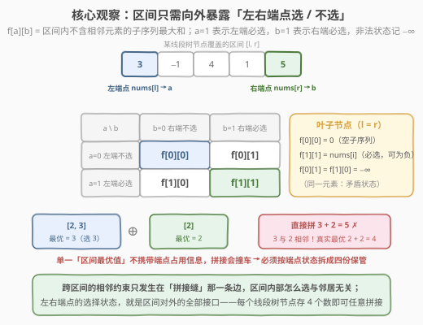
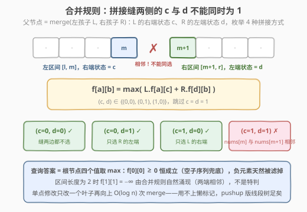
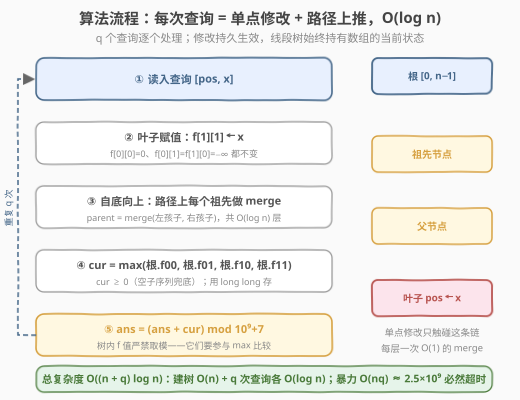
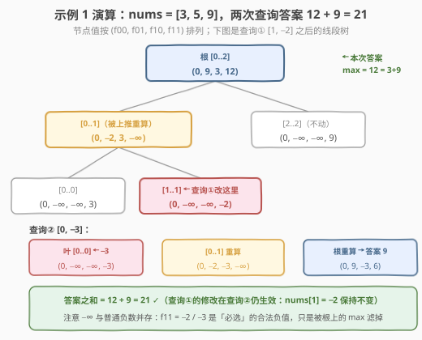

# 不包含相邻元素的子序列的最大和

- **题目名称**：不包含相邻元素的子序列的最大和
- **链接**：[3165. 不包含相邻元素的子序列的最大和](https://leetcode.cn/problems/maximum-sum-of-subsequence-with-non-adjacent-elements/)
- **难度**：困难
- **标签**：线段树、数组、分治、动态规划

## 1. 题目概述

给你一个整数数组 `nums` 和一个二维数组 `queries`，其中 `queries[i] = [pos_i, x_i]`。

对每个查询 `i`：**首先**将 `nums[pos_i]` 赋值为 `x_i`（**修改持久生效**，后续查询基于新数组），**然后**计算 `nums` 中**不包含相邻元素**的**子序列**的**最大和**——子序列允许为空，空子序列的和为 0。返回**所有查询答案之和**，对 $10^9+7$ 取模。

**示例 1**：

```text
输入：nums = [3,5,9], queries = [[1,-2],[0,-3]]
输出：21
解释：查询 1 后 nums = [3,-2,9]，最大和 3+9 = 12；
      查询 2 后 nums = [-3,-2,9]，最大和 9。合计 21。
```

**示例 2**：

```text
输入：nums = [0,-1], queries = [[0,-5]]
输出：0
解释：查询后 nums = [-5,-1]，全为负数，选空子序列，答案 0。
```

**约束条件**：

- $1 \le \text{nums.length} \le 5 \times 10^4$，$-10^5 \le \text{nums}[i] \le 10^5$
- $1 \le \text{queries.length} \le 5 \times 10^4$，$0 \le \text{pos}_i < \text{nums.length}$，$-10^5 \le x_i \le 10^5$

> 💡 读题三个关键：**① 修改是持久的**——示例 1 里第二次查询时 `nums[1]` 仍是 −2，两次查询串行依赖、不可交换；**② 允许空子序列**——全负数组的答案是 0，而不是「最不负」的那个元素；**③ 取模加在「答案之总和」上**——单次答案可达 $n \cdot \max|v| = 5 \times 10^9$，早已超过 int32，中间值必须用 64 位整数；而线段树内部维护的 $f$ 值要参与 $\max$ 比较，**绝不能提前取模**。

---

## 2. 解题思路

### 2.1 暴力思路：每个查询重跑一遍「打家劫舍」

去掉修改，单次询问就是 [198. 打家劫舍](https://leetcode.cn/problems/house-robber/)（[站内题解](../0101-0200/198_打家劫舍.md)）：每个元素选或不选，选了就不能选隔壁。线性 DP 一遍即可：

$$g_i = \max(g_{i-1},\ h_{i-1}),\qquad h_i = g_{i-1} + \text{nums}[i]$$

其中 $g_i$ / $h_i$ 分别表示**不选 / 必选**第 $i$ 个元素时的最大和，答案为 $\max(g_{n-1}, h_{n-1}) \ge 0$（空子序列由 $g$ 链兜底）。单次 $O(n)$，总计 $O(nq) = 2.5 \times 10^9$——超时。

> ⚠️ 线性 DP 的病灶在于**全局前缀依赖**：改动一个 `nums[pos]`，`pos` 之后的所有 DP 值理论上全部作废。要让修改的代价**局部化**，就得把 DP 状态改造成「区间可合并」的形态——这正是线段树的本职工作。

### 2.2 核心观察：区间只向外暴露「左右端点选 / 不选」



定义线段树节点覆盖区间 $[l, r]$，维护一枚 $2 \times 2$ 矩阵：

$$f[a][b] = \text{区间内「不含相邻元素的子序列」的最大和}$$

其中 $a \in \{0,1\}$ 表示**左端点 nums[l] 必须不选 / 必须选**，$b$ 同理约束右端点；无法满足的矛盾状态记 $-\infty$。叶子（$l = r$）初始化为：

- $f[0][0] = 0$：什么都不选（空子序列）；
- $f[1][1] = \text{nums}[l]$：必选它（**可为负**，这是约束不是偏好）；
- $f[0][1] = f[1][0] = -\infty$：同一个元素「不选左端又必选右端」自相矛盾。

**为什么只记端点就够？** 把区间 $[l, r]$ 从中间 $m$ 处切开：跨过拼接缝的相邻约束**只有一条边**——`nums[m]` 与 `nums[m+1]` 不能同时选。除此之外，左半内部怎么选、右半内部怎么选，**互不影响**。因此一个区间要与外界交换的全部信息，就是**两个端点的选择状态**；四种组合各存一个最优值，就能支持任意拼接。

**为什么不能只存一个「区间最优值」？** 反例：$[2,3]$ 的最优是 3（选 3，**占用右端**），$[2]$ 的最优是 2（**占用左端**），直接相加得 5——但拼接处 3 与 2 相邻，非法！真实最优是 $2+2=4$。单一最优值不携带「端点是否被占用」的信息，**拼接时会撞车**，必须按端点状态拆开保管。

> 💡 这与 [53. 最大子数组和](https://leetcode.cn/problems/maximum-subarray/)（[站内题解](../0001-0100/53_最大子数组和.md)）分治视角下每个区间暴露 $(\text{lsum}, \text{rsum}, \text{best}, \text{sum})$ 四元组是同一件事：**线段树维护可合并信息的关键动作，就是找出区间的「最小充分接口」**。本题的接口恰好是一枚 $2\times2$ 矩阵。

### 2.3 合并规则：拼接缝两侧的 c 与 d 不能同时为 1



$$f[a][b] = \max_{\neg(c \wedge d)} \Big( L.f[a][c] + R.f[d][b] \Big),\qquad (c,d) \in \{(0,0),\ (0,1),\ (1,0)\}$$

$c$ 是左孩子的**右端状态**，$d$ 是右孩子的**左端状态**；$c = d = 1$ 意味着 `nums[m]` 与 `nums[m+1]` 同时被选——相邻，禁止。每个父节点的 16 个 $(a,b,c,d)$ 组合里只有这一种被跳过，其余取最大。

几个漂亮的**免费赠品**：

- 区间长度为 2 时 $f[1][1] = -\infty$（两端相邻不能同选）由合并规则**自然涌现**，不是特判；
- 查询答案 = 根节点四个值取 $\max$，$f[0][0] \ge 0$ 恒成立（一路选空），全负数组自动落到 0（示例 2）；
- 中间节点出现负值状态也无妨——劣解会被 $\max$ 滤掉，而 $-\infty$ 参与加法只会得到「仍然足够小」的数。

**单点修改** `nums[pos] ← x`：只改一个叶子（$f[1][1] \leftarrow x$），再沿叶到根的路径做 $O(\log n)$ 次 merge。全程只有 pushup，**用不上懒标记**。

### 2.4 算法流程图



**完整步骤**：

1. **建树** $O(n)$：叶子按上述初始化，内部节点自底向上 merge；
2. **每个查询 `[pos, x]`**：叶子 $f[1][1] \leftarrow x$，叶到根逐层 merge，读根的 $\max(f_{00}, f_{01}, f_{10}, f_{11})$ 作为本次答案 `cur`；
3. **累加取模**：`ans = (ans + cur) % MOD`。`cur` 本身 $\le 5 \times 10^9$ 用 `long long` 存；树内 $f$ 值**不取模**。

### 2.5 示例演算



以示例 1 全程演算（`nums = [3,5,9]`）：

| 查询 | 修改后数组 | 关键节点矩阵变化 | 本次答案 |
|------|-----------|----------------|---------|
| `[1, −2]` | `[3, −2, 9]` | 叶 `[1..1]` 的 $f_{11} \leftarrow -2$；`[0..1]` → `(0, −2, 3, −∞)`；根 → `(0, 9, 3, 12)` | $\max = 12$（$3+9$）|
| `[0, −3]` | `[−3, −2, 9]` | 叶 `[0..0]` 的 $f_{11} \leftarrow -3$；`[0..1]` → `(0, −2, −3, −∞)`；根 → `(0, 9, −3, 6)` | $\max = 9$ |

总和 $12 + 9 = 21$ ✓。注意查询②里 `nums[1] = −2` 仍然生效（修改持久），根的 $f_{11} = -3 + 9 = 6$ 已不如 $f_{01} = 9$（只选 9）——**强制选左端的路径变劣后，max 自动换轨**。

---

## 3. 参考代码

### C++

```cpp
class Solution {
    static constexpr long long MOD = 1'000'000'007;
    static constexpr long long NEG = -1e18;        // −∞：远小于任何真实值（真实值 ≥ −5×10⁹）

    // 节点信息：f[a][b] = 区间内「不含相邻元素」的子序列最大和
    //   a = 左端点是否必选，b = 右端点是否必选；矛盾状态记 NEG
    struct Info {
        long long f[2][2];
    };

    vector<Info> t;

    Info merge(const Info& L, const Info& R) {
        Info res;
        for (int a = 0; a < 2; ++a)
            for (int b = 0; b < 2; ++b) {
                long long best = NEG;              // 从 −∞ 起步，只增不减
                for (int c = 0; c < 2; ++c)
                    for (int d = 0; d < 2; ++d) {
                        if (c && d) continue;      // ⭐ 拼接缝相邻，不能同时选
                        best = max(best, L.f[a][c] + R.f[d][b]);
                    }
                res.f[a][b] = best;
            }
        return res;
    }

    void pull(int p) { t[p] = merge(t[p << 1], t[p << 1 | 1]); }

    void build(int p, int l, int r, vector<int>& nums) {
        if (l == r) {
            t[p].f[0][0] = 0;                      // 空选
            t[p].f[0][1] = t[p].f[1][0] = NEG;     // 同一元素：矛盾状态
            t[p].f[1][1] = nums[l];                // 必选它（可为负）
            return;
        }
        int m = (l + r) >> 1;
        build(p << 1, l, m, nums);
        build(p << 1 | 1, m + 1, r, nums);
        pull(p);
    }

    void update(int p, int l, int r, int pos, int val) {
        if (l == r) { t[p].f[1][1] = val; return; }   // 只有 f11 会变
        int m = (l + r) >> 1;
        pos <= m ? update(p << 1, l, m, pos, val)
                 : update(p << 1 | 1, m + 1, r, pos, val);
        pull(p);
    }

  public:
    int maximumSumSubsequence(vector<int>& nums, vector<vector<int>>& queries) {
        int n = nums.size();
        t.assign(4 * n, Info{});
        build(1, 0, n - 1, nums);
        long long ans = 0;
        for (auto& q : queries) {
            update(1, 0, n - 1, q[0], q[1]);
            auto& f = t[1].f;                      // 根 = 整个数组
            long long cur = max({f[0][0], f[0][1], f[1][0], f[1][1]});
            ans = (ans + cur) % MOD;
        }
        return (int)ans;
    }
};
```

### Python

```python
class Solution:
    def maximumSumSubsequence(self, nums: List[int], queries: List[List[int]]) -> int:
        n = len(nums)
        NEG = float('-inf')
        tree = [None] * (4 * n)                    # 每节点 = (f00, f01, f10, f11)

        def merge(L, R):                           # f[a][b] = max(L[a][c] + R[d][b])，c、d 不同时为 1
            l00, l01, l10, l11 = L
            r00, r01, r10, r11 = R
            return (max(l00 + r00, l00 + r10, l01 + r00),   # f[0][0]
                    max(l00 + r01, l00 + r11, l01 + r01),   # f[0][1]
                    max(l10 + r00, l10 + r10, l11 + r00),   # f[1][0]
                    max(l10 + r01, l10 + r11, l11 + r01))   # f[1][1]

        def build(p, lo, hi):
            if lo == hi:
                tree[p] = (0, NEG, NEG, nums[lo])
                return
            mid = (lo + hi) >> 1
            build(2 * p, lo, mid)
            build(2 * p + 1, mid + 1, hi)
            tree[p] = merge(tree[2 * p], tree[2 * p + 1])

        build(1, 0, n - 1)

        ans = 0
        for pos, x in queries:
            path, p, lo, hi = [], 1, 0, n - 1      # 自顶向下找叶子，顺手记路径
            while lo < hi:
                path.append(p)
                mid = (lo + hi) >> 1
                if pos <= mid:
                    p, hi = 2 * p, mid
                else:
                    p, lo = 2 * p + 1, mid + 1
            tree[p] = (0, NEG, NEG, x)             # 只有 f11 变
            for q in reversed(path):               # 自底向上重算 O(log n) 个节点
                tree[q] = merge(tree[2 * q], tree[2 * q + 1])
            ans = (ans + max(tree[1])) % 1_000_000_007
        return ans
```

> 💡 工程细节：$-\infty$ 在 C++ 里取 $-10^{18}$——任何真实值 $\ge -5 \times 10^9$，两次 $-\infty$ 相加 $= -2 \times 10^{18}$ 仍在 `long long`（约 $\pm 9.2 \times 10^{18}$）范围内；且 `best` 从 NEG 起步只增不减，存进节点的值永远不会低于 NEG，逐层上推**不会越加越深**。**易错点：把 NEG 取成 `LLONG_MIN`**——两个相加直接溢出，属于未定义行为。Python 直接用 `float('-inf')`，$-\infty$ 加任何数仍是 $-\infty$，零风险；更新用「显式记路径 + 循环上推」替代递归，省去 $q \log n$ 次函数调用开销。

---

## 4. 复杂度分析

| 维度 | 复杂度 | 说明 |
|------|--------|------|
| 时间复杂度 | $O((n + q) \log n)$ | 建树 $O(n)$（每节点一次 $O(1)$ merge）；每个查询一次单点修改 $O(\log n)$ |
| 空间复杂度 | $O(n)$ | $4n$ 个节点 × 4 个 `long long`；无懒标记、无辅助数组 |
| 对照：逐查询线性 DP | $O(nq)$ | $5 \times 10^4 \times 5 \times 10^4 = 2.5 \times 10^9$，必然超时 |
| 中间量规模 | $\le 5 \times 10^9$ | 单次答案 $\le \sum|\text{nums}[i]|$，int32 装不下；取模只施加于答案之和，树内 $f$ 值保持原值参与比较 |

---

## 5. 扩展：(max, +) 矩阵乘法视角

把「选 / 不选」编码成二维状态，每个元素就是一枚 $2 \times 2$ 转移矩阵（在 **(max, +) 半环**上做乘法——乘法对应加、加法对应取 max）：

$$T_i = \begin{pmatrix} 0 & \text{nums}[i] \\ 0 & -\infty \end{pmatrix}$$

行下标 = 前一个元素选没选，列下标 = 当前元素选没选；$T_i[1][1] = -\infty$ 正是「相邻不能同选」。**区间信息 = 区间内所有矩阵的 (max, +) 乘积**，2.2 的 $f$ 矩阵与合并规则就是这个乘积的逐元素展开。线段树在此扮演「矩阵乘法的分块预处理」：单点改一枚矩阵，只有 $O(\log n)$ 个分块积需要重算。

同一视角还能统摄一族题目：DP 转移矩阵快速幂（求第 $n$ 项斐波那契）、区间最大子段和的四元组合并、乃至带约束的路径计数。**只要 DP 转移能写成固定维度的 (max, +) 或 (+, ×) 矩阵，就能套「线段树 / 矩阵快速幂」二件套**。

> 💡 若把查询改成「任意区间 $[l, r]$ 的答案」，把覆盖 $[l,r]$ 的 $O(\log n)$ 个节点**按左右顺序**依次 merge 即可——注意这个合并不满足交换律，reduce 时顺序不能乱；若再改成区间修改，$2\times2$ 矩阵对「区间加」不再封闭，懒标记无处安放，需要换思路（如分块或更高级的标记设计）。

---

## 6. 面试要点

1. **为什么只维护左右端点各一个 bit，信息就足够了？**

   - 拼接引理：两个相邻区间之间的相邻约束只发生在拼接缝那一条边（`nums[m]` 与 `nums[m+1]`），内部约束不会出界。所以区间对外的全部接口 = 两端点状态，$(a,b)$ 四种组合各配一个最优值后，任何拼接方案都能被 $\max$ 枚举到。这与区间最大子段和暴露 $(\text{lsum}, \text{rsum}, \text{best}, \text{sum})$ 同构——先找**最小充分接口**，再上数据结构。

2. **只存一个「区间最优值」为什么错？现场给个反例。**

   - $[2,3]$ 最优 3（占用右端），$[2]$ 最优 2（占用左端），直接拼 $3+2=5$，但 3 与 2 相邻非法；真实答案 $2+2=4$。最优值不携带「端点是否被占用」的信息，拼接时会撞车——这正是必须升级成 $2\times2$ 矩阵的原因。

3. **叶子的 $f[1][1] = \text{nums}[i]$ 可能为负，为什么最终答案仍正确且 $\ge 0$？**

   - $f[1][1]$ 的语义是「**必选**它」，是约束不是偏好；负值只说明这条强制路径较劣。根上四个状态取 $\max$，而 $f[0][0] \ge 0$ 由空子序列保证恒成立，全负数组自然落到 0（示例 2）。同理中间节点的负值状态也不影响正确性——劣解被 $\max$ 滤掉，$-\infty$ 加任何数仍是「足够小」。

4. **$-\infty$ 的实现有什么讲究？**

   - C++ 取 `NEG = -1e18`：真实值 $\ge -5\times10^9$，任意一次相加 $\ge -2\times10^{18}$，`long long` 装得下；merge 中 `best` 从 NEG 起步只增不减，节点存储值永不低于 NEG，逐层上推不会累积下探。**千万别取 `LLONG_MIN`**——两个相加立刻溢出（UB）。Python 用 `float('-inf')` 天然安全。

5. **为什么线段树内部的 $f$ 值不能取模？**

   - $f$ 值要持续参与 $\max$ 比较与加法合并，取模会破坏大小关系（$5\times10^9 \bmod p$ 可能小于 $3\times10^9$ 对应的值），合并结果全错。取模只施加在「查询答案累加」这一步：`cur` 用 `long long` 存（$\le 5\times10^9$），`ans` 每步 `% MOD`。另外别忘了单次答案就超 int32——返回前累加过程中的中间类型也要 64 位。

---

## 7. 同类练习题

- [198. 打家劫舍](https://leetcode.cn/problems/house-robber/)（[站内题解](../0101-0200/198_打家劫舍.md)）：本题的静态版母题——先手撕线性 DP，再看「选/不选」状态如何升级成 $2\times2$ 矩阵
- [740. 删除并获得点数](https://leetcode.cn/problems/delete-and-earn/)（[站内题解](../0701-0800/740_删除并获得点数.md)）：打家劫舍的值域变形，体会「相邻互斥」的另一种建模方式
- [307. 区域和检索 - 数组可变](https://leetcode.cn/problems/range-sum-query-mutable/)（[站内题解](../0301-0400/307_区域和检索 - 数组可变.md)）：单点修改线段树入门——本题只是把节点信息从「一个和」换成「一枚 2×2 矩阵」
- [2407. 最长递增子序列 II](https://leetcode.cn/problems/longest-increasing-subsequence-ii/)（[站内题解](../2401-2500/2407_最长递增子序列II.md)）：线段树维护 DP 的另一种形态——用「区间查 max」加速转移，与本题「区间信息合并」互为镜像
- [53. 最大子数组和](https://leetcode.cn/problems/maximum-subarray/)（[站内题解](../0001-0100/53_最大子数组和.md)）：分治视角的四元组合并 $(\text{lsum}, \text{rsum}, \text{best}, \text{sum})$——「找出区间最小充分接口」的经典起点
