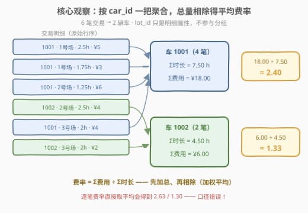
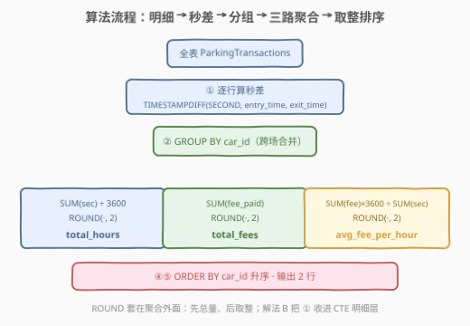
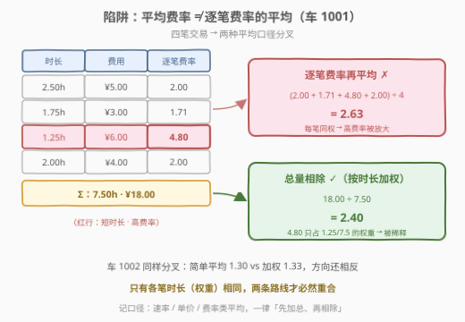

# 计算停车费与时长

- **题目名称**：计算停车费与时长
- **链接**：[3166. 计算停车费与时长 🔒](https://leetcode.cn/problems/calculate-parking-fees-and-duration/)
- **难度**：中等
- **标签**：数据库、SQL、聚合、`GROUP BY`、`TIMESTAMPDIFF`、`ROUND`、加权平均

## 1. 题目概述

> ⚠️ 本题为 LeetCode 付费题（Plus 会员专享），题意描述根据官方示例用例与建表语句重建，可能与官方题面有出入。

**表结构**：`ParkingTransactions`

| 列名 | 类型 |
|------|------|
| lot_id | int |
| car_id | int |
| entry_time | datetime |
| exit_time | datetime |
| fee_paid | decimal(10,2) |

- 每行记录一笔停车交易：车辆 `car_id` 在 `lot_id` 号停车场的入场时间 `entry_time`、离场时间 `exit_time` 与实付停车费 `fee_paid`。
- 每行满足 `entry_time` 早于 `exit_time`；同一辆车可以在**多个**停车场、多个日期反复停车。

**目标**：编写解决方案，对**每辆车**（跨所有停车场）统计三项指标：

1. `total_hours`：总停车时长（单位小时，保留两位小数）；
2. `total_fees`：总停车费（保留两位小数）；
3. `avg_fee_per_hour`：平均每小时停车费（保留两位小数），口径为**总费用 ÷ 总时长**。

结果按 `car_id` **升序**返回。

**示例 1**：

```text
输入：
ParkingTransactions 表:
+--------+--------+---------------------+---------------------+----------+
| lot_id | car_id | entry_time          | exit_time           | fee_paid |
+--------+--------+---------------------+---------------------+----------+
| 1      | 1001   | 2023-06-01 08:00:00 | 2023-06-01 10:30:00 | 5.0      |
| 1      | 1001   | 2023-06-02 11:00:00 | 2023-06-02 12:45:00 | 3.0      |
| 2      | 1001   | 2023-06-01 10:45:00 | 2023-06-01 12:00:00 | 6.0      |
| 2      | 1002   | 2023-06-01 09:00:00 | 2023-06-01 11:30:00 | 4.0      |
| 3      | 1001   | 2023-06-03 07:00:00 | 2023-06-03 09:00:00 | 4.0      |
| 3      | 1002   | 2023-06-02 12:00:00 | 2023-06-02 14:00:00 | 2.0      |
+--------+--------+---------------------+---------------------+----------+

输出：
+--------+-------------+------------+-----------------+
| car_id | total_hours | total_fees | avg_fee_per_hour |
+--------+-------------+------------+-----------------+
| 1001   | 7.50        | 18.00      | 2.40            |
| 1002   | 4.50        | 6.00       | 1.33            |
+--------+-------------+------------+-----------------+
```

**解释**：

| 车辆 | 交易明细 | 总时长 | 总费用 | 平均费率 |
|------|----------|--------|--------|----------|
| 1001 | 1 号场 2.5h·¥5 ＋ 1 号场 1.75h·¥3 ＋ 2 号场 1.25h·¥6 ＋ 3 号场 2h·¥4 | 2.5+1.75+1.25+2 = **7.50h** | 5+3+6+4 = **¥18.00** | 18 ÷ 7.5 = **2.40** |
| 1002 | 2 号场 2.5h·¥4 ＋ 3 号场 2h·¥2 | 2.5+2 = **4.50h** | 4+2 = **¥6.00** | 6 ÷ 4.5 = 1.333… → **1.33** |

> 💡 **审题关键**：① 分组键是 `car_id`，`lot_id` 只是明细属性——1001 在 06-01 同一天先停 1 号场（08:00–10:30）、15 分钟后转场 2 号场（10:45–12:00），跨场停车全部计入**同一辆车**的总账；② 平均费率是"**总费用 ÷ 总时长**"的**加权**口径，不是逐笔费率的简单平均（2.2 节展开，这是本题埋的主陷阱）；③ `fee_paid` 为 `DECIMAL(10,2)`，聚合与除法时注意精度与取整顺序。

---

## 2. 解题思路

### 2.1 暴力思路

**笨办法一：甩给应用层**。把 `ParkingTransactions` 全量导出到 Python/Excel，逐行减出时长再透视求和。逻辑无懈可击，但数据库聚合题的考点正是**一条 SQL 交代所有统计**——能把活儿留在库里就别搬出去。

**笨办法二：逐笔算费率再平均**。先算出每笔的每小时费率（`fee_paid ÷ 时长`），再对费率列取 `AVG`。这个"看起来很自然"的写法正是本题的陷阱：车 1001 四笔的费率是 2.00、1.71、4.80、2.00，简单平均得 **2.63**，而正确答案是 **2.40**（见 2.2）。

> ⚠️ 两种笨办法的共同病根：**统计口径错位**。前者把"在哪算"搞错（库外），后者把"怎么平均"搞错（逐行费率 ≠ 总量费率）。

### 2.2 核心观察：GROUP BY 一把聚合，总量相除得费率



整道题只有一次分组：`GROUP BY car_id`。分组之后，三个输出列全部由**聚合函数**产出：

$$\text{total\_hours} = \frac{\sum_i \text{TIMESTAMPDIFF}(\text{SECOND},\ \text{entry}_i,\ \text{exit}_i)}{3600}, \qquad \text{total\_fees} = \sum_i \text{fee}_i, \qquad \text{avg\_fee\_per\_hour} = \frac{\sum_i \text{fee}_i}{\sum_i \text{hours}_i}$$

**关键观察（平均的加权性）**：平均每小时费用必须"**先加总、再相除**"：

$$\frac{\sum_i \text{fee}_i}{\sum_i \text{hours}_i} \;\ne\; \frac{1}{n}\sum_i \frac{\text{fee}_i}{\text{hours}_i}$$

右边的简单平均给每笔交易**同等权重**，左边的加权平均按**时长**加权。车 1001 里那笔"1.25 小时却花了 ¥6"的高费率交易（¥4.80/h），在加权口径下只占 $\frac{1.25}{7.5}$ 的权重，被自动稀释；简单平均却让它与 2.5 小时的大宗交易平起平坐，把费率抬高到 2.63。**记口径**：凡"平均速率 / 平均单价 / 平均费率"，默认拿总量相除——这正是 [1251. 平均售价](https://leetcode.cn/problems/average-selling-price/) 的同款考点。

> 💡 **时长差怎么算**：MySQL 用 `TIMESTAMPDIFF(SECOND, entry_time, exit_time)`——参数顺序是 **（单位, 较早, 较晚）**，写反会得到负数；先按秒取整差、再统一除 3600，避免逐笔除法的浮点误差累积。`DATEDIFF` 只能算**天数**差，不适用于本题的分钟级精度。

### 2.3 算法流程图



| 步骤 | 关键表达式 | 产出 |
|------|-----------|------|
| ① 明细换算 | `TIMESTAMPDIFF(SECOND, entry_time, exit_time)` | 每笔的秒数 |
| ② 分组 | `GROUP BY car_id` | 跨场合并同一辆车 |
| ③ 三路聚合 | `SUM(sec)/3600`、`SUM(fee_paid)`、`SUM(fee)*3600/SUM(sec)` | 三个总量 |
| ④ 取整 | `ROUND(·, 2)` 套在聚合**外面** | 两位小数 |
| ⑤ 排序 | `ORDER BY car_id` | 升序输出 |

> ⚠️ **取整顺序**：`ROUND(SUM(...), 2)` 而非 `SUM(ROUND(..., 2))`——先把总量算干净、再对总量做标量变换。本题各笔时长恰好都是两位小数能精确表示的刻度（0.25h 的整数倍），两种写法结果碰巧一致；一旦数据出现秒级零头，逐笔取整的累计误差就会显形（对照 [3156](../3101-3200/3156_员工任务持续时间和并发任务.md) 中 `FLOOR` 套在哪一层的同款讨论）。

### 2.4 示例演算：两种平均口径的分叉



车 1001 的四笔交易逐笔展开：

| 笔 | 停车场 | 时长 | 费用 | 逐笔费率 |
|----|--------|------|------|----------|
| 1 | 1 号场 | 2.50h | ¥5.00 | 2.00 |
| 2 | 1 号场 | 1.75h | ¥3.00 | 1.71 |
| 3 | 2 号场 | 1.25h | ¥6.00 | **4.80**（短时长·高费率） |
| 4 | 3 号场 | 2.00h | ¥4.00 | 2.00 |

两条路线的分叉：

$$\text{简单平均（✗）} = \frac{2.00+1.71+4.80+2.00}{4} = 2.63, \qquad \text{加权平均（✓）} = \frac{18.00}{7.50} = 2.40$$

车 1002 同样分叉（简单平均 1.30 vs 加权 1.33，方向还相反）——说明这不是偶然误差，而是**两种不同的统计量**。只有当各笔时长（权重）相同时，两条路线才必然重合。

---

## 3. 参考代码

### SQL（MySQL）

```sql
SELECT
    car_id,
    ROUND(SUM(TIMESTAMPDIFF(SECOND, entry_time, exit_time)) / 3600, 2) AS total_hours,
    ROUND(SUM(fee_paid), 2)                                            AS total_fees,
    ROUND(
        SUM(fee_paid) * 3600 / SUM(TIMESTAMPDIFF(SECOND, entry_time, exit_time)),
        2
    )                                                                  AS avg_fee_per_hour
FROM ParkingTransactions
GROUP BY car_id
ORDER BY car_id;
```

> 💡 **写法要点**：
> - `TIMESTAMPDIFF(SECOND, entry_time, exit_time)`：单位在前、较早时刻在后，返回整秒差，天然支持跨天。
> - 平均费率写成 `SUM(fee_paid) * 3600 / SUM(秒差)`：分子分母同乘 3600，等价于 $\frac{\sum \text{fee}}{\sum \text{hours}}$，但避免"先除后除"的两次中间舍入。
> - `entry_time` 恒早于 `exit_time`，分母为正，无除零风险。
> - 输出列顺序 `car_id, total_hours, total_fees, avg_fee_per_hour`；`ORDER BY car_id` 与示例一致。

### SQL（解法 B：CTE 分层，明细与聚合解耦）

```sql
WITH per_txn AS (
    SELECT car_id,
           fee_paid,
           TIMESTAMPDIFF(SECOND, entry_time, exit_time) AS secs
    FROM ParkingTransactions
)
SELECT car_id,
       ROUND(SUM(secs) / 3600, 2)                 AS total_hours,
       ROUND(SUM(fee_paid), 2)                    AS total_fees,
       ROUND(SUM(fee_paid) * 3600 / SUM(secs), 2) AS avg_fee_per_hour
FROM per_txn
GROUP BY car_id
ORDER BY car_id;
```

> 💡 逻辑与解法 A 完全等价，但把"明细换算"（每行一次函数调用）收进 CTE、主查询只剩纯聚合——指标更多时（再加最贵一笔、最长一笔、去过的场次数等）这种分层更好维护，也是数仓"明细层 → 聚合层"的最小缩影。

### Python（pandas）

```python
import pandas as pd


def calculate_parking_fees_and_duration(
    parking_transactions: pd.DataFrame,
) -> pd.DataFrame:
    df = parking_transactions.copy()
    # ① 明细换算：每笔的秒数
    df["secs"] = (df["exit_time"] - df["entry_time"]).dt.total_seconds()
    # ② 分组聚合：总量
    result = (
        df.groupby("car_id")
        .agg(total_secs=("secs", "sum"), total_fees=("fee_paid", "sum"))
        .reset_index()
    )
    # ③ 总量相除得平均费率，最后统一取整
    result["total_hours"] = (result["total_secs"] / 3600).round(2)
    result["avg_fee_per_hour"] = (result["total_fees"] * 3600 / result["total_secs"]).round(2)
    return result[
        ["car_id", "total_hours", "total_fees", "avg_fee_per_hour"]
    ].sort_values("car_id", ignore_index=True)
```

> 💡 `.dt.total_seconds()` 对应 `TIMESTAMPDIFF(SECOND, ...)`；命名聚合 `.agg(...)` 一步产出两个总量列，对应 `GROUP BY` 后的 `SUM`。注意 `avg_fee_per_hour` 用 `total_fees * 3600 / total_secs`（总量相除），**不要**写成 `(df["fee_paid"] / hours).groupby(...).mean()`——那正是 2.2 的陷阱。

---

## 4. 复杂度分析

设 $n$ 为交易行数、$g$ 为不同车辆数（$g \le n$）。

| 维度 | 复杂度 | 说明 |
|------|--------|------|
| **时间** | $O(n)$ | 一次全表扫描：逐行常数算秒差 + 分组聚合 |
| **空间** | $O(g)$（解法 A）/ $O(n)$（解法 B） | 解法 B 的 CTE 物化每行秒数；分组结果本身只有 $g$ 行 |
| **索引** | — | 谓词均为函数运算（非 SARGable）；大表可按 `car_id` 建二级索引让分组走索引扫描 |

> - 无 JOIN、无窗口、无自连接——一次线性聚合就是本题的复杂度下界，"中等"的含金量不在计算量，**在口径**（时长换算、取整顺序、加权平均）。
> - pandas 版本 `groupby` 之后的向量化运算均为 $O(g)$，瓶颈同样只在对 $n$ 行的一次扫描。

---

## 5. 扩展

### 5.1 如果题目反过来要"逐笔费率的简单平均"？

写法是 `AVG(fee_paid / (TIMESTAMPDIFF(SECOND, entry_time, exit_time) / 3600))`。两种口径各有含义：加权平均回答"**这辆车平均每小时花多少钱**"（总账视角），简单平均回答"**平均每一笔交易的每小时单价**"（逐笔视角）。判别标准只有一条：**看业务问的是总量比还是均值比**。本题要总账，取加权；[1934. 确认率](https://leetcode.cn/problems/confirmation-rate/) 里"确认率 = 确认数 ÷ 总数"也是同款总量相除。

### 5.2 维度切换：停车场营收报表 / 按日分区

把 `GROUP BY car_id` 换成 `GROUP BY lot_id` 即得每个停车场的总时长与总营收（示例数据下：1 号场 4.25h·¥8、2 号场 3.75h·¥10、3 号场 4h·¥6——2 号场 2.67 ¥/h 是"坪效"最高的场）；换成 `GROUP BY car_id, DATE(entry_time)` 则得每车每日的停车账单。BI 报表的常见做法是把这几个维度用 `GROUPING SETS` / `GROUP BY ... WITH ROLLUP` 一次算完。

### 5.3 区间重叠去重：如果同一辆车能同时"挂"在两个场？

本题交易天然不重叠（一辆车同一时刻只能停在一个场）。若数据允许同一辆车区间重叠（如套牌、漏刷卡），总时长就不能直接 `SUM`——要先把每辆车的停车区间**取并集**再计长，做法与 [3156. 员工任务持续时间和并发任务](../3101-3200/3156_员工任务持续时间和并发任务.md) 的"事件点离散化 + 初等区间"完全同源。

---

## 6. 面试要点

**Q1：`TIMESTAMPDIFF` 和 `DATEDIFF` 有什么区别？参数顺序是什么？**

> `TIMESTAMPDIFF(unit, t1, t2)` 返回 `t2 − t1` 按 `unit`（SECOND/MINUTE/HOUR/DAY…）计的差值，参数顺序是 **（单位, 减数, 被减数）**——写反得负数；而 MySQL 的 `DATEDIFF(t1, t2)` 只返回**日期**差的天数，且参数顺序恰好相反（前者减后者），粒度只到天。本题分钟级精度必须用 `TIMESTAMPDIFF`，且建议取 SECOND 再统一除 3600，避免逐笔小时化的精度损失。

**Q2：为什么 `avg_fee_per_hour` 不能写 `AVG(fee_paid / hours)`？什么时候两种写法相等？**

> 前者是按时长加权的平均费率（总量相除），后者是逐笔费率的简单平均。示例中车 1001 加权 2.40、简单 2.63——那笔 1.25h·¥6 的高费率（4.80 ¥/h）在加权口径下权重只有 1.25/7.5，在简单平均里却与 2.5h 的交易同权。只有**各笔时长（权重）相同**时两者才必然重合。判别口诀：速率、单价、费率类平均一律"先加总、再相除"。

**Q3：`ROUND` 应该套在 `SUM` 里面还是外面？**

> 外面——`ROUND(SUM(sec)/3600, 2)`。先按业务语义聚合出总量，再对总量做标量变换；`SUM(ROUND(...))` 会把逐笔的舍入误差累计进总量。本题示例各笔时长都是 0.25h 的整数倍，两种写法碰巧同值；若被追问"数据换成秒级零头怎么办"，答案永远是先聚合后取整。

**Q4：`SUM(fee_paid)` 与整数相除，MySQL 里结果类型是什么？要担心浮点误差吗？**

> `fee_paid` 是 `DECIMAL(10,2)`，`SUM` 仍是 DECIMAL，`TIMESTAMPDIFF` 返回整数；DECIMAL 与整数的运算保持精确十进制，除法自动扩展 scale，最后 `ROUND(..., 2)` 收敛到两位——全程无二进制浮点参与，2.40 就是 2.40。pandas 侧是 IEEE-754 double，本题的 18/7.5、6/4.5 均可精确或安全表示，`.round(2)` 即可；生产报表若要严格十进制，用 `decimal.Decimal` 或整数分（cent）运算。

**Q5：一句话说清本题的"中等"难在哪里？**

> 计算量是入门级的 `GROUP BY + SUM`，难度全在**三个口径**：时长差的方向与单位、聚合与取整的先后、平均费率的加权性。数据库题的坑从来不在"会不会聚合"，在"聚合的是什么"。

> 💡 **一句话总结**：一条 `GROUP BY car_id` 的线性聚合——秒差求和折小时、费用求和、总量相除取费率；口诀「**秒差要正向，先总后取整，费率总量除**」。

---

## 7. 同类练习题

- [1251. 平均售价](https://leetcode.cn/problems/average-selling-price/)：`SUM(价格×销量) ÷ SUM(销量)` 的加权平均——与本题"平均费率 = 总费用 ÷ 总时长"同款陷阱
- [1934. 确认率](https://leetcode.cn/problems/confirmation-rate/)：日期差 + 比率 + `ROUND`，聚合模板与本题几乎同构
- [1193. 每月交易 I](https://leetcode.cn/problems/monthly-transactions-i/)：金额与笔数的分组聚合 + 日期维度切换（对应 5.2 的按日/按场报表）
- [511. 游戏玩法分析 I](https://leetcode.cn/problems/game-play-analysis-i/)：`GROUP BY` + 聚合函数的最朴素形态，入门对照
- [3156. 员工任务持续时间和并发任务](../3101-3200/3156_员工任务持续时间和并发任务.md)（本仓库题解）：同用 `TIMESTAMPDIFF(SECOND, ...)` 折算时长的进阶版——区间重叠需先取并集
