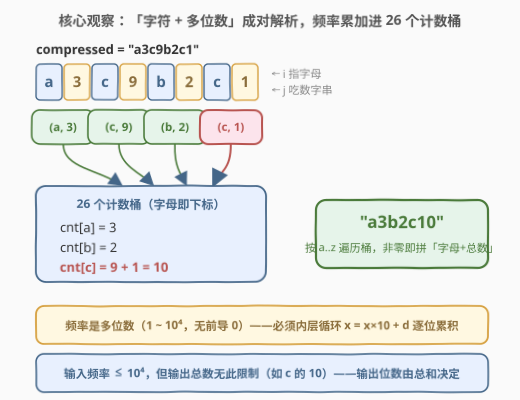
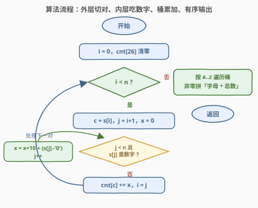
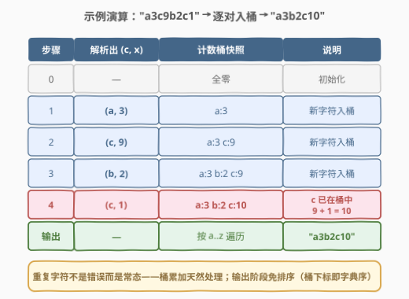

# 字符串的更好压缩

- **题目名称**：字符串的更好压缩
- **链接**：[3167. 字符串的更好压缩](https://leetcode.cn/problems/better-compression-of-string/)
- **难度**：中等
- **标签**：哈希表，字符串，计数，排序

## 1. 题目概述

> ⚠️ 本题为 LeetCode 付费题（Plus 会员专享），题意描述根据官方示例用例与 hints 重建（已与社区镜像 doocs/leetcode 的官方中文翻译交叉核对，示例输入输出与 LeetCode GraphQL 接口返回一致，出入风险较低）。

给定一个字符串 `compressed`，表示某个字符串的**压缩版本**，格式为「一个字符 + 其出现频率」。例如 `"a3b1a1c2"` 是字符串 `"aaabacc"` 的一个压缩版本。

我们寻求**更好的压缩**，需满足：

1. 每个字符在压缩版本中只出现**一次**；
2. 字符按**字母顺序**排列。

返回 `compressed` 的更好压缩版本。

**注意**：在更好的压缩版本中，字母的顺序可能会改变，这是可以接受的。

**示例 1**：

```text
输入：compressed = "a3c9b2c1"
输出："a3b2c10"
解释：'a' 和 'b' 在输入中只出现一次，但 'c' 出现了两次——第一次频率为 9，第二次为 1，
因此结果中它的频率应为 10。
```

**示例 2**：

```text
输入：compressed = "c2b3a1"
输出："a1b3c2"
```

**示例 3**：

```text
输入：compressed = "a2b4c1"
输出："a2b4c1"
解释：已经是更好的压缩，原样返回。
```

**约束条件**：

- $1 \le \text{compressed.length} \le 6 \times 10^4$
- `compressed` 仅由小写英文字母和数字组成
- `compressed` 是**有效**的压缩——每个字母后面都跟着它的出现频率
- 每个频率 $\in [1, 10^4]$ 且**无前导 0**

> 💡 读题关键：格式是「**字符在前 + 多位数频率**」（与 [443](../0401-0500/443_压缩字符串.md) 的输出格式同款）。频率可达 $10^4$，是**一至五位的十进制数**，绝不能当成一位数字处理。输出端的频率则**没有** $10^4$ 上限——同一字符的多次频率要**求和**（如 `c9 + c1 = c10`），这正是「更好」二字的全部含义。

---

## 2. 解题思路

### 2.1 朴素思路：正则切对 / 逐位解析

题面结构极其规整：`字母 数字... 字母 数字... ...`。最直接的做法分两步：

1. **解析**：把 `compressed` 切成一组 `(字符, 频率)` 对。Python 可用正则 `([a-z])(\d+)` 一把梭，C++ / 手写则用双指针——`i` 指向字母，`j` 从 `i+1` 起吃掉连续数字；
2. **重整**：用哈希表把同一字符的频率**累加**，最后按字母序拼出「字符 + 总数」。

两个常见的坑：

- **多位数陷阱**：受 [3163](../3101-3200/3163_压缩字符串III.md)「频率封顶 9、恒一位」的惯性影响，只读 `s[i+1]` 一位数字——遇到 `"a12b3"` 立即错位。频率必须用内层循环 $x \leftarrow x \times 10 + d$ **逐位累积**（[8. atoi](../0001-0100/8_字符串转换整数atoi.md) 同款 Horner 套路）；
- **假想解压**：先还原原串再重新压缩——原串长度可达 $3 \times 10^8$（$3 \times 10^4$ 对 × 每对最多 $10^4$ 个字符），内存直接爆炸。**信息根本不需要展开**：频率求和在压缩域上就能完成。

> ⚠️ 「重复字符」在本题不是异常而是**常态**——输入保证合法，但同一字符允许多次出现，累加逻辑是必选项而非防御性代码。

### 2.2 核心观察：双指针切对 + 26 桶累加，输出免排序



三个观察把做法压到最短：

1. **解析是确定性双指针**：字母必在偶发位置开启一段，其后连续的数字段就是频率。`i` 停在字母上，`j` 吃数字直到非数字或越界，`x` 一路 $x \times 10 + d$——一个 `while` 内嵌一个 `while`，每字符恰好被读一次；
2. **字符集只有 26 个字母 → 数组即哈希**：`cnt[26]` 以 `c - 'a'` 为下标，累加 `cnt[c] += x` 是 O(1)；不必用 `map` / `Counter` 再排序；
3. **桶下标天然就是字典序**：输出时按 `k = 0..25` 遍历，`cnt[k] > 0` 就拼 `('a'+k) + to_string(cnt[k])`——**排序步骤整体消失**，复杂度里连 $|\Sigma| \log |\Sigma|$ 的因子都没有。

一句话：**解析 → 入桶累加 → 按桶序输出**，三步各一遍线性扫描。

> 💡 题面那句「字母的顺序可能会改变，这是可以接受的」是在**明确授权**你排序——出题人预判了有人想保序合并，提前把这条路堵死，让「排序 + 求和」成为无歧义的标准答案。

### 2.3 算法流程图



流程要点：

1. 外层 `while i < n`：每轮处理一个「字符 + 频率」对；
2. 内层 `while`：`j < n` 且 `s[j]` 是数字就 $x \leftarrow x \times 10 + d$、`j++`——**至少执行一次都不到也无所谓**，因为题面保证字母后必有频率（至少 1 位数字），解析结束时 `j > i+1` 恒成立；
3. `cnt[c] += x` 后 `i = j`，外层继续——`i`、`j` 都单调右移，总计 $O(n)$；
4. 收尾：按 `a..z` 扫桶拼接，跳过零桶。

### 2.4 示例演算



| 步骤 | 解析出 (c, x) | 计数桶快照 | 说明 |
|------|--------------|-----------|------|
| 0 | — | 全零 | 初始化 |
| 1 | (a, 3) | a:3 | 新字符入桶 |
| 2 | (c, 9) | a:3  c:9 | 新字符入桶 |
| 3 | (b, 2) | a:3  b:2  c:9 | 新字符入桶 |
| 4 | (c, 1) | a:3  b:2  **c:10** | c 已在桶中，9 + 1 = 10 |
| 输出 | — | 按 a..z 遍历 | **"a3b2c10"** |

示例 2（`"c2b3a1"`）只用到「桶序输出」这一半：输入顺序 c、b、a，输出顺序由桶下标决定为 a、b、c。示例 3 则是恒等情形——桶快照与输入一致时原样返回。

---

## 3. 参考代码

### C++

```cpp
class Solution {
  public:
    string betterCompression(string compressed) {
        int cnt[26] = {0};
        int n = compressed.size();
        int i = 0;
        while (i < n) {
            char c = compressed[i];               // 字母开头
            int j = i + 1, x = 0;
            while (j < n && isdigit(compressed[j])) {  // 吃掉整个多位频率
                x = x * 10 + (compressed[j] - '0');
                j++;
            }
            cnt[c - 'a'] += x;                    // 桶累加：同字符频率求和
            i = j;                                // 下一对
        }
        string ans;
        for (int k = 0; k < 26; k++) {            // 桶下标即字典序，免排序
            if (cnt[k]) {
                ans += char('a' + k);
                ans += to_string(cnt[k]);
            }
        }
        return ans;
    }
};
```

### Python

```python
class Solution:
    def betterCompression(self, compressed: str) -> str:
        cnt = [0] * 26
        i, n = 0, len(compressed)
        while i < n:
            c = compressed[i]
            j, x = i + 1, 0
            while j < n and compressed[j].isdigit():   # 多位频率逐位累积
                x = x * 10 + ord(compressed[j]) - ord('0')
                j += 1
            cnt[ord(c) - 97] += x
            i = j
        return ''.join(chr(97 + k) + str(v) for k, v in enumerate(cnt) if v)
```

正则一把梭版（解析阶段交给 `re.findall`，重整交给 `Counter` + `sorted`）：

```python
import re
from collections import Counter

class Solution:
    def betterCompression(self, compressed: str) -> str:
        cnt = Counter()
        for c, num in re.findall(r'([a-z])(\d+)', compressed):
            cnt[c] += int(num)
        return ''.join(f'{c}{cnt[c]}' for c in sorted(cnt))
```

> 💡 两版等价，正则版短、双指针版通用（不依赖语言设施，C++/Java 移植无痛）。**共同红线**：正则里是 `\d+` 不是 `\d`，手写里是内层 `while` 不是读一位——频率是多位的。

---

## 4. 复杂度分析

| 维度 | 复杂度 | 说明 |
|------|--------|------|
| 时间复杂度 | $O(n + \|\Sigma\|)$ | `i`、`j` 单调右移，每个字符恰被读一次；收尾扫 26 个桶（$\|\Sigma\| = 26$），无排序因子 |
| 空间复杂度 | $O(\|\Sigma\|)$ | 计数桶 26 个整数；**输出串长度 $\le 26 \times (1 + 9) = 260$，是与 $n$ 无关的常数**（见 5.1） |
| 解析趟数 | 1 | 双指针一遍过，无回溯、无重复扫描 |

> ⚠️ 若用 `map` / 哈希表 + 显式 `sort`，时间退化为 $O(n + \|\Sigma\|\log\|\Sigma\|)$——本题 $\|\Sigma\|$ 恒为 26，差异可忽略，但「数组桶 + 下标序输出」是更到位的写法。

---

## 5. 扩展

### 5.1 两个上界：计数会不会溢出？输出会不会很长？

**单字符频率总和**：最坏输入形如 `"a9999a9999..."`——每对 5 个字符，$n = 6 \times 10^4$ 时至多 $\lfloor n/5 \rfloor = 12000$ 对，总和 $\le 12000 \times 9999 = 119{,}988{,}000 < 2^{31} - 1$。**`int` 安全，无需 `long long`**。全体字符的总和上界 $\lfloor n/2 \rfloor \times 10^4 = 3 \times 10^8$ 同样安全。

**输出长度**：至多 26 个「字母 + 数字」组，每个数字不超过 9 位（$\le 1.2 \times 10^8$），故输出 $\le 26 \times 10 = 260$ 个字符——**与 $n$ 完全无关**。对比 [3163](../3101-3200/3163_压缩字符串III.md) 输出最长 $2n$，本题是「输入越长、输出不变」的极端压缩形态，也再次说明「假想解压」有多浪费。

### 5.2 压缩字符串家族纵览

| 题目 | 格式约束 | 任务方向 | 核心考点 |
|------|---------|---------|----------|
| [443. 压缩字符串](../0401-0500/443_压缩字符串.md) | 字符在前、计数可多位 | 原串 → 压缩 | **原地**改写字符数组，双指针写回 |
| [1531. 压缩字符串 II](../1501-1600/1531_压缩字符串II.md) | 同 443，允许删 $\le k$ 个字符 | 压缩 → 最短 | 区间 DP：删谁最划算 |
| [3163. 压缩字符串 III](../3101-3200/3163_压缩字符串III.md) | **数字在前**、封顶 9 | 原串 → 压缩 | 纯模拟：封顶强制拆段 + 输出缓冲 |
| **3167. 字符串的更好压缩** | **字符在前**、频率 $\le 10^4$ | 压缩 → 压缩 | **解析 + 重整**：多位频率 Horner 累积 + 桶求和 |

四题同源三种角色：443 / 3163 是**压缩器**（生成方向），1531 是**优化器**（带删除的最短压缩），3167 是**修复器**（把不合格的压缩重整为规范形）。3167 与 3163 恰好互为镜像——3163 数字在前且封顶 9（段定长 2），3167 字符在前且不封顶（频率不定长）；前者难点在**拆段**，后者难点在**解析**。

### 5.3 正则 / 状态机视角

「字母开头 + 连续数字」的解析本质是一个两状态的微型 DFA：处于**字母态**读入字母后迁移到**数字态**，处于数字态读入数字则自旋累积、读入字母则冲刷上一对并回到字母态。这与 [65. 有效数字](../0001-0100/65_有效数字.md) 的 9 状态 DFA、[8. atoi](../0001-0100/8_字符串转换整数atoi.md) 的逐位累积一脉相承——凡是「格式受约束的字符串处理」，先画状态转移表再动手，边界情况（本题是「字母后必跟数字」「频率无前导 0」）就藏在表的空格子里。

---

## 6. 面试要点

1. **为什么频率不能只读一位数字？怎么解析多位数？**

   - 题面约束频率 $\in [1, 10^4]$ 且无前导 0，是 1 至 5 位的十进制数。只读 `s[i+1]` 一位会把 `"a12b3"` 解析成 `(a,1)` 后在 `'2'` 处错位。正确做法：内层 `while` 吃掉整个数字段，`x = x * 10 + (s[j] - '0')` 逐位累积（Horner 法），`isdigit` 判停。

2. **为什么用 `cnt[26]` 数组而不是哈希表 + 排序？**

   - 字符集是固定的小写 26 字母，数组即完美哈希（下标 `c - 'a'`，无冲突无扩容）；且**数组下标天然就是字典序**，输出时按 `0..25` 扫一遍即有序拼接，把 $O(|\Sigma|\log|\Sigma|)$ 的排序整个省掉。哈希表版逻辑等价，只是没吃到字符集小且有序的红利。

3. **计数累加会溢出 `int` 吗？输出串最长多长？**

   - 不会。最坏 `12000 对 × 9999 ≈ 1.2 × 10^8 < 2^31 − 1`，`int` 足够。输出至多 26 组「字母 + ≤9 位数字」，**长度 $\le 260$，与 $n$ 无关**——本题输入再长，输出也是常数规模（见 5.1）。

4. **同一字符在输入中出现多次，需要特判吗？**

   - 不需要。桶累加 `cnt[c] += x` 对「新字符」和「重复字符」一视同仁——重复出现是输入的**常态**而非错误（示例 1 的 `c9...c1`），累加语义天然覆盖。真正要特判的是输出端：零桶跳过（该字符未出现）。

5. **本题与 443 / 3163 的本质区别是什么？**

   - 方向与格式都不同：443 / 3163 是**从原串生成压缩**（前者字符在前可多位、需原地写回，后者数字在前封顶 9、需拆段）；3167 是**从压缩重整压缩**——输入已经是压缩形，考的是「字符 + 不定长多位数」的解析与求和重排。三题共用游程 / 计数的外壳，考点完全错开。

---

## 7. 同类练习题

- [443. 压缩字符串](https://leetcode.cn/problems/string-compression/)（[站内题解](../0401-0500/443_压缩字符串.md)）：本题的**生成方向姊妹篇**——同样的「字符 + 多位计数」格式，考原地双指针写回
- [3163. 压缩字符串III](https://leetcode.cn/problems/string-compression-iii/)（[站内题解](../3101-3200/3163_压缩字符串III.md)）：**镜像对照题**——数字前置且封顶 9，段定长 2；本题字符前置不封顶，频率不定长，解析难度互换
- [1531. 压缩字符串 II](https://leetcode.cn/problems/string-compression-ii/)（[站内题解](../1501-1600/1531_压缩字符串II.md)）：**DP 硬核版**——允许删除至多 k 个字符，求最短压缩长度
- [8. 字符串转换整数（atoi）](https://leetcode.cn/problems/string-to-integer-atoi/)（[站内题解](../0001-0100/8_字符串转换整数atoi.md)）：`x = x×10 + d` 逐位累积数字的母题——本题内层循环的出处
- [1446. 连续字符](https://leetcode.cn/problems/consecutive-characters/)（[站内题解](../1401-1500/1446_连续字符.md)）：游程计数的最小切片——压缩家族「数相邻」的地基
