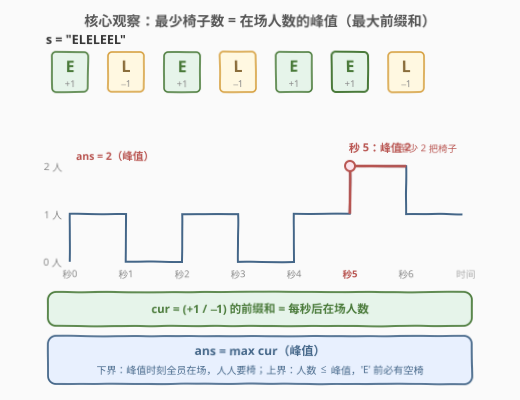
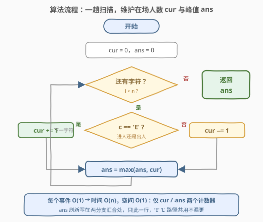
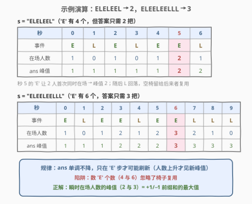

# 候诊室中的最少椅子数

- **题目名称**：候诊室中的最少椅子数
- **链接**：[3168. 候诊室中的最少椅子数](https://leetcode.cn/problems/minimum-number-of-chairs-in-a-waiting-room/)
- **难度**：简单
- **标签**：字符串、模拟

## 1. 题目概述

给你一个字符串 `s`，模拟每秒钟的事件 `i`：

- 如果 `s[i] == 'E'`，表示有一位顾客进入候诊室并占用一把椅子。
- 如果 `s[i] == 'L'`，表示有一位顾客离开候诊室，从而释放一把椅子。

返回保证每位进入候诊室的顾客都有椅子坐的**最少**椅子数，假设候诊室最初是**空的**。

**示例 1**：

```text
输入：s = "EEEEEEE"
输出：7
解释：每秒后都有一个顾客进入候诊室，没有人离开。因此，至少需要 7 把椅子。
```

**示例 2**：

```text
输入：s = "ELELEEL"
输出：2
解释：假设候诊室里有 2 把椅子。7 秒内人数依次为 1 → 0 → 1 → 0 → 1 → 2 → 1，峰值 2。
```

**示例 3**：

```text
输入：s = "ELEELEELLL"
输出：3
解释：人数依次为 1 → 0 → 1 → 2 → 1 → 2 → 3 → 2 → 1 → 0，峰值 3。
```

**约束条件**：

- $1 \le s.length \le 50$
- `s` 仅由字母 `'E'` 和 `'L'` 组成
- `s` 表示一个有效的进出序列

> 💡 读题关键：椅子是**可复用的资源**——先来的人走后，椅子留给后来的人。所以答案不是数一遍 `'E'` 的个数，而是**同一时刻最多有多少人同时在室内**。题目保证 `s` 是合法进出序列（任何前缀中 `'L'` 不会多于 `'E'`），因此室内人数永远 $\ge 0$，无需处理"空室还有人离开"的异常。

---

## 2. 解题思路

### 2.1 朴素思路：模拟每把椅子的占用与释放

最直白的做法是用一个集合/队列记录"哪些椅子当前空闲"：遇到 `'E'` 就从空闲集合取一把（不够则新添一把），遇到 `'L'` 就放回去一把。这样模拟当然正确，但**椅子之间完全无差别**——题目只问总数，不问哪把椅子给了谁。"哪把椅子"这一信息是冗余的，状态可以坍缩成一个整数：**当前室内人数**。人数就是"正被占用的椅子数"，集合模拟退化为计数器模拟。

> ⚠️ 另一个极端是"每人新添一把椅子"——直接返回 `count('E')`。这在示例 1（`"EEEEEEE"` → 7）恰好正确，但示例 2 中 4 进 3 出，买 4 把椅子就有 1 把永远空置：**先来的人离开后椅子会被后来者复用**，这正是本题埋的陷阱。

### 2.2 核心观察：答案 = 在场人数的峰值（最大前缀和）



把每个事件翻译成对**室内人数**的增量：$E \to +1$，$L \to -1$。从空的候诊室（人数 0）出发逐秒推进，得到一条起伏的"人数曲线"。答案就是这条曲线的**峰值**：

$$\text{ans} = \max_{0 \le i < n} \text{cur}_i, \qquad \text{cur}_i = \sum_{j=0}^{i} \Delta_j, \qquad \Delta_j = \begin{cases} +1, & s_j = \texttt{E} \\ -1, & s_j = \texttt{L} \end{cases}$$

**为什么恰好是峰值（必要性 + 充分性）**：

- **必要性（下界）**：取到峰值的那一秒，室内同时有 $\text{ans}$ 个人，每人必须有一把椅子，故椅子数 $\ge$ 峰值；
- **充分性（上界）**：只要备足"峰值"把椅子，任何 `'E'` 发生前人数至多 $\text{peak} - 1$（因为 $+1$ 之后仍 $\le \text{peak}$），必有一把空椅。峰值把椅子**够用且不多余**。

> 💡 **漂亮的换皮（面试加分点）**：令 $E \leftrightarrow (\,'('\,$、$L \leftrightarrow \,')'\,$。合法进出序列 ⇔ 合法括号串（每个前缀 `')'` 不多于 `'('`），室内人数 ⇔ 当前**括号嵌套深度**。于是本题与 [1614. 括号的最大嵌套深度](https://leetcode.cn/problems/maximum-nesting-depth-of-the-parentheses/) 完全同构：**最少椅子数 = 最大嵌套深度 = ±1 前缀和的最大值**。同一道题换了三层皮：候诊室、括号串、经典的"火车站最少站台数"。

### 2.3 算法流程图



流程只有四步：

1. `cur = 0, ans = 0`；
2. 逐字符扫描 `s`：`'E'` 则 `cur++`，`'L'` 则 `cur--`；
3. 每步 `ans = max(ans, cur)` 刷新峰值；
4. 扫描结束返回 `ans`。

### 2.4 示例演算



以 `s = "ELELEEL"` 为例（加粗列为峰值首次出现处）：

| 秒 | 0 | 1 | 2 | 3 | 4 | 5 | 6 |
|------|---|---|---|---|---|---|---|
| 事件 | E | L | E | L | E | E | L |
| 在场人数 | 1 | 0 | 1 | 0 | 1 | **2** | 1 |
| ans 峰值 | 1 | 1 | 1 | 1 | 1 | **2** | 2 |

峰值出现在秒 5——两个 `'E'` 相邻，第 2 位顾客在第 1 位离开前进入，两人首次同时在场，所以至少 2 把椅子；此后人数回落，空出的椅子可复用，答案定格 **2**。

`"ELEELEELLL"` 同理：人数序列 $1 \to 0 \to 1 \to 2 \to 1 \to 2 \to \mathbf{3} \to 2 \to 1 \to 0$，秒 6 首次三人同场，答案 **3**。注意两例中 `'E'` 的个数分别是 4 和 6，都比答案大——**累计进入量 ≠ 瞬时在场量**。

---

## 3. 参考代码

### C++

```cpp
class Solution {
  public:
    int minimumChairs(string s) {
        int cur = 0, ans = 0;
        for (char c : s) {
            cur += (c == 'E') ? 1 : -1;   // E: +1 进人，L: −1 出人
            ans = max(ans, cur);          // 实时刷新在场人数峰值
        }
        return ans;
    }
};
```

### Python

```python
class Solution:
    def minimumChairs(self, s: str) -> int:
        cur = ans = 0
        for c in s:
            cur += 1 if c == 'E' else -1
            ans = max(ans, cur)
        return ans
```

> 💡 写法盘点：Python 一行版 `max(accumulate(1 if c == 'E' else -1 for c in s))`（`itertools.accumulate` 恰好逐项吐前缀和，`max` 取峰值；$n \ge 1$ 保证迭代器非空，无需 `default`）。C++ 可把三目压成 `cur += (c == 'E') * 2 - 1`，但可读性略降。**峰值刷新放在两个分支的汇合处只写一次**——不要在 `'E'` 分支里更新、`'L'` 分支里跳过（虽然本题恰好等价：峰值只可能随人数上升而刷新，但汇合处写法更不易漏）。

---

## 4. 复杂度分析

| 维度 | 复杂度 | 说明 |
|------|--------|------|
| 时间复杂度 | $O(n)$ | 每个事件 $O(1)$ 处理，单趟扫描 |
| 空间复杂度 | $O(1)$ | 仅 `cur` / `ans` 两个计数器；朴素"空闲椅子集合"版需 $O(n)$ |
| 答案规模 | $\le 50$ | 峰值不超过 `'E'` 的个数，$n \le 50$，`int` 无溢出风险 |

---

## 5. 扩展

### 5.1 从事件流到区间：峰值并发的通用范式

本题输入是**交错的事件流**；更常见的形态是给**区间集合**，问"同一时刻最多几个区间重叠"——最少椅子数、最少会议室数（253）、最少站台数、把区间分成最少组数（2406）全是同一个问题：**所需资源数 = 峰值并发数**。事件流版沿时间轴扫一遍计数即可；区间版则需排序后用最小堆（或差分数组）求峰值。识别"这题本质在问峰值并发"，是从模拟题跨向调度题的关键一步。

### 5.2 如果椅子有归属 / 问的是容量呢？

- 椅子**无差别**（本题）：一个计数器足矣，峰值即答案；
- 椅子**有归属**（座位号固定、离开后须坐回原位）：维护一个"空闲座位队列"即可——'E' 队首取一把，'L' 归还一把，仍与计数器等价，因为归还的椅子总会被再取走，总数不变；
- **容量反向判定**：不给椅子数问"最少"，而是给定容量问"会不会超载"——就是 1094 拼车，逐站上下客计数、看峰值是否超载即可。

---

## 6. 面试要点

1. **为什么答案是峰值而不是 'E' 的个数？**

   - `'E'` 的个数是**累计进入量**，忽略了椅子复用；峰值是**瞬时在场量**。先进入的人离开后椅子空出，可被后来者使用，所以只需覆盖"最多人同时在场"的那一时刻。必要性（峰值时刻人人要椅）+ 充分性（`'E'` 前人数至多 peak−1，必有空椅）合起来即最优。

2. **需要栈/队列来记录哪些椅子空闲吗？**

   - 不需要。椅子彼此无差别，"哪把椅子空着"对答案无影响，状态可坍缩为计数器 `cur`。这是模拟题的常用简化：**先问"状态里哪些信息是答案真正依赖的"，把无关维度扔掉**（对照 2.1 的空闲集合模拟）。

3. **`s` 是合法序列这个保证用在哪？去掉会怎样？**

   - 合法性保证任何前缀 `'L'` 数 ≤ `'E'` 数，即人数曲线永不为负（对应合法括号串的深度恒 ≥ 0）。若去掉：出现"空室还有人离开"时语义未定义——忽略、报错还是别的？题目须补充约定，代码上需加 `cur = max(cur - 1, 0)`（忽略式）之类的防御。

4. **这题和括号类题是什么关系？**

   - 令 E↔`'('`、L↔`')'`，本题就是求合法括号串的**最大嵌套深度**（1614）；若问"最少补多少字符使其合法"则变成 921 的 running balance 计数器。E/L、括号、上下车、上下台全是同一套 **±1 前缀和**模型的换皮。

5. **一行 Python 怎么写？复杂度会变吗？**

   - `max(accumulate(1 if c == 'E' else -1 for c in s))`：`accumulate` 惰性生成前缀和，`max` 取峰值，整体仍是 $O(n)$ 时间、$O(1)$ 辅助空间（不落中间列表）。

---

## 7. 同类练习题

- [1614. 括号的最大嵌套深度](https://leetcode.cn/problems/maximum-nesting-depth-of-the-parentheses/)：本题的**完全同构版**——E/L 换成 ( /)，最少椅子数 = 最大嵌套深度
- [2406. 将区间分为最少组数](https://leetcode.cn/problems/divide-intervals-into-minimum-number-of-groups/)：**区间版峰值并发**——事件流换成区间集合，最少组数 = 最大重叠数
- [1094. 拼车](https://leetcode.cn/problems/car-pooling/)：**容量反向判定**——给定容量逐站计数，看峰值是否超载
- [921. 使括号有效的最少添加](https://leetcode.cn/problems/minimum-add-to-make-parentheses-valid/)：同款 ±1 running balance 计数器，从"求峰值"换成"数缺口"
- [1700. 无法吃午餐的学生数量](https://leetcode.cn/problems/number-of-students-unable-to-eat-lunch/)：同标签（模拟）的队列模拟入门，体会"状态该记多细"
