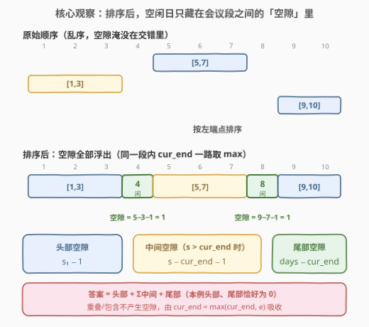
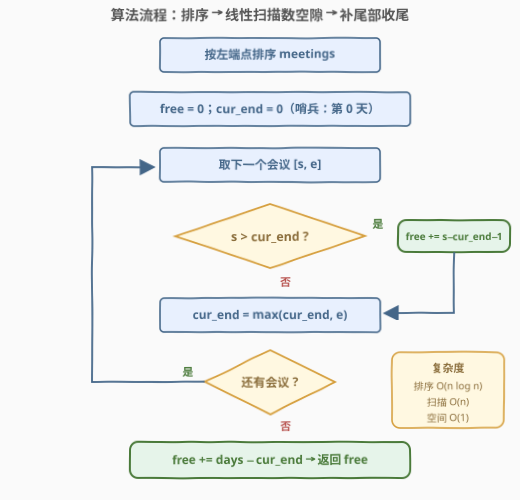
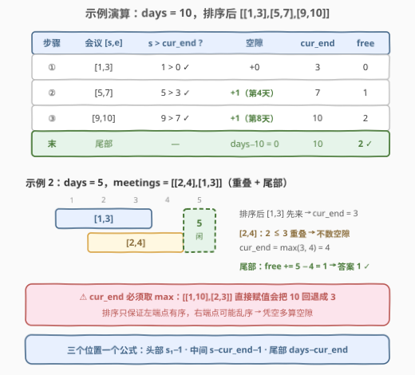

# 无需开会的工作日

- **题目名称**：无需开会的工作日
- **链接**：[3169. 无需开会的工作日](https://leetcode.cn/problems/count-days-without-meetings/)
- **难度**：中等
- **标签**：数组、排序、区间合并

## 1. 题目概述

给你一个正整数 `days`，表示员工可工作的总天数（从第 1 天开始）。另给你一个二维数组 `meetings`，长度为 `n`，其中 `meetings[i] = [start_i, end_i]` 表示第 `i` 次会议的开始和结束天数（**包含首尾**）。

返回员工可工作且**没有安排会议**的天数。

**注意**：会议时间可能会有重叠。

**示例 1**：

```text
输入：days = 10, meetings = [[5,7],[1,3],[9,10]]
输出：2
解释：第 4 天和第 8 天没有安排会议。
```

**示例 2**：

```text
输入：days = 5, meetings = [[2,4],[1,3]]
输出：1
解释：第 5 天没有安排会议。
```

**示例 3**：

```text
输入：days = 6, meetings = [[1,6]]
输出：0
解释：所有工作日都安排了会议。
```

**约束条件**：

- `1 <= days <= 10^9`
- `1 <= meetings.length <= 10^5`
- `meetings[i].length == 2`
- `1 <= meetings[i][0] <= meetings[i][1] <= days`

> 💡 **审题关键**：`days` 高达 $10^9$ 而 `meetings` 最多只有 $10^5$ 个——**值域巨大、会议数很少**。这组约束直接排除了「开一个 `days` 大小的数组逐天打标记」的做法，逼你把「哪些天被占用」压缩成**区间**来处理。

---

## 2. 解题思路

### 2.1 暴力思路：值域打标记（被 10^9 卡死）

最直观的做法：开一个 `days + 1` 的布尔数组 `busy`，对每个会议把 `busy[start … end]` 全置 `true`，最后数 `false` 的个数。时间 `O(days + n)`、空间 `O(days)`。

问题在于 `days ≤ 10^9`：这个数组约 1 GB，开不出来；就算改用差分数组，值域大小不变，照样爆空间。**值域才是瓶颈，必须换视角**——不逐天看，改看「区间与区间之间的空隙」。

### 2.2 核心观察：排序后，空闲日只藏在会议段之间的空隙里



把会议按**左端点升序**排序后，重叠/相邻的会议一定连续出现。维护 `cur_end` = 当前已**连续占用**到的最后一天，从 `0` 开始（第 0 天不存在，天然哨兵）。依次扫描每个会议 `[s, e]`：

- 若 `s > cur_end`：中间出现空隙，即第 `cur_end+1 … s−1` 天，共 `s − cur_end − 1` 天**空闲**；
- 无论有无空隙，都执行 `cur_end = max(cur_end, e)`——用 `max` 是因为后面的会议可能**被完全包含**在已占用范围内（如 `[1,10]` 后跟 `[2,3]`，直接赋值会让 `cur_end` 回退）。

所有会议处理完后，补上**尾部空隙**：第 `cur_end+1 … days` 天，共 `days − cur_end` 天。记 $E$ 为当前已连续占用到的最后一天（即 `cur_end`），则：

$$\text{free} = \underbrace{(s_1 - 1)}_{\text{头部空隙}} \;+\; \sum_{\text{相邻段}} \underbrace{(s - E - 1)}_{\text{中间空隙}} \;+\; \underbrace{(days - E)}_{\text{尾部空隙}}$$

这本质上就是 [56. 合并区间](https://leetcode.cn/problems/merge-intervals/) 的「边合并边数空隙」版：不需要真的把合并结果存下来，合并动作被简化成「`cur_end` 取 `max`」一行。

> 💡 **端点细节**：会议是**闭区间**（首尾都算开会）。`[1,3]` 与 `[3,5]` 共享第 3 天，属重叠；`[1,3]` 与 `[4,6]` 日历上紧挨着，中间空闲天数为 `4 − 3 − 1 = 0`——空隙公式自动给出 0，无需特判。

### 2.3 算法流程



1. 按**左端点升序**排序 `meetings`（左端点相同时右端点自然有序，无需额外处理）
2. 初始化 `free = 0`，`cur_end = 0`（哨兵：第 0 天，表示还没占用任何天）
3. 依次遍历每个会议 `[s, e]`：
   - 若 `s > cur_end`：`free += s - cur_end - 1`（中间空隙）
   - `cur_end = max(cur_end, e)`（扩展占用范围，重叠/包含都正确）
4. 遍历结束，`free += days - cur_end`（尾部空隙），返回 `free`

### 2.4 示例演算



**示例 1**：`days = 10, meetings = [[5,7],[1,3],[9,10]]`，排序后 `[[1,3],[5,7],[9,10]]`：

| 步骤 | 会议 [s,e] | s > cur_end ? | 空隙 | cur_end | free |
|------|-----------|---------------|------|---------|------|
| ① | [1,3] | 1 > 0 ✓ | 1−0−1 = 0 | 3 | 0 |
| ② | [5,7] | 5 > 3 ✓ | 5−3−1 = **1**（第 4 天） | 7 | 1 |
| ③ | [9,10] | 9 > 7 ✓ | 9−7−1 = **1**（第 8 天） | 10 | 2 |
| 末 | — | — | 尾部 10−10 = 0 | — | **2** ✓ |

**示例 2**：`days = 5, meetings = [[2,4],[1,3]]`，排序后 `[[1,3],[2,4]]`：

| 步骤 | 会议 [s,e] | s > cur_end ? | 空隙 | cur_end | free |
|------|-----------|---------------|------|---------|------|
| ① | [1,3] | 1 > 0 ✓ | 0 | 3 | 0 |
| ② | [2,4] | 2 > 3 ✗（重叠） | 0 | max(3,4) = 4 | 0 |
| 末 | — | — | 尾部 5−4 = **1** | — | **1** ✓ |

> ⚠️ 示例 2 的第 ② 步藏着两个易错点：`s ≤ cur_end` 时**不数空隙**，但 `cur_end` 仍要更新——且必须写 `max(cur_end, e)`。若写成直接赋值，遇到 `[1,10]` 后跟 `[2,3]` 会把 `cur_end` 从 10 拉回 3，凭空多算出一大段空隙。**排序只保证左端点有序，右端点完全可能乱序**。

---

## 3. 参考代码

### C++

```cpp
class Solution {
  public:
    int countDays(int days, vector<vector<int>>& meetings) {
        sort(meetings.begin(), meetings.end());   // 按左端点排序
        int free = 0;
        int curEnd = 0;                           // 已连续占用到的最后一天（0 作哨兵）
        for (auto& m : meetings) {
            if (m[0] > curEnd) {
                free += m[0] - curEnd - 1;        // 中间空隙 (curEnd, m[0])
            }
            curEnd = max(curEnd, m[1]);           // 重叠/包含都取 max，防回退
        }
        return free + (days - curEnd);            // 补上尾部空隙
    }
};
```

### Python

```python
class Solution:
    def countDays(self, days: int, meetings: List[List[int]]) -> int:
        meetings.sort()                           # 按左端点排序
        free = 0
        cur_end = 0                               # 已连续占用到的最后一天（0 作哨兵）
        for s, e in meetings:
            if s > cur_end:
                free += s - cur_end - 1           # 中间空隙 (cur_end, s)
            cur_end = max(cur_end, e)             # 重叠/包含都取 max，防回退
        return free + (days - cur_end)            # 补上尾部空隙
```

---

## 4. 复杂度分析

| 维度 | 复杂度 | 说明 |
|------|--------|------|
| 时间复杂度 | `O(n log n)` | 排序主导；线性扫描 `O(n)`，与 `days` 大小无关 |
| 空间复杂度 | `O(1)` | 只用常数个变量（原地排序的递归栈 `O(log n)` 不计） |

> 💡 复杂度只跟**会议个数** $n$ 走，跟值域 `days` 完全解耦——这正是 2.1 的暴力被卡死后的正确出路。

---

## 5. 扩展：另一种等价口径——总数减覆盖

数空隙之外还有一种对称写法：像 [56. 合并区间](https://leetcode.cn/problems/merge-intervals/) 那样把会议**显式合并**成若干不相交区间，累加每个区间的长度 `e − s + 1` 得到「开会总天数」，再用 `days` 减去它：

```python
meetings.sort()
covered, cur_s, cur_e = 0, meetings[0][0], meetings[0][1]
for s, e in meetings[1:]:
    if s > cur_e:                       # 当前段封存，开启新段
        covered += cur_e - cur_s + 1
        cur_s, cur_e = s, e
    else:                               # 重叠/相邻，扩展右端点
        cur_e = max(cur_e, e)
covered += cur_e - cur_s + 1            # 别忘最后一段
return days - covered
```

两种口径完全等价：**数空隙**关注段与段之间，**总数减覆盖**关注段本身。前者不用保存合并结果、代码更短；后者与 56 的模板一脉相承、更好迁移。面试任选其一，讲清头部/尾部/重叠包含三类边界即可。

---

## 6. 面试要点

1. **为什么不能开数组逐天打标记？**

   - `days ≤ 10^9`，布尔数组约 1 GB，空间爆炸；差分数组的值域同样大
   - 正确出路：只关注 `n ≤ 10^5` 个会议，把「逐天」问题升维成「区间」问题
   - 复杂度从 `O(days)` 降到 `O(n log n)`，与值域解耦

2. **排序后为什么一次扫描就够？**

   - 左端点升序后，能与当前段重叠/相邻的会议必然紧随其后，不会回头
   - `cur_end` 单调不减，空隙只可能出现在「新区间左端点」与「当前占用末尾」之间
   - 与 56 合并区间的正确性论证同源：一旦不重叠，后续左端点更大，可安全封存当前段

3. **`cur_end = max(cur_end, e)` 里的 `max` 能省吗？**

   - 不能。反例：`[[1,10],[2,3]]`，若处理 `[2,3]` 时直接 `cur_end = 3`，会从 10 回退到 3，凭空多算空隙
   - 排序只保证**左端点**有序，右端点完全可能乱序
   - 「被包含的区间」正是 [1288. 删除被覆盖区间](https://leetcode.cn/problems/remove-covered-intervals/) 的考点

4. **闭区间的端点规则怎么处理？**

   - 会议 `[s, e]` 首尾都算开会：`[1,3]` 与 `[3,5]` 共享第 3 天，属重叠（不产生空隙）
   - `[1,3]` 与 `[4,6]` 日历上紧挨：空隙 `4 − 3 − 1 = 0`，公式自动给出 0，无需特判
   - 面试时主动确认「包含首尾」「端点接触算不算重叠」这类边界，是加分项

5. **头部和尾部空隙为什么不会漏？**

   - `cur_end` 初始化为 `0`（不存在的第 0 天作哨兵），第一个会议前的空隙由 `s − 0 − 1 = s − 1` 自动算出
   - 尾部用 `days − cur_end` 收尾，覆盖最后一段会议之后的所有天
   - 三个位置统一成同一个公式 + 一次收尾，正是哨兵技巧的价值

---

## 7. 同类练习题

- [56. 合并区间](https://leetcode.cn/problems/merge-intervals/)：本题母题——排序 + 线性扫描合并，本题只是把「输出合并结果」换成「数空隙」
- [57. 插入区间](https://leetcode.cn/problems/insert-interval/)：已排序无重叠区间中插入新区间，同一套「扩展右端点」逻辑
- [1288. 删除被覆盖区间](https://leetcode.cn/problems/remove-covered-intervals/)：排序后判包含关系，对应本题 `cur_end = max(cur_end, e)` 防回退的场景
- [986. 区间列表的交集](https://leetcode.cn/problems/interval-list-intersections/)：双指针归并两个有序区间列表，区间家族的对照套路
- [1851. 包含每个查询的最小区间](https://leetcode.cn/problems/minimum-interval-to-include-each-query/)：区间与查询都离线排序再匹配，同样靠「排序消除乱序」
