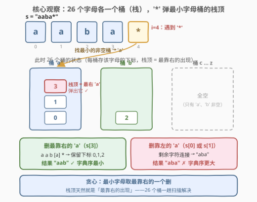
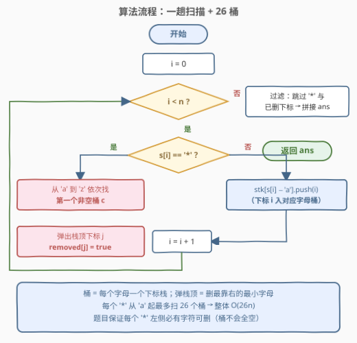
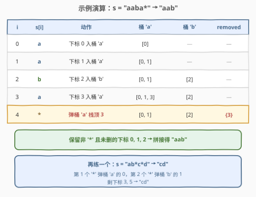

# 删除星号以后字典序最小的字符串

- **题目名称**：删除星号以后字典序最小的字符串
- **链接**：[3170. 删除星号以后字典序最小的字符串](https://leetcode.cn/problems/lexicographically-minimum-string-after-removing-stars/)
- **难度**：中等
- **标签**：栈、贪心、哈希表、字符串、堆（优先队列）

## 1. 题目概述

给你一个字符串 `s`，它可能包含任意数量的 `'*'` 字符。当字符串中还存在至少一个 `'*'` 时，你可以执行以下操作：

- 删除**最左边**的 `'*'` 字符，同时删除该星号**左边**一个**字典序最小**的字符；如果左边有多个字典序最小的字符，可以删除其中的**任意一个**。

请返回删除所有 `'*'` 字符之后，剩余字符连接而成的**字典序最小**的字符串。

**示例 1**：

```text
输入：s = "aaba*"
输出："aab"
解释：删除 '*' 号和它左边的其中一个 'a' 字符。选择删除 s[3] 时，s 字典序最小。
```

**示例 2**：

```text
输入：s = "abc"
输出："abc"
解释：字符串中没有 '*' 字符，原样返回。
```

**约束条件**：

- $1 \le s.length \le 10^5$
- `s` 只含有小写英文字母和 `'*'` 字符
- 输入保证操作可以删除所有的 `'*'` 字符

> 💡 读题关键：操作本身是**强制**的——每个 `'*'` 必须配对删掉它左侧一个**字典序最小**的字符，这一步没有讨价还价的空间。整道题唯一的自由度只有一个：**最小字符出现多次时，删哪一个**。全部博弈都浓缩在这一个选择上。

---

## 2. 解题思路

### 2.1 朴素思路：每个 '*' 向左线性扫

按操作顺序模拟：每个 `'*'` 到来时，向左扫描一遍未删除的字符，找出其中字典序最小的字母（取最靠右的一个），打上删除标记。最坏情形（如 `"zz...z*zz...z*"` 交替）每个 `'*'` 都要向左扫 $O(n)$ 个字符，总复杂度 $O(n^2)$，$n = 10^5$ 会超时。

瓶颈在于「找左侧最小字母的最右出现」这个查询被重复做了 $O(n)$ 次。把它变成 $O(1)$（均摊）查询，就是本题的全部优化点。

### 2.2 核心观察：26 个字母桶（栈）——约束已替你贪心



**观察一：「删哪个字符」没有选择。** 每个 `'*'` 必须删掉左侧当前**字典序最小**的字母——这是题目规则，不是策略。所以唯一的决策只剩：最小字母有多个时，删哪个位置。

**观察二（贪心）：同是最小字母，删最靠右的。** 设当前星号左侧未删除字符中的最小字母为 $c$，其出现位置为 $p_1 < p_2 < \dots < p_k$。比较「删 $p_j$」与「删 $p_k$」（$j < k$）两个结果串 $T_j$ 与 $T_k$：

- 两串的前 $p_j$ 个字符完全相同（都是 $s[0..p_j-1]$）；
- 从第 $p_j+1$ 位起，$T_k$ 接的是 $s[p_j..]$（以最小字母 $c$ **开头**），$T_j$ 接的是 $s[p_j+1..]$；
- 设 $x = s[p_j..p_k-1]$（首字符为 $c$，长度 $p_k - p_j$）。若 $x$ **不全为 $c$**，取 $x$ 中第一个 $\ne c$ 的位置 $t$：两串前 $t$ 位打平（都是 $c$），第 $t+1$ 位上 $T_k$ 放的是 $x[t-1] = c$，而 $T_j$ 放的是 $x[t] > c$（$c$ 是最小字母，$x[t] \ne c$ 只能更大）——**$T_k$ 严格更小**；
- 若 $x$ **全为 $c$**：两串该段都是 $p_k - p_j$ 个 $c$，完全打平。

两种情况删 $p_k$ 都不劣，故贪心成立：**最小字母取最靠右的一个删**。

**观察三（数据结构）：「最小字母的最右出现」= 26 个栈的栈顶。** 维护 26 个桶，第 $c$ 个桶是一个栈，按从左到右的顺序存入字母 $c$ 的下标——**栈顶天然就是该字母最靠右的出现**。遇到 `'*'` 时从 `'a'` 起找第一个非空桶，弹栈顶即可，一步同时锁定「最小」与「最靠右」两个条件。

> 💡 直觉版本：删除位置越靠右，被牺牲的字符权重越低——相当于把「损失」推到最低位。删掉最右侧的 $c$ 后，左侧的 $c$ 们原位不动，保住了小字符在高位的位置。

### 2.3 算法流程图



一趟扫描完整模拟了整个操作序列，因为题目本来就要求「按最左 `'*'` 的顺序」逐个执行操作，而扫描顺序恰好就是这个顺序：

1. 初始化 26 个空桶 `stk[0..25]` 与删除标记数组 `removed`；
2. 从左到右扫描 `s[i]`：
   - 若是字母：下标 `i` 压入桶 `stk[s[i]-'a']`；
   - 若是 `'*'`：从 `'a'` 到 `'z'` 找第一个非空桶，弹出栈顶下标 `j`，置 `removed[j] = true`；
3. 扫描结束，按原顺序拼接所有非 `'*'` 且未删除的字符，即为答案。

### 2.4 示例演算



以 `s = "aaba*"` 为例：

| i | s[i] | 动作 | 桶 'a' | 桶 'b' | removed |
|---|------|------|--------|--------|---------|
| 0 | a | 下标 0 入桶 'a' | [0] | — | — |
| 1 | a | 下标 1 入桶 'a' | [0, 1] | — | — |
| 2 | b | 下标 2 入桶 'b' | [0, 1] | [2] | — |
| 3 | a | 下标 3 入桶 'a' | [0, 1, 3] | [2] | — |
| 4 | * | 弹桶 'a' 栈顶 3 | [0, 1] | [2] | {3} |

保留下标 0, 1, 2 → **`"aab"`**。若当初删的是 $s[0]$ 或 $s[1]$，结果会是 `"aba"`，字典序更大——正好印证观察二。

再看 `s = "ab*c*d"`：第 1 个 `'*'` 弹桶 `'a'` 的 0，第 2 个 `'*'` 弹桶 `'b'` 的 1，剩下标 3, 5 → **`"cd"`**。

---

## 3. 参考代码

### C++

```cpp
class Solution {
  public:
    string clearStars(string s) {
        int n = s.size();
        vector<int> stk[26];              // 每个字母一个下标栈，栈顶 = 最靠右的出现
        vector<bool> removed(n, false);   // 墓碑标记
        for (int i = 0; i < n; i++) {
            if (s[i] == '*') {
                for (int c = 0; c < 26; c++) {          // 从 'a' 起找第一个非空桶
                    if (!stk[c].empty()) {
                        removed[stk[c].back()] = true;  // 删最靠右的最小字母
                        stk[c].pop_back();
                        break;
                    }
                }
            } else {
                stk[s[i] - 'a'].push_back(i);
            }
        }
        string ans;
        for (int i = 0; i < n; i++)
            if (s[i] != '*' && !removed[i]) ans += s[i];
        return ans;
    }
};
```

### Python

```python
class Solution:
    def clearStars(self, s: str) -> str:
        buckets = [[] for _ in range(26)]   # 每个字母一个下标栈
        removed = [False] * len(s)
        for i, ch in enumerate(s):
            if ch == '*':
                for c in range(26):         # 从 'a' 起找第一个非空桶
                    if buckets[c]:
                        removed[buckets[c].pop()] = True
                        break
            else:
                buckets[ord(ch) - 97].append(i)
        return ''.join(s[i] for i in range(len(s))
                       if s[i] != '*' and not removed[i])
```

> 💡 代码没有对「26 个桶全空」做特判：题目保证操作可删除所有 `'*'`，即每个 `'*'` 左侧必有存活字符，循环内总能找到非空桶。

---

## 4. 复杂度分析

| 维度 | 复杂度 | 说明 |
|------|--------|------|
| 时间复杂度 | $O(26n)$ | 字母 $O(1)$ 入桶；每个 `'*'` 从 `'a'` 起最多扫 26 个桶找非空者 |
| 空间复杂度 | $O(n)$ | 26 个桶合计存 $\le n$ 个下标，外加 `removed` 标记数组 |
| 正确性依赖 | 贪心 + 栈 | 栈顶即「最靠右的出现」，两个查询条件一步到位 |

$|\Sigma| = 26$ 是常数，整体即 $O(n)$。

---

## 5. 扩展

### 5.1 堆解法：26 桶是优先队列的「基数特化」

本题标签里挂着堆（优先队列）：维护一个小根堆，元素为 $(字母, -下标)$，字母小的先出、同字母下标大（即更靠右）的先出——`'*'` 时弹堆顶即可，$O(n \log n)$。注意到「键」的第一维只有 26 种取值，把堆换成 26 个桶、桶内按下标自然有序（栈），就把 $O(\log n)$ 的堆操作降成了 $O(26)$ 的桶定位——这正是**桶排序思想对比较排序的替换**，与计数排序替代比较排序是同一招。

### 5.2 原地墓碑：省掉 removed 数组

被删下标弹出栈后不会再被访问（扫描只前进），可以把原串直接改写成墓碑，省掉显式标记数组：

```cpp
class Solution {
  public:
    string clearStars(string s) {
        vector<int> stk[26];
        for (int i = 0; i < (int)s.size(); i++) {
            if (s[i] == '*') {
                for (int c = 0; c < 26; c++)
                    if (!stk[c].empty()) {
                        s[stk[c].back()] = '*';   // 原地改成墓碑
                        stk[c].pop_back();
                        break;
                    }
            } else {
                stk[s[i] - 'a'].push_back(i);
            }
        }
        string ans;
        for (char c : s)
            if (c != '*') ans += c;   // 真 '*' 与墓碑一并过滤
        return ans;
    }
};
```

真 `'*'` 与墓碑 `'*'` 在最终过滤时一起被跳过，语义恰好统一。

---

## 6. 面试要点

1. **「删字典序最小的字符」这步有策略空间吗？**

   - 没有。规则强制每个 `'*'` 配对删除左侧一个最小字符；唯一的自由度是最小字母出现多次时选哪个位置——答案是**删最靠右的那个**（见 2.2 的错位比较证明）。

2. **为什么删最靠右的最小字母，而不是最靠左的？**

   - 错位比较：设最小字母 $c$ 出现于 $p_j < p_k$，两结果串前 $p_j$ 位相同；此后删 $p_k$ 的串以 $c$ 开头，删 $p_j$ 的串以 $s[p_j+1] \ge c$ 开头。要么在第一个「非 $c$」位置上前者更小，要么该段全为 $c$ 打平——删 $p_k$ 永不劣。

3. **为什么用 26 个桶而不是小根堆？**

   - 优先队列的键是 (字母, 下标)，字母维度只有 26 种取值，可桶化：26 个桶每桶一个下标栈，找最小非空桶 $O(26)$，弹栈顶 $O(1)$，总 $O(26n)$，优于堆的 $O(n \log n)$。字符集是**固定小常数**时应优先想到桶化。

4. **一趟扫描为什么等价于完整操作序列？**

   - 题目按「最左 `'*'`」顺序执行操作，扫描顺序与操作顺序一致；每个 `'*'` 只依赖其左侧存活字符的集合，而桶/栈实时维护着这个集合。扫描即模拟。

5. **最坏时间复杂度在什么输入下触发？**

   - 类似 `"zz...z*zz...z*"` 的输入：每个 `'*'` 都要 `'a'` 扫到 `'z'` 才找到非空桶，每步 26 次探测，总 $O(26n)$——仍为线性，常数可控。

---

## 7. 同类练习题

- [316. 去除重复字母](https://leetcode.cn/problems/remove-duplicate-letters/)：同求字典序最小结果串，贪心 + 单调栈，体会「贪心方向」与本题的差异
- [402. 移掉 K 位数字](https://leetcode.cn/problems/remove-k-digits/)：删除字符使结果最小，单调栈贪心，与本题共享「删低位优于删高位」的直觉
- [1081. 不同字符的最小子序列](https://leetcode.cn/problems/smallest-subsequence-of-distinct-characters/)：316 的换皮版，巩固字典序贪心 + 栈模板
- [1047. 删除字符串中的所有相邻重复项](https://leetcode.cn/problems/remove-all-adjacent-duplicates-in-string/)：栈模拟字符串消除操作，本题的「无贪心、纯模拟」对照组
- [735. 行星碰撞](https://leetcode.cn/problems/asteroid-collision/)：栈模拟 + 条件消除，本库已有题解，对比「栈内留什么、弹什么」的决策差异
