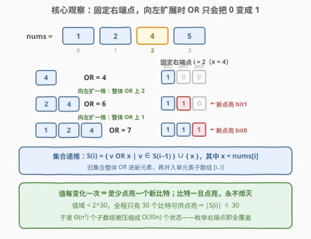
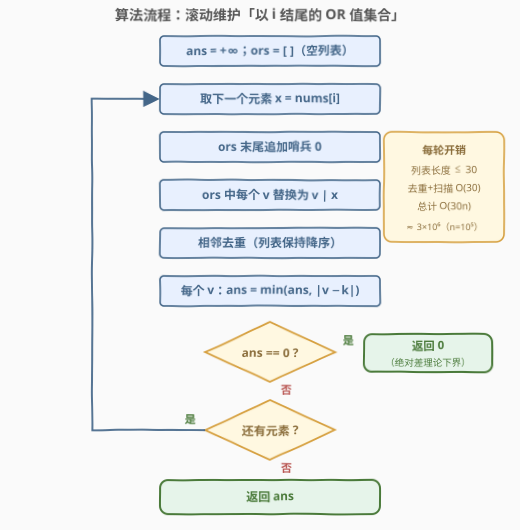

# LeetCode 找到按位或最接近K的子数组 题解

## 1. 题目概述

- **标题 / 题号**：找到按位或最接近 K 的子数组（#3171，hard）
- **链接**：https://leetcode.cn/problems/find-subarray-with-bitwise-or-closest-to-k/
- **难度**：困难
- **标签**：位运算、数组、动态规划、二分查找

**题意**：给你一个数组 `nums` 和一个整数 `k`。你需要找到 `nums` 的一个**子数组**，满足子数组中所有元素按位或运算 OR 的值与 `k` 的**绝对差**尽可能小。换言之，你需要选择一个子数组 `nums[l..r]` 满足 $|k - (\texttt{nums}[l] \text{ OR } \cdots \text{ OR } \texttt{nums}[r])|$ 最小。

请你返回**最小**的绝对差值。

**示例 1**：

```text
输入：nums = [1,2,4,5], k = 3
输出：0
解释：子数组 nums[0..1] 的按位 OR 运算值为 1|2 = 3，得到最小差值 |3 - 3| = 0。
```

**示例 2**：

```text
输入：nums = [1,3,1,3], k = 2
输出：1
解释：子数组 nums[1..1] 的按位 OR 运算值为 3，得到最小差值 |3 - 2| = 1。
```

**示例 3**：

```text
输入：nums = [1], k = 10
输出：9
解释：只有一个子数组，按位 OR 运算值为 1，得到最小差值 |10 - 1| = 9。
```

**约束**：

- $1 \le \texttt{nums.length} \le 10^5$
- $1 \le \texttt{nums}[i] \le 10^9$
- $1 \le k \le 10^9$

> 💡 **审题关键**：$n$ 高达 $10^5$，子数组多达约 $\frac{n(n+1)}{2} \approx 5 \times 10^9$ 个——**枚举子数组本身**就不可行。突破口藏在 OR 的性质里：**值域 $10^9 < 2^{30}$，只有 30 个比特**，而 OR 只会把 0 变成 1。子数组的 OR 值其实「长得都差不多」。

## 2. 解题思路

### 2.1 暴力思路：枚举所有子数组（被 10^5 卡死）

双重循环枚举 $(l, r)$：固定 $l$、向右推进 $r$ 的同时滚动维护 OR 值，顺手更新答案，时间 $O(n^2)$。$n = 10^5$ 时约 $5 \times 10^9$ 次运算，必然 TLE。

问题出在**大量重复计算**：以同一个 $r$ 结尾的各个子数组，OR 值高度相似——都是若干元素 OR 起来，比特只增不减。能否把「以 $r$ 结尾的所有子数组」压缩成极少数代表值？

### 2.2 核心观察：固定右端点，OR 值集合不超过 30 个



定义 $S_i$ 为**以 $i$ 结尾的所有子数组**的 OR 值组成的集合。把子数组从 $[i..i]$ 向左扩成 $[i-1..i]$、$[i-2..i]$……每扩一步，OR 值都满足：

- **单调不减**：OR 只能置 1、不能清 0，越往左扩值越大（比特集是超集）；
- **每变化一次至少点亮一个新比特**：相邻两个长度若 OR 值不同，较长者至少多一个 1；
- **比特永不熄灭**：某个比特一旦被点亮，继续向左扩展它仍然是 1。

而值域 $< 2^{30}$，全程只有 30 个比特可供「点亮」——整条值链至多变化 30 次，即 $|S_i| \le 30$。

于是得到滚动递推（记 $x = \texttt{nums}[i]$）：

$$S_i = \{\, v \text{ OR } x \mid v \in S_{i-1} \,\} \cup \{\, x \,\}$$

含义：以 $i$ 结尾的子数组，要么就是单元素子数组 $[i..i]$（OR 值为 $x$），要么是「某个以 $i-1$ 结尾的子数组再拼上 $x$」（OR 值为旧值 OR 上 $x$）。每轮对集合中每个 $v$ 更新 $ans \leftarrow \min(ans, \lvert v - k \rvert)$，遍历完所有右端点，就等价于扫过了全部子数组。

> 💡 这是位运算的经典套路「**子数组 OR/AND 的 dp 集合**」：[898. 子数组按位或操作](https://leetcode.cn/problems/bitwise-ors-of-subarrays/) 统计不同 OR 值个数、[1521. 找到最接近目标值的函数值](https://leetcode.cn/problems/find-a-value-of-a-mysterious-function-closest-to-target/) 求 AND 最接近目标，用的都是同一个骨架。

### 2.3 算法流程



1. 初始化 $ans = +\infty$，列表 $ors$ 为空（存放当前右端点的 OR 值集合，保持降序）
2. 对每个元素 $x$：
   - $ors$ 末尾**追加哨兵 0**（预留单元素子数组的位置）
   - 列表中每个 $v$ 替换为 $v \mid x$
   - **相邻去重**（列表天然降序，`unique` 一步到位）
   - 对每个 $v$：$ans = \min(ans, \lvert v - k \rvert)$
   - 若 $ans = 0$：已到理论下界，提前收工
3. 返回 $ans$

> 💡 **哨兵 0 的妙处**：「先追加 0、再全体 OR 上 $x$」一步完成两件事——旧值全部并入 $x$，而追加的 0 恰好变成 $x$ 本身（单元素子数组）。列表为什么天然降序？旧列表降序、$v \mapsto v \mid x$ 保序，且旧值 OR 上 $x$ 后仍 $\ge x$，新哨兵落在队尾正好是最小值。

### 2.4 示例演算

![示例演算：nums=[1,2,4,5], k=3 逐步滚动集合](../images/p3171_example_walkthrough.svg)

以示例 1（`nums = [1,2,4,5]`，`k = 3`）为例：

| i | x | 旧集合 $S_{i-1}$ | 新集合 $S_i$ | $\min \lvert v-k \rvert$ | ans |
|---|---|------|------|------|-----|
| 0 | 1 | ∅ | {1} | 2 | 2 |
| 1 | 2 | {1} | {1\|2, 2} = {2, 3} | **0** | **0** |
| 2 | 4 | {2, 3} | {2\|4, 3\|4, 4} = {4, 6, 7} | 1 | 0 |
| 3 | 5 | {4, 6, 7} | {5, 7, 7, 5} → {5, 7} | 2 | 0 |

$i = 1$ 时 $1 \mid 2 = 3$ 恰好等于 $k$，绝对差触底 0，答案就此锁定。

> ⚠️ 第 3 行专门用来看**去重**（列表视角，恒降序）：$[7,6,4]$ → 追加哨兵 0 → $[7,6,4,0]$ → 全体 OR 上 5 → $[7,7,5,5]$ → 相邻去重 → $[7,5]$。不去重列表会越滚越宽；去重后长度恒 $\le 30$。

## 3. 参考代码

### C++

```cpp
class Solution {
  public:
    int minimumDifference(vector<int>& nums, int k) {
        int ans = INT_MAX;
        vector<int> ors;                            // 以当前元素结尾的子数组 OR 值（降序、去重）
        for (int x : nums) {
            ors.push_back(0);                       // 哨兵 0：预留单元素子数组 [i..i] 的位置
            for (int& v : ors) v |= x;              // 旧集合整体 OR 进新元素
            ors.erase(unique(ors.begin(), ors.end()), ors.end());   // 相邻去重
            for (int v : ors) ans = min(ans, abs(v - k));
            if (ans == 0) break;                    // 绝对差的理论下界，提前收工
        }
        return ans;
    }
};
```

### Python

```python
class Solution:
    def minimumDifference(self, nums: List[int], k: int) -> int:
        ans = inf
        cur = set()                                 # 以当前元素结尾的所有子数组 OR 值
        for x in nums:
            cur = {v | x for v in cur} | {x}        # 旧集合整体 OR 进 x，再并入单元素子数组
            ans = min(ans, min(abs(v - k) for v in cur))
            if ans == 0:                            # 绝对差的理论下界，提前收工
                break
        return ans
```

## 4. 复杂度分析

| 维度 | 复杂度 | 说明 |
|------|--------|------|
| 时间复杂度 | $O(n \cdot B)$，$B \approx 30$ | 每个右端点维护并扫描 $\le 30$ 个集合值；$n = 10^5$ 时约 $3 \times 10^6$ 次位运算 |
| 空间复杂度 | $O(B)$ | 只滚动维护一个集合，与 $n$ 无关 |

> 💡 $B = \lceil \log_2 \text{值域} \rceil \approx 30$。复杂度与「值域比特数」线性相关，与子数组个数（$O(n^2)$ 级）彻底解耦——这正是 2.1 的暴力被卡死后该走的路。

## 5. 扩展：ST 表 + 二分的另一条路

官方标签里的 Binary Search 对应另一种做法：

- **OR 满足幂等性**（$a \mid a = a$），属于可重复贡献问题，可用 **ST 表**预处理 $O(n \log n)$、区间 OR 查询 $O(1)$；
- 固定左端点 $l$，$\text{OR}(l..r)$ 随 $r$ **单调不减**——二分出「最后一个 $< k$」与「第一个 $\ge k$」的分界两侧，各取一个候选检查即可；
- 总复杂度 $O(n \log n)$，比集合 dp 版略逊，代码量也大得多，面试首选仍是 2.2 的写法。

另外注意本题**不能**朴素滑动窗口：OR 不可逆（左端点右移无法撤销已点亮的比特），且 $\lvert \text{OR} - k \rvert$ 也不单调（$k$ 两侧都可能接近）。[3097. 或值至少为 K 的最短子数组 II](https://leetcode.cn/problems/shortest-subarray-with-or-at-least-k-ii/) 是用「按位计数」模拟左端点移除才实现了滑窗——OR 单调性的另一种玩法。

还有镜像题 [1521. 找到最接近目标值的函数值](https://leetcode.cn/problems/find-a-value-of-a-mysterious-function-closest-to-target/)（区间 AND 最接近 target）：把「整体 OR 上 $x$」换成「整体 AND 上 $x$」，值链方向反过来（AND 只能清 0），同样 $|S_i| \le 30$，几乎一行改完。

## 6. 面试要点

1. **为什么以每个右端点结尾的 OR 值集合不超过 30 个？**

   - 向左扩展子数组时 OR 单调不减，且相邻两个不同值之间至少点亮一个新比特
   - 比特一旦点亮永不熄灭，值域 $< 2^{30}$ 只有 30 个比特 → 值链至多 30 段
   - 这是「子数组 OR/AND dp 集合」套路的核心引理，898 / 1521 / 3209 通用

2. **暴力 O(n²) 慢在哪？这个优化的本质是什么？**

   - 暴力把 $\Theta(n^2)$ 个子数组逐个算；dp 集合把「以 $i$ 结尾」的全部子数组压成 $\le 30$ 个代表值
   - 递推 $S_i = \{v \mid x\} \cup \{x\}$ 只花 $O(|S_{i-1}|) \le O(30)$，总代价 $O(30n)$
   - 本质是利用 OR 的单调性做**值域压缩 / 状态去重**

3. **为什么相邻去重就够了？列表为什么天然有序？**

   - 旧列表降序，$v \mapsto v \mid x$ 保序，追加的哨兵 0 变成 $x$ 恰是新的最小值 → 新列表仍降序
   - 降序序列中相等元素必然相邻，`unique` 一遍即可扫掉
   - Python 用 `set` 更省心；C++ 的有序列表版可顺手做「相邻去重」

4. **ans == 0 时为什么可以直接 break？**

   - 题目求绝对差的最小值，$0$ 是理论下界，不可能再被更新
   - 后续轮次全是无用功，提前退出是标准剪枝
   - 注意别把「$k$ 很大」误当「答案很大」：如示例 3 中 $k = 10$ 而答案只由子数组 OR 值决定

5. **这题能滑动窗口吗？AND 版（1521）怎么改？**

   - 不能朴素滑窗：OR 不可逆，左端点右移无法撤销比特；$\lvert \text{OR} - k \rvert$ 也非单调
   - 3097（OR ≥ k 的最短子数组）用按位计数维护窗口内每个比特的出现次数，才能模拟左端点移除
   - 1521 把「整体 OR」换成「整体 AND」：值链改为单调不增、每变化一次至少清掉一个比特，其余原封不动

## 同类练习题

| # | 题目 | 与本题的关联 |
|---|------|-------------|
| 898 | [子数组按位或操作](https://leetcode.cn/problems/bitwise-ors-of-subarrays/) | 同一「右端点集合」模板的源头题，把「求最接近 k」换成「统计所有子数组 OR 的不同值个数」 |
| 1521 | [找到最接近目标值的函数值](https://leetcode.cn/problems/find-a-value-of-a-mysterious-function-closest-to-target/) | AND 镜像版（区间函数值即 AND），把「整体 OR」换成「整体 AND」即可 |
| 3097 | [或值至少为 K 的最短子数组 II](https://leetcode.cn/problems/shortest-subarray-with-or-at-least-k-ii/) | OR 单调性的滑窗玩法，因 OR 不可逆须按位计数维护窗口 |
| 3209 | [子数组按位与值为 K 的数目](https://leetcode.cn/problems/number-of-subarrays-with-and-value-of-k/) | AND 值集合 + 哈希计数，本题技术的计数版变体 |
