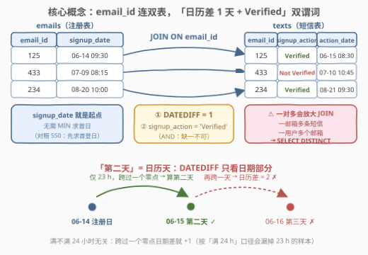
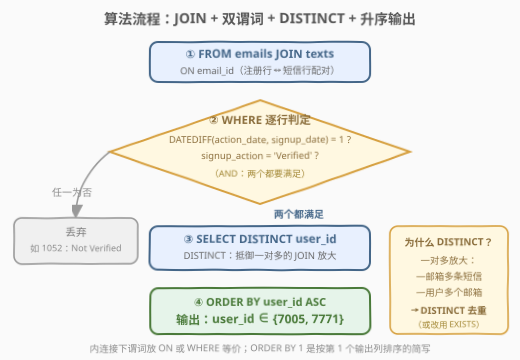
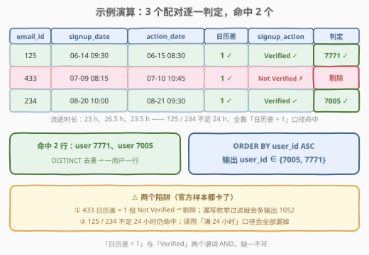

# 第二天验证

- **题目名称**：第二天验证
- **链接**：[3172. 第二天验证](https://leetcode.cn/problems/second-day-verification/)
- **难度**：简单
- **标签**：数据库、SQL、`JOIN` 连接、`DATEDIFF`、日期口径、`DISTINCT` 去重、`EXISTS` 半连接

## 1. 题目概述

> ⚠️ 本题为 LeetCode 付费题（Plus 会员专享），题意描述根据官方示例用例与外部资料重建，可能与官方题面有出入。

用户注册后会收到验证短信。给定 `emails`（注册表）与 `texts`（短信表）两张表，编写一个解决方案，找到所有**第二天验证注册**（即在注册后**第二天**收到 `Verified` 短信）的用户 ID。

返回结果表以 `user_id` **升序**排序。

**表结构**：

```text
表：emails
+-------------+----------+
| Column Name | Type     |
+-------------+----------+
| email_id    | int      |
| user_id     | int      |
| signup_date | datetime |
+-------------+----------+
(email_id, user_id) 是这张表的主键（有不同值的列的组合）。
这张表的每一行包含 email ID，user ID 和注册日期。
```

```text
表：texts
+---------------+----------+
| Column Name   | Type     |
+---------------+----------+
| text_id       | int      |
| email_id      | int      |
| signup_action | enum     |
| action_date   | datetime |
+---------------+----------+
(text_id, email_id) 是这张表的主键（有不同值的列的组合）。
signup_action 是 ('Verified', 'Not Verified') 的枚举类型。
这张表的每一行包含 text ID，email ID，注册操作和操作日期。
```

**示例 1**（依据官方测试用例重建）：

```text
输入：
emails 表:
+----------+---------+---------------------+
| email_id | user_id | signup_date         |
+----------+---------+---------------------+
| 125      | 7771    | 2022-06-14 09:30:00 |
| 433      | 1052    | 2022-07-09 08:15:00 |
| 234      | 7005    | 2022-08-20 10:00:00 |
+----------+---------+---------------------+

texts 表:
+---------+----------+--------------+---------------------+
| text_id | email_id | signup_action| action_date         |
+---------+----------+--------------+---------------------+
| 1       | 125      | Verified     | 2022-06-15 08:30:00 |
| 2       | 433      | Not Verified | 2022-07-10 10:45:00 |
| 4       | 234      | Verified     | 2022-08-21 09:30:00 |
+---------+----------+--------------+---------------------+

输出：
+---------+
| user_id |
+---------+
| 7005    |
| 7771    |
+---------+
```

**解释**：

| user_id | 判定 |
|---------|------|
| 7771 | 2022-06-14 09:30 注册，2022-06-15（第二天）收到 `Verified` → 入选 |
| 1052 | 2022-07-09 注册，第二天虽收到短信但为 `Not Verified` → 剔除 |
| 7005 | 2022-08-20 10:00 注册，2022-08-21（第二天）收到 `Verified` → 入选 |

**约束与注意**：

- `emails` 主键为 `(email_id, user_id)`——一个用户可能有多个邮箱，一个邮箱只对应一次注册。
- `texts` 主键为 `(text_id, email_id)`——一个邮箱可能收到**多条**短信（同日或不同日、`Verified` 或 `Not Verified` 均可并存）。
- 「第二天」指**日历日期恰好差一天**（`DATEDIFF` 口径），与是否满 24 小时无关（详见 2.2）。
- 输出按 `user_id` **升序**。

> 💡 本题是「**相邻日期判定**」家族的双表版：[197. 上升的温度](../0101-0200/197_上升的温度.md) 用自连接比较「今天 vs 昨天」，[550. 游戏玩法分析 IV](../0501-0600/550_游戏玩法分析IV.md) 用 `MIN` 求首登日再算次日留存率；本题把「起点」（`signup_date`）和「行为」（`texts` 短信）拆进两张表，多了一步 `JOIN`，也多了一个 `Verified` 枚举过滤。

---

## 2. 解题思路

### 2.1 暴力思路：应用层逐行比对

过程式直觉：把两张表全量拉到应用层，在 Python/Java 中逐个邮箱找短信、解析日期做差：

```text
result = set()
for t in texts:
    e = 按 email_id 查 emails
    if t.signup_action == 'Verified' and (t.action_date.date() - e.signup_date.date()).days == 1:
        result.add(e.user_id)
```

逻辑正确，但**全量拉取两张表**、网络往返与内存开销一样不少；更关键的是，它把「日期差」这个数据库**一行函数就能表达**的谓词搬到了应用层——SQL 的 `DATEDIFF` / `DATE_ADD` 正是为这种过滤而生的。与所有 SQL 题一样，能下推到数据库的谓词就应下推（谓词下推原则）。

### 2.2 核心观察：等值连接 + 「日历差一天」双谓词



问题拆解为三步：

1. **定锚点**：`emails.signup_date` 是该邮箱注册的唯一时点——**无需像 550 那样先 `MIN` 求首次日期**，表结构已经把"起点"直接给好了。
2. **连表**：`JOIN texts ON email_id`——注册行与短信行靠 `email_id` 配对（一对多：一个邮箱可收多条短信）。
3. **双谓词过滤**（缺一不可）：
   - `DATEDIFF(action_date, signup_date) = 1`——操作日与注册日的**日历差恰好 1 天**；
   - `signup_action = 'Verified'`——必须是**验证成功**的短信，`Not Verified` 不算。

> ⚠️ **「第二天」是日历天，不是 24 小时**：MySQL 的 `DATEDIFF(a, b)` 只比较两个 datetime 的**日期部分**（等价于 `DATE(a) − DATE(b)`），忽略时分秒。示例中 email 125：06-14 **09:30** 注册，06-15 **08:30** 验证——实际只过了 **23 小时**，但日期部分差 1，就是「第二天」✓。若误写成 `TIMESTAMPDIFF(HOUR, signup_date, action_date) = 24`（满 24 小时），125 和 234 两行（均不足 24h）会被全部漏掉——官方数据专门用两条"不到一天"的样本卡这个口径。

> ⚠️ **JOIN 放大与 `DISTINCT`**：`texts` 主键是 `(text_id, email_id)`，允许同一邮箱收多条短信；`emails` 主键是 `(email_id, user_id)`，允许同一用户注册多个邮箱。两条路径都可能让 JOIN 结果里同一个 `user_id` 出现多次——`SELECT DISTINCT` 兜底（或改用 `EXISTS` 半连接，见解法 B）。

### 2.3 算法流程图



**逻辑执行步骤**：

| 步骤 | 子句 | 作用 | 本题对应 |
|------|------|------|----------|
| ① | `FROM emails JOIN texts ON email_id` | 按 `email_id` 内连接 | 注册行 ↔ 短信行配对 |
| ② | `DATEDIFF(action_date, signup_date) = 1` 且 `signup_action = 'Verified'` | 双谓词 AND 过滤 | 只留「次日验证成功」的配对 |
| ③ | `SELECT DISTINCT user_id` | 投影 + 去重 | 一用户只输出一行 |
| ④ | `ORDER BY user_id` | 升序排序 | `{7005, 7771}` |

> 💡 谓词写在 `ON` 里还是 `WHERE` 里？**内连接下完全等价**——优化器会做同样的谓词处理；只有外连接时分家（`LEFT JOIN` 的 `ON` 失配只补 `NULL` 不删行，`WHERE` 才删行）。本题怎么写都对，把「连接条件 + 过滤条件」都归拢在 `ON` 里，一条链读下来更顺。

### 2.4 示例演算



对示例数据逐行计算（JOIN 后共 3 个配对）：

| email_id | user_id | signup_date | action_date | 日历差 | 流逝时长 | action | 判定 |
|----------|---------|-------------|-------------|--------|----------|--------|------|
| 125 | 7771 | 06-14 09:30 | 06-15 08:30 | **1 ✓** | 23 h | Verified ✓ | **输出 7771** |
| 433 | 1052 | 07-09 08:15 | 07-10 10:45 | 1 ✓ | 26.5 h | **Not Verified ✗** | 剔除 |
| 234 | 7005 | 08-20 10:00 | 08-21 09:30 | **1 ✓** | 23.5 h | Verified ✓ | **输出 7005** |

输出按 `user_id` 升序 → `{7005, 7771}`，与示例一致。

> 💡 注意「日历差」与「流逝时长」两列的**错位**：125 和 234 都不到 24 小时却命中（日历差 = 1），433 超过 24 小时却因 `Not Verified` 出局。官方样本同时卡住「时间口径」和「枚举过滤」两个考点——这正是本题作为简单题的全部陷阱所在。

---

## 3. 参考代码

### SQL（解法 A：JOIN + DATEDIFF，推荐）

```sql
SELECT DISTINCT e.user_id
FROM emails AS e
JOIN texts AS t
  ON t.email_id = e.email_id
 AND t.signup_action = 'Verified'
 AND DATEDIFF(t.action_date, e.signup_date) = 1
ORDER BY e.user_id;
```

> 💡 **写法要点**：
> - **`DATEDIFF(action_date, signup_date)`**：MySQL 口径为「前减后」的日期部分之差，顺序写反会得到 $-1$；结果 $= 1$ 即日历上恰好差一天。
> - **`signup_action = 'Verified'`**：枚举过滤放在 `ON` 里，配对阶段就丢弃 `Not Verified` 行。
> - **`DISTINCT`**：抵御「一个邮箱多条短信 / 一个用户多个邮箱」造成的 JOIN 放大，保证一用户一行。
> - **`ORDER BY e.user_id`** 也可写 `ORDER BY 1`（按输出列序号排序）。

### SQL（解法 B：EXISTS 半连接，天然免 DISTINCT）

```sql
SELECT e.user_id
FROM emails AS e
WHERE EXISTS (
    SELECT 1
    FROM texts AS t
    WHERE t.email_id = e.email_id
      AND t.signup_action = 'Verified'
      AND DATEDIFF(t.action_date, e.signup_date) = 1
)
ORDER BY e.user_id;
```

> 💡 **写法要点**：`EXISTS` 是**半连接**（semi-join）语义——只要存在一条满足条件的短信，外层注册行就入选，**结构上不可能产生重复**，无需 `DISTINCT`。语义与解法 A 完全一致，多数优化器会给出相近的执行计划；写哪个看团队口味，面试里能说清「半连接 vs 连接 + 去重」的等价性即可。

### SQL（解法 C：日期等值比较，跨库最通用）

```sql
SELECT DISTINCT e.user_id
FROM emails AS e
JOIN texts AS t
  ON t.email_id = e.email_id
 AND t.signup_action = 'Verified'
 AND DATE(t.action_date) = DATE(e.signup_date) + INTERVAL 1 DAY
ORDER BY 1;
```

> 💡 **写法要点**：把「差一天」改写成「注册日 + 1 天 = 操作日」的**等值比较**。`DATE()` 抹掉时间部分，`+ INTERVAL 1 DAY` 是 MySQL 的日期加法（也可写 `DATE_ADD(DATE(e.signup_date), INTERVAL 1 DAY)`）。等值形式的好处：**任何**支持日期类型与 `CAST`/`TRUNC` 的数据库都能照写（PostgreSQL：`t.action_date::date = e.signup_date::date + 1`；Oracle：`TRUNC(t.action_date) = TRUNC(e.signup_date) + 1`），见 5.1 的对照表。

### Python（pandas）

```python
import pandas as pd

def second_day_verification(emails: pd.DataFrame, texts: pd.DataFrame) -> pd.DataFrame:
    df = emails.merge(
        texts.loc[texts["signup_action"] == "Verified", ["email_id", "action_date"]],
        on="email_id",
    )
    mask = (
        df["action_date"].dt.normalize() - df["signup_date"].dt.normalize()
    ).dt.days == 1
    return (
        df.loc[mask, ["user_id"]]
        .drop_duplicates()
        .sort_values("user_id")
        .reset_index(drop=True)
    )
```

> 💡 **pandas 对照**：
> - **`.dt.normalize()` 不可省**：直接写 `(action_date - signup_date).dt.days == 1` 比较的是**流逝时长**（timedelta 向下取整的天数）——125 行只差 23 小时，`.dt.days = 0`，会被漏掉。`normalize()` 把时间抹成 `00:00:00`，做差才是「日历天差」，对应 SQL 的 `DATEDIFF`。
> - 先在 `texts` 上过滤 `Verified` 再 `merge`，对应 SQL 的 `ON` 过滤条件；`drop_duplicates()` 对应 `DISTINCT`；`sort_values` 对应 `ORDER BY`。

---

## 4. 复杂度分析

设 $n$ 为 `emails` 行数，$m$ 为 `texts` 行数，$k$ 为输出用户数。

| 维度 | SQL（解法 A/B/C） | pandas |
|------|-------------------|--------|
| **时间** | $O(n + m)$ + 排序 $O(k \log k)$（哈希连接 / `email_id` 有索引时；无索引嵌套循环退化为 $O(n \cdot m)$） | 同量级：`merge` 即哈希连接 |
| **空间** | $O(n + m)$ 连接中间结果 | $O(n + m)$ 全表入内存 |
| **去重开销** | `DISTINCT` 哈希去重 $O(1)$/行；`EXISTS` 无需去重 | `drop_duplicates()` 一次排序/哈希 |
| **可读性** | ✓ 三个条件并列在 `ON` 里 | ✓ `normalize` 一步对齐口径 |

> - 谓词本身（`DATEDIFF`、字符串等值）都是每行 $O(1)$ 的求值，整体开销由**连接**主导。
> - `DATEDIFF(t.action_date, e.signup_date)` 两侧都包了函数/引用了连接列，属于**非 SARGable** 谓词，无法直接利用索引——但连接键 `email_id` 上的索引仍能显著收敛扫描范围（先按 `email_id` 配对，再逐对判定）。真实业务中若「次日验证率」是高频报表，更常见的做法是把口径落到写入侧的冗余列（如 `verified_next_day` 标记）。
> - LeetCode 判题数据量很小（几十行级），任何写法都能瞬时通过；复杂度分析的价值在于说清**连接方式**与**谓词下推**的影响。

---

## 5. 扩展

### 5.1 「日期差一天」跨数据库写法对照

| 数据库 | 写法 | 备注 |
|--------|------|------|
| MySQL | `DATEDIFF(a, b) = 1` | 只看日期部分；参数顺序敏感（**前减后**） |
| SQL Server | `DATEDIFF(day, b, a) = 1` | 参数顺序**相反**（`datepart, start, end`），数的是跨过的日界数 |
| PostgreSQL | `a::date - b::date = 1` 或 `a::date = b::date + 1` | `date` 相减直接得整数天数 |
| Oracle | `TRUNC(a) - TRUNC(b) = 1` | `TRUNC` 抹掉时间部分 |
| 通用等值式 | `DATE(a) = DATE(b) + INTERVAL 1 DAY` | 等值比较，任何有日期类型/`CAST` 的库都能写 |
| pandas | `(a.dt.normalize() - b.dt.normalize()).dt.days == 1` | `normalize` 抹时间，对应 `DATEDIFF` |

> 💡 两个同姓兄弟最容易混：**MySQL 的 `DATEDIFF(a, b)`** 与 **SQL Server 的 `DATEDIFF(day, b, a)`**——语义同为「日期部分之差」，但参数顺序相反；而 MySQL 的 `TIMESTAMPDIFF(unit, b, a)` 才是「完整流逝的时间单位数」。面试口诀：**MySQL `DATEDIFF` 前减后只看天，`TIMESTAMPDIFF` 算的是实打实的时长**。

### 5.2 「次日」口径辨析：日历天 vs 24 小时

「第二天验证」在产品口径上几乎总是**日历天**（次日 = 跨过一个零点），对应互联网「次日留存」的通用定义（DAU 按日期分桶，`2026-08-30` 与 `2026-08-29` 即为两天）：

| 情形 | 注册 | 验证 | 日历差 | 流逝时长 | 本题判定 |
|------|------|------|--------|----------|----------|
| 深夜注册、凌晨验证 | 06-14 23:00 | 06-15 00:30 | 1 | 1.5 h | ✓ 第二天 |
| 傍晚注册、清晨验证（示例 125/234） | 06-14 09:30 | 06-15 08:30 | 1 | 23 h | ✓ 第二天 |
| 注册后超过一整天 | 06-14 09:00 | 06-15 23:00 | 1 | 38 h | ✓ 第二天 |
| 隔了两天 | 06-14 23:00 | 06-16 00:30 | 2 | 25.5 h | ✗ 第三天 |

- 注意最后一行：**流逝 25.5 小时却不是第二天**——若用「满 24 小时」口径（`TIMESTAMPDIFF(HOUR, ...) >= 24`）会误判，同时又会漏掉前两行不到 24 小时的样本。两种口径互不包含，**不能互相替换**。
- 若需求真的改成「24 小时内验证」，写法是区间比较：`action_date BETWEEN signup_date AND signup_date + INTERVAL 24 HOUR`——与「次日」是两道不同的题。
- 家族对照：[550](https://leetcode.cn/problems/game-play-analysis-iv/) 的「次日留存」同样用 `DATEDIFF = 1`；[197](https://leetcode.cn/problems/rising-temperature/) 的「比昨天温度高」也是 `DATEDIFF = 1` 的自连接——日历天口径是这个家族的统一约定。

---

## 6. 面试要点

**Q1：为什么 `DATEDIFF(action_date, signup_date) = 1` 恰好表达「第二天」？参数顺序有什么坑？**

> MySQL 的 `DATEDIFF(expr1, expr2)` 定义是 `DATE(expr1) − DATE(expr2)`——只取日期部分做差，忽略时分秒。「第二天」即日期部分恰好大 1。顺序是**前减后**：把 `action_date` 写在前面得到 $1$，写反得到 $-1$ 永远不命中。示例中 09:30 注册、次日 08:30 验证只隔 23 小时仍算第二天，正是「只看日期部分」的体现。

**Q2：把 `DATEDIFF` 换成 `TIMESTAMPDIFF(HOUR, signup_date, action_date) = 24` 行不行？**

> 不行，语义变了。`TIMESTAMPDIFF` 计算的是**完整流逝**的小时数：示例 125（23 h）和 234（23.5 h）都不到 24 小时，会被漏掉；反过来 06-14 23:00 → 06-16 00:30（25.5 h）倒是满 24 小时，却已经是第三天。两个口径互不包含。顺带：SQL Server 的 `DATEDIFF(day, b, a)` 数的是**跨过的日界数**，结果与 MySQL 日期差一致，但参数顺序是 `(datepart, start, end)`，正好相反。

**Q3：为什么需要 `DISTINCT`（或 `EXISTS`）？**

> 两张表的主键都允许「一对多」：`texts` 主键 `(text_id, email_id)` 意味着一个邮箱可收多条短信——若某邮箱在第二天先后收到 `Not Verified` 和 `Verified` 两条，JOIN 会产出两行，其中一行命中，`user_id` 出现一次还好；但若两天内有多条 `Verified`，内连接 + 等值过滤就会把同一用户重复输出。`emails` 主键 `(email_id, user_id)` 还允许一用户多邮箱，任一邮箱次日验证成功即入选，同样可能放大。`DISTINCT` 是兜底去重；`EXISTS` 半连接从语义上「存在即可」，结构上就不会重复，两者等价。

**Q4：谓词写在 `ON` 里和写在 `WHERE` 里有区别吗？**

> **内连接下完全等价**——`JOIN ... ON <条件>` 与 `JOIN ON TRUE WHERE <条件>` 对内连接产出相同的行集，优化器会统一处理。只有**外连接**才分家：`LEFT JOIN` 的 `ON` 失配只是把右表列补成 `NULL`（行保留），`WHERE` 失配则整行删除。本题用内连接，怎么写都对；工程上习惯把「连接键条件」放 `ON`、「业务过滤」放 `WHERE`，但把过滤并入 `ON` 一条链读完，小型查询里可读性反而更好。

**Q5：本题与 197 / 550 相比，「起点」的处理差在哪？**

> 197 单表自连接，比较的是**同一张表内**的相邻日期，起点由自连接配对隐式给出；550 的行为表里一个玩家多条记录，「首次登录日」必须先用 `MIN(event_date)` 子查询求出来，再判 `DATEDIFF = 1`，最后还要聚合成留存比例；本题把「起点」单独放进 `emails.signup_date`——注册表天然一对一，**省掉了求首日的子查询**，只需 `JOIN` + 双谓词 + `DISTINCT`。三题难度递进：197（自连接）< 本题（双表连接）< 550（首日子查询 + 聚合）。

> 💡 **一句话总结**：**连接靠 `email_id`，次日看 `DATEDIFF = 1`（日历天，不是 24 小时），验证要 `Verified`，输出 `DISTINCT` 再排序**——四件套凑齐，简单题稳拿。

---

## 7. 同类练习题

- [197. 上升的温度](https://leetcode.cn/problems/rising-temperature/)（[题解](../0101-0200/197_上升的温度.md)）：`DATEDIFF = 1` 的开山题——单表自连接比较「今天 vs 昨天」，本题把同样的日期差判定升级为跨表配对
- [550. 游戏玩法分析 IV](https://leetcode.cn/problems/game-play-analysis-iv/)（[题解](../0501-0600/550_游戏玩法分析IV.md)）：同是「次日」判定（`DATEDIFF = 1`），但需先 `MIN` 求首登日、再聚合成留存比例——本题去掉聚合与首日子查询，保留连接
- [1934. 确认率](https://leetcode.cn/problems/confirmation-rate/)（[题解](../1901-2000/1934_确认率.md)）：同一对「注册 Signups / 确认 Confirmations」双表结构的比例版——`AVG(action = 'confirmed')`，与本题的 `Verified` 枚举过滤互为镜像
- [1174. 即时食物配送 II](https://leetcode.cn/problems/immediate-food-delivery-ii/)（[题解](../1101-1200/1174_即时食物配送II.md)）：`MIN` 求首单 + 日期相等判定「即时配送」并求比例——注册后行为分析的另一变体，口径从「次日」换成「同日」
