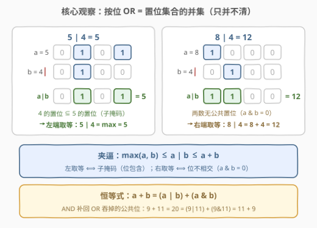
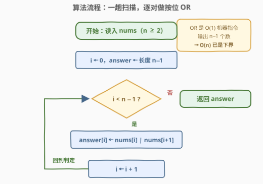
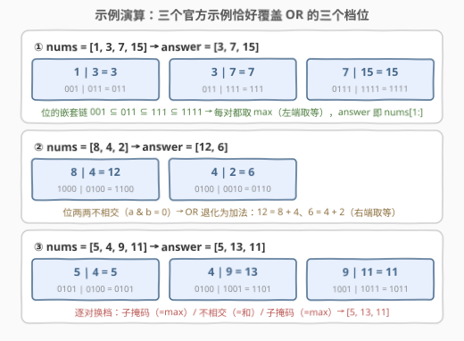

# LeetCode 相邻元素的按位或 题解

## 1. 题目概述

- **标题 / 题号**：相邻元素的按位或（#3173，easy）
- **链接**：https://leetcode.cn/problems/bitwise-or-of-adjacent-elements/
- **难度**：简单
- **标签**：位运算、数组

> ⚠️ 本题为 LeetCode 付费题（🔒 Plus 会员专享），题意描述根据官方示例用例（`jsonExampleTestcases`）与 hints 重建，并已与社区镜像 doocs/leetcode 的官方中文翻译交叉核对（示例输入输出、函数签名 `orArray`、约束条件均一致，出入风险较低）。

**题意**：给定一个长度为 `n` 的数组 `nums`，返回一个长度为 `n - 1` 的数组 `answer`，使得：

$$answer[i] = nums[i] \,|\, nums[i + 1], \quad 0 \le i < n - 1$$

其中 `|` 表示按位 `OR` 操作。

**示例 1**：

```text
输入：nums = [1,3,7,15]
输出：[3,7,15]
```

**示例 2**：

```text
输入：nums = [8,4,2]
输出：[12,6]
```

**示例 3**：

```text
输入：nums = [5,4,9,11]
输出：[5,13,11]
```

**约束**：

- $2 \le nums.length \le 100$
- $0 \le nums[i] \le 100$

> 💡 读题关键：这是一道「定义即算法」的模拟题——题面直接给出了每个输出元素的公式，不存在任何需要「想」出来的优化（$n - 1$ 个输出每个都必须被计算，$O(n)$ 已是下界）。真正的价值在于把 `|` 的**位级语义**吃透：三个官方示例恰好对应了 OR 结果的三个典型档位（子掩码嵌套 / 位不相交 / 两者混合），是讲透按位 OR 性质的绝佳素材。

## 2. 解题思路

### 2.1 朴素思路：按定义直译

最朴素的做法就是**按定义直译**：令 $i$ 从 $0$ 扫到 $n - 2$，逐个计算 $nums[i] \,|\, nums[i + 1]$ 填进答案数组。这已经是最优解——每个输出元素都被公式唯一确定，没有任何可省略的重复计算。

真正意义上的「更暴力」写法是假设位运算符不存在，退化为**二进制拆位模拟**：把两个数各拆成 7 个 bit（$0 \le nums[i] \le 100 < 128$），每一位按「有 1 则 1」的真值表合成，再按权拼回整数，$O(n \log U)$ 也能过。但这只是在手工还原 `|` 本身——语言内置的按位或就是一条 $O(1)$ 机器指令。

> ⚠️ 本题仅有的翻车点全在**边界**而非算法：① 输出长度是 $n - 1$ 不是 $n$；② 循环上界写 `i < n - 1` 时注意 `nums.size()` 是无符号类型（见第 3 节）；③ $n \ge 2$ 保证答案非空，无需特判单元素输入。

### 2.2 核心观察：按位 OR = 置位集合的并集



把整数看作**二进制置位的集合**（第 $k$ 位为 1 ⟺ $k$ 属于该集合），三个位运算立刻有了集合语义：

| 运算 | 位级规则 | 集合语义 |
|------|---------|---------|
| `a \| b` | 有 1 则 1 | 并集 $A \cup B$ |
| `a & b` | 都为 1 才 1 | 交集 $A \cap B$ |
| `a ^ b` | 不同为 1 | 对称差 $A \triangle B$ |

于是 $answer[i] = nums[i] \,|\, nums[i+1]$ 就是把相邻两数的置位集合**取并**——只并把 0 变 1、从不反向。由「只并不清」立即得到一条**夹逼不等式**：

$$\max(a, b) \;\le\; a \,|\, b \;\le\; a + b$$

- **左端取等** ⟺ 一个数的置位集合是另一个的**子集**（子掩码，submask）：$5 \,|\, 4 = 5$，因为 $4$ 的位 $100$ 全含于 $5$ 的 $101$；
- **右端取等** ⟺ 两个置位集合**不相交**（$a \,\&\, b = 0$）：$8 \,|\, 4 = 12 = 8 + 4$，因为 $1000$ 与 $0100$ 无公共位，OR 退化为加法；
- 一般情形夹在中间，例如 $9 \,|\, 11 = 11$（$1001 \subseteq 1011$，仍取左端）。

三个官方示例恰好把三个档位各演示了一遍（详见 2.4）。最后再送一条把两端缝起来的**恒等式**：

$$a + b = (a \,|\, b) + (a \,\&\, b)$$

直觉：加法在公共位上会「翻倍」，而 OR 只保留一份，AND 恰好补回被 OR 吞掉的那一份。验证 $9 + 11 = 20 = (9\,|\,11) + (9\,\&\,11) = 11 + 9$ ✓。

### 2.3 算法流程图



流程四步：

1. 初始化 `answer` 为长度 $n - 1$ 的数组，$i \gets 0$；
2. 若 $i < n - 1$，计算 $answer[i] = nums[i] \,|\, nums[i + 1]$；
3. $i \gets i + 1$，回到步骤 2；
4. 扫描结束，返回 `answer`。

$n \ge 2$ 时答案至少 1 个元素；即便 $n = 1$，循环体一次不执行、自然返回空数组——「空输入」无需特判。

### 2.4 示例演算



| 输入 | 相邻对（二进制） | answer | 档位解读 |
|------|----------------|--------|---------|
| `[1,3,7,15]` | $001\|011$、$011\|111$、$0111\|1111$ | `[3,7,15]` | 位集合逐个**嵌套**（$001 \subseteq 011 \subseteq 111 \subseteq 1111$），每对都是子掩码关系，全部左端取等——$answer$ 恰为 `nums[1:]` |
| `[8,4,2]` | $1000\|0100$、$0100\|0010$ | `[12,6]` | 位集合**两两不相交**（$a \,\&\, b = 0$），OR 退化为加法：$12 = 8+4$、$6 = 4+2$，全部右端取等 |
| `[5,4,9,11]` | $0101\|0100$、$0100\|1001$、$1001\|1011$ | `[5,13,11]` | 逐对换档：$5\|4$ 子掩码（左）、$4\|9$ 不相交（右）、$9\|11$ 子掩码（左） |

同一趟 $O(n)$ 扫描，三种输入形态殊途同归——这正是「位集合取并」这一语义统一解释了所有示例。

## 3. 参考代码

### C++

```cpp
class Solution {
  public:
    vector<int> orArray(vector<int>& nums) {
        int n = nums.size();
        vector<int> ans(n - 1);          // n >= 2，答案至少 1 个元素
        for (int i = 0; i < n - 1; i++) {
            ans[i] = nums[i] | nums[i + 1];
        }
        return ans;
    }
};
```

### Python

```python
class Solution:
    def orArray(self, nums: List[int]) -> List[int]:
        return [a | b for a, b in zip(nums, nums[1:])]
```

> 💡 写法盘点：Python 3.10+ 可用 `itertools.pairwise(nums)` 替代 `zip(nums, nums[1:])`，省掉 $O(n)$ 的切片拷贝。C++ 的坑在**无符号下溢**：若把循环条件写成 `i < nums.size() - 1`，当 `nums` 为空时 `size() - 1` 会回绕成 `size_t` 极大值导致越界（本题 $n \ge 2$ 踩不到，但「先存进 `int n` 再用」是零成本的防御性习惯，与 [3151. 特殊数组 I](3151_特殊数组I.md) 是同款坑）。C++ 还可一行流：`transform` + `back_inserter`，或直接对 `ans` 用 `adjacent_difference(nums.begin(), nums.end(), ...)` 风格的相邻对遍历，语义等价。

## 4. 复杂度分析

| 维度 | 复杂度 | 说明 |
|------|--------|------|
| 时间复杂度 | $O(n)$ | 恰好计算 $n - 1$ 次按位 OR，每次一条机器指令；输出规模即 $n - 1$，$\Omega(n)$ 是下界 |
| 空间复杂度 | $O(1)$ | 不计返回数组，仅下标与常数个临时变量 |
| 单次 OR | $O(1)$ | 值域 $\le 100 < 128$，7 个 bit 一次指令完成 |

## 5. 扩展

### 5.1 加法与 OR 的桥梁：$a + b = (a \,|\, b) + (a \,\&\, b)$

用两条标准分解可以一行证明 2.2 的恒等式：$a + b = (a \oplus b) + 2(a \,\&\, b)$（异或管无进位和、与管进位），而 $a \,|\, b = (a \oplus b) + (a \,\&\, b)$（$\oplus$ 与 $\&$ 的置位互不相交，相加即拼接），两式相减立得。移项还能反解出交集：$a \,\&\, b = a + b - (a \,|\, b)$——「位重叠量」被加法与 OR 的差精确度量。这条恒等式是拆位统计、位贡献计数类技巧的地基。

### 5.2 从相邻到区间：前缀 OR 的单调性

本题只 OR **相邻两个**数；若升级为「**任意子数组**的 OR」，就进入 [898. 子数组按位或操作](https://leetcode.cn/problems/bitwise-ors-of-subarrays/) 与 [3171. 找到按位或最接近 K 的子数组](3171_找到按位或最接近K的子数组.md)（站内题解）的领地。核心性质正是 2.2 的「只并不清」：**前缀 OR 的置位集合单调不减**，每次取值变化至少新置 1 个位，而值域 $\le 100$ 只有 7 个位——故以任一端点为锚，不同 OR 值至多 $O(\log U)$ 个。这一「OR 值集合衰减」性质把子数组 OR 的枚举从 $O(n^2)$ 压到 $O(n \log U)$，是 898/3171 的灵魂。

### 5.3 AND / XOR 镜像

把 `|` 换成 `&` 即得镜像题：交集只会更小，$a \,\&\, b \le \min(a, b)$，位集合只减不增（对应题如 [2419. 按位与最大的最长子数组](https://leetcode.cn/problems/longest-subarray-with-maximum-bitwise-and/)）。换成 `^` 则是对称差，无单调性可言（见 [3158. 求出现两次数字的 XOR 值](3158_求出现两次数字的XOR值.md)）。扫描骨架与相邻关系运算符**正交**——换运算符即换题，骨架不动。

## 6. 面试要点

1. **为什么 `a | b ≥ max(a, b)` 恒成立？什么时候取等？**

   - OR 结果的置位集合同时包含 $a$、$b$ 的全部置位（只并不清），位集合的超集数值必不小于原数，故 $a \,|\, b \ge \max(a, b)$。取等 ⟺ 一个数是另一个的**子掩码**（如 $4 \,|\, 5 = 5$）。对称地 $a \,|\, b \le a + b$，取等 ⟺ $a \,\&\, b = 0$（位不相交，OR 退化为加法）。

2. **`a + b = (a | b) + (a & b)` 怎么证明？**

   - 由 $a + b = (a \oplus b) + 2(a \,\&\, b)$ 与 $a \,|\, b = (a \oplus b) + (a \,\&\, b)$ 两式相减即得。直觉版本：AND 补回 OR 在公共位上「吞掉」的那一份贡献。

3. **本题可能比 $O(n)$ 更快吗？**

   - 不可能。输出有 $n - 1$ 个元素，仅写答案就需要 $\Omega(n)$；单次 OR 是 $O(1)$ 机器指令，一趟扫描已触及理论下界。

4. **C++ 里 `for (int i = 0; i < nums.size() - 1; i++)` 有什么隐患？**

   - `size()` 返回无符号类型，若 `nums` 为空则 `size() - 1` 回绕成极大数，循环越界。本题 $n \ge 2$ 不会触发，但「先 `int n = nums.size()`」是零成本防御（与 3151 同款坑）。另外输出长度是 $n - 1$ 不是 $n$，`vector<int> ans(n - 1)` 别写成 `ans(n)`。

5. **如果改成「相邻元素的按位 AND / XOR」呢？**

   - 骨架完全不变，只换运算符：AND 版满足 $a \,\&\, b \le \min(a, b)$ 且位集合只减不增；XOR 版是对称差、无单调性。这体现「**扫描骨架 × 相邻关系运算**」的正交分解——面试官换运算符，你只改一行。

## 同类练习题

| # | 题目 | 与本题的关联 |
|---|------|-------------|
| 1486 | [数组异或操作](https://leetcode.cn/problems/xor-operation-in-an-array/)（[站内题解](../1401-1500/1486_数组异或操作.md)） | XOR 版的入门热身，同样是「按定义逐个算相邻/递推位运算」的模拟骨架 |
| 898 | [子数组按位或操作](https://leetcode.cn/problems/bitwise-ors-of-subarrays/) | 从「相邻两个」扩到「任意子数组」，前缀 OR 单调性 + 值集合衰减（见 5.2） |
| 3171 | [找到按位或最接近 K 的子数组](https://leetcode.cn/problems/find-subarray-with-bitwise-or-closest-to-k/)（[站内题解](3171_找到按位或最接近K的子数组.md)） | 子数组 OR 的最优化版，把本题的「只并不清」性质用到极致 |
| 1318 | [或运算的最小翻转次数](https://leetcode.cn/problems/minimum-flips-to-make-a-or-b-equal-to-c/) | OR 真值表反向出题——逐位数出需要翻转的位，巩固位级语义 |
| 2419 | [按位与最大的最长子数组](https://leetcode.cn/problems/longest-subarray-with-maximum-bitwise-and/) | AND 镜像题，「只减不增」单调性的另一面（见 5.3） |
