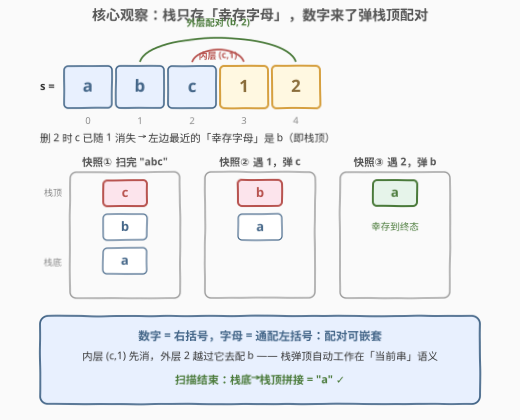
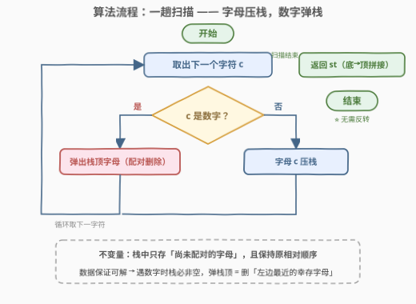
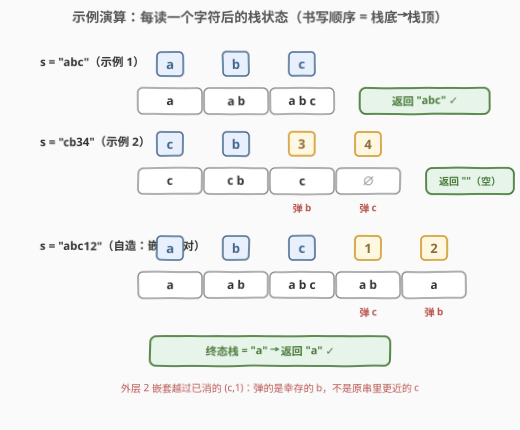

# LeetCode 消除数字 题解

## 1. 题目概述

- **标题 / 题号**：消除数字（#3174，easy）
- **链接**：https://leetcode.cn/problems/clear-digits/
- **难度**：简单
- **标签**：栈、字符串、模拟

**题意**：给你一个字符串 `s`。你的任务是重复执行以下操作删除**所有**数字字符：

- 删除**第一个数字字符**以及它左边**最近**的**非数字**字符。

请你返回删除所有数字字符以后剩下的字符串。

**注意**，该操作不能对左侧没有任何非数字字符的数字执行。

**示例 1**：

```text
输入：s = "abc"
输出："abc"
解释：字符串中没有数字，原样返回。
```

**示例 2**：

```text
输入：s = "cb34"
输出：""
解释：一开始，我们对 s[2] 执行操作，s 变为 "c4"。然后对 s[1] 执行操作，s 变为 ""。
```

**约束**：

- $1 \le s.length \le 100$
- `s` 只包含小写英文字母和数字字符。
- 输入保证所有数字都可以按以上操作被删除。

> 💡 读题关键：操作对象永远是「**第一个**数字」——它左边的字符此刻全是字母（否则左边还有更早的数字没删）。所以「第一个数字 + 它左边最近的字母」构成一对**相邻消除对**，这与括号匹配、[1047. 删除字符串中的所有相邻重复项](https://leetcode.cn/problems/remove-all-adjacent-duplicates-in-string/) 是同一骨架。另外「输入保证可解」等价于**任何前缀中字母数 ≥ 数字数**（恰是合法括号串的前缀性质）——遇到数字时它的左边必有幸存字母可删，这是后面敢放心弹栈的底气。

## 2. 解题思路

### 2.1 朴素思路：按题面直译，每轮删一对

直接模拟：每轮从头定位第一个数字字符，再向左找最近的非数字字符，把两个字符一起从串里删掉；重复直到串中不再有数字。每轮需要 $O(n)$ 定位加 $O(n)$ 删除搬迁，最多执行 $\lfloor n/2 \rfloor$ 轮（每轮净删 2 个字符），总代价 $O(n^2)$。$n \le 100$ 当然能过，但这份重复扫描完全没必要——每一对「字母， 数字」的配对关系，一趟从左到右的扫描就能全部确定。

> ⚠️ 直译版还埋着一个易错点：同一轮里删两个字符时，**必须先删靠右的再删靠左的**（或干脆用串拼接绕开），否则前一次删除造成的下标位移会让后一次删错位置——典型的「边遍历边删除」下标陷阱。

### 2.2 核心观察：数字与「左侧最近的幸存字母」配对 = 栈弹顶



从左到右扫描，维护一个**只存字母**的栈：

- 遇到**字母**：压栈——它是「目前尚未与任何数字配对的字母」；
- 遇到**数字**：弹出栈顶——栈顶就是它左边**最近的、还没被删掉的**字母。

为什么「左边最近的非数字」恰好是栈顶？关键在一条**循环不变式**：

> 扫描到任意位置时，栈中恰好保存「已扫描前缀里所有尚未配对删除的字母」，且从栈底到栈顶保持原相对顺序；前缀中出现过的数字已全部与更早的字母配对删除。

于是栈里**永远只有字母**，且栈顶是最靠右的幸存字母——新来的数字，其左边最近的非数字非它莫属。数据保证可解（任何前缀字母数 $\ge$ 数字数），所以遇数字时栈必非空，可以放心弹。这与括号匹配完全同构：**数字 = 右括号，字母 = 通配的左括号**。

> ⚠️ 题面里「左边最近的非数字」指的是**当前串**（前面的删除已生效之后）里最近的非数字，不是原始串里的。拿 `"abc12"` 验证：删第一个数字 `1` 时连同它左边最近的字母 `c` 一起消失，串变 `"ab2"`；接下来删 `2` 时它左边最近的非数字是 **`b`** 而不是原始串中更近的 `c`（`c` 已被带走）。配对因此可以**嵌套**——`2` 越过已消去的 $(c,1)$ 对去配 `b`，正如外层括号嵌套内层括号。栈在弹顶的那一瞬间天然就在「当前串」语义下工作，这个坑它替你自动绕开。

配对删除不改变其余字符的相对顺序，因此最终答案 = 扫描结束时栈中内容**从栈底到栈顶**直接拼接，无需反转。

### 2.3 算法流程图



流程四步：

1. 初始化空栈 `st`；
2. 逐字符扫描 `s`：若 `c` 是数字，`st.pop_back()`（与左边最近的幸存字母配对删除）；否则 `st.push_back(c)`；
3. 扫描结束，`st` 本身就是答案（栈底 → 栈顶 = 从左到右）；
4. 返回 `st`。

### 2.4 示例演算



**示例 2**：`s = "cb34"`

| 读到 | 栈（底→顶） | 动作 |
|------|------------|------|
| `c` | `c` | 字母压栈 |
| `b` | `c b` | 字母压栈 |
| `3` | `c` | 数字：弹 `b`（`3` 与左边最近的字母 `b` 配对） |
| `4` | （空） | 数字：弹 `c` |

终态栈为空，返回 `""`。

**自造示例**（演示嵌套配对）：`s = "abc12"`

| 读到 | 栈（底→顶） | 动作 |
|------|------------|------|
| `a` | `a` | 压栈 |
| `b` | `a b` | 压栈 |
| `c` | `a b c` | 压栈 |
| `1` | `a b` | 弹 `c`（内层对 $(c,1)$ 消除） |
| `2` | `a` | 弹 `b`（外层对 $(b,2)$ 嵌套越过内层） |

终态栈 = `"a"`，即答案。对照 `"abc"`（无数字，栈原样收下全部字母）三种形态全覆盖：**全保留、全消除、部分保留**。一趟扫描的栈，按从左到右的顺序精确复放了题面「重复删第一个数字」的整个过程。

## 3. 参考代码

### C++

```cpp
class Solution {
  public:
    string clearDigits(string s) {
        string st;                          // 栈：只存尚未配对的字母
        for (char c : s) {
            if (isdigit(c)) st.pop_back();  // 数字：与左边最近的幸存字母配对删除
            else             st.push_back(c); // 字母：入栈等待配对
        }
        return st;                          // 栈底→栈顶即从左到右，无需反转
    }
};
```

### Python

```python
class Solution:
    def clearDigits(self, s: str) -> str:
        st = []
        for c in s:
            if c.isdigit():
                st.pop()      # 数字：弹掉左边最近的幸存字母
            else:
                st.append(c)  # 字母：入栈等待配对
        return ''.join(st)
```

> 💡 写法盘点：C++ 的 `string` 本身就是现成的栈容器（`push_back`/`pop_back` 均摊 $O(1)$），比 `stack<char>` 再倒腾一次省一遍拷贝；追求 $O(1)$ 额外空间可直接在 `s` 上原地双指针——写指针 `top` 就是栈大小，字母写 `s[top++] = c`、数字 `top--`，最后 `s.resize(top)`，语义仍是栈（见面试要点 5）。Python 的 `str.isdigit()` 在 Unicode 语境下认全角数字、上标数字等更宽字符集，本题 ASCII 输入无影响，更严格的写法是 `'0' <= c <= '9'`。

## 4. 复杂度分析

| 维度 | 复杂度 | 说明 |
|------|--------|------|
| 时间复杂度 | $O(n)$ | 每个字符一次均摊 $O(1)$ 的压栈/弹栈，单趟扫描 |
| 空间复杂度 | $O(n)$ | 栈最坏存下全部字母（如 `"abc"`）；C++ 原地双指针版 $O(1)$ 额外空间 |
| 答案长度 | #字母 − #数字 | 数据保证可解时，每个数字恰好消耗一个字母 |
| 朴素直译 | $O(n^2)$ | 每轮 $O(n)$ 定位 + 删除，至多 $\lfloor n/2 \rfloor$ 轮；$n \le 100$ 也能过 |

## 5. 扩展

### 5.1 「相邻消除对」家族：一套栈骨架，换匹配谓词即换题

本题、[1047](https://leetcode.cn/problems/remove-all-adjacent-duplicates-in-string/)（相邻相等字符对消除）、[1544. 整理字符串](https://leetcode.cn/problems/make-the-string-great/)（大小写互配对消除）、[20. 有效的括号](https://leetcode.cn/problems/valid-parentheses/)（左右括号配对）共享同一副骨架：**从左到右扫描，遇到「右半边」就检查栈顶是否为可配对的「左半边」，配得上则双双消除，配不上（或是「左半边」）则压栈**。变化的只有匹配谓词：

| 题目 | 左半边 | 右半边 | 配对条件 |
|------|--------|--------|---------|
| 3174 | 任意字母 | 数字 | 无条件（数字配任意字母） |
| 1047 | 任意字符 | 任意字符 | 二者相等 |
| 1544 | 字母 | 字母 | 同字母异大小写 |
| 20 | `(` `[` `{` | `)` `]` `}` | 括号种类一一对应 |

[1003. 检查替换后的词是否有效](https://leetcode.cn/problems/check-if-word-is-valid-after-substitutions/) 则把消除单元从「对」升级为三元组 `abc`——栈骨架不动，匹配窗口变长。面试遇到「删一删、消一消」类字符串题，先往这副骨架上套。

### 5.2 若数据不保证可解 / 只问长度

- **不保证可解**：某个数字左边可能没有幸存字母，对应括号匹配里的「栈空遇右括号」。此时弹栈前必须判空——空则该数字无法删除，按题意决定跳过还是整体判无解，与 20 的判定分支同款。合法输入的判定条件正是前缀性质：任何前缀中字母数 $\ge$ 数字数。
- **只问剩余长度**：数据保证可解时每个数字恰好消耗一个字母，答案长度 $=$ 字母数 $-$ 数字数，一次计数 $O(n)/O(1)$，连栈都可省。但要给出**内容**就必须保留幸存字母的顺序信息，栈不可省——「长度」与「内容」的信息量差距，正是计数器与栈的分界线。

## 6. 面试要点

1. **为什么「左边最近的非数字」恰好是栈顶？**

   - 循环不变式：扫描位置左侧的所有数字都已被即时配对删除，栈中只剩**尚未配对的字母**且保持原相对顺序。栈顶是最靠右的幸存字母，正是新数字左边最近的非数字。

2. **遇到数字时需要判栈空吗？本题为什么不用？**

   - 本题输入保证所有数字可删，等价于任何前缀中字母数 $\ge$ 数字数（合法括号串的前缀性质），故遇数字时栈必非空。若去掉该保证则必须判空——空栈说明该数字左侧没有可删字母，题目语义需要另行约定（见 5.2）。

3. **一趟扫描为什么等价于「重复删第一个数字」？**

   - 「第一个数字」总是当前尚未处理的最左数字。从左到右处理到某个数字时，更左的数字已全部删除，它就是当下的「第一个」；其左边最近的非数字即当前栈顶。所有配对互不相交（每个字符至多属于一对），删除不改变其余字符的相对顺序，两个过程逐步对应、结果一致。

4. **和 1047 / 20 / 3170 分别是什么关系？**

   - 1047、1544、20 与本题同属「相邻消除对」栈骨架，只是匹配谓词不同（相等 / 异大小写 / 括号对应 vs 本题的无条件配对，见 5.1）。3170 同为「删掉自身 + 左侧一个字符」的强制配对，但 3170 规定删左侧**字典序最小**者（自由度只在同字母选哪个位置）→ 按字母分 26 个桶取栈顶；本题无条件删**最近的幸存字母** → 单栈直弹，简单一档。

5. **能做到 $O(1)$ 额外空间吗？**

   - C++ 可以：把 `s` 本身当栈——写指针 `top` 即栈大小，遇字母 `s[top++] = c`，遇数字 `top--`，最后 `s.resize(top)` 返回。CPython 字符串不可变，列表栈 + `join` 已是常规最优。

## 同类练习题

| # | 题目 | 与本题的关联 |
|---|------|-------------|
| 1047 | [删除字符串中的所有相邻重复项](https://leetcode.cn/problems/remove-all-adjacent-duplicates-in-string/)（[站内题解](../1001-1100/1047_删除字符串中的所有相邻重复项.md)） | 同款栈骨架，匹配谓词换成「相邻相等」的消除对 |
| 1544 | [整理字符串](https://leetcode.cn/problems/make-the-string-great/) | 匹配谓词换成「同字母异大小写」，体会换谓词不改骨架 |
| 3170 | [删除星号以后字典序最小的字符串](https://leetcode.cn/problems/lexicographically-minimum-string-after-removing-stars/)（[站内题解](3170_删除星号以后字典序最小的字符串.md)） | 同为「删自身 + 左侧一个字符」，但强制删左侧字典序最小者 → 26 个字母桶，对照本题单栈直弹的简单版 |
| 20 | [有效的括号](https://leetcode.cn/problems/valid-parentheses/)（[站内题解](../0001-0100/20_有效括号.md)） | 配对消除的**判定**版——栈空遇右括号 / 结束栈非空即无解 |
| 1003 | [检查替换后的词是否有效](https://leetcode.cn/problems/check-if-word-is-valid-after-substitutions/) | 消除单元从「对」升级为三元组 `abc`，栈骨架不变、匹配窗口变长 |
