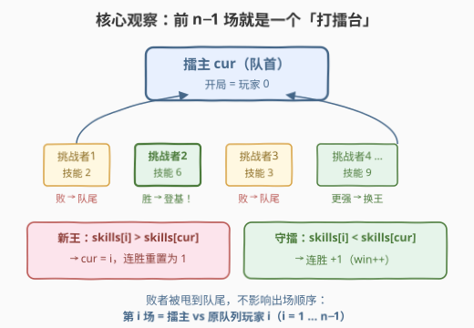
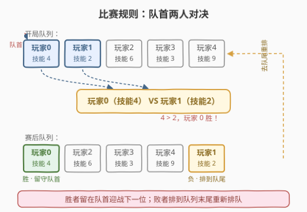
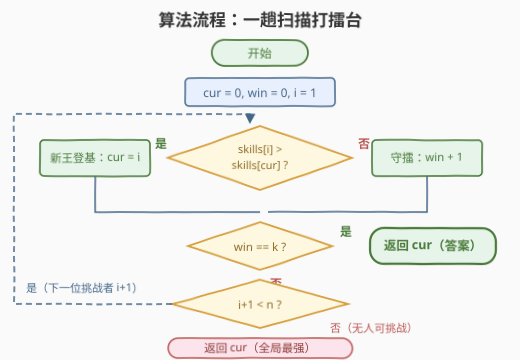
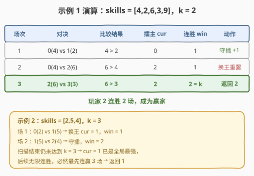

# LeetCode 找到连续赢K场比赛的第一位玩家 题解

## 1. 题目概述

- **标题 / 题号**：找到连续赢K场比赛的第一位玩家（#3175，medium）
- **链接**：https://leetcode.cn/problems/find-the-first-player-to-win-k-games-in-a-row/
- **难度**：中等
- **标签**：数组、模拟

**题意**：有 $n$ 位玩家在进行比赛，玩家编号依次为 $0$ 到 $n-1$，从前往后排成一列。给定长度为 $n$ 的整数数组 `skills`（`skills[i]` 是第 $i$ 位玩家的技能等级，**互不相同**）和一个正整数 $k$。

比赛规则：

- 队列中**最前面两名玩家**进行一场比赛，技能等级**更高**的玩家胜出；
- 比赛后，**胜者保持在队首**，**败者排到队尾**。

比赛的赢家是**第一位连续**赢下 $k$ 场比赛的玩家，请返回其编号。

**示例 1**：

```text
输入：skills = [4,2,6,3,9], k = 2
输出：2
解释：
场1：玩家0(4) 胜 玩家1(2)，队列 [0,2,3,4,1]
场2：玩家2(6) 胜 玩家0(4)，队列 [2,3,4,1,0]
场3：玩家2(6) 胜 玩家3(3)，队列 [2,4,1,0,3]
玩家 2 连胜 k=2 场，赢家是玩家 2。
```

**示例 2**：

```text
输入：skills = [2,5,4], k = 3
输出：1
解释：玩家 1 连胜 3 场（依次击败 0、2、0），赢家是玩家 1。
```

**约束**：

- $2 \le n \le 10^5$
- $1 \le k \le 10^9$
- $1 \le skills[i] \le 10^6$，且 `skills` 中的整数互不相同

> 💡 读题关键：两个数据范围放在一起就是最强的提示——$n$ 只有 $10^5$，而 $k$ 高达 $10^9$。**逐场模拟最多要进行 $O(n+k)$ 场比赛**，$k$ 取上限时必然超时；答案一定在 $O(n)$ 量级内就能确定。另外"技能互不相同"保证了每场必分胜负、无平局分支。

## 2. 解题思路

### 2.1 朴素思路：队列逐场模拟

最直白的做法是用双端队列忠实还原规则：取队首两人比较，胜者留在队首、败者 `push_back` 到队尾，同时维护队首玩家的连胜计数，达到 $k$ 即返回。

这个做法正确，但有隐患：若 $k \ge n$，前 $n-1$ 场内可能没有任何人达到 $k$ 连胜；之后**全局技能最高的玩家**必然已经坐稳队首（它上场后永不落败），还要再"象征性"地模拟到它连胜 $k$ 场为止。总场次 $O(n+k)$，$k = 10^9$ 时直接超时。

> ⚠️ 卡点在"模拟了很多场，但信息早已注定"。前 $n-1$ 场之后队列首部永远是全局最强，比赛结果毫无悬念——这些冗余场次完全可以跳过。

### 2.2 核心观察：前 n−1 场就是一个「打擂台」



先看比赛规则的直观图示：



**观察 1（挑战者顺序不变）**：开局队列为 $[0, 1, 2, \ldots, n-1]$。逐场分析可以发现——**前 $n-1$ 场比赛中，每场的挑战者恰好依次是原队列中的玩家 $1, 2, \ldots, n-1$**，与中间谁输谁赢无关。

归纳论证：第 1 场是 $0$ vs $1$。此后胜者占据队首，而它身后紧跟的永远是**原队列中下一个尚未上场的玩家**；败者被甩到队尾，排在所有未上场玩家之后，轮不到它再次出场。于是无论"换王"多少次，第 $i$ 场永远是"当前擂主 vs 原队列玩家 $i$"——这就是一个**打擂台**模型。

**观察 2（n−1 场后的局面）**：$n-1$ 场打完，所有玩家都上过场，此时队首必然是**全局技能最大值**（最大值上场那一刻必然登基，且永不落败）。此后它无限连胜，赢家只能是它。

于是整个比赛被压缩成**一趟扫描**：维护擂主下标 $cur$（初始 $0$）与连胜数 $win$（初始 $0$），让 $i$ 从 $1$ 遍历到 $n-1$：

- 若 $skills[i] > skills[cur]$：新王登基，$cur = i,\ win = 1$（这一场算新王的第 1 胜）；
- 否则：擂主守擂成功，$win{+}{+}$；
- 一旦 $win = k$，立即返回 $cur$；
- 扫描结束仍未达到 $k$（说明 $k \ge$ 场上任何可能的连胜），此时 $cur$ 恰好是**全局最大值的下标**——任何更强的挑战者都会触发换王，循环走完意味着没有更强的了。返回 $cur$ 即为答案。

> 💡 为什么"循环自然结束返回 $cur$"一定正确？两步：其一，此时 $skills[cur] = \max(skills)$，它登基后永不落败，连胜数终将涨到 $k$；其二，其余任何玩家的连胜要么为 $0$（刚输过），要么是已被打断的旧纪录——**除了擂主，没有任何人处于连胜状态**，不可能抢先达到 $k$。

### 2.3 算法流程图



流程共五步：

1. 初始化 `cur = 0, win = 0`，令 `i = 1`；
2. 比较 `skills[i]` 与 `skills[cur]`：更大则 `cur = i, win = 1`（换王），否则 `win++`（守擂）；
3. 若 `win == k`，返回 `cur`；
4. `i++`；若仍有 `i < n`，回到第 2 步；
5. 挑战者耗尽仍未达标，返回 `cur`（此时已是全局最强）。

### 2.4 示例演算



以 `skills = [4,2,6,3,9], k = 2` 为例：

| 场次 | 对决 | 比较结果 | 擂主 cur | 连胜 win | 动作 |
|------|-------------|---------|----------|----------|-------------|
| 1 | 0(4) vs 1(2) | 4 > 2 | 0 | 1 | 守擂 +1 |
| 2 | 0(4) vs 2(6) | 6 > 4 | 2 | 1 | 换王，重置为 1 |
| 3 | 2(6) vs 3(3) | 6 > 3 | 2 | **2 = k** | 返回 **2** |

以 `skills = [2,5,4], k = 3` 为例：

| 场次 | 对决 | 比较结果 | 擂主 cur | 连胜 win | 动作 |
|------|-------------|---------|----------|----------|-------------|
| 1 | 0(2) vs 1(5) | 5 > 2 | 1 | 1 | 换王，重置为 1 |
| 2 | 1(5) vs 2(4) | 5 > 4 | 1 | 2 | 守擂 +1 |
| — | 挑战者耗尽 | — | 1 | — | cur=1 是全局最强，返回 **1** |

第二例正体现了 $k \ge n$ 情形的处理：扫描结束时无人达到 $k$，但擂主已是全局最大值，后续比赛它场场赢、无限连胜，必然第一个达到 $k$。

## 3. 参考代码

### C++

```cpp
class Solution {
  public:
    int findWinningPlayer(vector<int>& skills, int k) {
        int n = skills.size();
        int cur = 0, win = 0;                 // cur: 当前擂主下标, win: 连胜场数
        for (int i = 1; i < n; i++) {         // 挑战者按原队列顺序依次上场
            if (skills[i] > skills[cur]) {
                cur = i;                      // 新王登基
                win = 1;
            } else {
                win++;                        // 擂主守擂成功
            }
            if (win == k) return cur;         // 率先连赢 k 场
        }
        return cur;                           // k 过大：cur 已是全局最强，无限连胜
    }
};
```

### Python

```python
class Solution:
    def findWinningPlayer(self, skills: List[int], k: int) -> int:
        cur = win = 0                          # cur: 当前擂主下标, win: 连胜场数
        for i in range(1, len(skills)):        # 挑战者按原队列顺序依次上场
            if skills[i] > skills[cur]:
                cur, win = i, 1                # 新王登基，连胜重置为 1
            else:
                win += 1                       # 擂主守擂成功
            if win == k:
                return cur
        return cur                             # k 过大：cur 已是全局最强
```

> 💡 细节盘点：循环内 `win` 至多为 $n-1$（开局擂主一路守到底），因此 $k \ge n$ 时 `win == k` 永不触发，循环自然走完落到最后的 `return cur`，两种情形被同一段代码优雅覆盖，无需特判 $k$ 与 $n$ 的大小关系。$k = 1$ 时第 1 场比较后 `win` 必为 $1$，同样正确。

## 4. 复杂度分析

| 维度 | 复杂度 | 说明 |
|------|--------|------|
| 时间复杂度 | $O(n)$ | 一趟扫描至多 $n-1$ 次比较；`win == k` 命中还会提前退出 |
| 空间复杂度 | $O(1)$ | 仅 `cur` / `win` 两个变量；朴素队列模拟需 $O(n)$ 队列 |
| 暴力对照 | $O(n + k)$ | 逐场模拟最多约 $(n-1) + k$ 场，$k \le 10^9$ 时超时 |

## 5. 扩展：换皮识别与模型迁移

### 5.1 与 1535「找出数组游戏的赢家」的关系

[1535](https://leetcode.cn/problems/find-the-winner-of-an-array-game/) 的规则是：`arr[0]` 与 `arr[1]` 对决，胜者与前一个赢家的**下一位**整数比较，第一个赢下 `k` 轮的整数获胜——它就是打擂台模型的**原生形态**。本题 3175 只是给擂台套了一层"队列"外衣：胜者留守队首、败者排队尾。2.2 的观察 1 证明了这层外衣**不改变出场顺序**，两题本质完全同构。面试中先认出 1535 的骨架，本题即可秒杀。

### 5.2 k ≥ n 时的博弈论视角

当 $k \ge n$ 时答案恒为全局 `argmax(skills)`（官方 hint 1）：任何玩家的连胜上限是"击败所有其余 $n-1$ 人"，而全局最强一旦登基就不可战胜。更一般地，本题的扫描其实在隐式计算：**每个前缀最大值位置的连胜长度**，谁先攒够 $k$ 谁赢；攒不够，就由终极前缀最大值（全局最大）兜底。这与"前缀最大值单调栈/擂台"一类的套路一脉相承。

## 6. 面试要点

1. **为什么不能直接用队列逐场模拟？**

   - 场次上限约 $(n-1) + k$ 场：$k \le 10^9$ 而 $n \le 10^5$，$k$ 大时绝大多数场次发生在"全局最强已坐稳队首"之后，结果毫无悬念却仍要一场场打，$O(n+k)$ 超时。前 $n-1$ 场的信息已足以判定一切。

2. **如何证明"前 n−1 场的挑战者恰好是原队列玩家 1..n−1"？**

   - 归纳：胜者留队首时，其身后第一位始终是"原队列中下一个未上场的玩家"；败者被甩到队尾，排在所有未上场玩家之后，短期内轮不到它。所以无论换王几次，第 $i$ 场 = 当前擂主 vs 原队列玩家 $i$。

3. **扫描结束仍没人达到 k 连胜，为什么直接返回 cur 就正确？**

   - 循环不变量：任何 $skills[i] > skills[cur]$ 都会触发换王，故循环结束时 $skills[cur]$ 是全局最大值。它此后永不落败、连胜单调上涨终达 $k$；而其他玩家的连胜均已被清零或打断，无人能抢先。返回 `cur` 恒对，无需比较 $k$ 与 $n$。

4. **k = 1 和 k ≥ n 两个边界如何被同一段代码覆盖？**

   - $k=1$：第 1 场（`i=1`）比较后 `win` 必为 `1`（无论换王还是守擂），当场返回首场胜者。$k \ge n$：循环内 `win` 至多 $n-1 < k`，永不提前返回，自然落到末尾 `return cur`（全局最强）。两种极端零特判。

5. **本题和 1535 有何异同？如果技能允许相同会怎样？**

   - 1535 是同一打擂台模型的原生形态，本题多套了一层"败者排队尾"的队列皮，证明出场顺序不变后两题同构。若技能允许相同，需先约定平局规则（如编号小者胜/算连胜中断），擂台扫描仍适用，但"互不相同"这一保证让本题完全无需处理平局分支。

## 同类练习题

| # | 题目 | 与本题的关联 |
|---|------|-------------|
| 1535 | [找出数组游戏的赢家](https://leetcode.cn/problems/find-the-winner-of-an-array-game/) | 本题的**原生打擂台形态**，去掉队列外衣后代码几乎逐行相同 |
| 2073 | [买票需要的时间](https://leetcode.cn/problems/time-needed-to-buy-tickets/) | 队列逐轮模拟入门，体会"何时必须精细模拟、何时可以数学化简" |
| 950 | [按递增顺序显示卡牌](https://leetcode.cn/problems/reveal-cards-in-increasing-order/) | 队列**逆过程**模拟（用队列反推输出顺序），正反两面练队列 |
| 899 | [有序队列](https://leetcode.cn/problems/orderly-queue/) | 队列操作 + 思维题（k=1 与 k≥2 的本质差异），训练"别被操作模拟绑架"的意识 |
