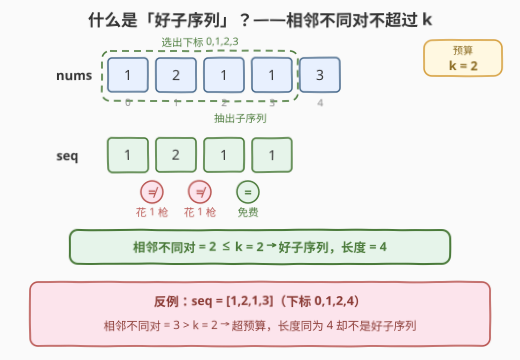
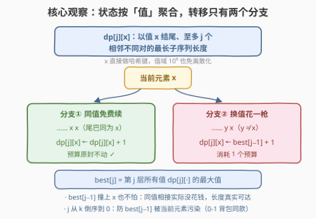
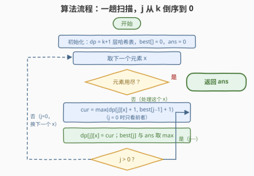
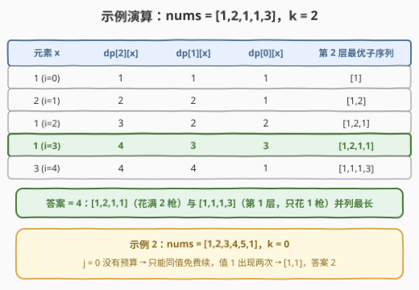

# 求出最长好子序列 I

- **题目名称**：求出最长好子序列 I
- **链接**：[3176. 求出最长好子序列 I](https://leetcode.cn/problems/find-the-maximum-length-of-a-good-subsequence-i/)
- **难度**：中等
- **标签**：数组、哈希表、动态规划

## 1. 题目概述

给你一个整数数组 `nums` 和一个**非负**整数 `k`。如果整数序列 `seq` 满足：在下标范围 `[0, seq.length - 2]` 中**至多只有** `k` 个下标 `i` 使得 `seq[i] != seq[i + 1]`，则称 `seq` 为一个**好**序列。请你返回 `nums` 中**好子序列**的最长长度。

一句话读题：把子序列中每一对**相邻且不相等**的元素看作消耗一次「预算」，预算只有 $k$ 次，求能选出的最长子序列。

**示例 1**：

```text
输入：nums = [1,2,1,1,3], k = 2
输出：4
解释：最长好子序列为 [1,2,1,1]（取下标 0,1,2,3），
     相邻不同对只有 (1,2) 和 (2,1) 两个，恰好不超预算。
```

**示例 2**：

```text
输入：nums = [1,2,3,4,5,1], k = 0
输出：2
解释：k = 0 意味着子序列必须所有元素都相同，
     最长好子序列为 [1,1]（取下标 0 和 5）。
```

**约束条件**：

- $1 \le nums.length \le 500$
- $1 \le nums[i] \le 10^9$
- $0 \le k \le \min(nums.length,\ 25)$

> 💡 读题关键：三个数据范围各藏一条线索——$n \le 500$ 且 $k \le 25$：一个 $O(nk)$ 量级状态的 DP 正落在甜区；$nums[i] \le 10^9$：值不能直接当数组下标，要么离散化要么用哈希表；而孪生题 3177 只把 $n$ 放大到 5000，强烈暗示存在**不靠 $O(n)$ 枚举前驱**的一维转移。

---

## 2. 解题思路

### 2.1 暴力思路：枚举前驱下标的 DP

最暴力的做法是枚举全部 $2^n$ 个子序列、逐个数相邻不同对——$n = 500$ 时是天文数字，直接放弃。

可行的第一档是**按下标**做 DP：设 $dp[j][i]$ 为**以 $nums[i]$ 结尾、至多 $j$ 个相邻不同对**的最长子序列长度，转移时枚举前驱下标 $t < i$：

$$
dp[j][i] = 1 + \max\begin{cases} dp[j][t], & nums[t] = nums[i] \ (\text{同值免费续}) \\ dp[j-1][t], & nums[t] \ne nums[i]\ (\text{换值花一枪}) \end{cases}
$$

时间复杂度 $O(n^2 k)$：本题 $n \le 500$ 约 $3 \times 10^6$ 次转移，能过；但 3177 的 $n = 5000$ 高达 $3 \times 10^8$，必然超时。

> ⚠️ 卡点：$O(n)$ 的内层开销全部花在「枚举前驱下标」上。可是仔细一想——**接一个元素会不会产生新的相邻不同对，只取决于前驱的值**，前驱是哪个下标根本无关紧要。

### 2.2 核心观察：状态按「值」聚合，转移降到 O(1)

先直观感受一下什么叫好子序列：





**观察 1（状态从下标坍缩成值）**：既然衔接只看值，那么「以某个值 $x$ 结尾」的所有子序列里，**只有最长的那一条有用**（更短的既不能接得更长，也不影响预算）。于是状态从 $dp[j][i]$（下标）坍缩成

$$
dp[j][x] = \text{以值 } x \text{ 结尾、至多 } j \text{ 个相邻不同对的最长子序列长度}
$$

值域高达 $10^9$ 不碍事——$x$ 直接做**哈希表的键**，天然完成离散化。

**观察 2（转移只剩两个分支）**：从左到右处理每个元素 $x$：

- **分支① 同值免费续**：接在以 $x$ 结尾的子序列后面，不产生新的不同对：$dp[j][x] \leftarrow dp[j][x] + 1$；
- **分支② 换值花一枪**：接在以 $y \ne x$ 结尾的子序列后面，多出一对不同对，预算要从 $j-1$ 层借：$dp[j][x] \leftarrow best[j-1] + 1$。

其中 $best[j] = \max_v dp[j][v]$，即第 $j$ 层所有值中的最大长度。

**观察 3（$best[j-1]$ 不必排除 $x$）**：分支②按理应取 $\max_{y \ne x} dp[j-1][y]$，那如果 $best[j-1]$ 恰好被 $x$ 自己取得，会不会算错？不会——$dp[j-1][x] + 1$ 对应「把 $x$ 接在 $x$ 后面」，**实际上一个预算都没花**，得到的仍是一条至多 $j-1$ 个不同对、长度货真价实的合法子序列。因此 $best[j-1] + 1$ 永不虚高，直接取全局最大即可，省掉维护「次大值」的麻烦。

**观察 4（$j$ 必须倒序枚举）**：这是与 **0-1 背包一维化**完全同构的坑。若 $j$ 正序枚举，计算 $dp[j][x]$ 时 $best[j-1]$ 已被当前元素更新，相当于把 $x$ 接在「已经以当前 $x$ 结尾」的子序列后面——**同一个元素被用了两次**。反例：$nums = [1,3,1],\ k = 2$，正序会算出 4，正确答案是 3。倒序保证读到的 $best[j-1]$ 恒为处理上一个元素时的旧值。

### 2.3 算法流程图



流程共五步：

1. 建好 $k+1$ 层哈希表 $dp$，$best[j]$ 与 $ans$ 置 0；
2. 取下一个元素 $x$（元素用尽则返回 $ans$）；
3. 令 $j$ 从 $k$ **倒序**到 0，计算 $cur = \max(dp[j][x] + 1,\ best[j-1] + 1)$（$j = 0$ 时只看前者）；
4. 写回 $dp[j][x] = cur$，并用 $cur$ 更新 $best[j]$ 与 $ans$；
5. $j$ 减到 0 后回到第 2 步换下一个元素。

### 2.4 示例演算



以 `nums = [1,2,1,1,3], k = 2` 为例，下表记录每个元素处理完后**以该值结尾**的三层 dp 值：

| 元素 x | dp[2][x] | dp[1][x] | dp[0][x] | 第 2 层最优子序列 |
|--------|----------|----------|----------|------------------|
| 1 (i=0) | 1 | 1 | 1 | [1] |
| 2 (i=1) | 2 | 2 | 1 | [1,2]（分支②借 best[0]=1） |
| 1 (i=2) | 3 | 2 | 2 | [1,2,1]（分支②借 best[1]=2） |
| 1 (i=3) | **4** | 3 | 3 | [1,2,1,1]（分支①免费续） |
| 3 (i=4) | 4 | 4 | 1 | [1,1,1,3]（分支②借 best[1]=3） |

处理完第 4 个元素时 $dp[2][1]$ 到达 4；最后一个元素 3 也追平到 4——**答案 = 4**。注意 $[1,2,1,1]$ 花满 2 枪，而 $[1,1,1,3]$ 只花 1 枪（在第 1 层就成立），两条路线殊途同归。

示例 2（`k = 0`）则展示了一个退化情形：$j=0$ 没有预算，分支②不存在，第 0 层只剩「同值免费续」——dp 退化为统计**每个值的出现次数**，值 1 出现两次，答案 2。

---

## 3. 参考代码

### C++

```cpp
class Solution {
  public:
    int maximumLength(vector<int>& nums, int k) {
        // dp[j][x]：以值 x 结尾、至多 j 个相邻不同对的最长子序列长度
        vector<unordered_map<int, int>> dp(k + 1);
        vector<int> best(k + 1, 0);          // best[j]：第 j 层所有值中的最大长度
        int ans = 0;
        for (int x : nums) {
            for (int j = k; j >= 0; j--) {   // 倒序：best[j-1] 必须是上一个元素的旧值
                int cur = dp[j][x] + 1;      // 分支①：同值免费续
                if (j > 0) cur = max(cur, best[j - 1] + 1);  // 分支②：换值花一枪
                dp[j][x] = cur;
                best[j] = max(best[j], cur);
                ans = max(ans, cur);
            }
        }
        return ans;
    }
};
```

### Python

```python
class Solution:
    def maximumLength(self, nums: List[int], k: int) -> int:
        dp = [dict() for _ in range(k + 1)]   # dp[j][x]：以值 x 结尾、至多 j 个相邻不同对的最长子序列长度
        best = [0] * (k + 1)                  # best[j]：第 j 层所有值中的最大长度
        ans = 0
        for x in nums:
            for j in range(k, -1, -1):        # 倒序：best[j-1] 必须是上一个元素的旧值
                cur = dp[j].get(x, 0) + 1     # 分支①：同值免费续
                if j:
                    cur = max(cur, best[j - 1] + 1)  # 分支②：换值花一枪
                dp[j][x] = cur
                best[j] = max(best[j], cur)
                ans = max(ans, cur)
        return ans
```

> 💡 细节盘点：$j = 0$ 时分支②不存在，`if (j > 0)` 一行带过，第 0 层自然退化为「同值免费续」（各值频次）。哈希键直接用原值，$10^9$ 的值域无需离散化——官方 hint 1 的 remap 到 $[0, n-1]$ 是给数组版 dp 准备的，哈希版可以跳过。另外 $dp[j][x]$ 关于 $j$ 单调（预算越多越长），最后取 `best[k]` 与循环里顺手维护的 `ans` 等价。

---

## 4. 复杂度分析

| 维度 | 复杂度 | 说明 |
|------|--------|------|
| 时间复杂度 | $O(n \cdot k)$ | 每个元素把 $j$ 从 $k$ 倒序跑到 0，每步 $O(1)$ 哈希操作；$n = 5000,\ k = 25$ 也只要约 $1.3 \times 10^5$ 步 |
| 空间复杂度 | $O(D \cdot k)$ | $D$ 为不同值个数（$\le n$），$k+1$ 层哈希表每层至多 $D$ 个键 |
| 暴力对照 | $O(n^2 \cdot k)$ | 按下标 DP 枚举前驱；本题 $n \le 500$ 可过，3177（$n \le 5000$）超时 |

---

## 5. 扩展：孪生题 3177 与两个退化边界

### 5.1 姐妹题 3177：同题不同规模

[3177. 求出最长好子序列 II](https://leetcode.cn/problems/find-the-maximum-length-of-a-good-subsequence-ii/) 题意与本题一字不差，仅把 $n$ 放大到 5000。2.2 的 $O(nk)$ 解法两题通吃——这正是「状态按值聚合」的价值：转移不再依赖前驱下标，$n$ 的平方因子被彻底消掉。

### 5.2 两个退化边界

- **$k = 0$**：没有预算，子序列必须全部同值，答案 = **众数的出现次数**（即 2.4 示例 2 的观察）；
- **$k \ge n - 1$**：整个数组最多只有 $n-1$ 个相邻对，全选必然合法，答案 = $n$。

> 💡 「至多 $j$」还是「恰好 $j$」？本文选「至多」：初值全 0，$best$ 直接可比，答案取全局最大即可；若改用「恰好 $j$」定义，转移对称但初值要 $-\infty$、最后仍要跨层取 max，多绕一步，面试口述时用「至多」更顺。

---

## 6. 面试要点

1. **为什么状态要按「值」而不是「下标」聚合？**

   - 衔接是否产生新的相邻不同对只取决于前驱的**值**；同值结尾的子序列只有最长者有用。按下标是 $O(n^2k)$，$n = 5000$ 超时；按值聚合后每步转移 $O(1)$，总复杂度 $O(nk)$，两题通吃。

2. **换值分支用 $best[j-1]$ 而不排除 $y = x$，为什么不会算错？**

   - 若 $best[j-1]$ 恰由 $x$ 取得，$dp[j-1][x]+1$ 对应的是同值衔接——实际没花钱，得到的是一条 $\le j-1$ 个不同对的合法子序列，长度真实可达；$best$ 只是「懒得多排除」，但**永不虚高**。

3. **$j$ 为什么必须倒序枚举？正序会发生什么？**

   - 正序时 $best[j-1]$ 已含当前元素，相当于同一元素接两次。反例 $[1,3,1], k=2$：正序得 4，正确 3。这与 0-1 背包一维化必须倒序容量是同一个原理：**防止本层状态被同一次处理的更新污染**。

4. **$k = 0$ 和 $k \ge n-1$ 两个边界分别对应什么？**

   - $k=0$：无预算，子序列必须全同值，答案为众数频次（第 0 层退化为计数）。$k \ge n-1$：全数组相邻对至多 $n-1$ 个，整个数组就是好子序列，答案 $n$。两者都被主代码自然覆盖，无需特判。

5. **值域 $10^9$ 需要离散化吗？和官方 hint 的 remap 有何区别？**

   - 哈希表键直接存原值，等价于「用到才分配」的离散化，代码零预处理；官方 hint 1 的 remap 到 $[0, n-1]$ 是为了开定长数组 `dp[k+1][n]`，两种实现复杂度同阶，哈希版更省事。

---

## 7. 同类练习题

- [3177. 求出最长好子序列 II](https://leetcode.cn/problems/find-the-maximum-length-of-a-good-subsequence-ii/)：本题的 $n \le 5000$ 加强版，同一套 $O(nk)$ 解法直接通吃
- [1218. 最长定差子序列](https://leetcode.cn/problems/longest-arithmetic-subsequence-of-given-difference/)：「状态按值存哈希」的开山模板（`dp[v] = dp[v−d] + 1`），一维版先练熟
- [1048. 最长字符串链](https://leetcode.cn/problems/longest-string-chain/)：状态从下标换成「单词本身」存哈希，与本题思想同源
- [2407. 最长递增子序列 II](https://leetcode.cn/problems/longest-increasing-subsequence-ii/)：按值域聚合的进阶——哈希升级为值域线段树查区间最值，体会聚合结构的演进
