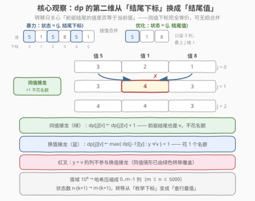
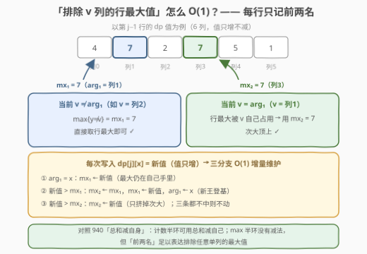
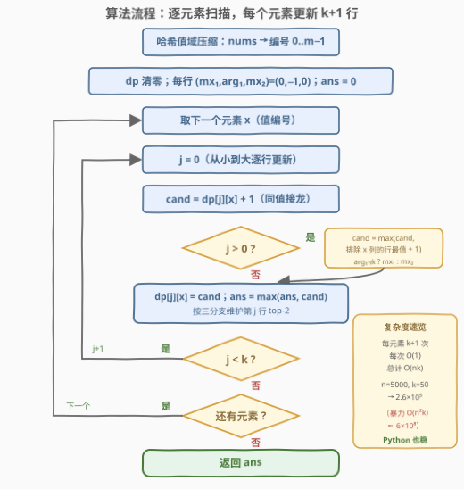
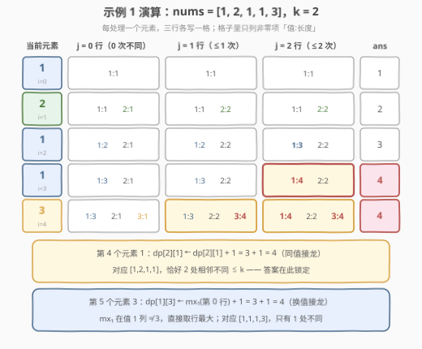

# 求出最长好子序列II

- **题目名称**：求出最长好子序列II
- **链接**：[3177. 求出最长好子序列 II](https://leetcode.cn/problems/find-the-maximum-length-of-a-good-subsequence-ii/)
- **难度**：困难
- **标签**：数组、哈希表、动态规划

## 1. 题目概述

给你一个整数数组 `nums` 和一个**非负**整数 `k`。如果整数序列 `seq` 在下标范围 $[0, \text{seq.length} - 2]$ 中**不超过 $k$ 个下标 $i$ 满足 $\text{seq}[i] \ne \text{seq}[i + 1]$**（即相邻元素不同的位置至多 $k$ 处），就称 `seq` 为**好序列**。返回 `nums` 中**好子序列**的最长长度。

**示例 1**：

```text
输入：nums = [1,2,1,1,3], k = 2
输出：4
解释：最长好子序列为 [1,2,1,1]（取下标 0,1,2,3），
      相邻不同的位置有 2 处（1→2 与 2→1），不超过 k = 2。
```

**示例 2**：

```text
输入：nums = [1,2,3,4,5,1], k = 0
输出：2
解释：k = 0 时子序列不能有任何相邻不同，只能整个取同一个值；
      值 1 出现两次，故 [1,1]（下标 0 与 5）最长。
```

**约束条件**：

- $1 \le \text{nums.length} \le 5 \times 10^3$
- $1 \le \text{nums}[i] \le 10^9$
- $0 \le k \le \min(50, \text{nums.length})$

> 💡 读题三个关键：**①「不同次数」数的是子序列自身的相邻对**，与原数组里元素是否相邻无关——选出的子序列保持相对顺序，但下标可以任意稀疏；**② `k = 0` 是免费的对拍用例**——答案恒等于众数出现次数（示例 2 即验证）；**③ 本题是 [3176. 求出最长好子序列 I](https://leetcode.cn/problems/find-the-maximum-length-of-a-good-subsequence-i/) 的放大版**：I 中 $n \le 500$、$k \le 25$，$O(n^2 k)$ 的下标 DP 即可过关；II 把规模抬到 $n \le 5000$、$k \le 50$，必须把转移压到 $O(nk)$。

---

## 2. 解题思路

### 2.1 暴力思路：按下标 DP，O(n²k)

最直观的状态设计以**结尾下标**为第二维：$dp[i][j]$ = 以下标 $i$ 的元素结尾、相邻不同对数**至多** $j$ 的最长子序列。枚举前驱下标 $p < i$ 转移：

$$dp[i][j] = 1 + \max\Big(\ \max_{p<i,\ \text{nums}[p] = \text{nums}[i]} dp[p][j],\qquad \max_{p<i,\ \text{nums}[p] \ne \text{nums}[i]} dp[p][j-1] \Big)$$

前驱**同值**则不花名额、**异值**则花一个。答案为 $\max_i dp[i][k]$。总转移数约 $\frac{n^2}{2}(k+1)$，$n = 5000,\ k = 50$ 时约 $6 \times 10^8$——C++ 卡点、Python 必超时（3176 的 $n \le 500$ 才是这套写法的舒适区）。

> ⚠️ 病灶在于**前驱按下标枚举**：结尾值相同的一批下标，在转移中的地位**完全等价**——转移只问「前驱的值等不等」「前驱的 dp 值多大」，从不关心前驱具体是哪个下标。冗余的状态维度，就该合并掉。

### 2.2 核心观察：把「结尾下标」压缩成「结尾值」



元素仍**从左到右逐个处理**（顺序信息一颗不少），状态改为按**值**聚合：

$$dp[j][x] = \text{以值 } x \text{ 结尾、相邻不同对数} \le j \text{ 的最长子序列长度（仅统计已扫描的前缀）}$$

值域高达 $10^9$，先用哈希把出现过的值压缩成 $0 \sim m-1$ 列（$m \le n \le 5000$）。处理当前元素（值为 $v$）时只有两类接法：

| 接法 | 转移 | 名额 |
|------|------|------|
| **同值接龙** | $dp[j][v] \leftarrow dp[j][v] + 1$ | 不花 |
| **换值接龙**（$j \ge 1$） | $dp[j][v] \leftarrow \max\limits_{y \ne v} dp[j-1][y] + 1$ | 花 1 个 |

（以当前元素**单开新序列**得长度 1，被「$dp = 0$ 时 $+1$」自动覆盖，无需特判。）

**一个容易踩坑的正确性细节——行更新顺序**：同一元素按 $j$ **从小到大**就地更新时，算第 $j$ 行要读第 $j-1$ 行，而第 $j-1$ 行**本轮已经写过**——但本轮只写过第 $v$ 列，换值接龙读的恰是 $y \ne v$ 的列，**完美避开**；同值接龙读的第 $j$ 行 $v$ 列本轮尚未写过。因此就地更新既不需要滚动拷贝，也**绝无可能把当前元素用两次**。

> ⚠️ 剩最后一个拦路虎：换值接龙要的是**「排除 $v$ 列」的行最大值** $\max_{y \ne v} dp[j-1][y]$。逐列重扫是 $O(m)$，总复杂度退化成 $O(nmk)$；对每行维护**前两名**即可 $O(1)$ 拿到——见 2.3。

### 2.3 top-2：O(1) 拿到「排除 v 列」的行最大值



为每行 $j$ 维护三元组 $(mx_1,\ arg_1,\ mx_2)$：**行最大值、它所在的列、行内次大值**（次大 = 除 $arg_1$ 列外的最大）。于是

$$\max_{y \ne v} dp[j][y] = \begin{cases} mx_1, & arg_1 \ne v & \text{（行最大不在 } v \text{ 列，直接用）} \\ mx_2, & arg_1 = v & \text{（行最大被 } v \text{ 自己占了，次大顶上）} \end{cases}$$

本算法中 dp 值**只增不减**（每次写入至少是旧值 $+1$），单点升高时用**三分支** $O(1)$ 增量维护 top-2，无需任何重建。最终答案 $=$ 全过程写入值的最大值（「至多 $j$」语义下单调性保证 $dp[k][x]$ 已是每列的收官值）。

### 2.4 算法流程图



**完整步骤**：

1. **值域压缩**：哈希把 `nums` 的取值映射为编号 $0 \sim m-1$；
2. **初始化**：$dp$ 表 $(k+1) \times m$ 清零，每行 $(mx_1, arg_1, mx_2) = (0, -1, 0)$，`ans = 0`；
3. **逐元素**：对每个元素（值编号 $x$），让 $j$ 从 $0$ 到 $k$ 依次计算

$$\text{cand} = \max\Big(dp[j][x] + 1,\ \ b_{j-1}(x) + 1\Big),\qquad b_{j-1}(x) = \max_{y \ne x} dp[j-1][y] = \begin{cases} mx_1[j-1], & arg_1[j-1] \ne x \\ mx_2[j-1], & arg_1[j-1] = x \end{cases}$$

（第二项仅当 $j \ge 1$ 时存在。）写回 $dp[j][x] = \text{cand}$，更新 `ans` 与第 $j$ 行 top-2；

4. **输出** `ans`。

### 2.5 示例演算



以示例 1（`nums = [1,2,1,1,3]`，`k = 2`）走完全程，dp 表只列非零项（值:长度）：

| 处理元素 | j=0 行 | j=1 行 | j=2 行 | ans |
|---------|--------|--------|--------|-----|
| 1 | {1:1} | {1:1} | {1:1} | 1 |
| 2 | {1:1, 2:1} | {1:1, 2:2} | {1:1, 2:2} | 2 |
| 1 | {1:2, 2:1} | {1:2, 2:2} | {1:3, 2:2} | 3 |
| 1 | {1:3, 2:1} | {1:3, 2:2} | **{1:4}**, 2:2 | **4** |
| 3 | {1:3, 2:1, 3:1} | {1:3, 2:2, **3:4**} | **{1:4}**, 2:2, **3:4** | **4** |

- 第 4 个元素 `1`：同值接龙 $dp[2][1] \leftarrow 3 + 1 = 4$，对应 $[1,2,1,1]$（恰好 2 处不同）——**答案在此锁定**；
- 第 5 个元素 `3`：换值接龙 $dp[1][3] \leftarrow mx_1(\text{行 } 0) + 1 = 3 + 1 = 4$（行 0 的最大在值 1 列 $\ne 3$，直接取行最大），对应 $[1,1,1,3]$（仅 1 处不同）——殊途同归。

---

## 3. 参考代码

### C++

```cpp
class Solution {
public:
    int maximumLength(vector<int>& nums, int k) {
        // ① 值域压缩：值 -> 编号 0..m-1
        unordered_map<int, int> sid;
        sid.reserve(nums.size() * 2);
        vector<int> a(nums.size());
        for (int i = 0; i < (int)nums.size(); ++i) {
            int sz = (int)sid.size();
            auto [it, _] = sid.try_emplace(nums[i], sz);   // 已存在时沿用旧编号
            a[i] = it->second;
        }
        int m = (int)sid.size();

        // ② dp[j][x]：以值 x 结尾、相邻不同对数 <= j 的最长子序列长度
        vector<vector<int>> dp(k + 1, vector<int>(m, 0));
        // 每行 top-2：mx1 = 行最大（在 arg1 列），mx2 = 除 arg1 外的最大
        vector<int> mx1(k + 1, 0), arg1(k + 1, -1), mx2(k + 1, 0);

        int ans = 0;
        for (int x : a) {
            for (int j = 0; j <= k; ++j) {   // 从小到大：j-1 行本轮只写过 x 列，
                int cand = dp[j][x] + 1;     // 换值接龙只读 y != x 的列，互不干扰
                if (j > 0) {                 // 换值接龙：行 j-1 排除 x 列的最大值 + 1
                    int b = (arg1[j - 1] != x) ? mx1[j - 1] : mx2[j - 1];
                    cand = max(cand, b + 1);
                }
                dp[j][x] = cand;             // 同值接龙已含在 cand 里（旧值 + 1）
                ans = max(ans, cand);
                if (arg1[j] == x) {          // top-2 三分支增量维护（值只增不减）
                    mx1[j] = cand;
                } else if (cand > mx1[j]) {
                    mx2[j] = mx1[j]; mx1[j] = cand; arg1[j] = x;
                } else if (cand > mx2[j]) {
                    mx2[j] = cand;
                }
            }
        }
        return ans;
    }
};
```

### Python

```python
class Solution:
    def maximumLength(self, nums: List[int], k: int) -> int:
        # ① 值域压缩：值 -> 编号 0..m-1
        sid = {}
        for x in nums:
            if x not in sid:
                sid[x] = len(sid)
        m = len(sid)

        # ② dp[j][x]：以值 x 结尾、相邻不同对数 <= j 的最长子序列长度
        dp = [[0] * m for _ in range(k + 1)]
        mx1 = [0] * (k + 1)      # 每行 top-2：行最大
        arg1 = [-1] * (k + 1)    # 行最大所在列
        mx2 = [0] * (k + 1)      # 除 arg1 外的最大

        ans = 0
        for x in (sid[v] for v in nums):
            for j in range(k + 1):               # 从小到大：j-1 行本轮只写过 x 列，
                cand = dp[j][x] + 1              # 换值接龙只读 y != x 的列，互不干扰
                if j:
                    b = mx1[j - 1] if arg1[j - 1] != x else mx2[j - 1]
                    cand = max(cand, b + 1)      # 换值接龙（花 1 个名额）
                dp[j][x] = cand                  # 同值接龙已含在 cand 里（旧值 + 1）
                if cand > ans:
                    ans = cand
                if arg1[j] == x:                 # top-2 三分支（值只增不减）
                    mx1[j] = cand
                elif cand > mx1[j]:
                    mx2[j], mx1[j], arg1[j] = mx1[j], cand, x
                elif cand > mx2[j]:
                    mx2[j] = cand
        return ans
```

> 💡 工程细节：**值域压缩用「先取 size 再插入」**保证编号是首次出现序（C++ 里 `try_emplace(nums[i], sz)` 的实参在调用前求值，先存临时变量更稳妥）；**top-2 初始 $(mx_1, arg_1, mx_2) = (0, -1, 0)$**——全零行也能正确回答「排除 $v$ 列的最大值 $= 0$」；`ans` 直接取全过程写入值的最大值，省得最后再扫一遍表。

---

## 4. 复杂度分析

| 维度 | 复杂度 | 说明 |
|------|--------|------|
| 时间复杂度 | $O(nk)$ | 每个元素触发 $k+1$ 次转移、每次 $O(1)$（top-2 三分支增量维护）；$n=5000,\ k=50$ 约 $2.6 \times 10^5$ |
| 空间复杂度 | $O(mk)$ | $dp$ 表 $(k+1) \times m$（$m \le n$）+ 每行 3 个标量 |
| 对照：下标 DP | $O(n^2 k)$ | 约 $6 \times 10^8$ 次转移，C++ 卡点、Python 必超时——3176 的舒适区、3177 的死亡区 |
| 附加开销 | 值域压缩 $O(n)$ | 一次哈希遍历，均摊 $O(1)$ 每元素 |

---

## 5. 扩展：「排除自身的聚合」是一个套路家族

本题最值得带走的技术点是**「聚合时排除自身」**的若干实现姿势，按排除对象从特殊到一般排列：

| 排除对象 | max 半环（本题） | 计数半环 |
|----------|------------------|----------|
| **排除单列 $v$** | top-2：$(mx_1, arg_1, mx_2)$，每行 $O(1)$ | 「总和减自身」：$\text{cnt}_{\ne v} = \text{total} - \text{cnt}_v$ |
| **排除前缀/后缀** | 前后缀最大值数组，$O(m)$ 预处理 $O(1)$ 查询（适合静态） | 同理（加法有逆） |
| **排除任意集合 / 带修改** | 线段树区间查 $\max$，$O(\log m)$ | 树状数组 / 线段树 |

「总和减自身」正是 [940. 不同的子序列 II](https://leetcode.cn/problems/distinct-subsequences-ii/)（[站内题解](../0901-1000/940_不同的子序列II.md)）的核心转移；而 max 半环**没有减法**（$\max$ 不可逆），只能靠「前两名」表达排除任意单列的最大值——**半环的代数性质决定数据结构的选择**。

> 💡 再往前一步：若把「相邻不同对数 $\le k$」改成「相邻不同**值**的种类数 $\le k$」，转移里的 $y \ne v$ 要换成「$y$ 不在当前集合里」，top-2 就不够了——需要可删除堆或平衡树按值维护。**排除条件越复杂，维护结构越重**，面试时能主动聊到这一层即是加分项。

---

## 6. 面试要点

1. **为什么结尾下标能压缩成结尾值？丢掉的顺序信息去哪了？**

   转移只依赖前驱的两件事：**值是否等于当前值**、**dp 值多大**——同值的不同下标在这两点上完全等价，合并无损。顺序信息由「元素从左到右逐个处理」保住：dp 表在任一时刻只反映已扫描前缀，后到的元素只能接在先到的状态上，子序列的相对顺序天然成立。

2. **$\max_{y \ne v} dp[j-1][y]$ 怎么 $O(1)$？为什么前两名就够？**

   行最大若不在 $v$ 列，它本身就是答案；若恰好在 $v$ 列，答案必然是「其余列的最大」即次大。dp 值只增不减，单点升高用三分支增量维护（最大在自己手里 → 只更新 $mx_1$；超过最大 → 旧王退居次席；只超过次大 → 只换 $mx_2$），每次 $O(1)$。

3. **同一元素按 $j$ 从小到大就地更新，为什么不会把当前元素用两次？**

   「一鱼两吃」要求转移链上出现两个当前元素。本轮写过的格子只有各行的 $v$ 列；换值接龙读的是 $y \ne v$ 的列（本轮未写），同值接龙读的是本行 $v$ 列（本轮未写）。两个读端口都碰不到本轮的写端口，就地更新安全。

4. **「至多 $j$」和「恰好 $j$」两种状态定义，选哪个？**

   选「至多」：它对 $j$ 单调（$dp[j][x] \ge dp[j-1][x]$ 恒成立），答案直接取 $dp[k][\cdot]$ 的最大值（实现里更省：取全程写入值的 max）。「恰好」要处理「名额花不满」的边界，最后还得对 $j \le k$ 取 max——除非题目额外统计「恰好」的方案数，否则别自找麻烦。

5. **和 3176 的分界线在哪？如何自证实现正确？**

   分界在 $n$：$n \le 500$ 时 $O(n^2 k)$ 约 $3 \times 10^6$ 随便过；$n \le 5000$ 必须压到 $O(nk)$。自证三板斧：**`k = 0` 对拍众数出现次数**；**$k \ge n-1$ 时答案必为 $n$**（整条数组的不同对数至多 $n-1$）；**小随机用例与 $O(n^2k)$ 的下标 DP 互拍**。

---

## 7. 同类练习题

- [3176. 求出最长好子序列 I](https://leetcode.cn/problems/find-the-maximum-length-of-a-good-subsequence-i/)：同题缩小版（$n \le 500$、$k \le 25$），先按下标写 $O(n^2k)$ 再优化到 $O(nk)$，两题对照最能体会「状态压缩」的动机
- [1218. 最长定差子序列](https://leetcode.cn/problems/longest-arithmetic-subsequence-of-given-difference/)（[站内题解](../1201-1300/1218_最长定差子序列.md)）：值域哈希 DP 的最简形态——$dp[v] = dp[v - d] + 1$，无名额维度，适合作为本题的热身
- [1027. 最长等差数列](https://leetcode.cn/problems/longest-arithmetic-subsequence/)（[站内题解](../1001-1100/1027_最长等差数列.md)）：$dp[\text{结尾}][\text{公差}]$ 的二维状态设计与本题「名额 × 结尾值」互为镜像
- [940. 不同的子序列 II](https://leetcode.cn/problems/distinct-subsequences-ii/)（[站内题解](../0901-1000/940_不同的子序列II.md)）：同样「按结尾聚合 + 排除自身」，计数半环用「总和减自身」，与本题 max 半环的 top-2 恰成一对
- [300. 最长递增子序列](https://leetcode.cn/problems/longest-increasing-subsequence/)（[站内题解](../0201-0300/300_最长递增子序列.md)）：子序列 DP 母题，它的 $O(n^2) \to O(n \log n)$ 优化史与本题 $O(n^2k) \to O(nk)$ 同构——都是「转移瓶颈 → 换状态组织方式」
