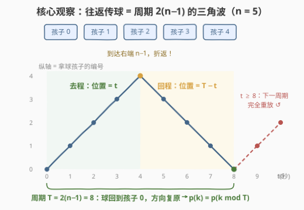
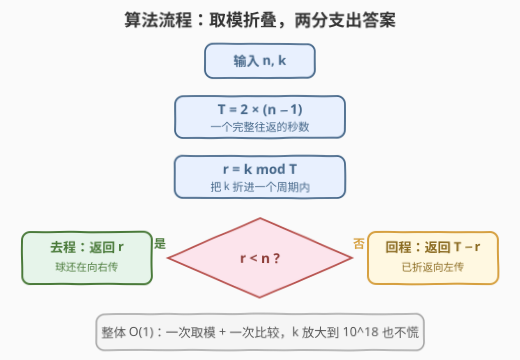
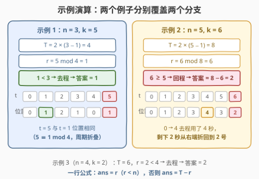

# LeetCode 找出K秒后拿着球的孩子 题解

## 1. 题目概述

- **标题 / 题号**：找出K秒后拿着球的孩子（#3178，easy）
- **链接**：https://leetcode.cn/problems/find-the-child-who-has-the-ball-after-k-seconds/
- **难度**：简单
- **标签**：数学、模拟

**题意**：给你两个**正整数** $n$ 和 $k$。有 $n$ 个编号从 $0$ 到 $n-1$ 的孩子按顺序从左到右站成一队。

最初，编号为 $0$ 的孩子拿着一个球，并且**向右**传球。每过一秒，拿着球的孩子就会将球传给他旁边的孩子。一旦球到达队列的**任一端**（编号 $0$ 或编号 $n-1$ 的孩子处），传球方向就会**反转**。

返回 $k$ 秒后接到球的孩子的编号。

**示例 1**：

```text
输入：n = 3, k = 5
输出：1
解释：
时间 0 1 2 3 4 5
持球 0 1 2 1 0 1
第 5 秒结束时球在孩子 1 手上。
```

**示例 2**：

```text
输入：n = 5, k = 6
输出：2
解释：
时间 0 1 2 3 4 5 6
持球 0 1 2 3 4 3 2
球先向右传到 4 号，再折返回来，第 6 秒在孩子 2 手上。
```

**示例 3**：

```text
输入：n = 4, k = 2
输出：2
解释：球向右传两秒，0 → 1 → 2，答案为 2。
```

**约束**：

- $2 \le n \le 50$
- $1 \le k \le 50$

> 💡 读题关键：数据范围小到允许逐秒暴力，但「数学」标签已经明示考点——球的往返是**周期运动**：从 $0$ 出发到 $n-1$ 再回到 $0$ 恰好用时 $2(n-1)$ 秒，且回到 $0$ 时方向复原、局面与 $t=0$ 完全相同。看到"往返 + 两端反弹"，第一反应就应是**周期折叠**，把 $O(k)$ 的模拟压成 $O(1)$ 的公式。另注意本题题面官方注明与 [2582. 递枕头](https://leetcode.cn/problems/pass-the-pillow/) 完全一致，是同一模型的换皮。

## 2. 解题思路

### 2.1 朴素思路：逐秒模拟

维护当前持球位置 `pos` 和方向 `dir`（初始 $+1$ 表示向右），循环 $k$ 次：每秒 `pos += dir`，一旦 `pos` 触到 $0$ 或 $n-1$ 就把 `dir` 取反。时间 $O(k)$、空间 $O(1)$。

本题 $k \le 50$ 完全够用。但面试官随手把约束改成 $k \le 10^{18}$，逐秒模拟立刻失效——而周期折叠的公式解毫发无损。**简单题的 AC 不是终点，识别出可推广的结构才是。**

> ⚠️ 卡点在"重复了很多秒，但局面早已轮回"。球的位置序列是周期的，任何 $k$ 的答案都等价于 $k \bmod T$ 的答案，冗余时间可以整体跳过。

### 2.2 核心观察：周期折叠 + 三角波



把球的位置随时间画成图，就是一条**三角波**（zigzag）。以 $n=5$ 为例：位置依次为 $0,1,2,3,4,3,2,1,0,1,2,\ldots$

**观察 1（周期是 $T = 2(n-1)$）**：球从 $0$ 向右走到 $n-1$ 需要 $n-1$ 秒，再折返回到 $0$ 又需要 $n-1$ 秒。回到 $0$ 的那一瞬，方向重新向右——**状态（位置, 方向）与 $t=0$ 完全一致**，此后的运动是上一个周期的逐秒重放。因此位置函数满足

$$
p(k) = p\big(k \bmod T\big), \quad T = 2(n-1)
$$

> ⚠️ 为什么周期不是 $2n$？因为**端点不重复停留**：去程和回程共享 $0$ 和 $n-1$ 这两个端点，一个完整往返只经过 $2(n-1)+1$ 个时刻、$2(n-1)$ 次传递。这是"锯齿计数"的经典陷阱（同"篱笆问题"：段数 = 点数 − 1）。

**观察 2（一个周期内的两段式公式）**：令 $r = k \bmod T$，把问题折进单个周期 $[0, T)$ 内：

- **去程**（$0 \le r < n$）：球还在向右走，第 $r$ 秒恰好传到编号 $r$ 的孩子，答案就是 $r$；
- **回程**（$n \le r \le 2n-3$）：球已从右端折返，从 $n-1$ 往回走了 $r-(n-1)$ 步，位置为 $(n-1)-\big(r-(n-1)\big) = T - r$。

合并成一行：

$$
\text{ans} = \begin{cases} r, & r < n \\ T - r, & r \ge n \end{cases} \quad\text{其中 } r = k \bmod 2(n-1)
$$

两段在 $r = n-1$（球恰在右端孩子手上）处无缝衔接：左分支给 $n-1$，右分支在 $r=n$ 时给 $n-2$，连续且不重不漏。

### 2.3 算法流程图



流程共四步：

1. 计算周期 $T = 2 \times (n-1)$；
2. 取余 $r = k \bmod T$，把 $k$ 折进一个周期内；
3. 若 $r < n$：去程未折返，返回 $r$；
4. 否则：已折返，返回 $T - r$。

### 2.4 示例演算



以 `n = 3, k = 5` 为例：

| 步骤 | 计算 | 结果 |
|------|------|------|
| 周期 | $T = 2 \times (3-1)$ | $4$ |
| 折叠 | $r = 5 \bmod 4$ | $1$ |
| 分支 | $1 < 3$，去程 | 答案 $= r = 1$ ✓ |

以 `n = 5, k = 6` 为例：

| 步骤 | 计算 | 结果 |
|------|------|------|
| 周期 | $T = 2 \times (5-1)$ | $8$ |
| 折叠 | $r = 6 \bmod 8$ | $6$ |
| 分支 | $6 \ge 5$，回程 | 答案 $= 8 - 6 = 2$ ✓ |

两例恰好分别覆盖去程、回程两个分支；示例 3（`n=4, k=2`）则验证边界：$T=6$，$r=2 < 4$，去程答案 $2$ ✓。

## 3. 参考代码

### C++

```cpp
class Solution {
  public:
    int numberOfChild(int n, int k) {
        int T = 2 * (n - 1);              // 一个完整往返的周期
        int r = k % T;                     // 折进一个周期
        return r < n ? r : T - r;          // 去程直接取 r，回程折返取 T−r
    }
};
```

### Python

```python
class Solution:
    def numberOfChild(self, n: int, k: int) -> int:
        T = 2 * (n - 1)                    # 一个完整往返的周期
        r = k % T                          # 折进一个周期
        return r if r < n else T - r       # 去程直接取 r，回程折返取 T−r
```

> 💡 细节盘点：约束 $n \ge 2$ 保证 $T = 2(n-1) \ge 2$，取模运算永不除零；$k$ 恰为 $T$ 的整数倍时 $r=0$，答案回到 $0$ 号孩子——与"第 $T$ 秒局面复原"的直觉一致，无需任何特判。

## 4. 复杂度分析

| 维度 | 复杂度 | 说明 |
|------|--------|------|
| 时间复杂度 | $O(1)$ | 一次乘法、一次取模、一次比较，与 $n$、$k$ 的大小无关 |
| 空间复杂度 | $O(1)$ | 仅 `T` / `r` 两个变量 |
| 暴力对照 | $O(k)$ | 逐秒模拟 `pos/dir`，$k \le 50$ 时可行，$k$ 放大后失效 |

## 5. 扩展：三角波通项与换皮识别

**对称式一步到位**：两分支还可以合并成关于 $n-1$ 的对称公式（三角波的顶点式）：

$$
\text{ans} = (n-1) - \big|(n-1) - k \bmod 2(n-1)\big|
$$

验证 $n=5, k=6$：$r=6$，$4 - |4-6| = 2$ ✓。喜欢一行流的面试可以现场推导。

**换皮识别**：本题题面官方注明与 [2582. 递枕头](https://leetcode.cn/problems/pass-the-pillow/) 一致——把"球"换成"枕头"、编号从 $1$ 起数，两题答案只差一个 $+1$ 的平移。更一般地，一切**一维往返反弹运动**（乒乓缓冲区、屏幕保护弹球、弹力球在两墙间弹跳）折叠后都是同一条三角波：先算周期 $2 \times (\text{全长})$，取余后按"未过中点取 $r$、过了取 $T-r$"两分支。认出这个骨架，一族题全部秒杀。

## 6. 面试要点

1. **为什么周期是 $2(n-1)$ 而不是 $n$ 或 $2n$？**

   - 完整状态是（位置, 方向），只有"球回到 $0$ 且方向向右"才算局面复原：去程 $n-1$ 秒 + 回程 $n-1$ 秒 = $2(n-1)$。不是 $2n$ 的原因是两端点在去程/回程中**共享**，不重复计数（段数 = 点数 − 1）；不是 $n$ 是因为位置序列 $0,1,\ldots,n{-}1,n{-}2,\ldots$ 显然要 $2(n-1)$ 步才回到 $0$。

2. **$r = k \bmod T$ 后为什么以 $r < n$ 分界？边界 $r = n-1$ 和 $r = n$ 各对应什么？**

   - 去程覆盖 $r \in [0, n-1]$（位置 $=$ 编号 $r$），其中 $r = n-1$ 表示球恰好在右端孩子手上；回程覆盖 $r \in [n, 2n-3]$，$r=n$ 时球已从右端折返一步到 $n-2$，公式 $T-r = 2n-2-n = n-2$ 与模拟一致。两段在交界处无缝衔接。

3. **$k$ 恰好是周期整数倍时结果是什么？为什么不用特判？**

   - $r = 0$，答案为 $0$：第 $mT$ 秒球恰好回到 $0$ 号孩子且方向复原，与 $t=0$ 局面完全相同。取模运算天然给出 $0$，落入去程分支，自动正确。

4. **如果把 $k$ 的上限改成 $10^{18}$，算法需要改动吗？**

   - 公式解完全不变：一次取模对 64 位整数依然是 $O(1)$（C++ 记得用 `long long`，Python 天然支持大整数）。会失效的只有逐秒模拟——这正是周期折叠相对模拟的价值所在。

5. **本题和 2582 递枕头是什么关系？如何互转？**

   - 完全同构（官方题面注明一致）：2582 编号从 $1$ 起数，本题从 $0$ 起数，把本题答案 $+1$ 即得 2582 的答案。核心模型都是"一维往返反弹 → 三角波 → 周期折叠"。

## 同类练习题

| # | 题目 | 与本题的关联 |
|---|------|-------------|
| 2582 | [递枕头](https://leetcode.cn/problems/pass-the-pillow/) | 本题的**完全同构版**（官方注明一致），编号平移一位，换个皮再写一遍巩固公式 |
| 880 | [索引处的解码字符串](https://leetcode.cn/problems/decoded-string-at-index/) | 解码串长到无法展开时同样用「总长折叠 + 取模」定位目标字符，周期思想的进阶应用 |
| 1103 | [分糖果 II](https://leetcode.cn/problems/distribute-candies-to-people/) | 循环发糖的周期分配，用取模定位落在哪一轮哪个人，训练"周期内分段"的拆解 |
| 390 | [消除游戏](https://leetcode.cn/problems/elimination-game/) | 左右往返消除数字，同样是"往返运动"，但周期结构更隐蔽，适合检验举一反三 |
