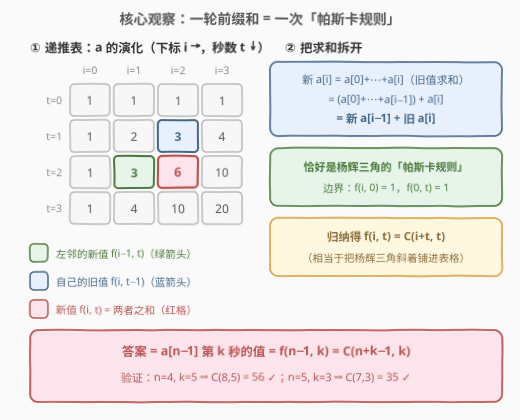
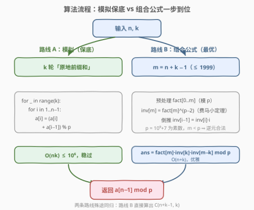
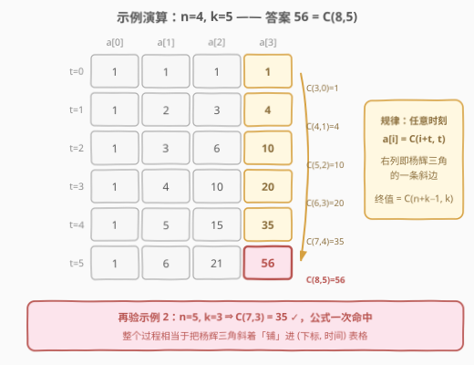

# K 秒后第 N 个元素的值

- **题目名称**：K 秒后第 N 个元素的值
- **链接**：[3179. K 秒后第 N 个元素的值](https://leetcode.cn/problems/find-the-n-th-value-after-k-seconds/)
- **难度**：中等
- **标签**：数组、数学、组合数学、前缀和、模拟

## 1. 题目概述

给你两个整数 `n` 和 `k`。最初，你有一个长度为 `n` 的整数数组 `a`，对所有 `0 <= i <= n - 1` 都有 `a[i] = 1`。每过一秒，你会**同时**更新每个元素为其**前面所有元素的和**加上该元素本身。例如，一秒后，`a[0]` 保持不变，`a[1]` 变为 `a[0] + a[1]`，`a[2]` 变为 `a[0] + a[1] + a[2]`，以此类推。

换句话说：**每过一秒，就对整个数组做一轮前缀和**。返回 `k` 秒后 `a[n - 1]` 的值。由于答案可能非常大，返回其对 $10^9 + 7$ **取余**后的结果。

**示例 1**：

```text
输入：n = 4, k = 5
输出：56
解释：
时间（秒）  数组状态
0          [1, 1, 1, 1]
1          [1, 2, 3, 4]
2          [1, 3, 6, 10]
3          [1, 4, 10, 20]
4          [1, 5, 15, 35]
5          [1, 6, 21, 56]
```

**示例 2**：

```text
输入：n = 5, k = 3
输出：35
解释：
时间（秒）  数组状态
0          [1, 1, 1, 1, 1]
1          [1, 2, 3, 4, 5]
2          [1, 3, 6, 10, 15]
3          [1, 4, 10, 20, 35]
```

**约束条件**：

- $1 \le n, k \le 1000$

> 💡 读题关键：「同时更新为前缀和」意味着每秒一轮 `a[i] += a[i-1]`。$n, k \le 1000$ 意味着 $O(nk) \le 10^6$ 的模拟就能过——但「**重复做前缀和**」是组合数学里的经典结构：它和**杨辉三角**完全同构，存在 $O(n + k)$ 的闭式解。看到示例里冒出的 `1, 3, 6, 10, 20, 35, 56`（三角形数、四面体数……全是组合数），就应该意识到答案是一个**二项式系数**。

---

## 2. 解题思路

### 2.1 暴力思路：k 轮原地前缀和

最直接的做法是照题意模拟：每一秒从左到右扫一遍，执行原地前缀和

$$a[i] \leftarrow a[i] + a[i-1] \pmod{10^9+7}$$

**为什么原地更新是正确的？** 题目要求「同时」更新，而从左往右扫描时，`a[i-1]` 已经是本轮**新值**（= 旧 $a[0] + \cdots + a[i-1]$），它加上还没被动过的 `a[i]`（旧值），恰好就是本轮新 `a[i]` = 旧 $a[0] + \cdots + a[i]$——**扫描的顺序天然实现了「同时」的语义**。

总时间 $O(nk) \le 10^6$，完全能过（代码见 5.1）。但它没有利用任何结构：值域以组合数速度暴涨全靠取模压着，而「重复前缀和」本身有更深的代数结构，值得挖到底。

### 2.2 核心观察：一轮前缀和 = 一次「帕斯卡规则」



记 $f(i, t)$ 为 $t$ 秒后 $a[i]$ 的值。按题意，新值是旧值的前缀和：

$$f(i, t) = \sum_{j=0}^{i} f(j, t-1)$$

**关键一步：把求和拆成「左邻的新值 + 自己的旧值」。** 上式右边提出最后一项，剩下的 $\sum_{j=0}^{i-1} f(j, t-1)$ 恰好就是位置 $i-1$ 在第 $t$ 秒的新值 $f(i-1, t)$！于是

$$f(i, t) = f(i-1, t) + f(i, t-1)$$

边界条件：$f(i, 0) = 1$（初始全 1），$f(0, t) = 1$（`a[0]` 永远不变——它前面的元素只有自己）。

> 💡 这个「两来源相加 + 边界全 1」的形状，正是**杨辉三角的帕斯卡规则** $\binom{m}{r} = \binom{m-1}{r-1} + \binom{m-1}{r}$。把杨辉三角旋转 45° 斜着铺进「（下标 $i$，时间 $t$）」表格，得到的正是 $a$ 的演化过程。

**归纳证明** $f(i, t) = \binom{i+t}{t}$：

- **边界**：$f(i, 0) = 1 = \binom{i}{0}$ ✓；$f(0, t) = 1 = \binom{t}{t}$ ✓
- **归纳步**：$f(i-1, t) + f(i, t-1) = \binom{i-1+t}{t} + \binom{i+t-1}{t-1} = \binom{i+t}{t}$ ✓（帕斯卡恒等式）

于是答案一步到位：

$$\text{ans} = f(n-1, k) = \binom{n+k-1}{k}$$

验证：$n=4, k=5 \Rightarrow \binom{8}{5} = 56$ ✓；$n=5, k=3 \Rightarrow \binom{7}{3} = 35$ ✓。

> ⚠️ 注意取模位置：$\binom{n+k-1}{k}$ 本身是天文数字（$\binom{1999}{999}$ 约有 600 位），必须**在模意义下用阶乘 + 逆元**计算（C++），或用大整数算完再取模（Python 的 `math.comb`）。

### 2.3 算法流程图



两条路线殊途同归：

- **路线 A（模拟保底）**：`k` 轮原地前缀和，$O(nk)$，$n, k \le 1000$ 时至多 $10^6$ 次加法；
- **路线 B（组合公式）**：令 $m = n + k - 1 \le 1999$，预处理阶乘表 $\mathrm{fact}[0..m]$，用**费马小定理**求逆元（$p = 10^9 + 7$ 是素数，且 $m < p$ 保证分母不含 $p$ 的因子，逆元合法），三乘取模得 $\binom{m}{k}$，$O(n + k)$。

### 2.4 示例演算



以 $n = 4, k = 5$ 为例，把 6 行数组状态排成表格：

| $t$ \ $i$ | 0 | 1 | 2 | 3 |
|------|---|---|---|------|
| 0 | 1 | 1 | 1 | 1 |
| 1 | 1 | 2 | 3 | 4 |
| 2 | 1 | 3 | 6 | 10 |
| 3 | 1 | 4 | 10 | 20 |
| 4 | 1 | 5 | 15 | 35 |
| 5 | 1 | 6 | 21 | **56** |

逐格核对公式 $f(i, t) = \binom{i+t}{t}$：

- 第 0 列恒为 $1 = \binom{t}{t}$（`a[0]` 不动）；
- 右列自上而下 $1, 4, 10, 20, 35, 56 = \binom{3}{0}, \binom{4}{1}, \binom{5}{2}, \binom{6}{3}, \binom{7}{4}, \binom{8}{5}$——**正是杨辉三角的一条斜边**；
- 终值 $f(3, 5) = \binom{8}{5} = 56$ ✓。

再验示例 2：$f(4, 3) = \binom{7}{3} = 35$ ✓。

> 💡 每一格的值只依赖「左邻的新值 + 自己的旧值」，与数组长度无关——所以表格向右、向下可以无限延伸，$n, k$ 只是圈出了我们最终要读的那一格。

---

## 3. 参考代码

### C++

```cpp
class Solution {
    static constexpr long long MOD = 1'000'000'007;

  public:
    int valueAfterKSeconds(int n, int k) {
        int m = n + k - 1;                        // 答案 = C(m, k) = C(m, n-1)
        vector<long long> fact(m + 1), inv(m + 1);
        fact[0] = 1;
        for (int i = 1; i <= m; i++) fact[i] = fact[i - 1] * i % MOD;
        inv[m] = qpow(fact[m], MOD - 2);          // 费马小定理求逆元（p 为素数）
        for (int i = m; i >= 1; i--) inv[i - 1] = inv[i] * i % MOD;
        return fact[m] * inv[k] % MOD * inv[m - k] % MOD;
    }

  private:
    static long long qpow(long long b, long long e) {
        long long r = 1;
        for (b %= MOD; e; e >>= 1, b = b * b % MOD)
            if (e & 1) r = r * b % MOD;
        return r;
    }
};
```

### Python

```python
from math import comb


class Solution:
    def valueAfterKSeconds(self, n: int, k: int) -> int:
        return comb(n + k - 1, k) % (10**9 + 7)   # 一步到位，大整数算完再取模
```

> 💡 Python 的 `math.comb` 内部是精确大整数运算，$\binom{1999}{999}$ 约 600 位也毫无压力，取模放在最后一步即可。若追求与 C++ 同款写法（阶乘 + 费马逆元），把 `comb` 换成三条 `pow(x, MOD - 2, MOD)` 的乘积即可。

---

## 4. 复杂度分析

| 维度 | 复杂度 | 说明 |
|------|--------|------|
| 时间（公式解） | $O(n + k + \log p)$ | 阶乘表线性预处理 $O(n+k)$，一次快速幂 $O(\log p)$，$p = 10^9+7$ |
| 空间（公式解） | $O(n + k)$ | `fact` / `inv` 两个数组，$m = n+k-1 \le 1999$ |
| 模拟解 | $O(nk)$ 时间 / $O(n)$ 空间 | $n, k \le 1000 \Rightarrow$ 至多 $10^6$ 次模加法，同样能过 |

> 💡 本题规模下两条路线都远低于时限，差异在**思想**：模拟是「照题意办事」，公式是「识别出重复前缀和 = 杨辉三角」后的降维打击。若 $n, k$ 放大到 $10^9$（模 $10^9+7$），模拟彻底不可行，而公式解只需把阶乘表换成 $O(k)$ 的乘法逆元滚动式（或 Lucas 定理），依然轻松。

---

## 5. 扩展

### 5.1 保底写法：k 轮原地前缀和

不想推组合公式时，五分钟写完的模拟同样通过：

```cpp
class Solution {
    static constexpr long long MOD = 1'000'000'007;

  public:
    int valueAfterKSeconds(int n, int k) {
        vector<long long> a(n, 1);
        while (k--)
            for (int i = 1; i < n; i++)    // 从左往右：a[i-1] 已是本轮新值
                a[i] = (a[i] + a[i - 1]) % MOD;
        return a[n - 1];
    }
};
```

```python
class Solution:
    def valueAfterKSeconds(self, n: int, k: int) -> int:
        MOD = 10**9 + 7
        a = [1] * n
        for _ in range(k):
            for i in range(1, n):
                a[i] = (a[i] + a[i - 1]) % MOD
        return a[n - 1]
```

面试中建议先落这个版本保底，再当场优化成组合公式——完整的加分路径。

### 5.2 组合意义：终值数的是「多重集」

公式 $\binom{n+k-1}{k}$ 不是巧合，它有干净的双计数解释。观察传播过程：每一秒，位置 $j$ 的值会被**累加进**所有位置 $q \ge j$。于是把「1 份贡献」从第 0 秒传到第 $t$ 秒的位置 $i$，等价于选一条**位置单调不减**的传播链

$$0 \le p_0 \le p_1 \le \cdots \le p_t \le i$$

（每一秒位置要么不动、要么右移）。因此

$$f(i, t) = \#\{(p_0, \ldots, p_t) : 0 \le p_0 \le \cdots \le p_t \le i\}$$

——这正是**从 $i+1$ 个下标中可重复地选 $t+1$ 个（多重集）的方案数**，由隔板法（stars and bars）得 $\binom{i+t}{t}$。取 $i = n-1, t = k$ 即答案 $\binom{n+k-1}{k}$。

换个等价的说法：$f(i, t)$ 也等于**格路计数**——从 $(0,0)$ 走到 $(i, t)$、每步向右或向上的路径数，递推式 $f(i,t) = f(i-1,t) + f(i,t-1)$ 与格路递推逐字相同。一个公式，三种读法（传播链 / 多重集 / 格路），都是组合数学的常用视角。

---

## 6. 面试要点

1. **为什么原地 `a[i] += a[i-1]` 就实现了「同时更新」？**

   - 从左往右扫时，`a[i-1]` 已是本轮新值（= 旧 $a[0..i-1]$ 之和），加上未更新的 `a[i]`（旧值）恰为本轮新值。**扫描顺序天然保证同时语义**；反过来从右往左扫就错了。

2. **怎么发现杨辉三角结构？**

   - 代数上：拆和 $f(i,t) = \sum_{j \le i} f(j, t-1) = f(i-1, t) + f(i, t-1)$，两来源相加 + 边界全 1 = 帕斯卡规则；数值上：手推两轮就能认出 $1, 3, 6, 10, 20$（三角形数 / 四面体数）。

3. **最终答案是什么？如何验证？**

   - $f(i, t) = \binom{i+t}{t}$，答案 $= \binom{n+k-1}{k}$；用示例验证 $C(8,5)=56$、$C(7,3)=35$。

4. **模意义下组合数怎么算？费马逆元为什么合法？**

   - 预处理阶乘 + 一次快速幂求 $\mathrm{fact}[m]^{-1}$ 再倒推全部逆元；$p = 10^9+7$ 是素数且 $m \le 1999 < p$，分母不含因子 $p$，费马小定理 $a^{p-2} \equiv a^{-1}$ 适用。

5. **如果模数不素或值域更大，怎么办？**

   - 模数不素（或分母与模数不互素）时逆元失效：小规模可改「杨辉三角一行递推 $O(nk)$」（本题的模拟本质），素数模 + 超大参数用 Lucas 定理按 $p$ 进制拆位。

---

## 7. 同类练习题

- [118. 杨辉三角](https://leetcode.cn/problems/pascals-triangle/)（[站内题解](../0001-0100/118_杨辉三角.md)）：帕斯卡规则的本体，本题递推的「原材料」
- [62. 不同路径](https://leetcode.cn/problems/unique-paths/)（[站内题解](../0001-0100/62_不同路径.md)）：格路计数 $\binom{m+n-2}{m-1}$，与本文 5.2 的第三种读法同源
- [1641. 统计字典序元音字符串的数目](https://leetcode.cn/problems/count-sorted-vowel-strings/)（[站内题解](../1601-1700/1641_统计字典序元音字符串的数目.md)）：隔板法 $\binom{n+4}{4}$，「多重集计数」的直接同款
- [2400. 恰好移动 k 步到达某一位置的方法数目](https://leetcode.cn/problems/number-of-ways-to-reach-a-position-after-exactly-k-steps/)（[站内题解](../2301-2400/2400_恰好移动k步到达某一位置的方法数目.md)）：模意义组合数 $\binom{k}{j}$ 的套路化计算，巩固费马逆元写法
