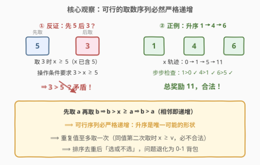
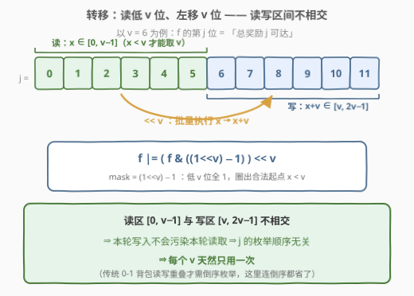

# 执行操作可获得的最大总奖励 I

- **题目名称**：执行操作可获得的最大总奖励 I
- **链接**：[3180. 执行操作可获得的最大总奖励 I](https://leetcode.cn/problems/maximum-total-reward-using-operations-i/)
- **难度**：中等
- **标签**：位运算、数组、动态规划、排序

## 1. 题目概述

给你一个整数数组 `rewardValues`，长度为 `n`，代表奖励的值。最初，你的总奖励 $x$ 为 0，所有下标都是**未标记**的。你可以执行以下操作**任意次**：

- 从区间 $[0, n - 1]$ 中选择一个**未标记**的下标 $i$；
- 如果 `rewardValues[i]` **大于**你当前的总奖励 $x$，则将 `rewardValues[i]` 加到 $x$ 上（即 $x = x + \text{rewardValues}[i]$），并**标记**下标 $i$。

以整数形式返回执行最优操作能够获得的**最大**总奖励。

**示例 1**：

```text
输入：rewardValues = [1,1,3,3]
输出：4
解释：依次标记下标 0 和 2，总奖励为 4，这是可获得的 最大 值。
```

**示例 2**：

```text
输入：rewardValues = [1,6,4,3,2]
输出：11
解释：依次标记下标 0、2 和 1。总奖励为 11，这是可获得的 最大 值。
```

**约束条件**：

- $1 \le \text{rewardValues.length} \le 2000$
- $1 \le \text{rewardValues}[i] \le 2000$

> 💡 读题关键：操作条件「$\text{rewardValues}[i] > x$」是本题的灵魂——**x 只增不减，取数的门槛越抬越高**。直觉上应该「小的先取、大的后取」，而这其实可以证明成一件必然的事（见 2.2）。此外 $n, v \le 2000$ 意味着总奖励不超过 $2 \times 2000$，**状态（总奖励的值域）极小**，天然是可行性背包 DP 的形状；而「标签里的位运算」提示我们还能把整个状态集装进一个整数里批量转移。

---

## 2. 解题思路

### 2.1 暴力思路：枚举取数序列

最直接的想法是回溯：每一步枚举所有「值大于当前 $x$ 且未标记」的下标，取或不取，搜索全部取数序列取最大值。但 $n \le 2000$，子集个数是 $2^{2000}$ 量级，哪怕剪枝也无从下手——**爆搜的瓶颈在于「顺序」维度**：同一组数以不同顺序取，合法性完全不同。

换一个视角：与其问「以什么顺序取」，不如先回答「合法的顺序长什么样」——这就是下面的核心观察。

### 2.2 核心观察：可行的取数序列必然严格递增



设某可行序列中相邻两步**先取 $a$、后取 $b$**。由操作条件，取 $b$ 时要求

$$b > x \ge a \quad \Longrightarrow \quad b > a$$

（$x$ 此时已包含 $a$）。于是**任何可行序列都严格递增**。这一步看似简单，信息量却很大：

1. **顺序维度被消灭**：升序不是众多可行顺序中「最优」的一种，而是**唯一可能**的形状。把数组排序后，取数顺序自动确定，问题退化为纯**选或不选**——标准 0-1 背包。
2. **重复值无效**：严格递增 ⟹ 同一个值至多取一次，排序后去重即可。
3. **转移自带区间限制**：按升序处理到值 $v$ 时，取它之前的总和 $x$ 必须满足 $v > x$，即 $x \in [0, v-1]$；取完之后 $x + v \in [v, 2v-1]$。

> 💡 一句话：**「$\text{value} > x$」这个门槛把顺序锁死成升序，把问题锁死成背包。**

于是定义可行性 DP：$f[j] = \text{true}$ 表示「存在一种取法使总奖励**恰好**为 $j$」。初始 $f[0] = \text{true}$。按升序枚举（去重后的）$v$，转移为

$$f[j + v] \;\mathrel{|}= f[j], \qquad j \in [0, v-1]$$

答案为 $\max\{j : f[j] = \text{true}\}$。

**答案上界**：设最大值为 $m$，最后一步取的数 $\le m$，而取它之前 $x \le m - 1$，故总奖励 $\le 2m - 1 \le 3999$——$f$ 数组开 $4000$ 即可。

### 2.3 算法流程图：读低 $v$ 位、左移 $v$ 位的 bitset 转移



把 $f$ 的第 $j$ 位当作 $f[j]$，整个状态集就是一个**大整数 / bitset**。处理 $v$ 时的转移只涉及：

- **读**：低 $v$ 位 $[0, v-1]$（合法的 $x < v$ 区间）；
- **写**：左移 $v$ 位后落入 $[v, 2v-1]$。

转移浓缩成一条位运算：

$$f \;\mathrel{|}= \big(f \,\&\, \underbrace{(2^{v} - 1)}_{\text{mask：低 } v \text{ 位}}\big) \ll v$$

**读写区间不相交** $[0, v-1] \cap [v, 2v-1] = \varnothing$ 带来一个漂亮性质：$j$ 的枚举顺序根本不影响结果——传统 0-1 背包必须倒序枚举来防止同一物品被重复使用，而这里**读取区永远碰不到本轮写入区**，每个 $v$ 天然只用一次。

流程总结：

1. 排序 + 去重，得升序数组；
2. $f \gets 1$（只有第 0 位为 1）；
3. 依次处理 $v$：$f \mathrel{|}= (f \,\&\, (2^v - 1)) \ll v$；
4. 返回 $f$ 的**最高位下标**。

### 2.4 示例演算

![示例演算：[1,6,4,3,2] 排序去重后逐值转移，最终最高位为 11](../images/p3180_example_walkthrough.svg)

以示例 2 `rewardValues = [1,6,4,3,2]` 为例，排序去重得 $[1,2,3,4,6]$，用集合表示 $f$ 的为 1 的位：

| 处理值 $v$ | $\text{low} = f \cap [0, v-1]$ | $\text{low} + v$ | 合并后的 $f$ |
|------|------|------|------|
| 初始 | — | — | $\{0\}$ |
| $v=1$ | $\{0\}$ | $\{1\}$ | $\{0,1\}$ |
| $v=2$ | $\{0,1\}$ | $\{2,3\}$ | $\{0,1,2,3\}$ |
| $v=3$ | $\{0,1,2\}$ | $\{3,4,5\}$ | $\{0,\dots,5\}$ |
| $v=4$ | $\{0,1,2,3\}$ | $\{4,5,6,7\}$ | $\{0,\dots,7\}$ |
| $v=6$ | $\{0,\dots,5\}$ | $\{6,\dots,11\}$ | $\{0,\dots,11\}$ |

最高位为 $11$ ✓。对应的实际取法是 $1 \to 4 \to 6$：$x$ 轨迹 $0 \to 1 \to 5 \to 11$，每步都满足 $\text{value} > x$。

再验示例 1 `[1,1,3,3]`：去重得 $[1,3]$；$v=1$ 后 $f=\{0,1\}$；$v=3$ 时 $\text{low}=\{0,1\}$（注意位 3、4 虽在 $f$ 的历史里不存在，此处 $\text{low}$ 只含 $\{0,1\}$），合并后 $f=\{0,1,3,4\}$，最高位 $4$ ✓。

> ⚠️ 易错点：$v=6$ 时不能读位 6（$\text{low}$ 被 mask 截到 $[0,5]$）——因为取 6 之前必须 $x < 6$，$x = 6$ 时 6 并不大于 $x$，位 6 是非法起点。这正是 mask 存在的意义。

---

## 3. 参考代码

### C++（朴素可行性 DP）

```cpp
class Solution {
  public:
    int maxTotalReward(vector<int>& rewardValues) {
        sort(rewardValues.begin(), rewardValues.end());
        rewardValues.erase(unique(rewardValues.begin(), rewardValues.end()),
                           rewardValues.end());

        const int M = 4000;                  // 上界 2*2000
        vector<char> f(M, 0);
        f[0] = 1;
        int ans = 0;
        for (int v : rewardValues)
            for (int j = min(M - 1, 2 * v - 1); j >= v; j--)   // j ∈ [v, 2v-1]
                if (f[j - v]) {
                    f[j] = 1;
                    ans = max(ans, j);
                }
        return ans;
    }
};
```

### Python（大整数位运算）

```python
class Solution:
    def maxTotalReward(self, rewardValues: List[int]) -> int:
        f = 1                                  # bit 0：总奖励 0 可达
        for v in sorted(set(rewardValues)):    # 升序 + 去重
            f |= (f & ((1 << v) - 1)) << v     # 读低 v 位，左移 v 位，并回
        return f.bit_length() - 1              # 最高位 = 最大总奖励
```

> 💡 Python 的大整数天然就是任意宽度的 bitset，`(1 << v) - 1` 直接构造低 $v$ 位的 mask，一条表达式完成整轮转移；`bit_length() - 1` 一步读出最高位。C++ 里对应的 `bitset<4000>` 写法见 5.1。

---

## 4. 复杂度分析

| 维度 | 复杂度 | 说明 |
|------|--------|------|
| 时间（朴素 DP） | $O(n \log n + d \cdot M)$ | $d$ = 去重后元素个数 $\le \min(n, 2000)$，$M = 2\max v \le 4000$；本题规模至多 $8 \times 10^6$ 次布尔操作 |
| 时间（位运算） | $O(n \log n + d \cdot M / w)$ | $w = 64$（机器字长 / bitset 字宽），一轮转移只需 $M/w$ 次字级与/或/移位 |
| 空间 | $O(M)$ | 长度 4000 的布尔数组（或 4000 位 bitset），与 $n$ 无关 |

> 💡 朴素版在本题 $n \le 2000$ 下绰绰有余；位运算版的意义在**放大后**（见第 5 节的 3181）——值域与个数同时放大时，$d \cdot M$ 乘积爆炸，而 $d \cdot M / w$ 依然从容。

---

## 5. 扩展：bitset 写法与 3181（II 版）

### 5.1 C++ `bitset<4000>` 版

与 Python 大整数完全同构，唯一的手工活是构造「低 $v$ 位」的 mask——由于 $v$ 按升序处理，mask 可以**增量补位**，不必每个 $v$ 重造：

```cpp
class Solution {
  public:
    int maxTotalReward(vector<int>& rewardValues) {
        sort(rewardValues.begin(), rewardValues.end());
        rewardValues.erase(unique(rewardValues.begin(), rewardValues.end()),
                           rewardValues.end());

        bitset<4000> f, mask;
        f[0] = 1;
        int low = 0;
        for (int v : rewardValues) {
            while (low < v) mask[low++] = 1;     // v 递增 → mask 增量补到 [0, v-1]
            f |= (f & mask) << v;
        }
        for (int j = 3999; j >= 0; j--)          // 找最高位
            if (f[j]) return j;
        return 0;
    }
};
```

### 5.2 3181（II 版）：位运算从「优化」变成「必需」

[3181. 执行操作可获得的最大总奖励 II](https://leetcode.cn/problems/maximum-total-reward-using-operations-ii/) 题意完全相同，仅数据范围放大：$n \le 5 \times 10^4$，$\text{rewardValues}[i] \le 5 \times 10^4$。此时 $M = 10^5$，朴素 DP 为 $d \cdot M \approx 5 \times 10^9$ 次操作，超时；位运算版 $d \cdot M / 64 \approx 8 \times 10^7$ 次字操作，轻松通过（C++ `bitset<100000>`，或 Python 大整数——注意 $v$ 最大 $5\times10^4$ 时位宽 $10^5$，`int` 移位无压力）。

> 💡 这是「可行性背包」家族的经典分层：**值域小 → 布尔数组；值域大但装得下 → bitset / 大整数；值域巨大 → 换单调性 / 双指针 / 数学**。本题系列正是第二层的教科书案例。

---

## 6. 面试要点

1. **为什么排序后从小到大取就够了？**

   - 不是贪心偏好，而是必然：可行序列中相邻两步先取 $a$ 后取 $b$，条件要求 $b > x \ge a$，故 $b > a$——任何可行序列都严格递增，升序是**唯一可能**的顺序，顺序维度被彻底消去。

2. **重复值为什么可以直接去掉？**

   - 严格递增 ⟹ 同值至多取一次；第二次取同一个 $v$ 时 $x \ge v$，条件 $v > x$ 必不成立。排序后 `unique` 去重即可。

3. **转移为什么限制 $j \in [v, 2v-1]$？不需要倒序枚举吗？**

   - 取 $v$ 要求 $v > x$，即 $x = j - v \in [0, v-1]$，故 $j \in [v, 2v-1]$。读取区 $[0, v-1]$ 与写入区 $[v, 2v-1]$ **不相交**，本轮写入永远不会污染本轮读取——$j$ 的枚举顺序无关紧要，天然保证每个 $v$ 只用一次（对比：传统 0-1 背包读写区间重叠，才需要倒序）。

4. **答案上界是多少？dp 数组开多大？**

   - 最大值 $m$，最后取的数 $\le m$ 且取之前 $x \le m - 1$，故总和 $\le 2m - 1 \le 3999$，数组开 $4000$（II 版开 $10^5$）。

5. **位运算转移 $f \mathrel{|}= (f \,\&\, (2^v - 1)) \ll v$ 各部分含义？**

   - $2^v - 1$：低 $v$ 位全 1 的 mask，圈出合法读取区 $[0, v-1]$（$x < v$）；$f \,\&\, \text{mask}$：筛出所有能「垫在 $v$ 前面」的状态；$\ll v$：批量执行 $x \to x + v$；$|$：新旧状态并集（$v$ 可取可不取）。

---

## 7. 同类练习题

- [3181. 执行操作可获得的最大总奖励 II](https://leetcode.cn/problems/maximum-total-reward-using-operations-ii/)：同题放大版（$n, v \le 5 \times 10^4$），位运算 DP 从优化变为必需，正好检验本文 5.2 的分层思想
- [416. 分割等和子集](https://leetcode.cn/problems/partition-equal-subset-sum/)（[站内题解](../0401-0500/416_分割等和子集.md)）：0-1 背包可行性的母题；本题多了「$x < v$」的区间限制，读写区间因此错开
- [494. 目标和](https://leetcode.cn/problems/target-sum/)（[站内题解](../0401-0500/494_目标和.md)）：集合选取凑指定和的另一种形态，巩固「子集和 → 背包」的转化
- [1049. 最后一块石头的重量 II](https://leetcode.cn/problems/last-stone-weight-ii/)（[站内题解](../1001-1100/1049_最后一块石头的重量II.md)）：同为 $\pm$ 号分配型背包，对比「恰好为 $j$」（可行性）与「最接近半和」（最值化）两类问法
