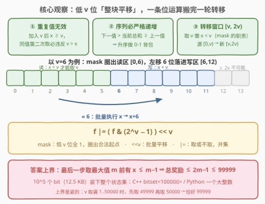
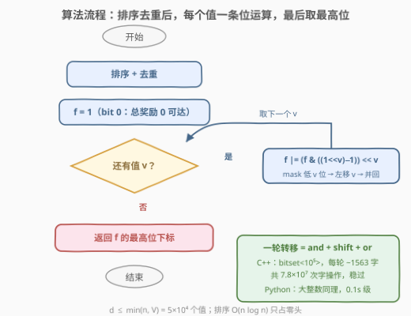

# LeetCode 执行操作可获得的最大总奖励 II 题解

## 1. 题目概述

- **标题 / 题号**：执行操作可获得的最大总奖励 II（#3181，hard）
- **链接**：https://leetcode.cn/problems/maximum-total-reward-using-operations-ii/
- **难度**：困难
- **标签**：位运算、数组、动态规划、排序

**题意**：给你一个整数数组 `rewardValues`，长度为 `n`，代表奖励的值。最初，你的总奖励 $x$ 为 0，所有下标都是**未标记**的。你可以执行以下操作**任意次**：

- 从区间 $[0, n-1]$ 中选择一个**未标记**的下标 $i$；
- 如果 `rewardValues[i]` **大于**你当前的总奖励 $x$，则将 `rewardValues[i]` 加到 $x$ 上（即 $x = x + \text{rewardValues}[i]$），并**标记**下标 $i$。

以整数形式返回执行最优操作能够获得的**最大**总奖励。

**示例 1**：

```text
输入：rewardValues = [1,1,3,3]
输出：4
解释：依次标记下标 0 和 2，总奖励为 4，这是可获得的 最大 值。
```

**示例 2**：

```text
输入：rewardValues = [1,6,4,3,2]
输出：11
解释：依次标记下标 0、2 和 1。总奖励为 11，这是可获得的 最大 值。
```

**约束**：

- $1 \le \texttt{rewardValues.length} \le 5 \times 10^4$
- $1 \le \texttt{rewardValues}[i] \le 5 \times 10^4$

> 💡 **审题关键**：与双胞胎题 [3180. 执行操作可获得的最大总奖励 I](https://leetcode.cn/problems/maximum-total-reward-using-operations-i/)（[站内题解](3180_执行操作可获得的最大总奖励I.md)）题意**逐字相同**，仅把数据范围从 $n, v \le 2000$ 放大到 $5 \times 10^4$——正是这一步放大，把「朴素可行性 DP 能过」的解法逼进死角，逼出 **bitset（位图）优化的 0-1 背包**。另一头，答案不超过 $2 \times 5 \times 10^4$，整个状态值域不过 $10^5$ 个，**全部装进一个整数的位里绰绰有余**——这是「位运算加速动态规划」的教科书题。

## 2. 解题思路

### 2.1 暴力思路：I 版的 O(n·V) 背包，在 II 版的数据范围下崩盘

建模三步（引理的完整证明见 3180 站内题解，此处给结论）：

1. **排序去重**：可行取数序列必然**严格递增**——下一步的值必须大于当前总和 $x$，而 $x$ 已包含上一步的值。因此同一值至多取一次，排序后按升序做「选或不选」；
2. **可行性 DP**：$f[j] = \text{true}$ 表示总奖励**恰好**可为 $j$，初始 $f[0] = \text{true}$。处理值 $v$ 时，取 $v$ 要求 $v > x$，即 $x \in [0, v-1]$，故

$$f[j + v] \mathrel{|}= f[j], \qquad j \in [0, v-1]$$

3. **答案** $= \max\{j : f[j] = \text{true}\}$，上界 $2\max v - 1 \le 99999$。

在 3180（$n, v \le 2000$）里，这套 $O(d \cdot V)$ 的布尔 DP 至多 $8 \times 10^6$ 次操作，轻松通过。但 II 版把 $n$ 和值域**同时放大 25 倍**：

- 逐位转移的总量约为 $\sum_{\text{distinct } v} v$，最坏（$v$ 恰为 $1 \dots 5\times10^4$ 全体）约 $1.25 \times 10^9$ 次带分支的布尔操作——本机 `-O2` 实测 0.87s，放到更慢的评测机上就在 TLE 边缘挣扎，Python 更是分钟级直接放弃；
- 而其中**每一次操作只干一件事**：把一个 bool 从 false 搬成 true。

> 💡 优化方向就藏在「操作太碎」里：$f$ 本是一个 0/1 数组，本质是一串**位**。把整个值域 $[0, 10^5)$ 装进一个 bitset，一轮转移就从「循环 $v$ 次逐位搬」变成「3 条整块的机器字级位运算」——常数直接除以机器字长 64。

### 2.2 核心观察：mask + 平移，一条位运算完成一轮转移



把 $f[j]$ 放在第 $j$ 个 bit 上，处理值 $v$ 的转移只涉及两段**互不相交**的区间：

- **读**：$[0, v-1]$——合法起点（$x < v$）所在的位段；
- **写**：$[v, 2v-1]$——每个合法起点 $x$ 平移 $v$ 位后的落点 $x + v$。

于是整轮转移浓缩成一条表达式：

$$f \;\mathrel{|}= \big(f \,\&\, \underbrace{(2^v - 1)}_{\text{低 } v \text{ 位全 1}}\big) \ll v$$

三个片段各有含义：

| 片段 | 动作 | 含义 |
|------|------|------|
| $f \,\&\, (2^v - 1)$ | 截断 | 只保留 $[0, v)$ 的可达位——$x \ge v$ 的状态没资格再取 $v$ |
| $\ll v$ | 平移 | 批量执行 $x \to x + v$，一次移动一整个值域 |
| $\mathrel{\|}=$ | 并集 | 取或不取 $v$ 都保留 |

读写区间 $[0, v-1]$ 与 $[v, 2v-1]$ **零重叠**，这正是能整块位运算的根本原因：传统 0-1 背包正序枚举会让「刚写入的位被本轮再读」导致物品复用，必须倒序；而这里读取永远碰不到本轮写入，**一条位运算就是一次无副作用的批量转移**，枚举顺序彻底无关紧要。

答案的值域也顺带锁定：最后一步取的值 $\le m = \max v$，取之前 $x \le m - 1$，故总奖励 $\le 2m - 1 \le 99999$——**$10^5$ 个 bit（12.5 KB）装下整个状态集**，C++ 用 `bitset<100000>`，Python 用一个大整数即可。

### 2.3 算法流程



1. 排序 + 去重，得升序数组；
2. $f \gets 1$（只有 bit 0 为 1，总奖励 0 可达）；
3. 依次处理每个 $v$：$f \mathrel{|}= (f \,\&\, (2^v - 1)) \ll v$；
4. 返回 $f$ 的**最高位下标**（Python：`f.bit_length() - 1`）。

> 💡 **为何必须升序处理**：转移读的是「更小值铺出来的低段」，写的是「从 $v$ 起步的高段」。若降序处理，大值先占据高位，轮到小值时 mask 只放行低位，大值铺出的状态就永远闲置浪费。升序保证每一步的写入区都为后面的更大值「垫高」可达集——仍是严格递增引理在背后发号施令。

### 2.4 示例演算

![示例演算：[1,6,4,3,2] 的 f 位图逐轮点亮，最终最高位为 11](../images/p3181_example_walkthrough.svg)

以示例 2 `rewardValues = [1,6,4,3,2]` 为例，排序去重得 $[1,2,3,4,6]$，用「$f$ 中为 1 的位」表示状态集：

| 处理值 $v$ | low $= f \cap [0, v)$ | low $+ v$ | 合并后的 $f$ |
|------|------|------|------|
| 初始 | — | — | $\{0\}$ |
| $v=1$ | $\{0\}$ | $\{1\}$ | $\{0,1\}$ |
| $v=2$ | $\{0,1\}$ | $\{2,3\}$ | $\{0,1,2,3\}$ |
| $v=3$ | $\{0,1,2\}$ | $\{3,4,5\}$ | $\{0,\dots,5\}$ |
| $v=4$ | $\{0,1,2,3\}$ | $\{4,5,6,7\}$ | $\{0,\dots,7\}$ |
| $v=6$ | $\{0,\dots,5\}$ | $\{6,\dots,11\}$ | $\{0,\dots,11\}$ |

最高位 $11$ ✓，对应取法 $1 \to 4 \to 6$（$x$ 轨迹 $0 \to 1 \to 5 \to 11$，每步值都大于当前 $x$）。

> ⚠️ 两个易错点：① $v=3$ 那轮 low 只含 $\{0,1,2\}$——位 3 虽已可达，但 $x = 3$ 时 3 并不大于 $x$，没有资格再取一次 3，mask 截断就是干这个的；② $v=6$ 那轮新点亮的只有 $\{8,\dots,11\}$，位 6、7 早已存在——`|=` 天然去重，不重不漏。

## 3. 参考代码

### C++（bitset 批量转移）

```cpp
class Solution {
  public:
    int maxTotalReward(vector<int>& rewardValues) {
        sort(rewardValues.begin(), rewardValues.end());
        rewardValues.erase(unique(rewardValues.begin(), rewardValues.end()),
                           rewardValues.end());              // 严格递增 ⇒ 重复值无用
        const int S = 100000;                                // 答案上界 2·maxV−1 ≤ 99999
        bitset<S> f;
        f[0] = 1;                                            // bit 0：总奖励 0 可达
        for (int v : rewardValues) {
            // f << (S−v) >> (S−v)：先顶出去再移回来 = 只保留最低 v 位 [0,v)
            f |= (f << (S - v) >> (S - v)) << v;             // 读 [0,v) → 写 [v,2v)
        }
        for (int i = S - 1;; i--)
            if (f[i]) return i;                              // 最高位的 1 = 最大总奖励
        return 0;
    }
};
```

### Python（大整数就是任意宽度的 bitset）

```python
class Solution:
    def maxTotalReward(self, rewardValues: List[int]) -> int:
        f = 1                                   # bit 0：总奖励 0 可达
        for v in sorted(set(rewardValues)):     # 升序 + 去重
            f |= (f & ((1 << v) - 1)) << v      # 读低 v 位，整块平移 v，并回
        return f.bit_length() - 1               # 最高位 = 最大总奖励
```

> 💡 这份 Python 代码与 3180（I 版）的位运算解**逐字相同**——位运算解法对数据范围天然免疫，这正是「复杂度除以字长」的价值。C++ 侧 `(f << (S-v) >> (S-v))` 的双向移位是「保留低 $v$ 位」的经典惯用法（`bitset` 移位溢出直接丢弃、无未定义行为）；也可像 3180 题解 5.1 那样维护增量补 1 的 mask 变量，两种写法等价，后者省一次移位、前者省一个变量。

## 4. 复杂度分析

| 维度 | 复杂度 | 说明 |
|------|--------|------|
| 时间 | $O(n \log n + d \cdot \lceil 2V/w \rceil)$ | $d \le \min(n, V) \le 5\times10^4$ 为去重后个数，$V \le 5\times10^4$，$w$ 为字长：C++ `bitset` $w = 64$，约 $5\times10^4 \times 1563 \approx 7.8\times10^7$ 次字操作 |
| 空间 | $O(\lceil 2V/w \rceil)$ | 一个 $10^5$ bit 的 bitset ≈ 12.5 KB，与 $n$ 无关 |

> 💡 对比朴素版 $O(\sum v) \approx 1.25 \times 10^9$：位运算**没有改变算法的渐进框架**，只是把第二维的操作宽度从 1 bit 提到 1 个机器字——这是 bitset 优化 DP 的统一收益公式：复杂度 $/\,w$。Python 大整数还有一个隐藏福利：位宽按需增长，处理小 $v$ 时只花小成本，总代价约 $\sum v / 30 \approx 4 \times 10^7$ 个数位级 C 操作，最坏用例实测 0.1s 量级。

## 5. 扩展

### 5.1 I / II 同码：一套位运算通吃两题

[3180. 执行操作可获得的最大总奖励 I](https://leetcode.cn/problems/maximum-total-reward-using-operations-i/)（[站内题解](3180_执行操作可获得的最大总奖励I.md)）题意相同、$n, v \le 2000$：朴素 bool 数组 DP（$O(d \cdot V) \le 8\times10^6$）足以 AC，位运算只是锦上添花；II 版把范围放大 25 倍，朴素版坠入 $10^9$ 量级，位运算从「优化」升格为「必需」。**面试策略**：先讲清排序 + 递增引理 + 窗口转移（建模是得分主体），再顺势抛出「读写区间不相交 ⇒ 可整块位运算」——层层递进正好展示完整的优化链路。

### 5.2 bitset 优化 DP 的家族套路

凡是「值域可达性 / 计数」型背包，状态转移都能写成位的批量搬移：

- **无约束版**（凑子和，状态随意叠加）：$f \mathrel{|}= f \ll w$——[494. 目标和](https://leetcode.cn/problems/target-sum/)、[1049. 最后一块石头的重量 II](https://leetcode.cn/problems/last-stone-weight-ii/) 的子集和核心；
- **带窗口版**（本题）：先 mask 出合法源区间再平移——$f \mathrel{|}= (f \,\&\, \text{mask}_v) \ll v$；
- **逐行折叠版**：[1981. 最小化目标值与所选元素的差](https://leetcode.cn/problems/minimize-the-difference-between-target-and-chosen-elements/) 每行任选一数、逐行 $f \mathrel{|}= f \ll a_{ij}$，把整行候选一次并进位图。

> 💡 判断标志：dp 数组是 bool（或计数）且转移呈「平移 + 或」的形状，就该想到 bitset。C++ 的 `bitset<N>` 需要编译期定长（本题取上界 $10^5$ 即可）；Python 大整数免定长、免手写，是白板推演的快捷通道。

### 5.3 上界紧不紧？

紧。取 $v = 1 \dots 5\times10^4$ 全体时，先取 $49999$ 再取 $50000$，$x$ 轨迹 $0 \to 49999 \to 99999$，恰好达到上界 $2m - 1 = 99999$——所以 `bitset<100000>` 一个 bit 都不多余（合法下标最大 99999）。

## 6. 面试要点

1. **为什么排序去重后按升序做 0-1 背包是完备的？**

   - 可行序列相邻两步先取 $a$ 后取 $b$，条件要求 $b > x \ge a$，故序列严格递增——升序不是贪心偏好，而是**唯一可能**的形状；
   - 严格递增 ⟹ 同值至多一次，去重安全；「顺序」维度被消灭，问题归约为标准可行性背包。

2. **朴素 DP 慢在哪？bitset 优化的本质是什么？**

   - 慢在「逐 bit 搬运」：约 $10^9$ 次单字节读写，每次只改一个 bool；
   - 本质是把 $10^5$ 个状态位打包进约 1563 个机器字，CPU 一条按位与/或/移位同时处理 64 个状态——复杂度除以字长 $w$。

3. **`f |= (f & ((1<<v)-1)) << v` 为什么不用倒序枚举、不会重复取 $v$？**

   - 读区 $[0, v)$ 与写区 $[v, 2v)$ 不相交，本轮写入不会污染本轮读取——传统 0-1 背包正序枚举才会让刚写入的状态被同一物品复用；
   - $v$ 产生的新位全部 $\ge v$，落在自己的读区之外，$v$ 无法「接着自己再取一次」；这些新位留给**后面更大**的 $v'$ 读用，恰好对应合法的「先取 $v$ 再取 $v'$」。

4. **mask 去掉会怎样？**

   - mask $2^v - 1$ 截出合法起点 $x < v$；去掉后 $x \ge v$ 的非法起点也能平移，等于允许「$v$ 不大于当前 $x$ 时仍取 $v$」；
   - 例如示例 2 在 $v=6$ 轮会从位 10（$x=10$）平移出 16——而 6 并不大于 10——答案被错误放大到 16。

5. **答案上界怎么来的？bitset 开多大？**

   - 最后一步取的值 $u \le m = \max v$，取之前 $x \le u - 1 \le m - 1$，故总和 $\le 2m - 1 \le 99999$；
   - C++ `bitset<100000>`（12.5 KB）；上界是紧的：$[1..50000]$ 先取 49999 再取 50000 恰好 99999。

## 同类练习题

| # | 题目 | 与本题的关联 |
|---|------|-------------|
| 3180 | [执行操作可获得的最大总奖励 I](https://leetcode.cn/problems/maximum-total-reward-using-operations-i/)（[站内题解](3180_执行操作可获得的最大总奖励I.md)） | 同题缩小版，含递增引理完整证明与朴素 DP / 增量 mask 写法，建议先读它再读本文 |
| 494 | [目标和](https://leetcode.cn/problems/target-sum/)（[站内题解](../0401-0500/494_目标和.md)） | $\pm$ 号分配凑目标和 → 子集和可行性，无窗口约束的 $f \mathrel{\|}= f \ll w$ 版本 |
| 1049 | [最后一块石头的重量 II](https://leetcode.cn/problems/last-stone-weight-ii/)（[站内题解](../1001-1100/1049_最后一块石头的重量II.md)） | 子集和最接近半和，对比本题「窗口限制让读写区间错开」的差异 |
| 1981 | [最小化目标值与所选元素的差](https://leetcode.cn/problems/minimize-the-difference-between-target-and-chosen-elements/)（[站内题解](../1901-2000/1981_最小化目标值与所选元素的差.md)） | 每行选一数逐行折叠 bitset 的多维版，bitset 加速 DP 的又一典型 |
