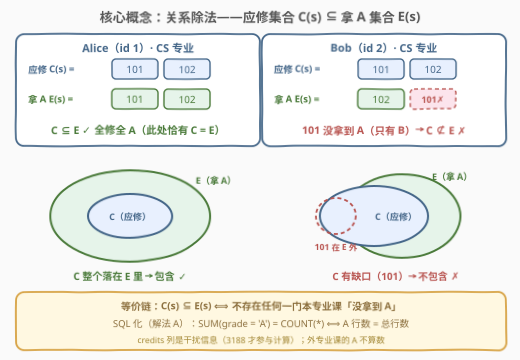
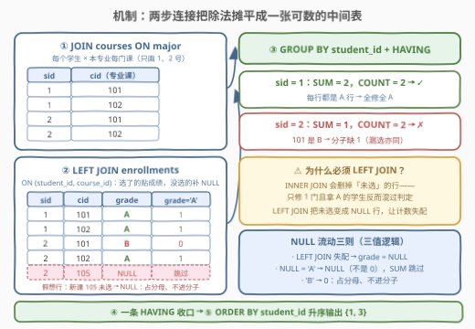
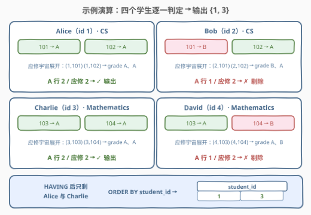

# LeetCode 查找得分最高的学生 题解

## 1. 题目概述

- **标题 / 题号**：查找得分最高的学生（#3182，medium）
- **链接**：https://leetcode.cn/problems/find-top-scoring-students/
- **难度**：中等
- **标签**：数据库、SQL、关系除法、`LEFT JOIN`、`GROUP BY` + `HAVING`、`SUM` 布尔求和、三值逻辑

> ⚠️ 本题为 LeetCode 付费题（Plus 会员专享），题意描述依据官方示例用例与公开镜像资料整理，已与官方中文题面核对。

**表结构**：

```text
表：students
+-------------+----------+
| Column Name | Type     |
+-------------+----------+
| student_id  | int      |
| name        | varchar  |
| major       | varchar  |
+-------------+----------+
student_id 是这张表的主键。
这张表的每一行包含学生 ID、学生姓名和他们的专业。
```

```text
表：courses
+-------------+----------+
| Column Name | Type     |
+-------------+----------+
| course_id   | int      |
| name        | varchar  |
| credits     | int      |
| major       | varchar  |
+-------------+----------+
course_id 是这张表的主键。
这张表的每一行包含课程 ID、课程名、课程学分和所属专业。
```

```text
表：enrollments
+-------------+----------+
| Column Name | Type     |
+-------------+----------+
| student_id  | int      |
| course_id   | int      |
| semester    | varchar  |
| grade       | varchar  |
+-------------+----------+
(student_id, course_id, semester) 是这张表的主键。
这张表的每一行包含学生 ID、课程 ID、学期和获得的等级（成绩）。
```

**目标**：编写解决方案，找到**修读过其 `major` 提供的所有课程**、并在**所有这些课程中都取得等级 A** 的学生。返回结果表以 `student_id` **升序**排序。

**示例 1**：

```text
输入：
students 表：
+------------+------------------+------------------+
| student_id | name             | major            |
+------------+------------------+------------------+
| 1          | Alice            | Computer Science |
| 2          | Bob              | Computer Science |
| 3          | Charlie          | Mathematics      |
| 4          | David            | Mathematics      |
+------------+------------------+------------------+

courses 表：
+-----------+-----------------+---------+------------------+
| course_id | name            | credits | major            |
+-----------+-----------------+---------+------------------+
| 101       | Algorithms      | 3       | Computer Science |
| 102       | Data Structures | 3       | Computer Science |
| 103       | Calculus        | 4       | Mathematics      |
| 104       | Linear Algebra  | 4       | Mathematics      |
+-----------+-----------------+---------+------------------+

enrollments 表：
+------------+-----------+-----------+-------+
| student_id | course_id | semester  | grade |
+------------+-----------+-----------+-------+
| 1          | 101       | Fall 2023 | A     |
| 1          | 102       | Fall 2023 | A     |
| 2          | 101       | Fall 2023 | B     |
| 2          | 102       | Fall 2023 | A     |
| 3          | 103       | Fall 2023 | A     |
| 3          | 104       | Fall 2023 | A     |
| 4          | 103       | Fall 2023 | A     |
| 4          | 104       | Fall 2023 | B     |
+------------+-----------+-----------+-------+

输出：
+------------+
| student_id |
+------------+
| 1          |
| 3          |
+------------+
```

**解释**：

| student_id | 学生 | 专业 | 修读与等级 | 判定 |
|------------|--------|------------------|------------|------|
| 1 | Alice | Computer Science | Algorithms（A）、Data Structures（A）——全修全 A | ✓ 输出 |
| 2 | Bob | Computer Science | Algorithms（**B**）、Data Structures（A）——全修但 101 非 A | ✗ |
| 3 | Charlie | Mathematics | Calculus（A）、Linear Algebra（A）——全修全 A | ✓ 输出 |
| 4 | David | Mathematics | Calculus（A）、Linear Algebra（**B**）——全修但 104 非 A | ✗ |

**约束与注意**（依据建表语句与示例）：

- `enrollments` 的主键是 `(student_id, course_id, semester)`——**同一门课可以在不同学期重复出现**（重修），`(student_id, course_id)` 本身**不**唯一。
- `grade` 为等级字母（示例中出现 `A`、`B`）。
- `courses.credits`（学分）在本题**不参与判定**，是干扰列——续作 [3188](https://leetcode.cn/problems/find-top-scoring-students-ii/) 才把它用起来。
- 输出仅含 `student_id` 一列，按升序排列。

> 💡 本题是 SQL **「关系除法」（Relational Division）** 家族的进阶款：[3051](../3001-3100/3051_寻找数据科学家职位的候选人.md) 的除数是写死的字面量清单，[1045. 买下所有产品的客户](../1001-1100/1045_买下所有产品的客户.md) 的除数是整张产品表，而本题的除数**随每个学生的 `major` 变化**——「参数化的除法」；并且匹配行还带条件：选课记录的 `grade` 必须是 `A`。

## 2. 解题思路

### 2.1 暴力思路：应用层逐学生核对

过程式直觉——把三张表全量拉到应用层，对每个学生做一次集合包含判断：

```text
for s in students:                                            # 逐学生
    need = {c for c in courses if c.major == s.major}         # 应修集合
    got  = {e.course_id for e in enrollments
            if e.student_id == s.student_id
            and e.grade == 'A'}                               # 拿 A 集合
    if need <= got: output(s.student_id)
```

逻辑直白无陷阱，但**三表全量拉取**、集合运算全在应用层——数据库题的考点正是把「集合包含」压进一条 SQL。SQL 侧的对应物是**逐学生逐门课做相关子查询**（即 2.2 的双重 `NOT EXISTS`，同一逻辑的 SQL 直译），正确但表达分散；更紧凑的路线是把除法**摊平成一张可数的中间表**，一次 `GROUP BY` 收口。

### 2.2 核心观察：应修集合 ⊆ 拿 A 集合



把每个学生 $s$ 的两样东西看成集合：

- **应修集合** $C(s) = \{\, c \in \text{courses} : c.\text{major} = s.\text{major} \,\}$——他的专业开设的**全部课程**；
- **拿 A 集合** $E_A(s) = \{\, c : \text{该生在课程 } c \text{ 有一条 grade} = \text{A 的选课记录} \,\}$。

题目条件就是**集合包含**：

$$C(s) \subseteq E_A(s)$$

它有三条等价的判法，分别对应第 3 节的三个解法：

1. **数缺口**：$\lvert C(s) \setminus E_A(s) \rvert = 0$——不存在一门本专业课「没拿到 A」（双重 `NOT EXISTS`，集合包含的逐字翻译）；
2. **数分子分母**：把每个学生按「本专业每门课一行」展开，判 $\text{SUM}(\text{grade} = \text{A}) = \text{COUNT}(*)$——组内**每一行都是 A 行**（LEFT JOIN 计数法，官方题解采用）；
3. **数去重交集**：$\lvert C(s) \cap E_A(s) \rvert = \lvert C(s) \rvert$（`COUNT(DISTINCT)` 与除数计数比较，1045 同款模板）。

> ⚠️ **两个易漏点**：
> ① **「没选」和「选了没拿 A」必须同样出局**——前者在 `enrollments` 里根本没有对应行，连接时若用 INNER JOIN 会被悄悄删掉、查无实据；必须用 LEFT JOIN 把它变成一行 `grade = NULL` 的**占位行**，才能被计数察觉（详见 2.3 与 Q1）。
> ② **非本专业的课不算数**——学生选修了外专业的课且拿了 A，不能放进分子；连接条件里要用 `c.major = s.major` 把应修宇宙限定在本专业（解法 C 里漏掉这个条件，漏选生会拿外专业的 A 混充分子）。

### 2.3 算法流程图



**逻辑执行步骤**（解法 A）：

| 步骤 | 子句 | 作用 | 本题对应 |
|------|------|------|----------|
| ① | `students JOIN courses ON major` | 每个学生 × 本专业每门课 | 展开「应修宇宙」，CS 学生各得 2 行 |
| ② | `LEFT JOIN enrollments ON (student_id, course_id)` | 给每行贴上 `grade` | 选了的贴成绩；没选的补 `NULL` 行 |
| ③ | `GROUP BY student_id` | 按学生归组 | 4 组，每组 2 行 |
| ④ | `HAVING SUM(grade='A') = COUNT(*)` | 分子 = 分母 | A 行数 = 总行数 ⟺ 全修且全 A |
| ⑤ | `ORDER BY student_id` | 升序排序 | `{1, 3}` |

**分子与分母各自数什么**：

- **分母 `COUNT(*)`**（或 `COUNT(c.course_id)`）：组内**全部**行——即「本专业课程数」（重修会放大行数，见 5.1 口径辨析）；
- **分子 `SUM(grade = 'A')`**：MySQL 布尔表达式按行求和——`'A'` 计 $1$、`'B'` 计 $0$、`NULL = 'A'` 得 `NULL` 被 `SUM` **跳过**；
- 两者相等 ⟺ 组内每一行都是 A 行 ⟺ **该修的都修了、且全是 A**。

> 💡 **三值逻辑是本题的隐形考点**：`NULL = 'A'` 的结果不是 `FALSE` 而是 `NULL`（未知），`SUM` 聚合跳过 `NULL`——于是「未选」的行**不进分子但占分母**，天然制造失配。跨库可移植写法：`SUM(CASE WHEN grade = 'A' THEN 1 ELSE 0 END)`。

### 2.4 示例演算



对示例数据逐学生计算（每个学生先按专业展开成 2 行，再逐行判 A）：

| student_id | 应修宇宙展开 | grade 逐行 | A 行数 / 总行数 | 判定 |
|------------|----------------------|-----------|----------------|------|
| 1 | (1,101)、(1,102) | A、A | **2 / 2** | ✓ 输出 |
| 2 | (2,101)、(2,102) | B、A | 1 / 2 | ✗ |
| 3 | (3,103)、(3,104) | A、A | **2 / 2** | ✓ 输出 |
| 4 | (4,103)、(4,104) | A、B | 1 / 2 | ✗ |

输出按 `student_id` 升序 → `{1, 3}`，与示例一致。

> 💡 示例里四个学生**都修满了本专业课程**，失分全在「非 A」上；若某个 CS 学生只修了 101 一门且拿了 A，他的展开表里 102 那行是 `NULL` 行——分子 $1$、分母 $2$，同样出局。**「漏选」与「偏科」在计数法里殊途同归**。

## 3. 参考代码

### SQL（解法 A：JOIN 展开 + LEFT JOIN + 一条 HAVING，官方口径）

```sql
# Write your MySQL query statement below
SELECT s.student_id
FROM students AS s
JOIN courses AS c
  ON c.major = s.major
LEFT JOIN enrollments AS e
  ON e.student_id = s.student_id
 AND e.course_id = c.course_id
GROUP BY s.student_id
HAVING SUM(e.grade = 'A') = COUNT(c.course_id)
ORDER BY s.student_id;
```

> 💡 **写法要点**：
> - **`JOIN courses`（内连接）负责展开**——专业没开课的学生不产生任何行，自然不出现在结果里（空集口径，见 5.1）；
> - **`LEFT JOIN enrollments` 负责保行**——未选的课保留为 `grade = NULL` 的占位行；
> - **`COUNT(c.course_id)`** 在 LEFT JOIN 后恒非 `NULL`，等价于 `COUNT(*)`；官方题解写作 `COUNT(major)`（配合 `USING (major)` 的合并列）同理；
> - 官方紧凑写法（效果相同）：`FROM students JOIN courses USING (major) LEFT JOIN enrollments USING (student_id, course_id) GROUP BY 1 HAVING SUM(grade = 'A') = COUNT(major) ORDER BY 1;`

### SQL（解法 B：双重 NOT EXISTS，关系除法教科书写法）

```sql
# Write your MySQL query statement below
SELECT s.student_id
FROM students AS s
WHERE NOT EXISTS (
    SELECT 1
    FROM courses AS c
    WHERE c.major = s.major
      AND NOT EXISTS (
          SELECT 1
          FROM enrollments AS e
          WHERE e.student_id = s.student_id
            AND e.course_id = c.course_id
            AND e.grade = 'A'
      )
)
ORDER BY s.student_id;
```

> 💡 **写法要点**：外层断言「**不存在**一门本专业课」、内层断言「该生在这门课上**不存在** A 记录」——双重否定恰好是 $C(s) \subseteq E_A(s)$ 的逐字翻译。无需 `GROUP BY`、天然无重复，且遇到第一门失手的课即可**短路**放弃该生。注意它把 `grade = 'A'` 放进**内层存在性判断**，语义是「只要拿过一次 A 就算」——与解法 A 的「每条记录都必须是 A」在重修场景下口径不同（见 5.1）。

### SQL（解法 C：COUNT(DISTINCT) 对除数计数，1045 同款模板）

```sql
# Write your MySQL query statement below
SELECT s.student_id
FROM students AS s
JOIN enrollments AS e
  ON e.student_id = s.student_id
 AND e.grade = 'A'
JOIN courses AS c
  ON c.course_id = e.course_id
 AND c.major = s.major
GROUP BY s.student_id
HAVING COUNT(DISTINCT e.course_id) = (
    SELECT COUNT(*)
    FROM courses AS c2
    WHERE c2.major = s.major
)
ORDER BY s.student_id;
```

> 💡 **写法要点**：分子是「该生拿到 A 的**本专业**课程去重数」（`COUNT(DISTINCT)` 把重修的重复记录合并），分母是相关子查询算出的「本专业课程总数」——这正是 [1045](../1001-1100/1045_买下所有产品的客户.md) 的模板，差别在于除数不再是全局常量，而要**按学生的 `major` 相关计算**。两个连接条件缺一不可：`e.grade = 'A'` 圈定分子资格，`c.major = s.major` 把外专业的 A 课挡在门外（否则分子虚高，漏选生可能混过判定）。`GROUP BY` 主键 `student_id` 之后 `HAVING` 里照常引用 `s.major`——函数依赖于分组键，`ONLY_FULL_GROUP_BY` 模式下也合法。

### Python（pandas）

```python
import pandas as pd

def find_top_scoring_students(
    students: pd.DataFrame, courses: pd.DataFrame, enrollments: pd.DataFrame
) -> pd.DataFrame:
    need = courses.groupby("major")["course_id"].agg(set)
    got = (
        enrollments.loc[enrollments["grade"] == "A"]
        .groupby("student_id")["course_id"]
        .agg(set)
    )
    mask = students.apply(
        lambda r: r["major"] in need.index
        and need[r["major"]] <= got.get(r["student_id"], set()),
        axis=1,
    )
    return (
        students.loc[mask, ["student_id"]]
        .sort_values("student_id")
        .reset_index(drop=True)
    )
```

> 💡 **pandas 对照**：把两张「集合表」分别 `groupby + agg(set)`，再用集合的 `<=`（子集判断）做包含——正是 2.1 伪代码的向量化版本。`r["major"] in need.index` 保证「专业没开课」的学生不出现在结果里，与解法 A 的口径对齐（若想对齐解法 B 的空真口径，去掉它、改用 `need.get(major, set()) <= ...` 即可）。

## 4. 复杂度分析

设 $n$ 为 `students` 行数、$m$ 为 `courses` 行数、$k$ 为 `enrollments` 行数，$R = \sum_{\text{major}} \lvert S_{\text{major}} \rvert \cdot \lvert C_{\text{major}} \rvert$ 为「学生 × 本专业课程」展开后的行数（最坏 $n \cdot m$）。

| 维度 | 解法 A（LEFT JOIN 计数） | 解法 B（双重 NOT EXISTS） | 解法 C（COUNT DISTINCT） |
|------|--------------------------|---------------------------|--------------------------|
| **时间** | $O(R + k)$（哈希连接 + 一次分组） | $O(R)$ 次索引/哈希探测，首个失手**短路** | $O(n + m + k)$ + 每组一次相关计数 |
| **空间** | $O(R + k)$ 中间行（最大头） | $O(1)$ 额外空间，逐对探测 | $O(n + m + k)$ |
| **提前终止** | ✗ 整组算完才判 | ✓ 一门课失手即弃该生 | ✗ |
| **可读性** | ✓ 一条 HAVING 说完全部语义 | ✓ 集合包含的逐字直译 | ✓ 除法模板的直接套用 |

> - 三种解法都依赖**等值连接**，`major`、`(student_id, course_id)` 上的索引（或哈希连接）是性能保障；`grade = 'A'` 是常量比较，每行 $O(1)$。
> - 解法 A 的中间结果 $R$ 在「大专业」场景可能膨胀（一个专业 $1000$ 人 × $100$ 门课 = 每专业 $10^5$ 行）；解法 B 不物化中间表且短路积极，大表下常更稳。
> - LeetCode 判题数据量很小（几十行级），任何解法都瞬时通过；复杂度分析的价值在于说清**中间结果规模**与**短路能力**的取舍。

## 5. 扩展

### 5.1 口径辨析：空专业与重修，三种解法何时分家

`enrollments` 的主键含 `semester`，意味着**允许重修**；`students.major` 也可能指向一个没开任何课的专业。这两个边缘场景下，三个解法**并不等价**：

| 边缘场景 | 解法 A（官方口径） | 解法 B（双 NOT EXISTS） | 解法 C（COUNT DISTINCT） |
|----------|--------------------|-------------------------|--------------------------|
| 学生的专业**没有任何课程**（除数 = $\varnothing$） | ✗ 不输出（INNER JOIN 展开不出行） | ✓ 输出（空集平凡满足，空真） | ✗ 不输出（无分组可聚合） |
| 重修同一门课，一次 A 一次 B | ✗ 不输出（A 行数 $1$ ≠ 行数 $2$） | ✓ 输出（该课**存在** A 记录） | ✓ 输出（DISTINCT 去重后仍计入） |
| 重修同一门课，两次都是 A | ✓ 输出（$2 = 2$） | ✓ 输出 | ✓ 输出 |

本质分歧是两种读法：

- **按记录口径**（解法 A）：本专业课程的**每条**选课记录都必须是 A——重修中的那个 B 会「连坐」；
- **按课程口径**（解法 B/C）：每门课**拿过** A 即可，历史低分不影响。

官方题解采用**按记录口径**（判题数据未见重修与空专业样本，两种口径均可通过）。工程与面试里遇到类似需求，应主动确认口径：「重修的低分算不算污点？专业没开课的学生算不算达标？」——把口径写进注释，比事后对账便宜得多。

### 5.2 关系除法家族：从字面量清单到参数化除数

| 题目 | 除数（必须覆盖的集合） | 匹配条件 | 难度台阶 |
|------|----------------------|----------|----------|
| [3051. 寻找数据科学家职位的候选人](../3001-3100/3051_寻找数据科学家职位的候选人.md) | 写死的字面量清单（Python/Tableau/PostgreSQL） | 无 | 入门：`HAVING COUNT(DISTINCT skill) = 3` |
| [1045. 买下所有产品的客户](../1001-1100/1045_买下所有产品的客户.md) | 整张 `Product` 表（全局固定集合） | 无 | 模板：`COUNT(DISTINCT)` 对常量子查询计数 |
| **本题 3182** | **随 `major` 逐行变化的集合** | 匹配行还须 `grade = 'A'` | 除数参数化 + **带谓词的除法** |
| [3188. 查找得分最高的学生 II 🔒](https://leetcode.cn/problems/find-top-scoring-students-ii/) | 必修课全集 + 至少 2 门选修 | 必修全 A、选修不低于 B、平均 GPA ≥ 2.5 | 除法之上叠加多条件聚合（困难） |

「除数参数化」是本题相对 1045 的本质增量：同一个 `HAVING` 模板不再适用，必须先把「学生 × 本专业课程」的对应关系展开（解法 A）或把除数计数做成相关子查询（解法 C）——这也是它配得上「中等」难度的主要原因。续作 3188 再把 `credits`、`mandatory`、`GPA` 全部启用，升级为困难题，可作为下一步练习。

## 6. 面试要点

**Q1：为什么连接 `enrollments` 必须用 LEFT JOIN，不能用 INNER JOIN？**

> 「没选某门课」在 `enrollments` 里**没有行**——INNER JOIN 会把这条「缺失证据」直接删掉。于是一个只修了 1 门课且拿了 A 的 CS 学生，组里只剩 1 行 A，`SUM = COUNT` 竟然成立，漏选生蒙混过关。LEFT JOIN 把未选的课变成一行 `grade = NULL` 的占位：分母 `COUNT(*)` 照数、分子 `SUM(grade='A')` 不计，失配立刻暴露。**外连接在这里的作用是「把缺失变成可计数的信号」**。

**Q2：`HAVING SUM(grade='A') = COUNT(*)` 两边各数什么？NULL 是怎么流动的？**

> 右边数组内**全部**行（本专业课程 × 选课重数）；左边对布尔表达式求和——`'A'` 计 1、`'B'` 计 0、`NULL = 'A'` 按 SQL 三值逻辑得 `NULL`，被 `SUM` 跳过。相等 ⟺ 每行都是 A 行 ⟺ 该修的都修了且全是 A。跨库移植时把布尔求和换成 `SUM(CASE WHEN grade='A' THEN 1 ELSE 0 END)`；写成 `COUNT(grade = 'A' OR NULL)` 也行（`OR NULL` 把 FALSE 变 NULL 让 `COUNT` 跳过），但可读性不如 CASE。

**Q3：官方题解的 `COUNT(major)` 数的是什么？`USING` 和 `ON` 有什么区别？**

> `JOIN courses USING (major)` 会把两表的 `major` **合并为一列**，且内连接保证它非 `NULL`；随后的 LEFT JOIN `enrollments` 不影响这一列。因此 `COUNT(major)` 恰好等于组内总行数，与 `COUNT(*)` 等价——只是借 `USING` 的合并列给了计数一个语义化的落点。等价写法 `ON c.major = s.major` 则数 `c.course_id` 或直接 `COUNT(*)`。另注意 `USING` 版的 `SELECT *` 只出一列 `major`，而 `ON` 版会出两列。

**Q4：双重 NOT EXISTS 和计数法在语义上什么时候不等价？**

> 两个边角：**空专业**——NOT EXISTS 版按「不存在反例」的空真逻辑输出该生，计数版因 INNER JOIN 展开不出任何行而丢弃；**重修**——NOT EXISTS 版按「该课存在一条 A 记录」判定（按课程口径），计数版要求「每条记录都是 A」（按记录口径）。官方题解走按记录口径，判题数据不含这两类样本。面试正确姿势是先把口径问清，再选模板（详见 5.1 对照表）。

**Q5：本题与 1045 同为关系除法，本质增量在哪？**

> 1045 的除数是**整张产品表**——全局一个常数，`HAVING COUNT(DISTINCT product_key) = (SELECT COUNT(*) FROM Product)` 直接套。本题除数**随学生的 `major` 逐行变化**，且匹配行还须满足 `grade = 'A'`（带谓词的除法）——必须先展开「学生 × 本专业课程」（解法 A）或做相关计数（解法 C）。一句话：**除数从常量升级为参数，除法从一元变成逐元的**。

> 💡 **一句话总结**：**先按专业把每个学生摊成「本专业课程清单」，再用 LEFT JOIN 让未选的课显形为 NULL，一条 `HAVING SUM(grade='A') = COUNT(*)` 同时收掉「漏选」与「偏科」**——这就是关系除法的计数实现；口径（重修 / 空专业）先问清再落笔。

## 同类练习题

| # | 题目 | 与本题的关联 |
|---|------|-------------|
| 1045 | [买下所有产品的客户](https://leetcode.cn/problems/customers-who-bought-all-products/)（[题解](../1001-1100/1045_买下所有产品的客户.md)） | 关系除法的模板题——除数是全局固定的产品表，`COUNT(DISTINCT)` 对常量子查询计数；本题把除数升级为随 `major` 变化的参数 |
| 3051 | [寻找数据科学家职位的候选人](https://leetcode.cn/problems/find-candidates-for-data-scientist-position/)（[题解](../3001-3100/3051_寻找数据科学家职位的候选人.md)） | 除数退化为写死的字面量技能清单，`HAVING COUNT(DISTINCT skill) = 3` 一行收工——关系除法的入门形态 |
| 3188 | [查找得分最高的学生 II 🔒](https://leetcode.cn/problems/find-top-scoring-students-ii/) | 本题续作（困难）——`courses` 增加必修/选修枚举、`enrollments` 增加 GPA 列，条件升级为「修完所有必修 + 至少 2 门选修 + 必修全 A + 选修不低于 B + 平均 GPA ≥ 2.5」，除法之上再叠多条件聚合 |
| 580 | [统计各专业学生人数](https://leetcode.cn/problems/count-student-number-in-departments/)（[题解](../0501-0600/580_统计各专业学生人数.md)） | 同一张 `students` 表按专业维度的连接统计——LEFT JOIN 保住「没有学生的专业」，与本题「没有课程的专业」互为镜像的空组口径问题 |
