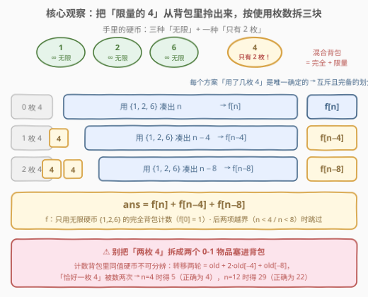
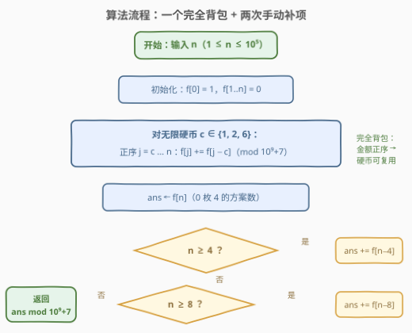
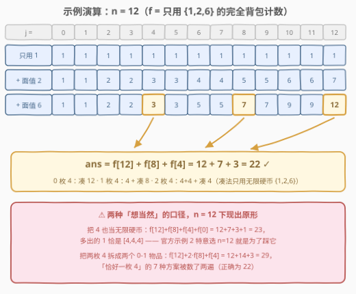

# 达到总和的方法数量

- **题目名称**：达到总和的方法数量
- **链接**：[3183. 达到总和的方法数量](https://leetcode.cn/problems/the-number-of-ways-to-make-the-sum/)
- **难度**：中等
- **标签**：数组、动态规划、背包问题、混合背包

## 1. 题目概述

> ⚠️ 本题为 LeetCode 付费题，题意描述根据官方示例用例与 hints 重建，可能与官方题面有出入。

你手中持有如下硬币：

| 面值 | 数量 |
|------|------|
| $1$ | **无限**枚 |
| $2$ | **无限**枚 |
| $6$ | **无限**枚 |
| $4$ | **只有 $2$ 枚** |

给定整数 $n$，返回用手中硬币凑出总和 $n$ 的**方法数量**。答案可能很大，对 $10^9 + 7$ 取模。

**注意**：硬币顺序不重要——$[2, 4]$ 与 $[4, 2]$ 是同一种方法（组合计数，非排列计数）。

**示例 1**：

```text
输入：n = 4
输出：4
解释：四种组合：[1,1,1,1]、[1,1,2]、[2,2]、[4]。
```

**示例 2**：

```text
输入：n = 12
输出：22
解释：注意 [4,4,4] 不是有效组合——面值 4 的硬币只有 2 枚。
```

**示例 3**：

```text
输入：n = 5
输出：4
解释：四种组合：[1,1,1,1,1]、[1,1,1,2]、[1,2,2]、[1,4]。
```

**约束条件**：

- $1 \le n \le 10^5$

> 💡 **审题关键**：三种「无限」硬币 + 一种「恰好两枚」的限量硬币——**混合背包**（完全背包 + 多重背包）的计数版。真正唯一的考点是**那两枚 4 怎么塞进计数 DP**：塞错了要么多数、要么翻倍数。而「顺序不重要」这句话决定了必须「外层硬币、内层金额」地做组合计数。

---

## 2. 解题思路

### 2.1 暴力思路：数得对，但数得慢 / 数得快，却数得错

**正确的暴力**：按面值枚举使用个数——$k_6 \in [0, \lfloor n/6 \rfloor]$、$k_4 \in [0, 2]$、$k_2 \in [0, \lfloor(n-6k_6-4k_4)/2\rfloor]$，余下由面值 $1$ 补齐（只要余额非负必然补得上，且补法唯一）。三层循环数出所有组合，约 $\frac{n^2}{12} \approx 8 \times 10^8$ 次（$n = 10^5$），超时。但它给出了正解的种子：**按面值分层**。

**想当然的背包**则有两种翻车方式，都栽在那两枚 4 上：

| 口径 | 转移 | $n=4$ | $n=12$ | 病因 |
|------|------|-------|--------|------|
| 正确答案 | — | $4$ | $22$ | — |
| ① 把 4 也当无限硬币 | 四种子完全背包 | $4$（碰巧对） | $23$ | 多算 $[4,4,4]$ 等三枚 4 的组合 |
| ② 两枚 4 拆成两个 0-1 物品 | 倒序转移两轮 | $5$ | $29$ | $\text{old}[x] + 2\,\text{old}[x-4] + \text{old}[x-8]$，「恰好一枚 4」数了两遍 |

> ⚠️ 口径①最阴险：$n=4,8$ 时三枚 4 要凑 $12$ 才会发生，**小样例全部碰巧通过**——官方示例 2 特意选 $n=12$ 就是为了踩它。口径②则是把**最值型多重背包**的「物品拆分」技巧错搬到**计数型**：计数场景里同值硬币不可分辨，「用第一枚 4」和「用第二枚 4」是同一个组合，拆开就重复计数。

### 2.2 核心观察：把「限量的 4」拎出来，按使用枚数拆三块



关键观察一句话：**每个方案「用了几枚 4」是唯一确定的不变量**，按 $k \in \{0, 1, 2\}$ 把方案集切成互斥且完备的三块；而 $k$ 一旦固定，$4$ 的部分就完全确定（贡献 $4k$），剩余金额 $n - 4k$ 的凑法**只由无限硬币 $\{1, 2, 6\}$ 决定**，与 $4$ 毫无关系。

设 $f[m]$ 为「只用 $\{1,2,6\}$ 凑出 $m$」的组合数（完全背包计数），则由**加法原理**分层求和：

$$\text{ans} = f[n] + f[n-4] + f[n-8]$$

（$n < 4$ 时跳过第二项，$n < 8$ 时跳过第三项。）

- **不重**：一个方案里 4 的枚数是唯一确定的，不可能同时属于两块；
- **不漏**：枚数只有 $0,1,2$ 三种取值，三块取并集覆盖全部方案。

这正是官方 hint 的表述——"calculate the dp for our infinite coins and then manually handle the existence of 4"。这也顺便化解了 2.1 的两个坑：4 根本不进背包循环，既不会「当无限」，也不存在「拆物品」。

而 $f$ 本身是教科书级完全背包计数：$f[0] = 1$（空集恰一种凑法），**外层硬币、内层金额正序**：

$$f[j] \mathrel{+}= f[j - c], \qquad c \in \{1, 2, 6\},\ j = c \dots n$$

外层固定硬币处理顺序、内层正序允许同种硬币复用——同一组硬币只有一条「按面值分层」的生成路径，数出来的自然是**组合数**而非排列数。

### 2.3 算法流程



1. 初始化 $f[0] = 1$，$f[1..n] = 0$；
2. 对 $c \in \{1, 2, 6\}$ 逐种做完全背包：金额 $j$ 从 $c$ 到 $n$ **正序**，$f[j] \mathrel{+}= f[j-c]$，随时取模；
3. $\text{ans} \gets f[n]$；若 $n \ge 4$ 再加 $f[n-4]$（一枚 4）；若 $n \ge 8$ 再加 $f[n-8]$（两枚 4）；
4. 返回 $\text{ans} \bmod (10^9+7)$。

### 2.4 示例演算



以 $n = 12$ 为例，观察 $f$ 数组的三次推进：

| 处理硬币 | $f[0..12]$ | 说明 |
|----------|-----------|------|
| 初始 | $1,0,0,\dots,0$ | 只有凑 0 有 $1$ 种（空集） |
| $c=1$ | $1,1,1,1,1,1,1,1,1,1,1,1,1$ | 全用 1，每种金额恰 $1$ 种 |
| $c=2$ | $1,1,2,2,3,3,4,4,5,5,6,6,7$ | $\lfloor j/2 \rfloor + 1$：枚举 2 的个数 |
| $c=6$ | $1,1,2,2,3,3,5,5,7,7,9,9,12$ | $f[j] \mathrel{+}= f[j-6]$：再枚举 6 的个数 |

最后三段求和：

$$\text{ans} = \underbrace{f[12]}_{0\text{ 枚 }4} + \underbrace{f[8]}_{1\text{ 枚 }4,\ 4+\text{凑 }8} + \underbrace{f[4]}_{2\text{ 枚 }4,\ 4+4+\text{凑 }4} = 12 + 7 + 3 = 22 \ ✓$$

对照 2.1 的翻车口径：全无限得 $12+7+3+f[0]=23$（多出 $[4,4,4]$）；拆两个 0-1 物品得 $12+2\times7+3=29$（一枚 4 的 $7$ 种方案数了两遍）。

---

## 3. 参考代码

### C++

```cpp
class Solution {
  public:
    int numberOfWays(int n) {
        const int MOD = 1'000'000'007;
        vector<int> f(n + 1);
        f[0] = 1;                                  // 凑 0：空集，恰 1 种
        for (int c : {1, 2, 6})                    // 三种无限硬币：完全背包
            for (int j = c; j <= n; ++j)           // 金额正序 → 同种硬币可复用
                f[j] = (f[j] + f[j - c]) % MOD;
        int ans = f[n];                            // 0 枚 4
        if (n >= 4) ans = (ans + f[n - 4]) % MOD;  // 1 枚 4
        if (n >= 8) ans = (ans + f[n - 8]) % MOD;  // 2 枚 4
        return ans;
    }
};
```

### Python

```python
class Solution:
    def numberOfWays(self, n: int) -> int:
        MOD = 10**9 + 7
        f = [0] * (n + 1)
        f[0] = 1                                  # 凑 0：空集，恰 1 种
        for c in (1, 2, 6):                       # 三种无限硬币：完全背包
            for j in range(c, n + 1):             # 金额正序 → 同种硬币可复用
                f[j] = (f[j] + f[j - c]) % MOD
        ans = f[n]                                # 0 枚 4
        if n >= 4: ans = (ans + f[n - 4]) % MOD   # 1 枚 4
        if n >= 8: ans = (ans + f[n - 8]) % MOD   # 2 枚 4
        return ans
```

> 💡 两枚 4 根本不进循环——`ans` 的三次累加就是「按枚数划分」的全部代码。若想写成统一形式，也可在完全背包后对限量硬币做一层系数枚举转移 $g[x] = \sum_{i=0}^{2} f[x-4i]$，结果相同（见 5.2 的通用写法）。

---

## 4. 复杂度分析

| 维度 | 复杂度 | 说明 |
|------|--------|------|
| 时间 | $O(n)$ | 三种无限硬币各扫一遍金额（外层常数 $3$，内层转移 $O(1)$），末尾两次补项 $O(1)$ |
| 空间 | $O(n)$ | 一维滚动数组 $f$，「硬币种类」维度已被滚动掉 |

> 💡 对比 2.1 的正确暴力 $O(n^2/12) \approx 8\times10^8$：完全背包正序滚动的本质，是把「枚举某种硬币用了几个」的二重循环压成「$f[j-c]$ 前缀式累加」的一重扫描——这正是无限硬币的标准优化。而限量硬币（4）因为枚举上界只有 $2$，干脆拿到循环外面手动展开，常数更小。

---

## 5. 扩展

### 5.1 不跑 DP：O(1) 公式解

只用 $\{1,2\}$ 凑 $m$：枚举 2 的个数 $0 \dots \lfloor m/2 \rfloor$，共 $\lfloor m/2 \rfloor + 1$ 种。再枚举 6 的个数 $k = 0 \dots K$（$K = \lfloor m/6 \rfloor$），剩余 $m - 6k$；由于 $6k$ 是偶数，$\lfloor (m-6k)/2 \rfloor = \lfloor m/2 \rfloor - 3k$，等差数列直接求和：

$$g(m) = \sum_{k=0}^{K} \Big(\big\lfloor \tfrac{m}{2} \big\rfloor + 1 - 3k\Big) = (K+1)\Big(\big\lfloor \tfrac{m}{2} \big\rfloor + 1\Big) - \frac{3K(K+1)}{2}$$

$$\text{ans} = g(n) + g(n-4) + g(n-8) \qquad (\text{自变量为负时该项为 } 0)$$

验证：$g(12)=12$、$g(8)=7$、$g(4)=3$，三项和 $22$ ✓。$n \le 10^5$ 时 DP 与公式都能过，但公式版**单次查询 $O(1)$**，被海量查询轰炸时优势明显。

### 5.2 通用化：多重背包计数的正确姿势

本题限量硬币只有一种、且枚数恰为 $2$，才能「手动展开」进 `ans`。若限量硬币有若干种、枚数各不相同（如 10 枚、100 枚），标准做法是**逐面值做系数枚举转移**：

$$\text{new}[x] = \sum_{i=0}^{\text{cnt}} \text{old}[x - i \cdot c]$$

对固定步长 $c$ 用前缀和/滑动窗口，每种硬币均摊 $O(n)$——这就是计数版多重背包。[2585. 获得分数的方法数](https://leetcode.cn/problems/number-of-ways-to-earn-points/)（[站内题解](../2501-2600/2585_获得分数的方法数.md)）把 0-1、多重、完全三种背包混在一起计数，正是这套框架的完整版。

> ⚠️ 再次强调：**二进制拆分（把 cnt 枚拆成 1+2+4+… 个「捆绑物品」）只适用于最值型背包**。计数型背包里捆绑物品之间可分辨、同值硬币不可分辨，拆分必然重复计数——本题 2.1 的口径②（$5 \ne 4$、$29 \ne 22$）就是最小反例。

### 5.3 组合还是排列？内外层说了算

- **外层硬币、内层金额**（本题、[518](https://leetcode.cn/problems/coin-change-ii/)）：每种组合按面值分层生成，唯一一条路径 → **组合数**；
- **外层金额、内层硬币**（[377. 组合总和 IV](https://leetcode.cn/problems/combination-sum-iv/)，[站内题解](../0301-0400/377_组合总和IV.md)）：每次转移枚举「末位放哪枚硬币」，不同顺序分开计数 → **排列数**。

本题题面明说「顺序不重要」，必须用前者；面试中先把这两句区别说清，再动手写循环，是最稳的开场。

---

## 6. 面试要点

1. **为什么 $\text{ans} = f[n] + f[n-4] + f[n-8]$ 不重不漏？**

   - 方案中「面值 4 的枚数」是唯一确定的不变量，按 $k \in \{0,1,2\}$ 划分方案集，三块**互斥**（一个方案枚数唯一）且**完备**（枚数只有三种取值）；
   - $k$ 固定后 4 的贡献固定为 $4k$，剩余金额只由无限硬币凑——两层独立，加法原理直接求和。

2. **$f[0] = 1$ 是什么意思？为什么不是 0？**

   - 「凑出 0」有一种方案：什么都不选（空集）——这是计数 DP 的哨兵；
   - 若取 0，则所有 $f[j]$ 沿转移链最终归零，整个 DP 全为 0；$f[0]$ 是整条转移链的唯一「源头」。

3. **完全背包计数为什么金额正序？和 0-1 背包的倒序有什么区别？**

   - 正序时 $f[j-c]$ 已包含「本轮硬币再取一次」的方案，允许同种硬币复用——完全背包；
   - 倒序时 $f[j-c]$ 还是旧值（本轮硬币未用），每种硬币至多取一次——0-1 背包。枚举方向就是「可否复用」的开关。

4. **为什么两枚 4 不能拆成两个 0-1 物品分别转移？**

   - 倒序转移两轮得 $\text{old}[x] + 2\,\text{old}[x-4] + \text{old}[x-8]$：「恰好一枚 4」的每种剩余凑法被数两次（第一枚 / 第二枚），$n=4$ 时 $5 \ne 4$；
   - 计数问题中同值物品不可分辨，最值型多重背包的物品拆分 / 二进制拆分技巧在此**全部失效**，必须按「枚举系数」转移。

5. **如果面值 4 有 10 枚、或限量硬币有若干种，怎么扩展？**

   - 单种限量硬币枚数 $k$：直接 $\text{ans} = \sum_{i=0}^{k} f[n - i \cdot c]$，$O(k)$ 补项；或按 5.2 用滑动窗口逐面值转移，均摊 $O(n)$；
   - 多种限量 + 无限混合：完全硬币正序扫、限量硬币系数枚举 + 前缀和，每种 $O(n)$——2585 是该框架的完整实现。

---

## 7. 同类练习题

- [518. 零钱兑换 II](https://leetcode.cn/problems/coin-change-ii/)（[站内题解](../0501-0600/518_零钱兑换II.md)）：纯完全背包组合计数母题，即本题「无限部分」$f$ 的原型
- [377. 组合总和 IV](https://leetcode.cn/problems/combination-sum-iv/)（[站内题解](../0301-0400/377_组合总和IV.md)）：内外层交换后数出排列数，与本题对照理解「组合 vs 排列」由循环结构决定
- [322. 零钱兑换](https://leetcode.cn/problems/coin-change/)（[站内题解](../0301-0400/322_零钱兑换.md)）：完全背包求最值（min），与计数版互为镜像——最值版可放心做物品拆分，计数版不能
- [2585. 获得分数的方法数](https://leetcode.cn/problems/number-of-ways-to-earn-points/)（[站内题解](../2501-2600/2585_获得分数的方法数.md)）：0-1 / 多重 / 完全三种背包混合计数的完整版，本题「混合背包」标签的完全体
