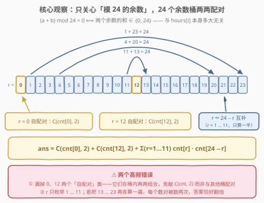
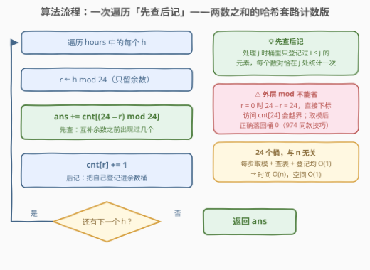
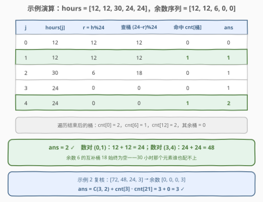

# 构成整天的下标对数目 I

- **题目名称**：构成整天的下标对数目 I
- **链接**：[3184. 构成整天的下标对数目 I](https://leetcode.cn/problems/count-pairs-that-form-a-complete-day-i/)
- **难度**：简单
- **标签**：数组、哈希表、计数

## 1. 题目概述

给你一个整数数组 `hours`，表示以**小时**为单位的时间，返回一个整数，表示满足 `i < j` 且 `hours[i] + hours[j]` 构成**整天**的下标对 `i`, `j` 的数目。

**整天**定义为时间持续时间是 24 小时的**整数倍**。例如，1 天是 24 小时，2 天是 48 小时，3 天是 72 小时，以此类推。

**示例 1**：

```text
输入：hours = [12,12,30,24,24]
输出：2
解释：构成整天的下标对分别是 (0, 1) 和 (3, 4)。
```

**示例 2**：

```text
输入：hours = [72,48,24,3]
输出：3
解释：构成整天的下标对分别是 (0, 1)、(0, 2) 和 (1, 2)。
```

**约束条件**：

- $1 \le \text{hours.length} \le 100$
- $1 \le \text{hours[i]} \le 10^9$

> 💡 **审题关键**：判定「和是不是 24 的倍数」只取决于两个数**模 24 的余数**，与 `hours[i]` 本身是否巨大（可达 $10^9$）无关；而 $n \le 100$ 意味着二重循环暴力就能 AC——这是 LeetCode 惯用的 I/II 双胞胎套路（II 版 [3185](https://leetcode.cn/problems/count-pairs-that-form-a-complete-day-ii/) 把 $n$ 放大到 $10^5$，暴力立刻超时）。本题直接按正解写，一次到位。

---

## 2. 解题思路

### 2.1 暴力思路：二重循环枚举所有数对

$n \le 100$，数对至多 $\binom{100}{2} = 4950$ 个，二重循环逐一判定即可通过：

```cpp
class Solution {
  public:
    int countCompleteDayPairs(vector<int>& hours) {
        int n = hours.size(), ans = 0;
        for (int i = 0; i < n; ++i)
            for (int j = i + 1; j < n; ++j)
                if ((hours[i] + hours[j]) % 24 == 0) ++ans;
        return ans;
    }
};
```

> ⚠️ 顺带一提：$10^9 + 10^9 = 2 \times 10^9$ 仍小于 `int` 上界 $2^{31} - 1 \approx 2.147 \times 10^9$，本题相加**贴边但不溢出**；不过「先各自取模再相加」是更稳的习惯，也是通往正解的第一步。

### 2.2 核心观察：模 24 的余数配对



模运算对加法封闭：$(a + b) \bmod 24 = \big((a \bmod 24) + (b \bmod 24)\big) \bmod 24$。于是每个小时数只需保留余数 $r = \text{hours}[i] \bmod 24$，两个数构成整天当且仅当**余数之和为 0 或 24**：

| 余数 $r$ | 配对对象 | 原因 |
|----------|----------|------|
| $r = 0$ | 余数 $0$（自己这类） | $0 + 0 = 0$ |
| $r = 12$ | 余数 $12$（自己这类） | $12 + 12 = 24$ |
| $r = 1 \dots 11$ | 余数 $24 - r$ | $r + (24 - r) = 24$ |

只需一趟扫描统计 24 个余数桶 $\text{cnt}[0..23]$，再按配对结构求和：

$$\text{ans} = \binom{\text{cnt}[0]}{2} + \binom{\text{cnt}[12]}{2} + \sum_{r=1}^{11} \text{cnt}[r] \times \text{cnt}[24 - r]$$

> ⚠️ 最容易错的两点：**① 余数 0 和 12 是「自配对」类**，贡献的是桶内组合数 $\binom{\text{cnt}}{2}$，漏掉它们是最高频错误；**② $r$ 与 $24-r$ 只能算一次**——$r$ 只枚举 $1 \dots 11$，若把 $13 \dots 23$ 再各算一遍，每个数对被数两次，答案恰好翻倍。

### 2.3 算法流程：一次遍历「先查后记」

组合数公式要分类讨论（自配对 / 互补配对），容易踩上面的坑。「两数之和」的一次遍历哈希技巧可以整体搬过来，把「存在性判定」升级为「计数」——遍历到每个数时，**先查**与它互补的余数之前出现过几个，**再**把自己登记进桶：



1. 初始化 $\text{cnt}[0..23] = 0$，$\text{ans} = 0$；
2. 对每个 $h \in \text{hours}$：计算 $r \gets h \bmod 24$；
3. $\text{ans} \mathrel{+}= \text{cnt}[(24 - r) \bmod 24]$——查互补桶，累加历史出现次数；
4. $\text{cnt}[r] \mathrel{+}= 1$——把自己登记进桶，供后续元素配对；
5. 遍历结束返回 $\text{ans}$。

两个细节：

- **外层取模不能省**：$r = 0$ 时 $24 - r = 24$ 会越界访问 $\text{cnt}[24]$，取模后正确落回桶 $0$（与 [974. 和可被 K 整除的子数组](https://leetcode.cn/problems/subarray-sums-divisible-by-k/)的负余数 $+k$ 修正同款技巧）；
- **$i < j$ 天然保证**：处理 $j$ 时桶里只登记过下标 $< j$ 的元素，「先查后记」使每个数对恰好在 $j$ 处被统计一次，不重不漏。

### 2.4 示例演算



以 `hours = [12,12,30,24,24]` 为例（余数序列 $[12, 12, 6, 0, 0]$）：

| $j$ | $\text{hours}[j]$ | $r$ | 查桶 $(24-r)\%24$ | 命中 | $\text{ans}$ | 登记后桶变化 |
|-----|------------------|-----|------------------|------|--------------|--------------|
| 0 | 12 | 12 | 12 | 0 | 0 | $\text{cnt}[12] = 1$ |
| 1 | 12 | 12 | 12 | **1** | **1** | $\text{cnt}[12] = 2$ |
| 2 | 30 | 6 | 18 | 0 | 1 | $\text{cnt}[6] = 1$ |
| 3 | 24 | 0 | 0 | 0 | 1 | $\text{cnt}[0] = 1$ |
| 4 | 24 | 0 | 0 | **1** | **2** | $\text{cnt}[0] = 2$ |

$j=1$ 时查桶 12，命中 $i=0$ 登记的那个 12 → 数对 $(0,1)$；$j=4$ 时查桶 0，命中 $i=3$ → 数对 $(3,4)$；余数 6 的互补桶 18 全程为空，30 谁也配不上。最终 $\text{ans} = 2$ ✓。

再用公式复核示例 2 `hours = [72,48,24,3]`（余数 $[0, 0, 0, 3]$）：

$$\text{ans} = \binom{3}{2} + \underbrace{\text{cnt}[3] \times \text{cnt}[21]}_{= 0} = 3 + 0 = 3 \ ✓$$

---

## 3. 参考代码

### C++

```cpp
class Solution {
  public:
    int countCompleteDayPairs(vector<int>& hours) {
        long long ans = 0;                 // II 版 n 更大时答案会超 int，直接养成习惯
        int cnt[24] = {};
        for (int h : hours) {
            int r = h % 24;
            ans += cnt[(24 - r) % 24];     // 先查：互补余数之前出现过几个
            ++cnt[r];                      // 后记：把自己登记进桶
        }
        return ans;
    }
};
```

### Python

```python
class Solution:
    def countCompleteDayPairs(self, hours: List[int]) -> int:
        cnt = [0] * 24
        ans = 0
        for h in hours:
            r = h % 24
            ans += cnt[(24 - r) % 24]      # 先查：互补余数之前出现过几个
            cnt[r] += 1                    # 后记：把自己登记进桶
        return ans
```

> 💡 本题 $n \le 100$、答案至多 $4950$，`int` 足够；`long long` 是为 II 版（$n \le 10^5$，数对最多约 $5 \times 10^9$ 个）预留的——同一份代码两题通吃。

---

## 4. 复杂度分析

| 维度 | 复杂度 | 说明 |
|------|--------|------|
| 时间 | $O(n)$ | 每个元素一次取模、一次查表、一次登记，均为 $O(1)$ |
| 空间 | $O(1)$ | 只需 24 个余数桶，与 $n$ 无关 |

> 💡 对比暴力 $O(n^2)$：本题 $n \le 100$ 无感，II 版 $n \le 10^5$ 时差 **3 个数量级**（$10^{10}$ 次运算必超时）——这正是同一题面拆成 I/II 两版的用意：I 版收留暴力，II 版逼出余数配对。

---

## 5. 扩展

### 5.1 两趟公式版：先数桶，再按配对结构求和

如果偏好数学公式，也可以先扫一遍建桶，再套 2.2 的公式：

```cpp
class Solution {
  public:
    int countCompleteDayPairs(vector<int>& hours) {
        int cnt[24] = {};
        for (int h : hours) ++cnt[h % 24];
        long long ans = 1LL * cnt[0] * (cnt[0] - 1) / 2      // 自配对：0
                      + 1LL * cnt[12] * (cnt[12] - 1) / 2;   // 自配对：12
        for (int r = 1; r < 12; ++r)                         // 互补配对，只算一半
            ans += 1LL * cnt[r] * cnt[24 - r];
        return ans;
    }
};
```

公式版把「自配对」和「互补配对」显式分开，逻辑清楚但要处理两处分类；一次遍历版用 $(24 - r) \bmod 24$ 把三种情况统一成一句话，几乎不可能写错——**面试推荐后者**。

### 5.2 一般化：数「和 mod k == c」的对数

把判定换成 $(a + b) \bmod k = c$（本题 $k = 24, c = 0$），一次遍历版只需改一处下标：

$$\text{ans} \mathrel{+}= \text{cnt}\big[(c - r + k) \bmod k\big]$$

[1010. 总持续时间可被 60 整除的歌曲](https://leetcode.cn/problems/pairs-of-songs-with-total-durations-divisible-by-60/)（[站内题解](../1001-1100/1010_总持续时间可被60整除的歌曲对.md)）就是 $k = 60, c = 0$ 的原版老题——本题正是它的换皮。

### 5.3 II 版（3185）：同一份代码直接提交

[3185. 构成整天的下标对数目 II](https://leetcode.cn/problems/count-pairs-that-form-a-complete-day-ii/) 仅把 $n$ 放大到 $10^5$：

- 暴力 $O(n^2) = 10^{10}$ 必超时，余数配对 $O(n)$ 稳过；
- 答案上限 $\binom{10^5}{2} \approx 5 \times 10^9$ 超出 `int`，C++ 必须用 `long long`（参考代码已就位）。

---

## 6. 面试要点

1. **`hours[i]` 高达 $10^9$，为什么不影响做法？**

   - 模运算对加法封闭：$(a + b) \bmod 24$ 只由 $a \bmod 24$ 与 $b \bmod 24$ 决定；
   - 值域再大也只有 24 种余数，问题被压缩到 $\text{cnt}[0..23]$ 的小表上——「值域大先想取模」是数对计数的通用反射。

2. **余数 0 和 12 为什么必须单独处理？**

   - 它们是仅有的两个「自配对」类：$0 + 0 \equiv 0$，$12 + 12 \equiv 24 \pmod{24}$；
   - 公式版中它们的贡献是桶内组合数 $\binom{\text{cnt}}{2}$ 而非两桶乘积；一次遍历版则被 $(24 - r) \bmod 24$ 自动统一，无需特判。

3. **一次遍历版为什么不重不漏地满足 $i < j$？**

   - 「先查后记」：处理 $j$ 时桶里只有下标 $< j$ 的元素，查到的每个都是合法的 $i$；
   - 每个数对恰在较大的下标 $j$ 处被统计一次，既不重复也不遗漏——与 1. 两数之和的一次遍历哈希同构。

4. **$(24 - r) \bmod 24$ 的外层取模能否省掉？**

   - 不能：$r = 0$ 时 $24 - r = 24$，`cnt[24]` 越界（未定义行为）；
   - 这是「下标修正取模」的标准技巧，同款出现在 974 的负余数 $(s \bmod k + k) \bmod k$ 修正里。

5. **直接把本题代码提交 II 版（$n \le 10^5$）会怎样？**

   - 时间上没问题（$O(n)$），但答案最多 $\binom{10^5}{2} \approx 5 \times 10^9$，超出 `int` 上界会溢出；
   - `ans` 用 `long long` 即可两题通吃；Python 无此烦恼，天然大整数。

---

## 7. 同类练习题

- [3185. 构成整天的下标对数目 II](https://leetcode.cn/problems/count-pairs-that-form-a-complete-day-ii/)：同题面放大 $n$，逼出 $O(n)$ 余数配对正解与 `long long`
- [1010. 总持续时间可被 60 整除的歌曲](https://leetcode.cn/problems/pairs-of-songs-with-total-durations-divisible-by-60/)（[站内题解](../1001-1100/1010_总持续时间可被60整除的歌曲对.md)）：本题的 $k = 60$ 原版，经典老题
- [2006. 差的绝对值为 K 的数对数目](https://leetcode.cn/problems/count-number-of-pairs-with-absolute-difference-k/)（[站内题解](../2001-2100/2006_差的绝对值为K的数对数目.md)）：数对计数 + 哈希桶的「值差」版本，同样先查后记
- [1. 两数之和](https://leetcode.cn/problems/two-sum/)（[站内题解](../0001-0100/1_两数之和.md)）：一次遍历哈希「先查后记」的起源，本题是其从判存在到计数的推广
- [974. 和可被 K 整除的子数组](https://leetcode.cn/problems/subarray-sums-divisible-by-k/)（[站内题解](../0901-1000/974_和可被K整除的子数组.md)）：同余配对思想从「数对」迁移到「前缀和子数组」
