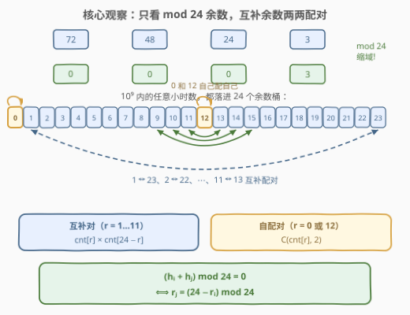
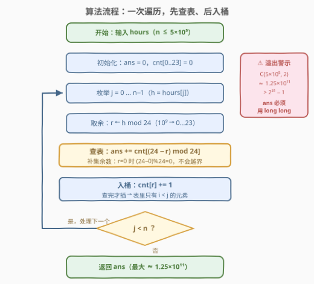

# LeetCode 构成整天的下标对数目 II 题解

## 1. 题目概述

- **标题 / 题号**：构成整天的下标对数目 II（#3185，medium）
- **链接**：https://leetcode.cn/problems/count-pairs-that-form-a-complete-day-ii/
- **难度**：中等
- **标签**：数组、哈希表、计数

**题意**：给你一个整数数组 `hours`，表示以**小时**为单位的时间，返回一个整数，表示满足 $i < j$ 且 $hours[i] + hours[j]$ 构成**整天**的下标对 $i, j$ 的数目。

**整天**定义为时间持续时间是 24 小时的**整数倍**。例如，1 天是 24 小时，2 天是 48 小时，3 天是 72 小时，以此类推。

**示例 1**：

```text
输入：hours = [12,12,30,24,24]
输出：2
解释：构成整天的下标对分别是 (0, 1) 和 (3, 4)。
```

**示例 2**：

```text
输入：hours = [72,48,24,3]
输出：3
解释：构成整天的下标对分别是 (0, 1)、(0, 2) 和 (1, 2)。
```

**约束**：

- $1 \le \text{hours.length} \le 5 \times 10^5$
- $1 \le \text{hours[i]} \le 10^9$

> 💡 **审题关键**：三个数字划定了本题的全部考点——① $n \le 5\times10^5$ 宣判 $O(n^2)$ 暴力死刑；② $hours[i] \le 10^9$ 说明判定必须先**取模缩域**；③ 答案上界 $\binom{5\times10^5}{2} \approx 1.25\times10^{11}$ 远超 `int`，累加器必须 64 位。这三条正是它与 [3184. 构成整天的下标对数目 I](https://leetcode.cn/problems/count-pairs-that-form-a-complete-day-i/)（$n \le 100$，暴力随便过）的全部区别。

## 2. 解题思路

### 2.1 暴力思路：$O(n^2)$ 双循环，数得对但数不完

暴力是显然的：双重循环枚举所有 $i < j$，判定 $(hours[i] + hours[j]) \bmod 24$ 是否为 $0$，统计计数。逻辑完全正确，I 版（$n \le 100$，至多 $4950$ 对）可以直接过。

但 II 版算一笔账：$n = 5\times10^5$ 时要判定 $\binom{n}{2} \approx 1.25\times10^{11}$ 对。即使每次判定只要 1 纳秒，也要跑 **125 秒**——超出时限四个数量级。结论：必须把「每个元素只与**之前**的元素配对统计」压缩成单次线性扫描，即把 $O(n^2)$ 的**配对枚举**换掉，而不是优化它的常数。

> ⚠️ 另一个隐形坑在 C++：`hours[i] + hours[j]` 最大 $2\times10^9$，虽然恰好没超过 `INT_MAX`（$\approx 2.147\times10^9$），但已属擦边飞行。正解里先取模再运算，所有中间量都不超过 23，彻底告别溢出问题。

### 2.2 核心观察：同余缩域 + 余数配对



**第一步：判定只依赖余数。** 由模运算的可加性：

$$(h_i + h_j) \bmod 24 = \big((h_i \bmod 24) + (h_j \bmod 24)\big) \bmod 24$$

所以「和是 24 的倍数」这个判定**只看两个数各自模 24 的余数**，与原始数值无关——$10^9$ 的值域瞬间缩到 $0 \sim 23$ 共 24 个桶。

**第二步：配对结构。** 设 $r_i = h_i \bmod 24$，则

$$r_i + r_j \equiv 0 \pmod{24} \iff r_j = (24 - r_i) \bmod 24$$

即每个余数 $r$ 的「搭档」是**补集余数** $(24-r) \bmod 24$。24 个余数桶由此分成两类：

| 类型 | 余数 | 配对方式 | 贡献 |
|------|------|----------|------|
| **自配对** | $r = 0$、$r = 12$ | 桶内自己配自己 | $\binom{\text{cnt}}{2}$ |
| **互补对** | $r = 1\ldots11$ 配 $24-r$ | 两桶交叉配 | $\text{cnt}[r] \times \text{cnt}[24-r]$ |

> ⚠️ $(24 - r) \bmod 24$ 里的 $\bmod 24$ **不可省略**：当 $r = 0$ 时 $24 - r = 24$，直接当下标会越界（哈希表则会配错到不存在的键）。而 $r = 12$ 的补集恰好还是 $12$，无需任何特判——一个公式统一处理三类情况。

**第三步：边扫边配，把 $i < j$ 编码进时间顺序。** 枚举每个 $j$，在「**已经入桶的历史元素**」里数一数补集余数的出现次数——这些元素的下标天然全部小于 $j$。于是**先查表、后入桶**的顺序直接实现了有序约束：既不会把 $j$ 自己配上（查表时它还不在表里），也不需要最后除以 2 消序（每对只在「右端点时刻」被数一次）。

### 2.3 算法流程



1. 初始化计数数组 `cnt[0..23] = 0`，答案 `ans = 0`（**必须 `long long`**）；
2. 从左到右遍历每个 `h`：取余 `r = h % 24`；
3. **查表**：`ans += cnt[(24 - r) % 24]`——统计此前所有与 `h` 凑成整天的元素个数；
4. **入桶**：`cnt[r] += 1`——把当前元素留给后面的元素配对；
5. 遍历结束，返回 `ans`。

### 2.4 示例演算

![示例演算：hours = [12,12,30,24,24] 逐行推进](../images/p3185_example_walkthrough.svg)

以示例 1 `hours = [12,12,30,24,24]` 逐行推进（命中行高亮）：

| $j$ | $h$ | $r = h \bmod 24$ | 补集 $(24-r)\%24$ | 查表值 | $\text{ans}$ | 入桶 |
|-----|-----|------------------|-------------------|--------|--------------|------|
| 0 | 12 | 12 | 12 | 0 | 0 | `cnt[12]=1` |
| 1 | 12 | 12 | 12 | **1** | **1** | `cnt[12]=2` |
| 2 | 30 | 6 | 18 | 0 | 1 | `cnt[6]=1` |
| 3 | 24 | 0 | 0 | 0 | 1 | `cnt[0]=1` |
| 4 | 24 | 0 | 0 | **1** | **2** | `cnt[0]=2` |

最终 $\text{ans} = 2$ ✓，正好对应 $(0,1)$（$12+12=24$，1 天）和 $(3,4)$（$24+24=48$，2 天）。注意两次命中的都是**自配对**余数——$j=4$ 时 $24 \bmod 24 = 0$，补集也是 $0$，公式无需任何分支。

示例 2 `hours = [72,48,24,3]` 同法：前三个数余数全为 $0$，两两自配对贡献 $\binom{3}{2} = 3$；最后的 $3$ 需要补集 $21$，此前没出现过，贡献 $0$。合计 $3$ ✓。

## 3. 参考代码

### C++

```cpp
class Solution {
  public:
    long long countCompleteDayPairs(vector<int>& hours) {
        long long ans = 0;
        int cnt[24] = {};                        // cnt[r]：已入桶元素中 mod 24 == r 的个数
        for (int h : hours) {
            int r = h % 24;                      // 10⁹ 先缩到 0..23
            ans += cnt[(24 - r) % 24];           // 先查：补集余数的历史出现次数
            ++cnt[r];                            // 后插：保证配到的都是 i < j
        }
        return ans;
    }
};
```

### Python

```python
class Solution:
    def countCompleteDayPairs(self, hours: List[int]) -> int:
        ans = 0
        cnt = [0] * 24                    # cnt[r]：已入桶元素中 mod 24 == r 的个数
        for h in hours:
            r = h % 24                    # 10⁹ 先缩到 0..23
            ans += cnt[(24 - r) % 24]     # 先查：补集余数的历史出现次数
            cnt[r] += 1                   # 后插：保证配到的都是 i < j
        return ans
```

> 💡 两行循环体顺序不可交换：**先查后插**是「$i < j$ 且不与自己配对」的全部保障。若先插后查，$r = 0$ 或 $12$ 时会当场把自己算进答案。另外 `cnt` 用长度 24 的数组而非哈希表——值域缩到 $[0,24)$ 后数组就是最快、最省的哈希表。

## 4. 复杂度分析

| 维度 | 复杂度 | 说明 |
|------|--------|------|
| 时间 | $O(n)$ | 单次线性扫描，每个元素做一次取余、一次查表、一次自增，均为 $O(1)$ |
| 空间 | $O(1)$ | 计数数组固定 24 个桶，与输入规模无关 |

> 💡 对比 2.1 的暴力 $O(n^2)$：优化的本质是**不再枚举配对，而是枚举「右端点」并批量询问左端点统计量**——每次 $O(n)$ 的内层扫描被一次 $O(1)$ 的桶计数取代。这也是所有「数对计数」题（[1010](https://leetcode.cn/problems/pairs-of-songs-with-total-durations-divisible-by-60/)、[2006](https://leetcode.cn/problems/count-number-of-pairs-with-absolute-difference-k/)）的共同压缩手法。

## 5. 扩展

### 5.1 两趟写法：先统计、再用组合数结算

「边扫边查」之外还有一种 equally 经典的写法：先扫一遍统计所有余数计数，再按 2.2 的配对结构分类结算——自配对余数取 $\binom{c}{2}$，互补对取乘积：

```cpp
long long countCompleteDayPairs(vector<int>& hours) {
    long long cnt[24] = {};
    for (int h : hours) ++cnt[h % 24];
    long long ans = cnt[0] * (cnt[0] - 1) / 2       // 余数 0 自配对
                  + cnt[12] * (cnt[12] - 1) / 2;    // 余数 12 自配对
    for (int r = 1; r < 12; ++r)                    // 11 个互补对
        ans += cnt[r] * cnt[24 - r];
    return ans;
}
```

两种写法都是 $O(n) / O(1)$，但细节负担不同：两趟版必须**显式分类讨论**自配对（$\binom{c}{2}$）与互补对（直接相乘，注意 $r$ 只枚举 $1 \sim 11$，否则每对算两遍）；一次遍历版把这些全部融进 `cnt[(24 - r) % 24]` 一个公式，**无分支、无除 2、流式处理**（数据来一个处理一个，天然适配数据流场景）。面试推荐后者，但两趟版能直接展示对配对结构的理解，值得都会。

> ⚠️ 两趟版的溢出更隐蔽：`cnt[r] * cnt[24-r]` 两个 `int` 相乘最大约 $6.25\times10^{10}$，直接溢出——上面代码把 `cnt` 声明为 `long long` 数组规避；若用 `int` 数组则须写成 `(long long)cnt[r] * cnt[24 - r]`。

### 5.2 I / II 成对出题的规律

LeetCode 的 I/II 系列是刻意的复杂度阶梯：I 版给温柔的数据范围让暴力/朴素解能过，II 版放大 $n$ 逼出正解。本题 3184（$n \le 100$）→ 3185（$n \le 5\times10^5$）如此，[3129/3130](https://leetcode.cn/problems/find-all-possible-stable-binary-arrays-ii/)、[3176/3177](https://leetcode.cn/problems/find-the-maximum-length-of-a-good-subsequence-ii/) 亦然。面试启示：**拿到题先看数据范围再选武器**——$n \le 10^2$ 可以 $O(n^3)$，$n \le 10^4$ 想 $O(n^2)$，$n \ge 10^5$ 直奔 $O(n \log n)$ 以内；先在 I 版上验证暴力正确性，再升级到 II 版的正解，是刷题的稳态路径。

## 6. 面试要点

1. **为什么 $(24 - r) \bmod 24$ 的取模不能省？**

   - $r = 0$ 时 $24 - r = 24$，直接当数组下标会越界、当哈希键会配错；
   - 取模后 $0$ 的补集仍是 $0$、$12$ 的补集仍是 $12$，自配对情形被同一公式覆盖，无需 `if` 特判。

2. **「先查表、后入桶」的顺序为什么天然保证 $i < j$？**

   - 查表时表里只有**此前遍历过**的元素，下标必然小于当前 $j$；
   - 若顺序颠倒（先插后查），当前元素会立刻出现在表里，$r = 0$ 或 $12$ 时把自己也配上一对，答案偏大。

3. **答案为什么必须用 64 位整数？上界是多少？**

   - 最坏情形所有元素余数相同（如全是 24 的倍数），答案为 $\binom{5\times10^5}{2} \approx 1.25\times10^{11}$；
   - 远超 `int` 上界 $2^{31}-1 \approx 2.1\times10^9$，C++ 必须用 `long long`（函数签名已约定），Python 天然大整数无此虑。

4. **一次遍历版和两趟组合版各有什么优劣？**

   - 都是 $O(n)/O(1)$；一次遍历版无分支、流式友好，但配对结构隐含在公式里；
   - 两趟版结构显式（自配对 $\binom{c}{2}$ + 互补对相乘），便于向「判定能否全部配对」类变体（如 [1497](https://leetcode.cn/problems/check-if-array-pairs-are-divisible-by-k/)）迁移，但要小心 $r$ 枚举范围和乘法溢出。

5. **如果把 24 换成任意 $k$，或者把「数对」改成「子数组」，解法怎么变？**

   - 换成任意 $k$：桶开 $k$ 个，公式照抄——[1010](https://leetcode.cn/problems/pairs-of-songs-with-total-durations-divisible-by-60/) 就是 $k = 60$ 的原版；
   - 改成「和能被 $k$ 整除的**子数组**」：单点余数不够用，要升级为**前缀和同余**——见 [974. 和可被 K 整除的子数组](https://leetcode.cn/problems/subarray-sums-divisible-by-k/)（[站内题解](../0901-1000/974_和可被K整除的子数组.md)）。

## 同类练习题

| # | 题目 | 与本题的关联 |
|---|------|-------------|
| 3184 | [构成整天的下标对数目 I](https://leetcode.cn/problems/count-pairs-that-form-a-complete-day-i/) | 同题小数据版（$n \le 100$），先用暴力验证、再上正解的最佳沙盒 |
| 1010 | [总持续时间可被 60 整除的歌曲](https://leetcode.cn/problems/pairs-of-songs-with-total-durations-divisible-by-60/)（[站内题解](../1001-1100/1010_总持续时间可被60整除的歌曲对.md)） | 一模一样的套路，模数换成 60 的经典原版 |
| 1497 | [检查数组对是否可以被 k 整除](https://leetcode.cn/problems/check-if-array-pairs-are-divisible-by-k/)（[站内题解](../1401-1500/1497_检查数组对是否可以被k整除.md)） | 同样的余数配对结构，从「计数」变成「能否全部配成对」的判定 |
| 2006 | [差的绝对值为 K 的数对数目](https://leetcode.cn/problems/count-number-of-pairs-with-absolute-difference-k/)（[站内题解](../2001-2100/2006_差的绝对值为K的数对数目.md)） | 哈希计数配对的入门母题，补集从「模意义」退化成「差值」 |
| 974 | [和可被 K 整除的子数组](https://leetcode.cn/problems/subarray-sums-divisible-by-k/)（[站内题解](../0901-1000/974_和可被K整除的子数组.md)） | 同余思想从「数对」升级到「子数组」，前缀和配同余前缀 |
