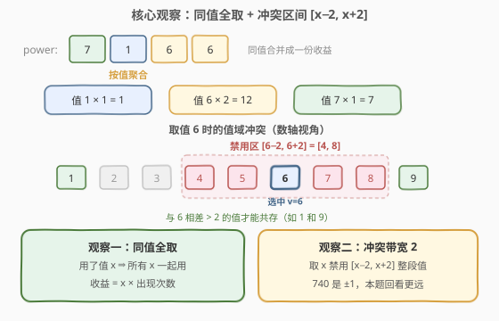
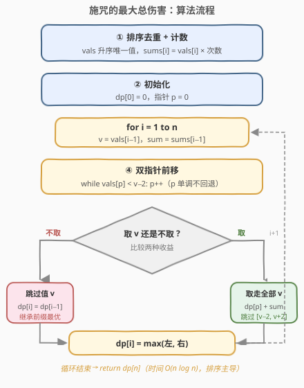
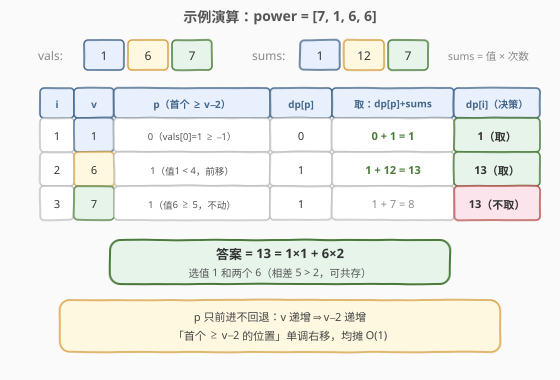

# 施咒的最大总伤害

- **题目名称**：施咒的最大总伤害
- **链接**：[3186. 施咒的最大总伤害](https://leetcode.cn/problems/maximum-total-damage-with-spell-casting/)
- **难度**：中等
- **标签**：数组、哈希表、动态规划、排序、双指针

## 1. 题目概述

一个魔法师有许多不同的咒语。给你一个数组 `power`，其中每个元素表示一个咒语的伤害值，可能会有多个咒语有相同的伤害值。

已知魔法师使用伤害值为 `power[i]` 的咒语时，就不能使用伤害为 `power[i] - 2`、`power[i] - 1`、`power[i] + 1` 或 `power[i] + 2` 的咒语。每个咒语最多只能被使用一次。请返回魔法师可以达到的伤害值之和的最大值。

**示例 1**：

```text
输入：power = [1,1,3,4]
输出：6
解释：可以使用咒语 0、1、3，伤害值分别为 1、1、4，总伤害值为 6。
```

**示例 2**：

```text
输入：power = [7,1,6,6]
输出：13
解释：可以使用咒语 1、2、3，伤害值分别为 1、6、6，总伤害值为 13。
```

**约束条件**：

- `1 <= power.length <= 10^5`
- `1 <= power[i] <= 10^9`

---

## 2. 解题思路

### 2.1 暴力思路

最直接的想法是枚举咒语的所有子集，检查子集内任意两个伤害值之差是否都大于 2，再取合法子集的最大收益。子集数是 $2^n$，$n$ 最大 $10^5$，必然超时。

贪心也不行：比如 `power = [2,2,3]`，若按"先取最大"的贪心选了 3（得 3），就再也用不了 2；而最优解是把两个 2 全拿走（得 4）。**互斥代价是按"值"收的，收益却按"个数"累积**，这种不对称性正是需要动态规划处理决策的信号。

### 2.2 核心观察：同值聚合 + 冲突带宽为 2 的打家劫舍

**观察一：同值要么全用，要么全不用。** 一旦决定使用伤害值为 $x$ 的任意一个咒语，禁用区间 $[x-2, x+2]$ 就已经付出，多用的每一个 $x$ 都是纯赚、没有额外代价。所以选 $x$ 就把所有 $x$ 一起用，收益为 $x \times \mathrm{cnt}(x)$（这也是官方提示 1 的含义）。

**观察二：值域太大，不能像 740 那样建桶。** [740. 删除并获得点数](../0701-0800/740_删除并获得点数.md) 中 `nums[i] <= 10^4`，可以开出值域数组；本题 `power[i] <= 10^9`，桶数组会爆内存。替代方案是**哈希计数 + 排序去重**，只在出现过的唯一值序列 `vals` 上做 DP。

**观察三：兼容的恰好是一个前缀。** 把唯一值升序排列后，取值 $v$ 时禁用的是 $[v-2, v+2]$；由于 `vals` 有序，**所有值小于 $v-2$ 的咒语都与 $v$ 兼容**，且它们恰好构成 `vals` 的一个前缀。设 $p$ 为第一个满足 $\text{vals}[p] \ge v-2$ 的下标，则兼容前缀就是 $\text{vals}[0..p-1]$。



于是状态转移水到渠成。定义 $dp[i]$ 为**只考虑前 $i$ 个唯一值**（即 $\text{vals}[0..i-1]$）能取得的最大伤害：

$$dp[i] = \max\big(dp[i-1],\ dp[p] + \text{sums}[i-1]\big)$$

- **不取**第 $i$ 个值：继承 $dp[i-1]$；
- **取**第 $i$ 个值：基准是兼容前缀的最优 $dp[p]$，再加上该值的总收益 $\text{sums}[i-1] = v \times \mathrm{cnt}(v)$。

> 💡 **这是 740「删除并获得点数」的两次升级**：冲突带从 $\pm 1$ 加宽到 $\pm 2$，值域从稠密（可建桶）变成稀疏（需排序去重）。转移从固定回看 2 格（$dp[i-2]$）泛化为"回看首个 $\ge v-2$ 的位置"，但"相邻互斥、取一跳一"的打家劫舍骨架完全不变。

### 2.3 算法流程图



整体三步走：

1. **聚合**：哈希计数（或排序后游程统计），得到升序唯一值数组 `vals` 和对应收益 `sums`。
2. **初始化**：`dp[0] = 0`，指针 `p = 0`。
3. **递推**：`for i = 1 to n`，令 `v = vals[i-1]`，先双指针前移 `while vals[p] < v - 2: p++`，再转移 `dp[i] = max(dp[i-1], dp[p] + sums[i-1])`，最后返回 `dp[n]`。

> ⚠️ 指针 `p` **只前进不回退**：随着 `i` 增大，`v` 递增，`v - 2` 也递增，"首个 $\ge v-2$ 的位置"只可能右移。整个循环中 `p` 总移动量不超过 $n$，均摊 $O(1)$。也可以不用指针，直接二分 `p = bisect_left(vals, v - 2)`，效果等价。

### 2.4 示例演算

以示例 2 `power = [7,1,6,6]` 为例。聚合后 `vals = [1, 6, 7]`，`sums = [1, 12, 7]`：



| i | v | p（首个 ≥ v−2） | dp[p] | 不取 dp[i−1] | 取 dp[p]+sums | dp[i] |
|---|---|------------------|-------|--------------|----------------|-------|
| 1 | 1 | 0（vals[0]=1 ≥ −1） | 0 | 0 | 0+1=1 | 1（取）|
| 2 | 6 | 1（值 1 < 4，前移） | 1 | 1 | 1+12=13 | 13（取）|
| 3 | 7 | 1（值 6 ≥ 5，不动） | 1 | 13 | 1+7=8 | 13（不取）|

最终 `dp[3] = 13`，即选值 1 和两个 6，与示例一致。注意第 3 行：值 7 与值 6 只差 1，冲突使得基准必须退到 `dp[1]`，"取 7"的收益 8 反而不如已有的 13。

再看示例 1 `power = [1,1,3,4]`，聚合后 `vals = [1, 3, 4]`，`sums = [2, 3, 4]`：

| i | v | p（首个 ≥ v−2） | dp[p] | 不取 dp[i−1] | 取 dp[p]+sums | dp[i] |
|---|---|------------------|-------|--------------|----------------|-------|
| 1 | 1 | 0 | 0 | 0 | 0+2=2 | 2（取）|
| 2 | 3 | 0（值 1 与 3 差 2，冲突） | 0 | 2 | 0+3=3 | 3（取）|
| 3 | 4 | 1（值 1 < 2 前移，值 3 ≥ 2 停） | 2 | 3 | 2+4=6 | 6（取）|

最终 $dp[3] = 6 = 1 \times 2 + 4$：值 1 与 4 相差 3，恰好大于 2，可以共存——这正是"相差恰为 3 时兼容"的边界体现。

---

## 3. 参考代码

### C++

```cpp
class Solution {
  public:
    long long maximumTotalDamage(vector<int>& power) {
        sort(power.begin(), power.end());
        vector<long long> vals, sums;
        for (int i = 0; i < (int)power.size();) {
            int j = i;
            while (j < (int)power.size() && power[j] == power[i]) j++;
            vals.push_back(power[i]);                    // 唯一值（升序）
            sums.push_back(1LL * power[i] * (j - i));    // 该值总收益
            i = j;
        }
        int n = vals.size();
        vector<long long> dp(n + 1, 0);                  // dp[i]: 前 i 个唯一值
        int p = 0;                                       // 首个 vals[p] >= v-2 的位置
        for (int i = 1; i <= n; i++) {
            long long v = vals[i - 1];
            while (vals[p] < v - 2) p++;                 // 值 < v-2 的前缀都与 v 兼容
            dp[i] = max(dp[i - 1], dp[p] + sums[i - 1]);
        }
        return dp[n];
    }
};
```

### Python

```python
from collections import Counter

class Solution:
    def maximumTotalDamage(self, power: List[int]) -> int:
        cnt = Counter(power)
        vals = sorted(cnt)                    # 唯一值升序
        n = len(vals)
        dp = [0] * (n + 1)                    # dp[i]: 前 i 个唯一值的最大伤害
        p = 0                                 # 首个 vals[p] >= v - 2 的位置
        for i in range(1, n + 1):
            v = vals[i - 1]
            while vals[p] < v - 2:            # 与 v 兼容的前缀是 vals[0..p-1]
                p += 1
            dp[i] = max(dp[i - 1], dp[p] + v * cnt[v])
        return dp[n]
```

> 💡 双指针也可以换成二分：`p = bisect_left(vals, v - 2)` 一步定位，整体 $O(n \log n)$ 不变。注意收益 `v * cnt[v]` 最大可达 $10^9 \times 10^5 = 10^{14}$，**必须用 64 位整数**（C++ 用 `long long`，Python 天然大数无碍）。

---

## 4. 复杂度分析

| 维度 | 复杂度 | 说明 |
|------|--------|------|
| 时间复杂度 | $O(n \log n)$ | 排序主导；计数 $O(n)$，DP 循环中指针 `p` 总移动量 $\le n$，均摊 $O(1)$ |
| 空间复杂度 | $O(n)$ | 唯一值数组 `vals`、收益数组 `sums` 与 `dp`，大小均为唯一值个数 |

> ⚠️ 本题值域高达 $10^9$，复杂度与 $\max(\text{power})$ 无关，只取决于元素个数——这是与 740（$O(n + M)$，$M$ 为值域上限）最本质的区别。

---

## 5. 扩展：回看距离至多 3 → 滚动变量压空间

一个漂亮的事实：`vals` 是**互异整数**且有序，区间 $[v-2, v-1]$ 内最多容纳 2 个整数。因此转移时 $p \ge i - 3$，即**只需回看最近 3 个 dp 值**，`dp` 数组可以压成 3 个滚动变量：

```python
class Solution:
    def maximumTotalDamage(self, power: List[int]) -> int:
        cnt = Counter(power)
        vals = sorted(cnt)
        d3 = d2 = d1 = 0                    # dp[i-3], dp[i-2], dp[i-1]
        v2 = v1 = None                      # vals[i-2], vals[i-1]
        for v in vals:
            if v1 is not None and v1 >= v - 2:      # 前一个值落在冲突带内
                base = d3 if (v2 is not None and v2 >= v - 2) else d2
            else:                                   # 前缀全部兼容
                base = d1
            d3, d2, d1 = d2, d1, max(d1, base + v * cnt[v])
            v2, v1 = v1, v
        return d1
```

（由于 `vals` 本身仍需 $O(n)$ 空间，这里省的只是 `dp` 数组，属于锦上添花；但"回看距离 = 冲突带宽 + 1"的推理是面试加分点。）

**一般化**：若禁用区间为 $[x-k, x+k]$，则兼容前缀是"首个 $\ge v-k$ 的位置"，且 $[v-k, v-1]$ 内至多 $k$ 个整数，回看距离至多 $k+1$。740 是 $k=1$，本题是 $k=2$，套路完全一致。

---

## 6. 面试要点

1. **这道题的本质是什么？**
   - [740. 删除并获得点数](../0701-0800/740_删除并获得点数.md) 的升级版打家劫舍：冲突带从 $\pm 1$ 加宽到 $\pm 2$，值域从 $10^4$（可建桶）涨到 $10^9$（必须排序去重 + 双指针/二分定位兼容前缀）。

2. **为什么同值可以放心全取？**
   - 禁用区间 $[x-2, x+2]$ 在使用第一个 $x$ 时就已付出，之后每个 $x$ 都是零代价纯收益，由交换论证，最优解里同值必然"要么全用要么全不用"，收益聚合为 $x \times \mathrm{cnt}(x)$。

3. **与 740 的转移方程差异在哪？**
   - 740 值域稠密、冲突带 $\pm 1$，转移固定回看 $dp[i-2]$；本题值域稀疏，回看位置随 $v$ 变化，需用 `p = 首个 ≥ v-2 的下标`，靠双指针或二分求得。

4. **指针 `p` 为什么均摊 O(1)？**
   - `v` 随 `i` 单调递增 ⇒ `v-2` 单调递增 ⇒ 首个 $\ge v-2$ 的下标单调不减，`p` 在整个循环中最多前进 $n$ 次。

5. **有哪些实现上的坑？**
   - 收益最大 $10^{14}$，C++ 必须 `long long`；`p` 循环天然安全（`vals[i-1] = v ≥ v-2` 保证 `p` 停在 `i-1` 以内，不会越界）；若写 `while vals[p] < v - 2` 注意负数下界（$v=1$ 时 $v-2=-1$，条件自然为假，无碍）。

---

## 7. 同类练习题

- [740. 删除并获得点数](https://leetcode.cn/problems/delete-and-earn/)（[题解](../0701-0800/740_删除并获得点数.md)）：本题的 $k=1$ 版本，冲突带 $\pm 1$、值域小可建桶，先做它再看本题感受两次升级
- [198. 打家劫舍](https://leetcode.cn/problems/house-robber/)（[题解](../0101-0200/198_打家劫舍.md)）："相邻互斥、取一跳一"的母模板
- [2140. 解决智力问题](https://leetcode.cn/problems/solving-questions-with-brainpower/)（[题解](../2101-2200/2140_解决智力问题.md)）：同样是"取一个、向后跳一段"的前缀最优转移，跳的距离由数据决定
- [2560. 打家劫舍 IV](https://leetcode.cn/problems/house-robber-iv/)（[题解](../2501-2600/2560_打家劫舍IV.md)）：打家劫舍 + 二分答案，把"最值"搬进判定条件
- [337. 打家劫舍 III](https://leetcode.cn/problems/house-robber-iii/)（[题解](../0301-0400/337_打家劫舍III.md)）：把相邻互斥约束搬到树上，树形 DP 取/不取两状态
