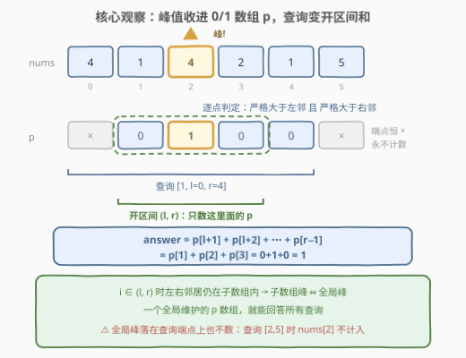
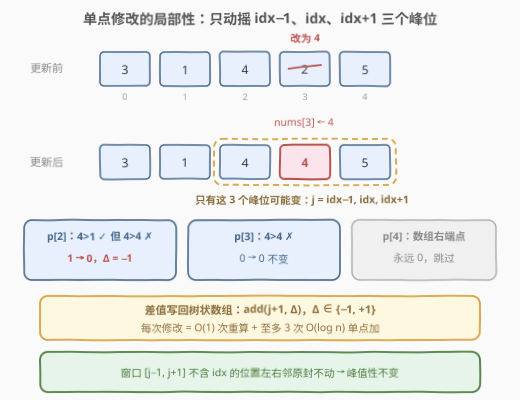

# LeetCode 数组中的峰值 题解

## 1. 题目概述

- **标题 / 题号**：数组中的峰值（#3187，hard）
- **链接**：https://leetcode.cn/problems/peaks-in-array/
- **难度**：困难
- **标签**：树状数组、线段树、数组

**题意**：数组中**大于**前面和后面相邻元素的元素被称为**峰值**元素。给你一个整数数组 `nums` 和一个二维整数数组 `queries`，你需要处理两种操作：

1. `queries[i] = [1, l, r]`：求出子数组 `nums[l..r]` 中**峰值**元素的数目；
2. `queries[i] = [2, index, val]`：将 `nums[index]` 变为 `val`。

请你返回一个数组 `answer`，依次包含每一个第一种操作的答案。

**注意**：子数组中**第一个**和**最后一个**元素都**不是**峰值元素——哪怕它在整个数组内部确实比邻居高。

**示例 1**：

```text
输入：nums = [3,1,4,2,5], queries = [[2,3,4],[1,0,4]]
输出：[0]
解释：先把 nums[3] 变为 4，nums = [3,1,4,4,5]；再查询整个数组——
两个 4 相邻相等，不满足「严格大于两侧」，峰值数为 0。
```

**示例 2**：

```text
输入：nums = [4,1,4,2,1,5], queries = [[2,2,4],[1,0,2],[1,0,4]]
输出：[0,1]
解释：nums[2] 变为 4（原本就是 4，无变化）；查询 [4,1,4] 峰值数 0；
查询 [4,1,4,2,1]：中间的 4 严格大于两侧（1 和 2），是峰，答案 1。
```

**约束**：

- $3 \le \text{nums.length} \le 10^5$
- $1 \le \text{nums[i]} \le 10^5$
- $1 \le \text{queries.length} \le 10^5$
- 查询满足 $0 \le l \le r \le n-1$；修改满足 $0 \le \text{index} \le n-1$，$1 \le \text{val} \le 10^5$

> 💡 **审题三个关键**：① $n, q \le 10^5$ 宣判「每个查询现扫一遍」的 $O(nq) \approx 10^{10}$ 死刑，单次操作必须压到 $O(\log n)$；② **子数组端点不算峰**——查询的实质是数**开区间** $(l, r)$ 内的峰，边界差一位答案就错；③ 「大于」是**严格**大于，相等不算（示例 1 的 $[3,1,4,4,5]$ 正是为此设置的陷阱）。

## 2. 解题思路

### 2.1 暴力思路：每个查询现扫一遍

最直觉的做法：操作 2 直接赋值；操作 1 从 $l+1$ 扫到 $r-1$，逐个判定 `nums[j] > nums[j-1] && nums[j] > nums[j+1]` 计数。单次查询 $O(r-l)$ 最坏 $O(n)$，总计 $O(nq) = 10^{10}$ 量级，必然超时。

「预处理前缀和」也救不了：操作 2 的修改会**反复作废**任何静态统计——上一秒还是峰的位置，下一秒可能就不是了。这正是 [307. 区域和检索 - 数组可变](https://leetcode.cn/problems/range-sum-query-mutable/)（[站内题解](../0301-0400/307_区域和检索 - 数组可变.md)）定下的经典命题：**带修改的区间和**，标准答案是树状数组或线段树。

### 2.2 核心观察：峰值 0/1 化，查询变开区间和



**观察一：峰值是「逐点局部性质」，可以 0/1 化。** 定义指示数组

$$p[i] = \big[\, \text{nums}[i] > \text{nums}[i-1] \ \wedge\ \text{nums}[i] > \text{nums}[i+1] \,\big], \quad 1 \le i \le n-2$$

（$[\cdot]$ 为 Iverson 括号，两端 $p[0] = p[n-1] = 0$。）「数区间里的峰」立刻变成「数区间里有多少个 1」——**计数问题归约为区间和问题**。

**观察二：子数组峰 ⇔ 全局峰（对严格内部位置）。** 查询 $[l, r]$ 时，位置 $i \in (l, r)$ 的左右邻居仍落在 $[l, r]$ 内，判定所用的比较与全局**是同一对元素**；而端点被题面直接排除。所以

$$\text{answer}(l, r) = \sum_{i=l+1}^{r-1} p[i]$$

一个全局维护的 $p$ 数组就能回答**所有**查询，无需按查询区间重新判定——这是本题唯一需要「证明」的一步。

**观察三：单点修改只动摇 3 个峰位。** $p[j]$ 只依赖长度为 3 的窗口 $\text{nums}[j-1..j+1]$。把 $\text{nums}[idx]$ 改成新值，可能变化的只有窗口覆盖 $idx$ 的三个位置 $p[idx-1],\ p[idx],\ p[idx+1]$——$O(1)$ 重算，差值 $\Delta = p_{\text{新}} - p_{\text{旧}}$ 做单点加即可。



**归纳操作集**：至多 3 次单点加（$\pm 1$）+ 一次区间和查询。**和可减、信息可合并**，这正是**树状数组**的甜区——比起 [3161. 物块放置查询](../3101-3200/3161_物块放置查询.md)里「区间加 + 区间 max」必须上懒标记线段树（$\max$ 不可减），本题一个 40 行的 BIT 就够。

### 2.3 算法流程

1. **初始化**：扫一遍 $i \in [1, n-2]$ 计算 $p[i]$，把峰位写入树状数组（$p[i]$ 存 BIT 的 $i+1$ 位，规避开 0 号位）；
2. **查询 $[1, l, r]$**：若 $r - l < 2$（开区间为空）直接答 0；否则返回 $\text{pre}(r) - \text{pre}(l+1)$，即 $i \in [l+1, r-1]$ 的 $p$ 之和；
3. **更新 $[2, idx, val]$**：赋值 $\text{nums}[idx] = val$，对 $j \in \{idx-1,\ idx,\ idx+1\}$ 各做一次 `refresh(j)`——重算 $p[j]$，若变化则向 BIT 单点加差值。

每个操作都是一次或三次 $O(\log n)$ 的 BIT 操作，总计 $O((n+q)\log n)$。

### 2.4 示例演算

![示例演算：[3,1,4,2,5] 上的一次改值与一次查询](../images/p3187_example_walkthrough.svg)

**示例 1**（`nums = [3,1,4,2,5]`）：

| 操作 | 动作 | nums | p[1..3] | BIT 变化 | 输出 |
|------|------|------|---------|----------|------|
| 初始 | 建树 | [3,1,4,2,5] | 0, **1**, 0 | add(3, +1) | — |
| [2,3,4] | nums[3]=4 | [3,1,4,4,5] | 0, **0**, 0 | refresh(2)：4&gt;4 不成立 → add(3, −1)；refresh(3)：不变；refresh(4)：端点跳过 | — |
| [1,0,4] | pre(4)−pre(1) | [3,1,4,4,5] | 0, 0, 0 | — | **0** |

**示例 2**（`nums = [4,1,4,2,1,5]`）：初始 $p[2] = 1$（$4>1$ 且 $4>2$），其余为 0。操作 `[2,2,4]` 赋值后三个 `refresh` 全部无差值；`[1,0,2]`：$r-l=2$，$\text{pre}(2)-\text{pre}(1) = p[1] = 0$；`[1,0,4]`：$\text{pre}(4)-\text{pre}(1) = p[1]+p[2]+p[3] = 1$。输出 `[0, 1]` ✓。

## 3. 参考代码

### C++

```cpp
class Solution {
    int n;
    vector<int> tree;                        // 树状数组：单点加 + 前缀和

    void add(int i, int v) {                 // BIT 位 i 单点加 v
        for (; i <= n; i += i & -i) tree[i] += v;
    }
    int pre(int i) {                         // 前缀和：Σ p[0..i-1]
        int s = 0;
        for (; i > 0; i &= i - 1) s += tree[i];
        return s;
    }

  public:
    vector<int> countOfPeaks(vector<int>& nums, vector<vector<int>>& queries) {
        n = nums.size();
        tree.assign(n + 1, 0);
        vector<int> p(n, 0);                 // p[i]：i 当前是否为峰（端点恒 0）

        auto refresh = [&](int j) {          // 重算 p[j]，差值写入 BIT
            if (j <= 0 || j >= n - 1) return;      // 端点/越界不可能是峰
            int f = nums[j] > nums[j - 1] && nums[j] > nums[j + 1];
            if (f != p[j]) { add(j + 1, f - p[j]); p[j] = f; }
        };

        for (int j = 1; j < n - 1; ++j) refresh(j);   // 初始建树

        vector<int> ans;
        for (auto& q : queries) {
            if (q[0] == 1) {                 // 数开区间 (l, r) 内的峰
                int l = q[1], r = q[2];
                ans.push_back(r - l >= 2 ? pre(r) - pre(l + 1) : 0);
            } else {
                nums[q[1]] = q[2];           // 改值，至多动摇 3 个峰位
                for (int j = q[1] - 1; j <= q[1] + 1; ++j) refresh(j);
            }
        }
        return ans;
    }
};
```

### Python

```python
class Solution:
    def countOfPeaks(self, nums: List[int], queries: List[List[int]]) -> List[int]:
        n = len(nums)
        tree = [0] * (n + 1)

        def add(i: int, v: int) -> None:      # BIT 位 i 单点加 v
            while i <= n:
                tree[i] += v
                i += i & -i

        def pre(i: int) -> int:               # 前缀和：Σ p[0..i-1]
            s = 0
            while i > 0:
                s += tree[i]
                i &= i - 1
            return s

        p = [0] * n                           # p[i]：i 当前是否为峰

        def refresh(j: int) -> None:          # 重算 p[j]，差值写入 BIT
            if 0 < j < n - 1:                 # 端点不可能是峰
                f = nums[j] > nums[j - 1] and nums[j] > nums[j + 1]
                if f != p[j]:
                    add(j + 1, 1 if f else -1)
                    p[j] = 1 if f else 0

        for j in range(1, n - 1):
            refresh(j)                        # 初始建树

        ans = []
        for t, a, b in queries:
            if t == 1:                        # 数开区间 (a, b) 内的峰
                ans.append(pre(b) - pre(a + 1) if b - a >= 2 else 0)
            else:
                nums[a] = b                   # 改值，至多动摇 3 个峰位
                for j in (a - 1, a, a + 1):
                    refresh(j)
        return ans
```

> 💡 三个易错点全藏在下标里：**①** 查询是 $\text{pre}(r) - \text{pre}(l+1)$ 而非 $\text{pre}(r) - \text{pre}(l)$——$p[i]$ 存在 BIT 的 $i+1$ 位，$i \in [l+1, r-1]$ 对应 BIT 位 $[l+2, r]$，查询左端点 $l$ 本身必须被减掉；**②** $r - l < 2$ 时开区间为空，直接答 0，不要让前缀和算出「负数个峰」；**③** `refresh` 的 `0 < j < n-1` 一石二鸟——既挡越界，又挡数组端点（端点在全局都不可能是峰，天然无需维护）。

## 4. 复杂度分析

| 维度 | 复杂度 | 说明 |
|------|--------|------|
| 时间 | $O((n+q)\log n)$ | 建树 $n$ 次 `refresh`；每个查询一次前缀和相减、每次修改至多 3 次 `refresh`，均为 $O(\log n)$ |
| 空间 | $O(n)$ | 树状数组 $n+1$ + 峰值标记数组 $p$，均为 `int` 级别 |
| 对照：暴力 | $O(nq)$ | 单次查询 $O(r-l)$ 最坏 $O(n)$，$10^{10}$ 量级超时 |

> 💡 中间量极小：$p$ 只取 0/1，区间和上界 $n < 10^5$，`int` 绰绰有余——不像 [3185](../3101-3200/3185_构成整天的下标对数目II.md) 那样需要 64 位累加器。

## 5. 扩展：为什么树状数组就够，线段树版怎么写

**树状数组 vs 线段树的分界线**在本题格外清晰。树状数组的全部能力是「前缀性信息」——单点改、前缀查（任意区间和靠前缀相减）。本题的操作恰好只有单点 $\pm 1$ 和区间求和，**和是可减信息**，BIT 全部接得住。对比 [3161. 物块放置查询](../3101-3200/3161_物块放置查询.md)：区间加 + 区间 $\max$，$\max$ 不可减、区间加拆不成前缀差，只能上懒标记线段树。一句话：**先看信息可不可减，再决定上 BIT 还是线段树**。

线段树版本也不难：叶子存 $p[i]$，`push_up` 直接求和，单点赋值 + 区间查询即可，代码量约为 BIT 的两倍且常数更大——面试里若题目就是「单点改 + 区间和」，BIT 是更受欢迎的答案。

**两个值得想的变体**：

- **去掉修改操作**：$p$ 数组静态化，一遍前缀和 $O(1)$ 回答所有查询——[3152. 特殊数组 II](https://leetcode.cn/problems/special-array-ii/)（[站内题解](../3101-3200/3152_特殊数组II.md)）正是这个形态：把「相邻元素奇偶不同」0/1 化后判区间和是否为 0。**修改操作是把前缀和逼成 BIT 的直接原因**。
- **升级为区间加**：若操作 2 变成「一段区间整体加 $v$」，峰值依赖**具体邻值比较**，不再是可加信息——线段树节点需额外维护区间左右端值，在拼缝处重新判定是否拼出新峰，属于经典的「信息融合」型线段树，难度上一个台阶。

## 6. 面试要点

1. **为什么全局的 $p$ 数组能回答任意子数组的峰值查询？**

   - 对 $i \in (l, r)$：$i$ 的左右邻居都落在 $[l, r]$ 内，子数组内的比较与全局比较是**同一对元素**，故「子数组峰 ⇔ 全局峰」；端点又被题面排除，答案恰为 $\sum_{i=l+1}^{r-1} p[i]$。若把端点也计入 $p$ 的查询范围，边界查询会多数。

2. **修改一个位置，为什么要重算恰好 3 个峰位？**

   - $p[j]$ 是窗口 $[j-1, j+1]$ 的函数，窗口覆盖 $idx$ 的 $j$ 只有 $idx-1, idx, idx+1$ 三个；其余位置的窗口元素原封不动，峰值性不可能变。漏掉 $idx \pm 1$ 是最常见的 WA 来源。

3. **查询的下标映射怎么推才不会错？**

   - 先写目标：$i \in [l+1, r-1]$（0-indexed）；再整体 $+1$ 映射到 BIT 位 $[l+2, r]$；最后按「右端保留、左端减一」翻译成前缀和相减 $\text{pre}(r) - \text{pre}(l+1)$。空区间（$r-l<2$）先特判 0。

4. **树状数组在这里为什么比线段树合适？**

   - 操作集是「单点加 + 区间和」：和**可减**，前缀差即可得任意区间和，BIT 的最小能力集恰好覆盖。若查询换成区间 max（如 3161）或更新换成区间加，BIT 的前缀性假设失效，才需要懒标记线段树。

5. **「严格大于」和「端点不算峰」这两个题面细节分别怎么体现？**

   - 严格大于：判定写 `>` 而非 `>=`，示例 1 的 $[3,1,4,4,5]$（相邻相等）答案为 0 即是反例测试；端点不算：`refresh` 用 `0 < j < n-1` 把全局端点挡在维护之外，查询收缩为开区间——即使某个查询端点本身是全局峰（如对示例 2 查询 $[2,5]$ 时的 `nums[2]`）也不计入。

## 同类练习题

| # | 题目 | 与本题的关联 |
|---|------|-------------|
| 307 | [区域和检索 - 数组可变](https://leetcode.cn/problems/range-sum-query-mutable/)（[站内题解](../0301-0400/307_区域和检索 - 数组可变.md)） | 「单点改 + 区间和」的 BIT 母题，本题的数据结构部分就是它 |
| 3152 | [特殊数组 II](https://leetcode.cn/problems/special-array-ii/)（[站内题解](../3101-3200/3152_特殊数组II.md)） | 无修改版——局部性质 0/1 化后退化为静态前缀和，正好对照「修改操作逼出 BIT」的因果 |
| 162 | [寻找峰值](https://leetcode.cn/problems/find-peak-element/)（[站内题解](../0101-0200/162_寻找峰值.md)） | 静态数组上**找一个**峰值的二分经典，峰值概念入门 |
| 1901 | [寻找峰值 II](https://leetcode.cn/problems/find-a-peak-element-ii/) | 峰值推广到二维矩阵的爬坡二分，与本题共享「峰只看邻居」的局部性 |
| 3161 | [物块放置查询](https://leetcode.cn/problems/block-placement-queries/)（[站内题解](../3101-3200/3161_物块放置查询.md)） | 同为 $10^5$ 级动态区间题，体会「和可减用 BIT、max 不可减用线段树」的分界线 |
