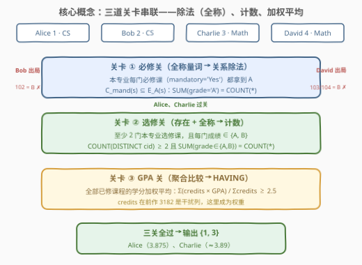
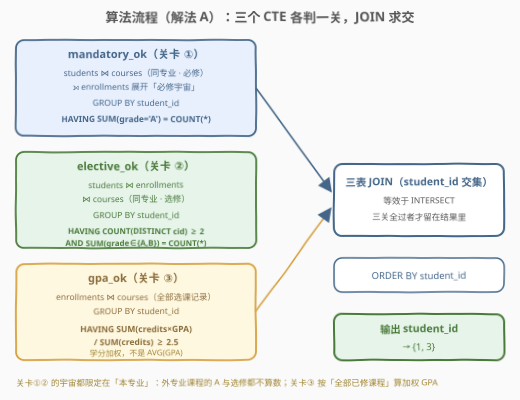
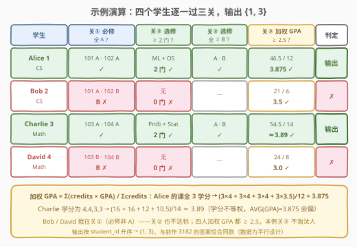

# 查找得分最高的学生 II

- **题目名称**：查找得分最高的学生 II
- **链接**：[3188. 查找得分最高的学生 II 🔒](https://leetcode.cn/problems/find-top-scoring-students-ii/)
- **难度**：困难
- **标签**：数据库、SQL、关系除法、条件聚合、`LEFT JOIN`、`GROUP BY` + `HAVING`、CTE、学分加权平均

## 1. 题目概述

> ⚠️ 本题为 LeetCode 付费题（Plus 会员专享），题意描述根据官方建表语句与示例用例（`mysqlSchemas`）重建，并与前作 [3182 题解](../3101-3200/3182_查找得分最高的学生.md)对本题条件的记载核对；输出列沿用前作（仅 `student_id`），可能与官方题面有出入。

**表结构**：

```text
表：students
+-------------+----------+
| Column Name | Type     |
+-------------+----------+
| student_id  | int      |
| name        | varchar  |
| major       | varchar  |
+-------------+----------+
student_id 是这张表的主键。
这张表的每一行包含学生 ID、学生姓名和他们的专业。
```

```text
表：courses
+-------------+---------------+
| Column Name | Type          |
+-------------+---------------+
| course_id   | int           |
| name        | varchar       |
| credits     | int           |
| major       | varchar       |
| mandatory   | enum('yes','no') |
+-------------+---------------+
course_id 是这张表的主键。
这张表的每一行包含课程 ID、课程名、学分、所属专业，
以及该课是否为该专业的必修课（mandatory = 'Yes'）。
```

```text
表：enrollments
+-------------+-------------+
| Column Name | Type        |
+-------------+-------------+
| student_id  | int         |
| course_id   | int         |
| semester    | varchar     |
| grade       | varchar     |
| GPA         | decimal(3,2)|
+-------------+-------------+
这张表的每一行包含学生 ID、课程 ID、学期、获得的等级（成绩）
和该门课的绩点 GPA（如 A 对应 4.0）。
```

**目标**：编写解决方案，找到**同时满足以下三道关卡**的学生，返回其 `student_id`，按 `student_id` **升序**排序：

1. **必修关**：该学生修读了其专业的**每一门必修课**（`courses.major = students.major` 且 `mandatory = 'Yes'`），且这些必修课的成绩**均为 A**；
2. **选修关**：该学生至少修读了 **2 门本专业选修课**（`mandatory = 'No'`），且已修选修课的成绩**均不低于 B**（即 ∈ {A, B}）；
3. **GPA 关**：该学生**全部已修课程**的**学分加权平均 GPA** 不低于 2.5：

$$\frac{\sum_c \text{credits}_c \times \text{GPA}_c}{\sum_c \text{credits}_c} \ge 2.5$$

**示例 1**：

```text
输入：
students 表：
+------------+------------------+------------------+
| student_id | name             | major            |
+------------+------------------+------------------+
| 1          | Alice            | Computer Science |
| 2          | Bob              | Computer Science |
| 3          | Charlie          | Mathematics      |
| 4          | David            | Mathematics      |
+------------+------------------+------------------+

courses 表：
+-----------+-----------------+---------+------------------+-----------+
| course_id | name            | credits | major            | mandatory |
+-----------+-----------------+---------+------------------+-----------+
| 101       | Algorithms      | 3       | Computer Science | Yes       |
| 102       | Data Structures | 3       | Computer Science | Yes       |
| 103       | Calculus        | 4       | Mathematics      | Yes       |
| 104       | Linear Algebra  | 4       | Mathematics      | Yes       |
| 105       | Machine Learning| 3       | Computer Science | No        |
| 106       | Probability     | 3       | Mathematics      | No        |
| 107       | Operating Systems| 3      | Computer Science | No        |
| 108       | Statistics      | 3       | Mathematics      | No        |
+-----------+-----------------+---------+------------------+-----------+

enrollments 表：
+------------+-----------+-------------+-------+-----+
| student_id | course_id | semester    | grade | GPA |
+------------+-----------+-------------+-------+-----+
| 1          | 101       | Fall 2023   | A     | 4.0 |
| 1          | 102       | Spring 2023 | A     | 4.0 |
| 1          | 105       | Spring 2023 | A     | 4.0 |
| 1          | 107       | Fall 2023   | B     | 3.5 |
| 2          | 101       | Fall 2023   | A     | 4.0 |
| 2          | 102       | Spring 2023 | B     | 3.0 |
| 3          | 103       | Fall 2023   | A     | 4.0 |
| 3          | 104       | Spring 2023 | A     | 4.0 |
| 3          | 106       | Spring 2023 | A     | 4.0 |
| 3          | 108       | Fall 2023   | B     | 3.5 |
| 4          | 103       | Fall 2023   | B     | 3.0 |
| 4          | 104       | Spring 2023 | B     | 3.0 |
+------------+-----------+-------------+-------+-----+

输出：
+------------+
| student_id |
+------------+
| 1          |
| 3          |
+------------+
```

**解释**：

| student_id | 学生 | 专业 | 必修关 | 选修关 | GPA 关（加权） | 判定 |
|------------|--------|------------------|--------|--------|----------------|------|
| 1 | Alice | Computer Science | 101（A）、102（A）——全修全 A ✓ | 105（A）、107（B）——2 门且全 ≥ B ✓ | $46.5/12 = 3.875 \ge 2.5$ ✓ | ✓ 输出 |
| 2 | Bob | Computer Science | 102（**B**）✗ | 无选修，0 门 ✗ | $21/6 = 3.5$ ✓ | ✗ |
| 3 | Charlie | Mathematics | 103（A）、104（A）——全修全 A ✓ | 106（A）、108（B）——2 门且全 ≥ B ✓ | $54.5/14 \approx 3.89 \ge 2.5$ ✓ | ✓ 输出 |
| 4 | David | Mathematics | 103（**B**）、104（**B**）✗ | 无选修，0 门 ✗ | $24/8 = 3.0$ ✓ | ✗ |

**约束与注意**（依据建表语句与示例）：

- `mandatory` 建表为 `ENUM('yes', 'no')`，数据以大写 `'Yes'`/`'No'` 插入——MySQL 的 ENUM 匹配与比较**不区分大小写**，`mandatory = 'Yes'` 与 `mandatory = 'yes'` 均可命中。
- `GPA` 为 `decimal(3,2)`，是**独立列**：示例里同为 B，Alice/Charlie 的选修 B 记 3.5，Bob/David 的必修 B 记 3.0——绩点不能从等级字母反推，必须读列。
- 建表语句**没有给 `enrollments` 声明主键**，同一门课理论上可在不同学期重复出现（重修），口径辨析见 5.1。
- 输出仅含 `student_id` 一列，按升序排列（沿用前作 3182 的输出格式）。

> 💡 本题是 [3182. 查找得分最高的学生](../3101-3200/3182_查找得分最高的学生.md) 的困难续作：前作的除数是「本专业**全部**课程」，本题聚焦到「本专业**必修**课」，再叠加**选修达标**与**加权 GPA** 两道新关卡——前作里当摆设的 `credits` 列，在本题成为加权平均的权重。一题之内集齐 SQL 的三种量词形态：**除法（全称）、计数（存在 + 全称）、聚合比较**。

---

## 2. 解题思路

### 2.1 暴力思路：应用层逐学生过三关

过程式直觉——三张表全量拉到应用层，对每个学生依次判三关：

```text
for s in students:
    mand = {c for c in courses if c.major == s.major and c.mandatory == 'Yes'}
    elec = [e for e in enrollments
            if e.student_id == s.student_id
            and course(e).major == s.major and course(e).mandatory == 'No']
    gpa  = sum(credits(e) * e.GPA for e in enrollments[e.student_id]) \
         / sum(credits(e) for e in enrollments[e.student_id])
    if all(A in grades(mand) for mand)  and  len(distinct(elec)) >= 2
       and all(e.grade in {'A','B'} for e in elec)  and  gpa >= 2.5:
        output(s.student_id)
```

逻辑直白，但三表全量拉取、集合判定全在应用层——数据库题的考点正是把「三关」各自压进 SQL 的标准构件里。关卡① 是带谓词的**关系除法**（承接 3182），关卡② 是**条件计数**，关卡③ 是**聚合比较**——三者都可以落在 `GROUP BY` + `HAVING` 的框架里一次收口。

### 2.2 核心观察：三道关卡 = 三种量词，各有 SQL 对应物



把每个学生 $s$ 的判定拆成三道串联的关卡，每道关卡对应一种逻辑量词，也各有一个 SQL「母版」：

| 关卡 | 逻辑量词 | 数学表达 | SQL 对应物 |
|------|----------|----------|------------|
| ① 必修关 | **全称**（每门必修课都拿到 A） | $C_{\text{mand}}(s) \subseteq E_A(s)$ | 关系除法：LEFT JOIN 计数 / 双重 `NOT EXISTS` |
| ② 选修关 | **存在 + 全称**（≥ 2 门，且每门 ≥ B） | $\lvert E_{\text{elec}}(s)\rvert \ge 2 \,\wedge\, \forall e \in E_{\text{elec}}(s):\ \text{grade}(e) \in \{A, B\}$ | `HAVING COUNT(DISTINCT) ≥ 2` + `SUM(布尔) = COUNT(*)` |
| ③ GPA 关 | **聚合比较** | $\frac{\sum_c \text{credits}_c \cdot \text{GPA}_c}{\sum_c \text{credits}_c} \ge 2.5$ | `HAVING SUM(x) / SUM(y) >= 2.5` |

其中 $C_{\text{mand}}(s)$ 是 $s$ 的专业开设的**必修课全集**，$E_A(s)$ 是他拿到 A 的课程集合，$E_{\text{elec}}(s)$ 是他修读的**本专业选修**记录集合。三关串联即取交集——这正是解法 A 用三个 CTE 分别收口、再 `JOIN` 求交的依据。

> ⚠️ **三个易漏点**：
> ① **关① 的宇宙是「本专业必修」**——既不是全部课程（3182 的口径），也不是全表必修；外专业的必修课与未选修课一样要挡在门外。
> ② **关② 的「≥ 2 门」数的是课程数**——重修同一门选修两次只算一门，用 `COUNT(DISTINCT course_id)` 而非 `COUNT(*)`；而「每门 ≥ B」是对**每条已修记录**的全称判定，两条口径并存于同一关。
> ③ **关③ 是学分加权平均**——$\text{AVG}(\text{GPA})$ 只有在每门课学分相同时才与加权结果一致；Charlie 的学分是 4, 4, 3, 3，`AVG(GPA) = 3.875` 而加权是 $54.5/14 \approx 3.89$，**平均的加权 ≠ 加权的平均**（见 5.2）。

### 2.3 算法流程图



**逻辑执行步骤**（解法 A，CTE 流水线）：

| 步骤 | CTE | 数据流 | 收口条件 |
|------|-----|--------|----------|
| ① | `mandatory_ok` | `students ⋈ courses`（同专业 · 必修）展开「必修宇宙」，`⟕ enrollments` 贴成绩 | `HAVING SUM(grade='A') = COUNT(*)`——A 行数 = 总行数 ⟺ 全修且全 A |
| ② | `elective_ok` | `students ⋈ enrollments ⋈ courses`（同专业 · 选修）收拢选修记录 | `HAVING COUNT(DISTINCT course_id) ≥ 2 AND SUM(grade IN ('A','B')) = COUNT(*)` |
| ③ | `gpa_ok` | `enrollments ⋈ courses`（全部选课记录） | `HAVING SUM(credits * GPA) / SUM(credits) >= 2.5` |
| ④ | 求交 | 三表 `JOIN`（或 `INTERSECT`）取 `student_id` 交集 | 三关全过者才留下 |
| ⑤ | 排序 | `ORDER BY student_id` | 升序输出 |

**关卡① 的分子分母**（与 3182 同款，除数换成必修子集）：

- **分母 `COUNT(*)`**：组内全部行——「本专业必修课数 × 选课重数」，INNER JOIN 展开保证专业没开必修课的学生不产生任何行；
- **分子 `SUM(grade = 'A')`**：MySQL 布尔求和——`'A'` 计 1、`'B'` 计 0、未选课的 `NULL = 'A'` 得 `NULL` 被 `SUM` **跳过**；
- 相等 ⟺ 每行都是 A 行 ⟺ 该修的都修了、且全是 A——「漏选」与「偏科」在计数法里殊途同归。

**关卡② 的两个条件**一个数课程、一个数记录：`COUNT(DISTINCT course_id)` 把重修合并成一门（门数口径），`SUM(grade IN ('A','B')) = COUNT(*)` 要求每条选修记录都不低于 B（记录口径）。

### 2.4 示例演算



对示例数据逐学生过三关（加权 GPA 逐项展开）：

| student_id | 关① 必修 | 关② 选修 | 关③ 加权 GPA | 判定 |
|------------|----------|----------|--------------|------|
| 1 | 101 A、102 A → **2 A / 2 行** ✓ | 105 A、107 B → 2 门 ✓ 全 ≥ B ✓ | $(3{\times}4.0 + 3{\times}4.0 + 3{\times}4.0 + 3{\times}3.5)/12 = 3.875$ ✓ | **✓ 输出** |
| 2 | 101 A、102 B → 1 A / 2 行 ✗ | 0 门 ✗ | $(3{\times}4.0 + 3{\times}3.0)/6 = 3.5$ ✓ | ✗ |
| 3 | 103 A、104 A → **2 A / 2 行** ✓ | 106 A、108 B → 2 门 ✓ 全 ≥ B ✓ | $(4{\times}4.0 + 4{\times}4.0 + 3{\times}4.0 + 3{\times}3.5)/14 \approx 3.89$ ✓ | **✓ 输出** |
| 4 | 103 B、104 B → 0 A / 2 行 ✗ | 0 门 ✗ | $(4{\times}3.0 + 4{\times}3.0)/8 = 3.0$ ✓ | ✗ |

输出按 `student_id` 升序 → `{1, 3}`，与示例一致。

> 💡 示例数据是**平行设计**：Alice 与 Charlie 都「两门必修全 A + 两门选修 A/B」，Bob 与 David 都「必修混入 B、零选修」——四个人的加权 GPA 全部 $\ge 2.5$，本例的关③ 不淘汰任何人，但它防住的是「偏科刷分」型数据（必修全 A 但绩点大面积不及格）。**别因为示例里某关不亮红灯就在实现里省掉那一关**。

---

## 3. 参考代码

### SQL（解法 A：三个 CTE 各判一关，JOIN 求交——分而治之，推荐）

```sql
# Write your MySQL query statement below
WITH
    mandatory_ok AS (
        SELECT s.student_id
        FROM students AS s
        JOIN courses AS c
          ON c.major = s.major AND c.mandatory = 'Yes'
        LEFT JOIN enrollments AS e
               ON e.student_id = s.student_id
              AND e.course_id = c.course_id
        GROUP BY s.student_id
        HAVING SUM(e.grade = 'A') = COUNT(c.course_id)
    ),
    elective_ok AS (
        SELECT s.student_id
        FROM students AS s
        JOIN enrollments AS e
          ON e.student_id = s.student_id
        JOIN courses AS c
          ON c.course_id = e.course_id
         AND c.major = s.major AND c.mandatory = 'No'
        GROUP BY s.student_id
        HAVING COUNT(DISTINCT e.course_id) >= 2
           AND SUM(e.grade IN ('A', 'B')) = COUNT(*)
    ),
    gpa_ok AS (
        SELECT e.student_id
        FROM enrollments AS e
        JOIN courses AS c
          ON c.course_id = e.course_id
        GROUP BY e.student_id
        HAVING SUM(c.credits * e.GPA) / SUM(c.credits) >= 2.5
    )
SELECT s.student_id
FROM students AS s
JOIN mandatory_ok AS m ON m.student_id = s.student_id
JOIN elective_ok  AS x ON x.student_id = s.student_id
JOIN gpa_ok       AS g ON g.student_id = s.student_id
ORDER BY s.student_id;
```

> 💡 **写法要点**：
> - `mandatory_ok` 是 3182 解法 A 的**除数收窄版**——`JOIN courses` 多挂一个 `c.mandatory = 'Yes'`，其余分毫未动；
> - `elective_ok` 用的是**内连接**——选修关只关心「已修的选修」，没修选修的学生自然无行可聚，被 0 门条件天然挡住，无需 LEFT JOIN 占位；
> - `gpa_ok` 按**全部选课记录**聚合（不筛专业），学分作权重；无任何选课的学生不产生分组，等价于「GPA 不达标」；
> - 三个 CTE 只在 `student_id` 上求交，MySQL 8.0.31+ 可直接写 `SELECT student_id FROM mandatory_ok INTERSECT SELECT ... INTERSECT SELECT ...`（见 5.2）。

### SQL（解法 B：单查询 LEFT JOIN 展开 + 一条 HAVING 收口，3182 解法 A 直系传承）

```sql
# Write your MySQL query statement below
SELECT s.student_id
FROM students AS s
JOIN courses AS c
  ON c.major = s.major
LEFT JOIN enrollments AS e
       ON e.student_id = s.student_id
      AND e.course_id = c.course_id
LEFT JOIN (
        SELECT e.student_id,
               SUM(c.credits * e.GPA) / SUM(c.credits) AS weighted_gpa
        FROM enrollments AS e
        JOIN courses AS c ON c.course_id = e.course_id
        GROUP BY e.student_id
     ) AS g ON g.student_id = s.student_id
GROUP BY s.student_id
HAVING SUM(c.mandatory = 'Yes' AND e.grade = 'A') = SUM(c.mandatory = 'Yes')
   AND COUNT(DISTINCT CASE WHEN c.mandatory = 'No' AND e.grade IN ('A', 'B')
                           THEN c.course_id END) >= 2
   AND SUM(c.mandatory = 'No' AND e.grade NOT IN ('A', 'B')) = 0
   AND COALESCE(MAX(g.weighted_gpa), 0) >= 2.5
ORDER BY s.student_id;
```

> 💡 **写法要点**：
> - 主干是 3182 的「学生 × 本专业课程」展开（此处**不筛** mandatory，展开整个本专业宇宙），条件全部塞进一条 `HAVING` 的**条件聚合**：必修 A 行数 = 必修行数、合格选修课程数 $\ge 2$、坏选修行数 = 0；
> - `SUM(c.mandatory = 'No' AND e.grade NOT IN ('A', 'B')) = 0` 里 NULL 的流动：未选的选修行 `TRUE AND NULL → NULL` 被 `SUM` 跳过，必修行恒为 0，只有「已修且低于 B」计 1——**反例计数为零**即全称成立，比正面写 `SUM(...) = COUNT(...)` 少一个条件；
> - 加权 GPA 来自 LEFT JOIN 的派生表 `g`：主查询的展开宇宙只覆盖本专业课程，而 GPA 要按全部选课算，两者口径不同，必须单独聚合再贴回来；`MAX(g.weighted_gpa)` 包一层既满足 `ONLY_FULL_GROUP_BY`（每组的 g 值本就唯一），又用 `COALESCE` 把「零选课」的学生按 0 分挡在关③ 外；
> - 选修门数用 `COUNT(DISTINCT CASE ... THEN c.course_id END)`——CASE 不命中产出 `NULL`，`COUNT` 天然跳过，重修不重复计数。

### SQL（解法 C：双重 NOT EXISTS + 标量子查询，除法的逐字翻译）

```sql
# Write your MySQL query statement below
SELECT s.student_id
FROM students AS s
WHERE NOT EXISTS (
          SELECT 1
          FROM courses AS c
          WHERE c.major = s.major AND c.mandatory = 'Yes'
            AND NOT EXISTS (
                SELECT 1
                FROM enrollments AS e
                WHERE e.student_id = s.student_id
                  AND e.course_id = c.course_id
                  AND e.grade = 'A'
            )
      )
  AND (SELECT COUNT(DISTINCT e.course_id)
       FROM enrollments AS e
       JOIN courses AS c
         ON c.course_id = e.course_id
        AND c.major = s.major AND c.mandatory = 'No'
       WHERE e.student_id = s.student_id) >= 2
  AND NOT EXISTS (
          SELECT 1
          FROM enrollments AS e
          JOIN courses AS c
            ON c.course_id = e.course_id
           AND c.major = s.major AND c.mandatory = 'No'
          WHERE e.student_id = s.student_id
            AND e.grade NOT IN ('A', 'B')
      )
  AND (SELECT SUM(c.credits * e.GPA) / SUM(c.credits)
       FROM enrollments AS e
       JOIN courses AS c
         ON c.course_id = e.course_id
       WHERE e.student_id = s.student_id) >= 2.5
ORDER BY s.student_id;
```

> 💡 **写法要点**：
> - 关① 的双重否定是 $C_{\text{mand}}(s) \subseteq E_A(s)$ 的逐字翻译：「不存在一门本专业必修课，该生在这门课上不存在 A 记录」；遇第一门失手的课即**短路**弃该生；
> - 关② 拆成一个存在性计数（≥ 2 门）加一个反例不存在（无低于 B 的选修记录）——**全称条件写成 NOT EXISTS 反例**，语义「有 A 记录就算过」与解法 A/B 的「每条记录都得合格」在重修场景下口径不同（见 5.1）；
> - 关④ 是标量子查询：零选课时 `SUM` 为 `NULL`，`NULL >= 2.5` 按 SQL 三值逻辑不成立，该生自动出局，无需显式判空。

### Python（pandas）

```python
import pandas as pd


def find_top_scoring_students_ii(
    students: pd.DataFrame, courses: pd.DataFrame, enrollments: pd.DataFrame
) -> pd.DataFrame:
    sid = students["student_id"]
    e = enrollments.merge(courses, on="course_id").merge(
        students[["student_id", "major"]].rename(columns={"major": "s_major"}),
        on="student_id",
    )
    in_major = e["major"] == e["s_major"]

    mand_need = (
        courses.loc[courses["mandatory"] == "Yes"]
        .groupby("major")["course_id"].agg(set)
    )
    mand_got = (
        e.loc[in_major & (e["mandatory"] == "Yes") & (e["grade"] == "A")]
        .groupby("student_id")["course_id"].agg(set)
    )
    cond1 = students.apply(
        lambda r: mand_need.get(r["major"], set())
        <= mand_got.get(r["student_id"], set()),
        axis=1,
    )

    elec = e.loc[in_major & (e["mandatory"] == "No")]
    elec_cnt = elec.groupby("student_id")["course_id"].nunique().reindex(sid).fillna(0)
    bad_elec = elec.loc[~elec["grade"].isin(["A", "B"]), "student_id"].unique()
    cond2 = elec_cnt.values >= 2
    cond3 = ~sid.isin(bad_elec)

    tot = e.assign(wg=e["credits"] * e["GPA"]).groupby("student_id")[["wg", "credits"]].sum()
    w = (tot["wg"] / tot["credits"]).reindex(sid).fillna(0)
    cond4 = w.values >= 2.5

    return (
        students.loc[cond1 & cond2 & cond3 & cond4, ["student_id"]]
        .sort_values("student_id")
        .reset_index(drop=True)
    )
```

> 💡 **pandas 对照**：
> - 关① 沿用 3182 的集合包含：`mand_need`（按专业聚合的必修课集合）$\subseteq$ `mand_got`（该生拿 A 的课程集合），集合的 `<=` 就是子集判定；`mand_need.get(major, set())` 让「专业没开必修课」按空集平凡通过（课程口径，见 5.1）；
> - 关② 的「每门 ≥ B」反向写更顺：先圈出有坏选修记录的学生集合 `bad_elec`，再用 `~sid.isin(bad_elec)` 判「不在坏名单里」——正是解法 C 反例计数为零的向量化版本；
> - 关③ 用 `assign` 造出 `credits × GPA` 临时列再 `groupby.sum()`——**先乘后汇总**，一次除法收尾，避免逐组 `apply`。

---

## 4. 复杂度分析

设 $n$ 为 `students` 行数、$m$ 为 `courses` 行数、$k$ 为 `enrollments` 行数；$R_{\text{all}} = \sum_{\text{major}} \lvert S_{\text{major}} \rvert \cdot \lvert C_{\text{major}} \rvert$ 为「学生 × 本专业课程」展开行数（最坏 $n \cdot m$），$R_{\text{mand}}$ 为其中必修部分。

| 维度 | 解法 A（CTE 交集） | 解法 B（单 HAVING） | 解法 C（NOT EXISTS） |
|------|--------------------|---------------------|----------------------|
| **时间** | $O(R_{\text{mand}} + k)$：必修展开 + 两趟选修/GPA 聚合 | $O(R_{\text{all}} + k)$：全课程展开 + 派生表聚合 | $O(R_{\text{mand}})$ 次探测 + 每生 $O(k)$ 标量子查询（无索引时最坏 $O(n \cdot k)$） |
| **空间** | $O(R_{\text{mand}} + k)$ 中间行 | $O(R_{\text{all}} + k)$ 中间行（展开宇宙最大） | $O(1)$ 额外空间，逐生探测不物化 |
| **提前终止** | ✗ 每关整组算完才判 | ✗ 同左 | ✓ 首门必修失手即弃该生 |
| **可读性** | ✓ 三关各自独立、可单独测试 | ✓ 一条 HAVING 说完全部语义 | ✓ 除法逐字直译，条件堆叠较长 |

> - 三个解法都依赖**等值连接**：`major`、`(student_id, course_id)`、`course_id` 上的索引（或哈希连接）是性能保障；布尔聚合与常量比较每行 $O(1)$。
> - 解法 B 的展开宇宙含全部本专业课程（必修 + 选修），比解法 A 的必修展开大；解法 C 不物化中间表且短路积极，大表下常更稳——与 3182 的取舍完全同构，只是本题又叠了两关，CTE 的「分而治之」在可维护性上的优势更明显。
> - LeetCode 判题数据量很小（几十行级），任何解法都瞬时通过；复杂度分析的价值在于说清**中间结果规模**与**短路能力**的取舍。

---

## 5. 扩展

### 5.1 口径辨析：重修与空必修，三解法何时分家

`enrollments` 建表未声明主键（重修可能）；`students.major` 也可能指向一个没开任何**必修**课的专业。这两个边缘场景下，三个解法**两两错位、并不等价**（以下结论均经本地引擎实测）：

| 边缘场景 | 解法 A（CTE 交集） | 解法 B（单 HAVING） | 解法 C（NOT EXISTS） |
|----------|--------------------|---------------------|----------------------|
| 重修必修课，一次 A 一次 B | ✗ 不输出（记录口径：那个 B「连坐」） | ✗ 不输出（同为记录口径） | ✓ 输出（课程口径：该课**存在** A 记录即过） |
| 学生的专业**没有必修课**（除数 = $\varnothing$） | ✗ 不输出（INNER JOIN 展开不出行） | ✓ 输出（`SUM(FALSE) = SUM(FALSE)`，$0 = 0$ 空过） | ✓ 输出（NOT EXISTS 空真） |
| 跨专业修了外专业选修（含低分） | 不进关①② 的宇宙（外专业课不算数），只拉低关③ 的加权 GPA | 同左 | 同左 |

本质分歧是两个维度的口径组合：

- **按记录 vs 按课程**：关① 的「必修全 A」，解法 A/B 要求本专业必修课的**每条**记录都是 A（重修中的 B 会连坐），解法 C 只要求每门必修**存在**一条 A 记录；
- **空除数的真假**：专业没有必修课时，「所有必修课都拿了 A」是空真——解法 C 按空真逻辑放行，解法 A 因 INNER JOIN 无行可聚而丢弃；解法 B 的 `SUM = SUM` 恰好落在了 $0 = 0$ 的空过一侧。

判题数据未含重修与空必修样本，三种口径均可通过示例。工程与面试里遇到类似需求，应主动确认：「重修的低分算不算污点？专业没开必修课的学生算不算达标？」——把口径写进注释，比事后对账便宜得多（对照 [3182 题解](../3101-3200/3182_查找得分最高的学生.md) 5.1 的同款辨析）。

### 5.2 比率聚合陷阱：AVG(GPA) ≠ 学分加权平均

关③ 的「平均学分绩点」按定义是**学分加权**：$\sum(\text{credits} \times \text{GPA}) / \sum \text{credits}$。常见的两种错写：

- `AVG(GPA)`：等权平均，只在**每门课学分相同**时碰巧等于加权值。示例里 Alice 四门课全 3 学分，两者同为 3.875；Charlie 学分为 4, 4, 3, 3，`AVG(GPA) = (4.0+4.0+4.0+3.5)/4 = 3.875`，而加权为 $54.5/14 \approx 3.89$——**学分不等权时两者必然分家**。本例两组值都远超 2.5 所以都能过示例，但阈值卡得紧的隐藏数据会把等权写法打穿。
- `AVG(credits * GPA)`：分子对了、分母错成「学分平方和」——加权平均的分母是 $\sum \text{credits}$，不是学分的平均。

这是 SQL 里「**比率的平均 ≠ 平均的比率**」家族的标准陷阱（[1211](https://leetcode.cn/problems/queries-quality-and-percentage/) 的 rating 平均是同一主题的近亲）：跨行聚合比率，必须**分子分母分别聚合、最后相除**。

另一个可选语法：解法 A 的三表 JOIN 求交，在 MySQL 8.0.31+ 可写成三条 `SELECT` 的 `INTERSECT`——语义更直白（三关取交集），但版本门槛更高；`JOIN` 版本在 8.0 全系可用，等价且可控。

---

## 6. 面试要点

**Q1：本题的关卡① 与前作 3182 的关系除法有何不同？**

> 三处升级：① 除数从「本专业**全部**课程」收窄为「本专业**必修**课」——`JOIN courses` 的连接条件多挂一个 `mandatory = 'Yes'`，除法模板本身分毫未动；② 除法只是**三关之一**，通过后还要过选修关与 GPA 关（串联 = 交集）；③ 判定通过的语义从「输出」变成「进入下一关」。一句话：**除数参数化再收窄，除法从单关变成流水线的第一站**。

**Q2：为什么推荐把三关拆成三个 CTE，而不是挤进一条 HAVING？**

> 三个理由：**可读**——每个 CTE 名字即语义（`mandatory_ok` / `elective_ok` / `gpa_ok`），评审一眼看懂；**可测**——每个 CTE 可单独 `SELECT` 出来对答案，定位口径问题不用解剖一整条 HAVING；**口径解耦**——三关的数据流本就不同（必修要展开保行、选修只要内连接、GPA 按全部选课聚合），拆开各自选对连接类型，比在一条查询里互相迁就更稳。解法 B 证明单条 HAVING 也写得对，但条件聚合一旦超过三四个，维护成本肉眼可见地上升——CTE 就是 SQL 里的「函数拆分」。

**Q3：关③ 为什么是 `SUM(credits * GPA) / SUM(credits)` 而不是 `AVG(GPA)`？**

> 因为「平均学分绩点」的定义就是**学分加权**：一门 4 学分的课对绩点的贡献应是 3 学分课的 $4/3$ 倍。`AVG(GPA)` 隐含「等权」假设，只在所有课学分相同时成立——示例里 Charlie 学分为 4, 4, 3, 3，等权平均 3.875、加权 $54.5/14 \approx 3.89$。这类「比率的聚合」必须分子分母**分别聚合再相除**，任何先算行内比率再取平均的写法（`AVG(GPA)`、`AVG(credits*GPA)`）都是口径错误，只是示例数据碰巧掩盖了差异。

**Q4：解法 B 的 `SUM(c.mandatory = 'No' AND e.grade NOT IN ('A','B')) = 0` 里，NULL 是怎么流动的？**

> 三类行的贡献：未选修的行——`c.mandatory='No'` 为真而 `e.grade` 为 `NULL`，`TRUE AND NULL` 得 `NULL`，被 `SUM` **跳过**；必修行——第一个条件为 `FALSE`，整式为 `FALSE`（0）；已修且低于 B 的选修——`TRUE AND TRUE` 得 1。于是求和恰为「坏选修记录数」，`= 0` 即「无反例」，全称条件成立。注意若某组**所有行**都贡献 `NULL`（专业只有选修且全没修），`SUM` 返回 `NULL`，`NULL = 0` 不成立——好在这类学生必然过不了「≥ 2 门选修」的一关。跨库可移植写法：`SUM(CASE WHEN ... THEN 1 ELSE 0 END)`。

**Q5：重修与「专业没有必修课」时，三个解法的结论为何不同？怎么选？**

> 两个口径维度交错：**记录口径 vs 课程口径**（解法 A/B 要求每条记录合格，B 会连坐；解法 C 只要存在合格记录）与**空除数放行 vs 拦截**（解法 C 空真放行、B 的 $0=0$ 空过、A 因 INNER JOIN 无行而拦截）。判题数据不含这两类样本，所以都能 AC；工程里应先和需求方对齐口径——「重修的低分算不算污点？没开必修课的专业算不算达标？」——再把口径固化成注释与测试用例。默认建议对齐前作官方的记录口径（解法 A/B），因为它对「偏科」与「重修刷分」都更严格。

> 💡 **一句话总结**：**必修关套 3182 的除法模板（除数收窄到本专业必修），选修关用「DISTINCT 计数 ≥ 2 + 坏记录数 = 0」，GPA 关用「分子分母分别聚合再相除」的学分加权**——三关各有一个 SQL 母版，CTE 拆开各自收口，JOIN 求交就是答案。

---

## 7. 同类练习题

- [3182. 查找得分最高的学生](https://leetcode.cn/problems/find-top-scoring-students/)（[题解](../3101-3200/3182_查找得分最高的学生.md)）：本题前作——除数是「本专业全部课程」的带谓词关系除法，无选修与 GPA 关卡，`credits` 还是干扰列；本题把除数收窄到必修并启用学分加权
- [1045. 买下所有产品的客户](https://leetcode.cn/problems/customers-who-bought-all-products/)（[题解](../1001-1100/1045_买下所有产品的客户.md)）：关系除法的模板题——除数是全局固定的产品表，`COUNT(DISTINCT)` 对常量子查询计数；本题把除数升级为随 `major` 变化且限定必修的参数
- [3051. 寻找数据科学家职位的候选人](https://leetcode.cn/problems/find-candidates-for-data-scientist-position/)（[题解](../3001-3100/3051_寻找数据科学家职位的候选人.md)）：除数退化为写死的字面量技能清单，`HAVING COUNT(DISTINCT skill) = 3` 一行收工——关系除法的入门形态
- [1211. 查询结果的质量和占比](https://leetcode.cn/problems/queries-quality-and-percentage/)：比率聚合的近亲——评分与劣质查询占比都要「分子分母分别聚合再相除」，与本题关③ 的加权 GPA 同一主题：**平均的加权 ≠ 加权的平均**
- [580. 统计各专业学生人数](https://leetcode.cn/problems/count-student-number-in-departments/)（[题解](../0501-0600/580_统计各专业学生人数.md)）：同一张 `students` 表按专业维度的连接统计——LEFT JOIN 保住「没有学生的专业」，与本题「专业没有必修课」的空除数口径互为镜像
