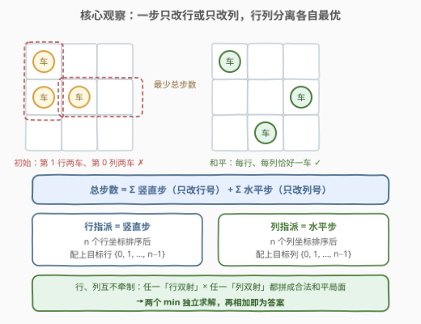
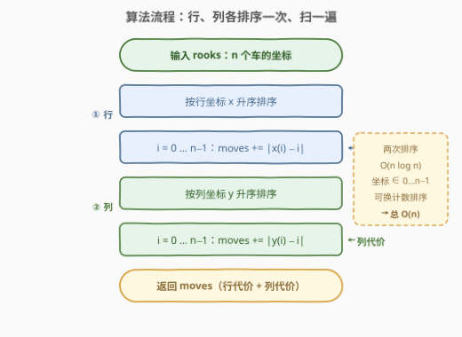
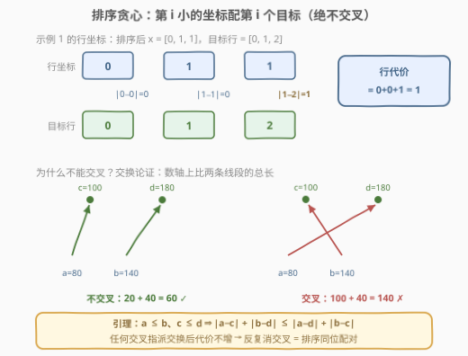
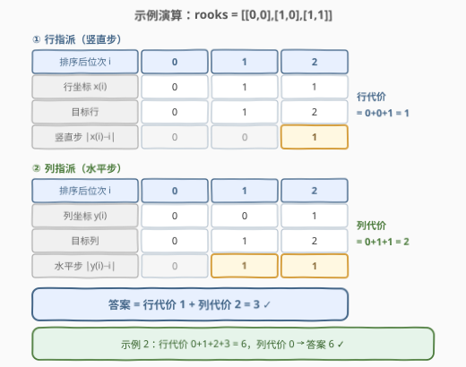

# LeetCode 得到一个和平棋盘的最少步骤 题解

## 1. 题目概述

- **标题 / 题号**：得到一个和平棋盘的最少步骤（#3189，medium）
- **链接**：https://leetcode.cn/problems/minimum-moves-to-get-a-peaceful-board/
- **难度**：中等
- **标签**：贪心、数组、排序、计数排序

> ⚠️ 本题为 LeetCode 付费题，题意描述根据官方示例用例与 hints 重建，可能与官方题面有出入。

**题意**：一个 $n \times n$ 的棋盘上放着 $n$ 个**车**（rook）。给定二维整数数组 `rooks`，其中 `rooks[i] = [x_i, y_i]` 表示第 $i$ 个车位于第 $x_i$ 行、第 $y_i$ 列。

一步操作可以选中任意一个车，将它**上 / 下 / 左 / 右移动一格**（每移动一格计一步）。

棋盘是**和平的**（peaceful），当且仅当任意两个车互不攻击——即没有两个车在**同一行**或**同一列**。由于恰好有 $n$ 个车、$n$ 行 $n$ 列，由鸽笼原理这等价于**每一行恰好一个车、每一列恰好一个车**。

返回使棋盘和平所需的**最少总步数**。

**示例 1**：

```text
输入：rooks = [[0,0],[1,0],[1,1]]
输出：3
解释：把 (1,1) 下移到第 2 行（1 步），行号变为 0,1,2 互不相同；
再把 (1,0) 右移两格到第 2 列（2 步），列号变为 0,2,1 互不相同。
共 1 + 2 = 3 步。
```

**示例 2**：

```text
输入：rooks = [[0,0],[0,1],[0,2],[0,3]]
输出：6
解释：四个车全挤在第 0 行（列号恰好各不相同）。
把三个车分别下移 1、2、3 格到第 1、2、3 行，共 6 步。
```

**约束条件**（按题意重建）：

- $n = \text{rooks.length}$
- $0 \le x_i, y_i \le n-1$（所有车都在棋盘上）

> 💡 **审题三个关键**：① 「和平」= 每行每列**恰好**一车——这是 $n$ 车 / $n$ 行 / $n$ 列的鸽笼结论，终局本质是一个**排列**；② 步数**按格计费**——移动 $k$ 格就是 $k$ 步，代价天然是**曼哈顿距离**；③ 一步要么竖直要么水平——这使行、列两本账**互不干涉**，是全题的突破口。

## 2. 解题思路

### 2.1 暴力思路：枚举指派

终局要求把 $n$ 个互不相同的行号「指派」给 $n$ 个车，列号同理——最暴力的做法是枚举行指派与列指派的所有组合，共 $(n!)^2$ 种，$n = 10$ 就已经是天文数字。

退一步看，行、列各自是一个**指派问题**（assignment problem）：车 $i$ 分到行 $t$ 的代价是 $|x_i - t|$，求最小总代价。经典解法匈牙利算法是 $O(n^3)$，$n$ 上 $10^4$ 就跑不动。要让大规模数据轻松通过，必须挖出本题代价的特殊结构。

### 2.2 核心观察：行列分离 + 排序同位配对



**观察一：一步只动行或只动列，总步数 = 两本账之和。** 竖直的一步只改行号，水平的一步只改列号，于是

$$\text{总步数} \;=\; \sum_i \text{车 } i \text{ 的竖直步数} \;+\; \sum_i \text{车 } i \text{ 的水平步数}$$

而车 $i$ 的竖直步数至少是 $|x_i - r_i|$（$r_i$ 为其最终行号），直着走即可取等；水平方向同理。

**观察二：终局 = 行双射 × 列双射，两种资源完全解耦。** 任选一个「车 → $\{0,1,\dots,n-1\}$」的行双射，再任选一个列双射，组合起来的局面行号互不相同、列号互不相同，必是合法的和平终局；反过来，任何和平终局也都能这样分解。行分配不会影响列分配的合法性，反之亦然。于是

$$\min(\text{总步数}) \;=\; \min_{\text{行指派}} \sum_i |x_i - r_i| \;+\; \min_{\text{列指派}} \sum_i |y_i - c_i|$$

一个大问题干净利落地拆成两个**同构**的一维子问题。

**观察三：一维子问题的最优解 = 排序后同位配对。** 把 $n$ 个行坐标升序排序，第 $i$ 小的坐标分给第 $i$ 行（$i = 0, 1, \dots, n-1$），行代价即 $\sum_i |x_{(i)} - i|$。这正是 [2037. 使每位学生都有座位的最少移动次数](https://leetcode.cn/problems/minimum-number-of-moves-to-seat-everyone/)（[站内题解](../2001-2100/2037_使每位学生都有座位的最少移动次数.md)）用过的**有序匹配定理**：两组数各自排序后同位配对，最小化 $\sum |a_i - b_{\pi(i)}|$。列方向完全同理。

> 💡 直观理解：目标行 $0, 1, \dots, n-1$ 本身就是排好序的；「小坐标配小目标、大坐标配大目标」，让每辆车的移动线段在数轴上**互不交叉**——而任何交叉方案总可以通过交换两车的目标行变得不更差（证明见 2.3 的交换论证）。

### 2.3 算法流程



1. 把 `rooks` 按行坐标 $x$ 升序排序，累加 $\sum_i |x_{(i)} - i|$ 得**行代价**；
2. 再按列坐标 $y$ 升序排序，累加 $\sum_i |y_{(i)} - i|$ 得**列代价**；
3. 返回两者之和。

两次排序 $O(n \log n)$，两次线性累加 $O(n)$。

**交换论证**（排序同位配对为何最优）：设 $a \le b$ 是两个车的坐标，$c \le d$ 是分给它们的两个目标行。核心引理：

$$|a - c| + |b - d| \;\le\; |a - d| + |b - c|$$

即**交叉配对的总长 ≥ 不交叉配对**（在数轴上画出四个点，按区间覆盖分情况即可验证）。因此任何出现「交叉」的指派，交换两车目标后总代价不增；反复消去交叉，最终必然终止于**同位配对**——它不劣于任何初始方案。



### 2.4 示例演算



**示例 1**（`rooks = [[0,0],[1,0],[1,1]]`）——行指派：

| 排序后 $i$ | 0 | 1 | 2 |
|---|---|---|---|
| 行坐标 $x_{(i)}$ | 0 | 1 | 1 |
| 目标行 | 0 | 1 | 2 |
| 竖直步 $\|x_{(i)} - i\|$ | 0 | 0 | **1** |

行代价 $= 0 + 0 + 1 = 1$。列坐标排序后为 $[0, 0, 1]$，配目标列 $\{0, 1, 2\}$：水平步 $= 0 + 1 + 1 = 2$。答案 $= 1 + 2 = \mathbf{3}$ ✓。

**示例 2**（`rooks = [[0,0],[0,1],[0,2],[0,3]]`）：行坐标 $[0,0,0,0]$ 配 $\{0,1,2,3\}$，代价 $0+1+2+3 = 6$；列坐标 $[0,1,2,3]$ 已经完美，代价 $0$。答案 $\mathbf{6}$ ✓。

## 3. 参考代码

### C++

```cpp
class Solution {
  public:
    int minMoves(vector<vector<int>>& rooks) {
        int n = rooks.size();
        long long moves = 0;                     // 总步数上界 O(n²)，用 long long 累加更稳

        sort(rooks.begin(), rooks.end());        // ① 按行坐标升序
        for (int i = 0; i < n; ++i)
            moves += abs(rooks[i][0] - i);       //    第 i 小的行坐标 → 第 i 行

        sort(rooks.begin(), rooks.end(),
             [](const auto& a, const auto& b) { return a[1] < b[1]; });   // ② 按列坐标升序
        for (int i = 0; i < n; ++i)
            moves += abs(rooks[i][1] - i);       //    第 i 小的列坐标 → 第 i 列

        return (int)moves;
    }
};
```

### Python

```python
class Solution:
    def minMoves(self, rooks: List[List[int]]) -> int:
        moves = 0

        rooks.sort()                             # ① 按行坐标升序
        for i, (x, _) in enumerate(rooks):
            moves += abs(x - i)                  #    第 i 小的行坐标 → 第 i 行

        rooks.sort(key=lambda r: r[1])           # ② 按列坐标升序
        for i, (_, y) in enumerate(rooks):
            moves += abs(y - i)                  #    第 i 小的列坐标 → 第 i 列

        return moves
```

> 💡 两个易错点：**①** 第二次排序前**不要**复用第一次排序后的顺序——行、列是两套独立账本，各排各的；**②** C++ 用 `long long` 累加：单车最多走 $\sim 2n$ 步，总量 $O(n^2)$，$n$ 上 $5 \times 10^4$ 就可能溢出 `int`（返回时再转回 `int` 即可）。

## 4. 复杂度分析

| 维度 | 复杂度 | 说明 |
|------|--------|------|
| 时间 | $O(n \log n)$ | 两次排序主导；两次线性累加 $O(n)$ |
| 空间 | $O(1)$ | 原地排序，仅累加器（排序递归栈 $O(\log n)$） |
| 对照：匈牙利算法 | $O(n^3)$ | 一般指派问题的解法；本题代价满足「不交叉」结构，排序贪心直接降维打击 |

## 5. 扩展：计数排序与一维指派家族

**计数排序线性化。** 本题的官方标签里藏着 Counting Sort：坐标满足 $0 \le x_i, y_i \le n-1$，值域恰好就是下标域——分别对行、列坐标开桶按出现次数收集，即可把两次排序从 $O(n \log n)$ 降到 $O(n)$，在 $n$ 巨大、追求常数的场景值得替换。

**一维指派三兄妹。** 本题与两道老题共享同一块数轴基石——最小化 $\sum |a_i - \text{目标}|$，区别只在**目标的形状**：

- [462. 最小操作次数使数组元素相等 II](https://leetcode.cn/problems/minimum-moves-to-equal-array-elements-ii/)（[站内题解](../0401-0500/462_最小操作次数使数组元素相等II.md)）：目标是**一个点** → 中位数最优；
- [2037. 使每位学生都有座位的最少移动次数](https://leetcode.cn/problems/minimum-number-of-moves-to-seat-everyone/)（[站内题解](../2001-2100/2037_使每位学生都有座位的最少移动次数.md)）：目标是**任意给定的一组位置** → 双方排序同位配对；
- 本题：目标恰是 $\{0, 1, \dots, n-1\}$ 这组等距位置 → 同位配对的特例，且行、列各做一遍再相加。

串起来记：**目标是单点用中位数，目标是多点用同位配对**，一张数轴图讲完全家族。

## 6. 面试要点

1. **为什么行、列可以分开优化？**

   - 一步要么竖直要么水平，总代价天然拆成 $\sum$ 竖直步 $+$ $\sum$ 水平步；合法终局又恰好是「行双射 × 列双射」的笛卡尔积，两种资源互不牵制，所以 $\min$ 可拆成两个独立子问题。若先指派行、再让列「迁就」行的结果，说明没想透这一层。

2. **排序同位配对为什么最优？怎么证？**

   - 交换论证 + 引理 $a \le b,\ c \le d \Rightarrow |a-c|+|b-d| \le |a-d|+|b-c|$：任何交叉指派交换后代价不增，反复消交叉必终止于同位配对。在数轴上画四个点、按相对位置分情况讨论，是白板上的标准证法。

3. **「每个车各自找最近的空行」这种局部贪心错在哪？**

   - 局部最优没有全局保证：行坐标 $[1, 1]$ 配目标行 $\{0, 1\}$ 时，「最近」出现平手，若第一个 $1$ 抢去第 $0$ 行，总代价 $1 + 1 = 2$；同位配对稳定给出 $1$。指派问题本质是全局问题，本题靠代价的「不交叉」结构，才让一次排序就等价于全局最优。

4. **C++ 为什么要用 long long 累加？**

   - 单车最多走 $\sim 2n$ 步（横竖各 $\le n-1$），总量 $O(n^2)$；$n = 10^5$ 时约 $2 \times 10^{10}$，远超 `int32` 上界。返回类型虽是 `int`，累加过程必须先撑住不溢出。

5. **如果面试官追问「车不能跨越别的车」怎么办？**

   - 本题按曼哈顿距离计费、不检查路径冲突。若真要加入「不可跨越」规则：注意排序同位配给的指派**本身不交叉**（同向移动不会互相穿越），再配合「先移走冲突行列中的车」这类顺序安排，一般也能达到同样步数；但这属于题面外的延伸，先与面试官确认计费与阻挡规则再展开。

## 同类练习题

| # | 题目 | 与本题的关联 |
|---|------|-------------|
| 2037 | [使每位学生都有座位的最少移动次数](https://leetcode.cn/problems/minimum-number-of-moves-to-seat-everyone/)（[站内题解](../2001-2100/2037_使每位学生都有座位的最少移动次数.md)） | 本题的「一维版」——学生与座位排序同位配对，正是行/列指派的原子操作 |
| 462 | [最小操作次数使数组元素相等 II](https://leetcode.cn/problems/minimum-moves-to-equal-array-elements-ii/)（[站内题解](../0401-0500/462_最小操作次数使数组元素相等II.md)） | 同为数轴绝对值指派，目标是单点时中位数最优，对照本题「目标是等距多点时同位配对最优」 |
| 1051 | [高度检查器](https://leetcode.cn/problems/height-checker/)（[站内题解](../1001-1100/1051_高度检查器.md)） | 排序前后同位对比、数不一致的位置——同位配对思想的计数版入门 |
| 782 | [变为棋盘](https://leetcode.cn/problems/transform-to-chessboard/)（[站内题解](../0701-0800/782_变为棋盘.md)） | 官方相似题，同为「棋盘行/列独立统计」的构造判定题 |
| 947 | [移除最多的同行或同列石头](https://leetcode.cn/problems/most-stones-removed-with-same-row-or-column/)（[站内题解](../0901-1000/947_移除最多的同行或同列石头.md)） | 官方相似题，同行同列连通分量里「每块留一个」，与本题共享「行、列两种资源」的棋盘视角 |
