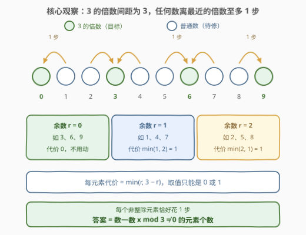
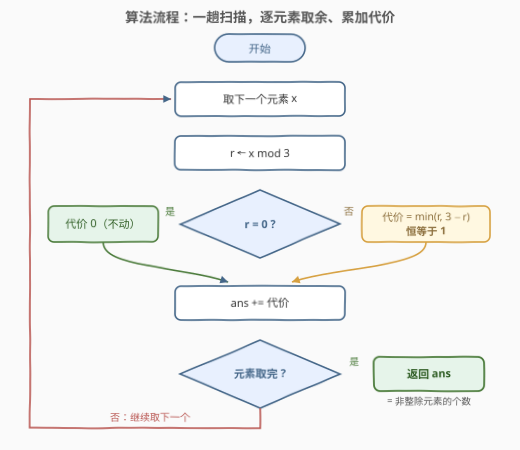

# LeetCode 使所有元素都可以被 3 整除的最少操作数 题解

## 1. 题目概述

- **标题 / 题号**：使所有元素都可以被 3 整除的最少操作数（#3190，easy）
- **链接**：https://leetcode.cn/problems/find-minimum-operations-to-make-all-elements-divisible-by-three/
- **难度**：简单
- **标签**：数组、数学

**题意**：给你一个整数数组 `nums`。一次操作中，你可以将 `nums` 中的**任意**一个元素增加或者减少 1。

请你返回将 `nums` 中所有元素都可以被 3 整除的**最少**操作次数。

**示例 1**：

```text
输入：nums = [1,2,3,4]
输出：3
解释：通过以下 3 个操作，数组中的所有元素都可以被 3 整除：
- 将 1 减少 1。
- 将 2 增加 1。
- 将 4 减少 1。
```

**示例 2**：

```text
输入：nums = [3,6,9]
输出：0
```

**约束**：

- $1 \le \text{nums.length} \le 50$
- $1 \le \text{nums[i]} \le 50$

> 💡 **审题关键**：一次操作只动**一个**元素 ±1，操作之间互不干扰——每个元素「修到 3 的倍数」的代价彼此独立，总代价就是逐元素代价之和。于是整个问题塌缩成一个小问题：单个数 $x$ 离最近的 3 的倍数有多远？

## 2. 解题思路

### 2.1 暴力思路：逐元素试探加减

对每个元素从距离 $d = 0$ 开始向外试探，$(x-d) \bmod 3 = 0$ 或 $(x+d) \bmod 3 = 0$ 谁先成立就把 $d$ 计入答案：

```cpp
class Solution {
  public:
    int minimumOperations(vector<int>& nums) {
        int ans = 0;
        for (int x : nums) {
            int d = 0;
            while ((x - d) % 3 != 0 && (x + d) % 3 != 0) ++d;
            ans += d;
        }
        return ans;
    }
};
```

> 💡 注意到 `while` **至多执行一轮**就退出——任何数离 3 的倍数都不超过 1 步。这不是巧合，正是 2.2 要展开的核心观察。

### 2.2 核心观察：余数只有三类，非零余数 1 步搞定



一个数离 3 的倍数多远，只取决于余数 $r = x \bmod 3$：

| 余数 $r$ | 代表 | 最近倍数 | 代价 |
|----------|------|----------|------|
| $r = 0$ | 3, 6, 9 | 自己 | $0$ |
| $r = 1$ | 1, 4, 7 | 减 1（加 2 更远） | $\min(1, 2) = 1$ |
| $r = 2$ | 2, 5, 8 | 加 1（减 2 更远） | $\min(2, 1) = 1$ |

统一写成每元素代价 $\min(r,\ 3 - r)$。几何直观：3 的倍数在数轴上以间距 3 排开，任何整数都落在某两个相邻倍数之间，到最近一个的距离至多 $\lfloor 3/2 \rfloor = 1$。

于是答案根本不用逐项「求和」，直接**数数**即可：

$$\text{ans} = \#\{\, x \in \text{nums} : x \bmod 3 \ne 0 \,\}$$

> ⚠️ 常见误区：试图让「余 1 的数」和「余 2 的数」互相转移凑成 3。操作只能让一个元素自己 ±1，**元素之间不能交换数值**，不存在任何「整体调配」的空间——每个元素各自修到最近的倍数，就是全局最优。

### 2.3 算法流程图



一趟扫描即可：每个元素取余、判断、累加。写代码时建议保留 $\min(r, 3 - r)$ 的形状（而不是直接 `++ans`）：它直接对应数学结论，且一眼可推广到模 $k$ 的变体（见第 5 节）。

### 2.4 示例演算

![示例演算表：nums = [1,2,3,4] 逐步求代价](../images/p3190_example_walkthrough.svg)

以 `nums = [1,2,3,4]` 为例：

| $i$ | $x$ | $r = x \bmod 3$ | 走到最近倍数 | 代价 | $\text{ans}$ 累计 |
|-----|-----|-----------------|--------------|------|------------------|
| 0 | 1 | 1 | $1 \to 0$（−1） | 1 | 1 |
| 1 | 2 | 2 | $2 \to 3$（+1） | 1 | 2 |
| 2 | 3 | 0 | 不动 | 0 | 2 |
| 3 | 4 | 1 | $4 \to 3$（−1） | 1 | **3** |

最终 $\text{ans} = 3$ ✓，恰好等于「余数非 0 的元素」1、2、4 的个数，与官方解释的三个操作一一对应。示例 2 `[3,6,9]` 全部余 0，答案为 0 ✓。

## 3. 参考代码

### C++

```cpp
class Solution {
  public:
    int minimumOperations(vector<int>& nums) {
        int ans = 0;
        for (int x : nums)
            ans += min(x % 3, 3 - x % 3);   // r=0 → 0；r=1、r=2 → 1
        return ans;
    }
};
```

### Python

```python
class Solution:
    def minimumOperations(self, nums: List[int]) -> int:
        return sum(x % 3 != 0 for x in nums)   # 非整除元素每个恰好 1 步
```

> 💡 两份代码等价：$r \in \{1, 2\}$ 时 $\min(r, 3 - r)$ 恒等于 1，所以整个循环可以塌缩成一行「数个数」。C++ 版保留公式形状便于推广，Python 版直接数数最简洁。

## 4. 复杂度分析

| 维度 | 复杂度 | 说明 |
|------|--------|------|
| 时间 | $O(n)$ | 每个元素一次取模、一次比较 / 累加 |
| 空间 | $O(1)$ | 只用一个计数器 |

> 💡 $n \le 50$ 的数据规模毫无压力；这题考的不是复杂度优化，而是「能不能一眼看出非零余数只需 1 步」的数学观察。

## 5. 扩展：模 $k$ 一般化与「独立子问题」的边界

### 5.1 一般化：模 k 的最少操作数

把 3 换成任意正整数 $k$，每元素代价变成

$$\text{cost}(x) = \min(r,\ k - r), \quad r = x \bmod k$$

因为 $k$ 的倍数以间距 $k$ 排开，任何数到最近倍数的距离至多 $\lfloor k / 2 \rfloor$。例如 $k = 5$ 时余 2 的数要花 2 步（$2 \to 0$ 或 $2 \to 5$）；$k = 4$ 时余 2 同样是 2 步。此时不能再「数个数」，必须把每元素代价真的加起来——这正是保留 $\min(r, k - r)$ 公式形状的价值。

[2033. 使网格单值的最少操作数](https://leetcode.cn/problems/minimum-operations-to-make-a-uni-value-grid/)（[站内题解](../2001-2100/2033_使网格单值的最少操作次数.md)）是这一思想的进阶版：每步只能 ±x 的倍数，先用余数判定可行性，再对商取中位数。

### 5.2 为什么「逐元素独立」如此重要

「每次操作只动一个元素」意味着 $n$ 个元素是 $n$ 个**互不共享资源**的子问题，逐元素取最优直接拼成全局最优。对比同家族题目里约束如何一步步升级：

- [1827. 最少操作使数组递增](https://leetcode.cn/problems/minimum-operations-to-make-the-array-increasing/)（[站内题解](../1801-1900/1827_最少操作使数组递增.md)）：每步 +1，但「严格递增」把相邻元素耦合起来，要**从左往右**递推；
- [945. 使数组唯一的最小增量](https://leetcode.cn/problems/minimum-increment-to-make-array-unique/)（[站内题解](../0901-1000/945_使数组唯一的最小增量.md)）：要求互不相同，先**排序**暴露冲突再统一调配。

本题没有任何耦合，是这一家族里最「散装」的成员——识别出「无耦合 → 直接贪心求和」正是面试想听到的判断。

## 6. 面试要点

1. **为什么每个非 3 倍数的元素恰好花 1 步？**

   - 3 的倍数在数轴上间距为 3，任何整数落在相邻两个倍数之间，到最近一个的距离至多 $\lfloor 3/2 \rfloor = 1$；
   - 换成余数语言：$r = 1$ 时减 1，$r = 2$ 时加 1，代价统一为 $\min(r, 3 - r) \le 1$。

2. **$\min(r, 3 - r)$ 与「数非整除元素个数」等价吗？**

   - 本题等价：$r \in \{1, 2\}$ 时 $\min(r, 3 - r)$ 恒为 1；
   - 但前者是模 $k$ 通用公式 $\min(r, k - r)$ 的直接代换，推广到模 4、模 5 时只需换个常数，面试写它更稳。

3. **能否在元素之间「转移」余数来省操作（比如 1 和 2 凑成 3）？**

   - 不能。一次操作只让一个元素 ±1，没有任何「交换」语义，元素间无法共享或转移数值；
   - 每个元素独立地修到最近的 3 的倍数，代价无交互，独立最优即全局最优。

4. **题目改成模 4、模 5，代码怎么改？**

   - 每元素代价改为 $\min(r, k - r)$（$r = x \bmod k$），单元素最坏代价 $\lfloor k/2 \rfloor$；
   - 此时非整除元素代价不再恒为 1，必须逐项累加而非计数。

5. **`nums[i]` 若可能是负数，取模要注意什么？**

   - C++/Java 中负数取模可能得到负余数（如 $-1 \% 3 = -1$），需写 $((x \bmod k) + k) \bmod k$ 归一化；
   - 本题 $1 \le \text{nums[i]} \le 50$ 无此问题；Python 的 `%` 恒非负，天然免疫。

## 同类练习题

| # | 题目 | 与本题的关联 |
|---|------|-------------|
| 1827 | [最少操作使数组递增](https://leetcode.cn/problems/minimum-operations-to-make-the-array-increasing/)（[站内题解](../1801-1900/1827_最少操作使数组递增.md)） | 同款「每步 ±1」的最少操作计数，但相邻元素被递增约束耦合 |
| 945 | [使数组唯一的最小增量](https://leetcode.cn/problems/minimum-increment-to-make-array-unique/)（[站内题解](../0901-1000/945_使数组唯一的最小增量.md)） | 每步 +1 且要求互不相同，排序后统一调度冲突 |
| 2033 | [获取单值网格的最少操作数](https://leetcode.cn/problems/minimum-operations-to-make-a-uni-value-grid/)（[站内题解](../2001-2100/2033_使网格单值的最少操作次数.md)） | 模 $k$ 代价思想的进阶——余数判可行性 + 中位数定目标 |
| 1262 | [可被三整除的最大和](https://leetcode.cn/problems/greatest-sum-divisible-by-three/)（[站内题解](../1201-1300/1262_可被三整除的最大和.md)） | 同以「模 3 余数」为核心，从最少操作换成最大和的 DP |
| 1005 | [K 次取反后最大化的数组和](https://leetcode.cn/problems/maximize-sum-of-array-after-k-negations/)（[站内题解](../1001-1100/1005_K次取反后最大化的数组和.md)） | 单次操作只动一个元素、按独立贡献贪心的又一例子 |
