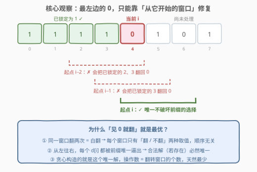
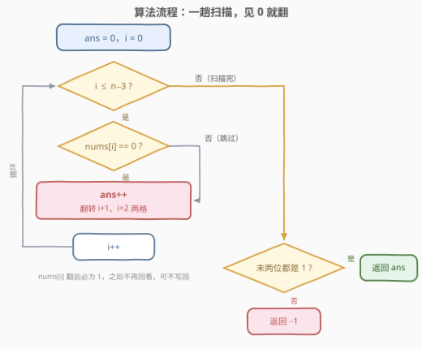
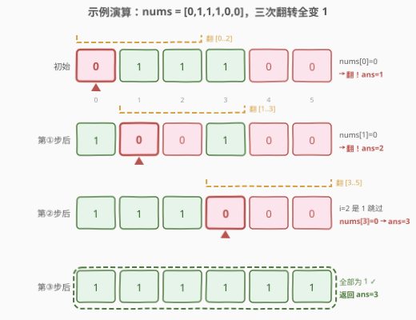

# 使二进制数组全部等于 1 的最少操作次数 I

- **题目名称**：使二进制数组全部等于 1 的最少操作次数 I
- **链接**：[3191. 使二进制数组全部等于 1 的最少操作次数 I](https://leetcode.cn/problems/minimum-operations-to-make-binary-array-elements-equal-to-one-i/)
- **难度**：中等
- **标签**：贪心、位运算、数组、滑动窗口

## 1. 题目概述

给你一个二进制数组 `nums`。

你可以对数组执行以下操作**任意**次（也可以 0 次）：

- 选择数组中**任意连续** 3 个元素，并将它们**全部反转**。

**反转**一个元素指的是将它的值从 0 变 1，或者从 1 变 0。

请你返回将 `nums` 中所有元素变为 1 的**最少**操作次数。如果无法全部变成 1，返回 -1。

**示例 1**：

```text
输入：nums = [0,1,1,1,0,0]
输出：3
解释：翻转下标 0,1,2 → [1,0,0,1,0,0]；
     再翻转下标 1,2,3 → [1,1,1,0,0,0]；
     再翻转下标 3,4,5 → [1,1,1,1,1,1]。
```

**示例 2**：

```text
输入：nums = [0,1,1,1]
输出：-1
解释：无法将所有元素都变为 1。
```

**约束条件**：

- $3 \le \text{nums.length} \le 10^5$
- $0 \le \text{nums}[i] \le 1$

> 💡 **审题三个关键**：① 窗口长度固定为 3、起点任意（$0 \sim n-3$）——每个下标 $i$ 只被起点为 $i-2$、$i-1$、$i$ 的**三个**窗口覆盖；② **翻转是对合**——同一窗口翻两次等于没翻，「翻多少次」只有**奇偶性**有意义；③ 目标全 1——每个位置都对「覆盖它的窗口的翻转次数之和的奇偶」提出一个约束方程。三条合起来，本题本质上是一组被「从左到右」逐个逼出的异或方程。

---

## 2. 解题思路

### 2.1 暴力思路：状态空间搜索

最直接的想法是把整个数组当成一个状态：初始状态出发，每步任选一个长度为 3 的窗口翻转，BFS 求到全 1 状态的最短路。状态数最多 $2^n$，每个状态还有 $n-2$ 个转移——$n = 10^5$ 时天文数字；即便枚举「每个窗口翻 / 不翻」的 $2^{n-2}$ 种组合同样不可行。

突破口藏在操作的**代数结构**里：翻转是异或，异或只关心奇偶、且与顺序无关。把「翻多少次」压缩成「翻不翻」，再利用「左边先修好」的顺序性，就能把指数级搜索变成一趟线性扫描。

### 2.2 核心观察：被前缀「唯一逼出」的翻转决策



**观察一：只有奇偶性有意义。** 把起点为 $j$（$0 \le j \le n-3$）的窗口记为 $W_j$，设它总共被翻了 $c_j \ge 0$ 次，令 $d_j = c_j \bmod 2$。由于「同一窗口翻两次 = 白翻」，真正决定终局的是 0/1 向量 $d$；给定 $d$，最小操作数就是 $\sum_j d_j$（每个奇数窗口恰好翻一次）。又因为异或可交换，**操作的先后顺序完全无关**——这为我们「从左往右」决策扫清了障碍。

**观察二：每个位置一个异或方程。** 位置 $i$ 的最终值为

$$\text{final}(i) \;=\; \text{nums}[i] \;\oplus\; d_{i-2} \;\oplus\; d_{i-1} \;\oplus\; d_i$$

（下标越界的 $d$ 取 0）。目标 $\text{final}(i) = 1$ 对所有 $i$ 成立。

**观察三：解被从左到右唯一逼出。** 位置 0 只被 $W_0$ 覆盖，方程 $\text{nums}[0] \oplus d_0 = 1$ 直接**逼定** $d_0$；归纳地，当 $d_0, \dots, d_{i-1}$ 全部确定后，位置 $i$ 的方程里只剩 $d_i$ 一个未知数——它的取值同样被逼定。于是：

> **合法解（在奇偶意义下）若存在则唯一**，且恰好就是贪心「从左往右、见 0 就翻」构造出的那条路线。

**白板直观版**：左边已经修好的 1 像上了锁。当前扫到一个 0（下标 $i$），能覆盖它的窗口只有起点 $i-2$、$i-1$、$i$ 三个——前两个都会把已锁定的位置翻回 0，等于砸锁；只剩「从 $i$ 自己开始的窗口」这一个选项。**每一步都是被逼的，被逼出来的路线当然唯一**，操作数 $\sum d_i$ 自然就是最小值；若这条唯一路线走到最后两位翻不成 1，则任何路线都翻不成——返回 -1。

### 2.3 算法流程



1. 从左到右扫描 $i = 0, 1, \dots, n-3$；
2. 若当前位置值为 0：$\text{ans}{+}{+}$，并把 $i+1$、$i+2$ 两格各异或 1（**当前位置翻后必为 1，且之后永不再回看，可以不写回**）；
3. 若为 1：什么都不做；
4. 扫描结束后检查**末两位**：都为 1 则返回 `ans`，否则返回 -1。

之所以只检查末两位：$i$ 只扫到 $n-3$，位置 $n-2$、$n-1$ 再也没有「以自己为起点」的翻身机会，它们的值已被前面所有翻转唯一决定——成则成，不成则无解。

### 2.4 示例演算



**示例 1**（`nums = [0,1,1,1,0,0]`）：

- $i=0$：值为 0 → 翻转 $[0,1,2]$，得 `[1,0,0,1,0,0]`，ans=1；
- $i=1$：值为 0 → 翻转 $[1,2,3]$，得 `[1,1,1,0,0,0]`，ans=2；
- $i=2$：值为 1 → 跳过；
- $i=3$：值为 0 → 翻转 $[3,4,5]$，得 `[1,1,1,1,1,1]`，ans=3；
- 末两位均为 1 → 返回 $\mathbf{3}$ ✓（与官方解释的中间态不同不要紧——翻转与顺序无关，殊途同归）。

**示例 2**（`nums = [0,1,1,1]`）：

- $i=0$：值为 0 → 翻转 $[0,1,2]$，得 `[1,0,0,1]`，ans=1；
- $i=1$：值为 0 → 翻转 $[1,2,3]$，得 `[1,1,1,0]`，ans=2；
- 扫描结束（$n-3=1$），末位为 0 → 返回 $\mathbf{-1}$ ✓。这不是贪心「走错了」，而是唯一解就长这样——任何方案都救不了它。

---

## 3. 参考代码

### C++

```cpp
class Solution {
  public:
    int minOperations(vector<int>& nums) {
        int n = nums.size(), ans = 0;
        for (int i = 0; i + 2 < n; ++i) {
            if (nums[i] == 0) {        // 左边已全是 1，这里被逼着翻
                ++ans;                 // 翻转窗口 [i, i+1, i+2]
                nums[i + 1] ^= 1;      // nums[i] 翻后必为 1 且不再回看，可不写回
                nums[i + 2] ^= 1;
            }
        }
        return (nums[n - 2] == 1 && nums[n - 1] == 1) ? ans : -1;
    }
};
```

### Python

```python
class Solution:
    def minOperations(self, nums: List[int]) -> int:
        ans = 0
        for i in range(len(nums) - 2):
            if nums[i] == 0:          # 左边已全是 1，这里被逼着翻
                ans += 1              # 翻转窗口 [i, i+1, i+2]
                nums[i + 1] ^= 1      # nums[i] 翻后必为 1 且不再回看，可不写回
                nums[i + 2] ^= 1
        return ans if nums[-1] == 1 and nums[-2] == 1 else -1
```

> 💡 两个易错点：**①** 循环上界是 $i \le n-3$（窗口必须完整放下），写成 `i < n` 会越界；**②** 别忘了收尾对**末两位**的判定——`ans` 数出来只是「唯一解的代价」，它是否真的是解要看末两位，否则示例 2 会错答 2。

---

## 4. 复杂度分析

| 维度 | 复杂度 | 说明 |
|------|--------|------|
| 时间 | $O(n)$ | 一趟扫描，每个位置 O(1) 判断 + 至多两次异或 |
| 空间 | $O(1)$ | 原地修改输入数组；不改输入的写法见第 5 节 |
| 对照：状态 BFS | $O(2^n \cdot n)$ | 把整个数组当状态去重，$n = 10^5$ 时状态数天文数字 |

---

## 5. 扩展：从「定长 3 窗口」到「后缀翻转」与「任意 K」

**不改输入数组的 O(1) 写法。** 若面试官要求不修改入参，只需维护最近两个决策 $d_{i-1}$、$d_{i-2}$（正是影响当前位置的两个「历史窗口」）：

```python
class Solution:
    def minOperations(self, nums: List[int]) -> int:
        n = len(nums)
        ans = d1 = d2 = 0                  # d1 = d[i-1]，d2 = d[i-2]
        for i in range(n - 2):
            d = nums[i] ^ d1 ^ d2 ^ 1      # 强制位置 i 的终值为 1
            ans += d
            d2, d1 = d1, d
        return ans if nums[n - 1] ^ d1 == 1 and nums[n - 2] ^ d1 ^ d2 == 1 else -1
```

**姊妹题 [3192](https://leetcode.cn/problems/minimum-operations-to-make-binary-array-elements-equal-to-one-ii/)：操作改成「翻转从 $i$ 到末尾的后缀」。** 此时每个位置被**所有起点 $\le i$** 的操作影响，奇偶性可以合并成一个标记，从左到右一趟扫完，且因为每个位置（包括最后一位）都有「以自己为起点」的操作，**必有解**：

```python
class Solution:
    def minOperations(self, nums: List[int]) -> int:
        ans = flip = 0                     # flip = 已发起的后缀翻转的奇偶性
        for x in nums:
            if x ^ flip == 0:              # 被之前的翻转抵消成了 0
                ans += 1                   # 从当前位置再发起一次后缀翻转
                flip ^= 1
        return ans
```

**泛化到任意窗口长度 K：[995. K 连续位的最小翻转次数](https://leetcode.cn/problems/minimum-number-of-k-consecutive-bit-flips/)（困难）。** 本题即 $K=3$ 的特例。$K$ 任意时「影响当前位置的历史窗口」有 $K-1$ 个，用一个队列（或差分数组）维护滑出窗口的翻转、随窗口右移同步弹出即可保持 O(1) 判断，整体 $O(n)$ 时间、$O(K)$ 空间。

---

## 6. 面试要点

1. **为什么「见 0 就翻」的贪心一定最优？**

   - 三段论：① 翻转是对合、可交换 → 解由奇偶向量 $d$ 唯一刻画，最小操作数 = $\sum d_i$；② 从左往右，位置 $i$ 的方程 $\text{nums}[i] \oplus d_{i-2} \oplus d_{i-1} \oplus d_i = 1$ 中只有 $d_i$ 未知 → 每个 $d_i$ 被前缀唯一逼出；③ 因此合法解若存在则**唯一**，贪心构造的正是它——「最优性」来自「唯一性」，比一般贪心的交换论证更强。

2. **会不会漏掉「先翻右边、再翻左边」的更优方案？**

   - 不会。异或可交换，任何操作序列的效果只取决于每个窗口的翻转次数奇偶，与顺序无关；同一窗口翻两次是纯浪费，最优解中每个窗口至多翻一次。BFS/DFS 枚举出的不同顺序，走的其实是同一批等价类。

3. **什么时候返回 -1？怎么证明真的无解？**

   - 唯一解在末两位失守时返回 -1。末两位（$n-2$、$n-1$）没有「以自己为起点」的窗口可用，其终值被 $d_{n-4}, d_{n-3}$ 唯一决定；而整条 $d$ 序列又是唯一的，所以这不是「算法没找到」，而是**解空间里根本没有别的解**。反例直觉：$[0,1,1,1]$ 中那个孤悬末尾的 1，任何 3 窗口一旦碰它必带着别的位一起变。

4. **不允许修改输入数组怎么办？**

   - 维护 $d_{i-1}$、$d_{i-2}$ 两个布尔（影响当前位置的全部历史决策的奇偶），判断 `nums[i] ^ d1 ^ d2` 即可；$K$ 任意时换成长度 $K-1$ 的队列或差分数组——本质都是「滑动窗口内翻转次数的奇偶标记」。

5. **本题与 995（K 连续位翻转）、3192（后缀翻转）的家族关系？**

   - 三题共用「翻转对合 + 奇偶刻画 + 左端点被逼」三板斧：本题是 $K=3$ 定长窗口（维护 2 个历史标记）；995 是任意 $K$（队列/差分维护 $K-1$ 个）；3192 是变长后缀（所有历史合并成 1 个标记，且必有解）。面试中能主动画出这条谱系，是「吃透」而非「刷过」的信号。

---

## 7. 同类练习题

- [3192. 使二进制数组全部等于 1 的最少操作次数 II](https://leetcode.cn/problems/minimum-operations-to-make-binary-array-elements-equal-to-one-ii/)：亲姊妹题，操作改为翻转后缀——一个奇偶标记一趟扫完，对比本题体会「覆盖当前位置的历史操作数」从 2 个变成全部
- [995. K 连续位的最小翻转次数](https://leetcode.cn/problems/minimum-number-of-k-consecutive-bit-flips/)（[站内题解](../0901-1000/995_K连续位的最小翻转次数.md)）：本题泛化到任意窗口长度 K，队列/差分维护滑动窗口内翻转奇偶
- [861. 翻转矩阵后的得分](https://leetcode.cn/problems/score-after-flipping-matrix/)（[站内题解](../0801-0900/861_翻转矩阵后的得分.md)）：同为「翻转对合 + 只看奇偶 + 先定高位再定低位」的贪心，二维版
- [1252. 奇数值单元格的数目](https://leetcode.cn/problems/cells-with-odd-values-in-a-matrix/)（[站内题解](../1201-1300/1252_奇数值单元格的数目.md)）：行/列增量只关心奇偶性，奇偶计数思想的入门热身
