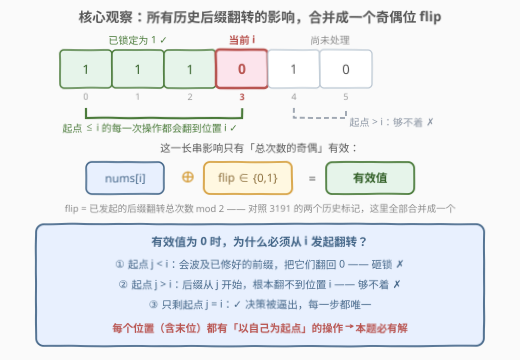
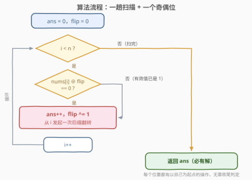
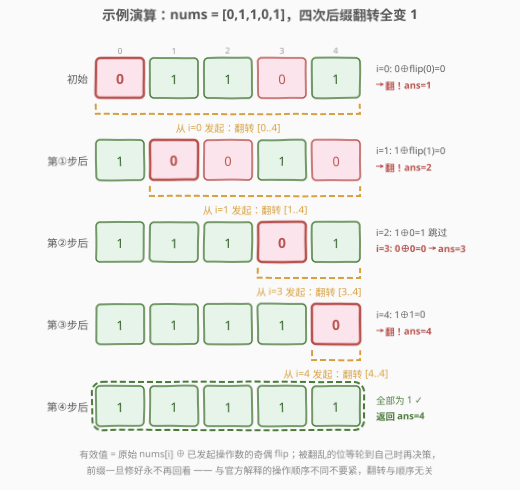

# 使二进制数组全部等于 1 的最少操作次数 II

- **题目名称**：使二进制数组全部等于 1 的最少操作次数 II
- **链接**：[3192. 使二进制数组全部等于 1 的最少操作次数 II](https://leetcode.cn/problems/minimum-operations-to-make-binary-array-elements-equal-to-one-ii/)
- **难度**：中等
- **标签**：贪心、数组、动态规划、位运算

## 1. 题目概述

给你一个二进制数组 `nums`。

你可以对数组执行以下操作**任意**次（也可以 0 次）：

- 选择数组中**任意**一个下标 `i`，并将从下标 `i` 开始一直到数组末尾的**所有**元素**反转**。

**反转**一个元素指的是将它的值从 0 变 1，或者从 1 变 0。

请你返回将 `nums` 中所有元素变为 1 的**最少**操作次数。

**示例 1**：

```text
输入：nums = [0,1,1,0,1]
输出：4
解释：选 i=1 → [0,0,0,1,0]；选 i=0 → [1,1,1,0,1]；
     选 i=4 → [1,1,1,0,0]；选 i=3 → [1,1,1,1,1]。
```

**示例 2**：

```text
输入：nums = [1,0,0,0]
输出：1
解释：选 i=1 → [1,1,1,1]。
```

**约束条件**：

- $1 \le \text{nums.length} \le 10^5$
- $0 \le \text{nums}[i] \le 1$

> 💡 **审题关键**：与 [3191](https://leetcode.cn/problems/minimum-operations-to-make-binary-array-elements-equal-to-one-i/) 一字之差——操作对象从「定长 3 窗口」换成「从 $i$ 到末尾的**后缀**」。位置 $i$ 的命运从此被**所有起点 $\le i$** 的操作共同决定；而「翻转」是异或，一串异或叠加后只剩**奇偶**起作用。这一条决定了本题反而更简单：一个奇偶位 + 一趟扫描，且**必有解**。

---

## 2. 解题思路

### 2.1 暴力思路：枚举翻转组合

每个下标都可以作为操作起点、且可重复操作，状态空间是 $2^n$ 级别——BFS 把整个数组当状态去重，或枚举「每个起点翻/不翻」的 $2^n$ 种组合，$n = 10^5$ 时都是天文数字。

突破口藏在操作的**代数结构**里：翻转 = 异或 1，异或只关心奇偶、且与顺序无关。把「翻多少次」压缩成「翻不翻」，再利用「左边先修好」的顺序性，指数级搜索就坍缩成一趟线性扫描。

### 2.2 核心观察：后缀翻转的影响可以合并成一个奇偶位



**观察一：只有奇偶性有意义，且与顺序无关。** 设起点 $j$ 总共被选了 $c_j \ge 0$ 次，令 $d_j = c_j \bmod 2$。同一操作做两次等于白做，真正决定终局的是 0/1 向量 $d$；给定 $d$，最小操作数就是 $\sum_j d_j$。异或可交换，所以**操作先后顺序完全无关**——这为「从左往右」决策扫清了障碍。

**观察二：位置 $i$ 被所有起点 $\le i$ 的操作覆盖。** 以 $j$ 为起点的后缀翻转覆盖区间 $[j, n-1]$，它碰到位置 $i$ 当且仅当 $j \le i$。于是位置 $i$ 的最终值为

$$\text{final}(i) \;=\; \text{nums}[i] \;\oplus\; d_0 \oplus d_1 \oplus \cdots \oplus d_i$$

关键来了：右边那一长串异或，就是「**已发起操作总数的奇偶**」——一个 bit。扫到位置 $i$ 时把它记作 $\text{flip} \in \{0,1\}$，则位置 $i$ 的当前值（**有效值**）为 $\text{nums}[i] \oplus \text{flip}$。对照 3191：那里影响位置 $i$ 的历史决策有 2 个（$d_{i-2}, d_{i-1}$），本题干脆**全部合并成 1 个标记**——后缀翻转「越靠左管得越宽」，历史影响天然可以折叠。

**观察三：决策被从左到右唯一逼出。** 扫到 $i$ 时 $d_0, \dots, d_{i-1}$ 已全部确定：

- 有效值为 **1** → $d_i = 0$，什么都不做；
- 有效值为 **0** → 只能 $d_i = 1$。因为能修位置 $i$ 的操作只有起点 $\le i$ 的：起点 $< i$ 会把已锁定的前缀翻回 0（**砸锁**），起点 $> i$ 根本翻不到 $i$（**够不着**）——只剩「从 $i$ 自己开始」这一条路。

> 合法解在奇偶意义下**唯一**，贪心「从左往右、见 0 就翻」构造的正是它，操作数 $\sum d_i$ 天然最少——「最优性」来自「唯一性」。又因为**每个位置（包括最后一位）都有以自己为起点的操作**，这条路线永远走不进死胡同：本题**必有解**（3191 还要检查末两位、可能返回 $-1$，这里连收尾判定都省了）。

**等价视角：数变化次数。** 由「处理完位置 $i$ 后它必为 1」可得 $d_0 \oplus \cdots \oplus d_i = \text{nums}[i] \oplus 1$，两个相邻式子一异或就得到

$$d_i = 1 \iff \text{nums}[i] \ne \text{nums}[i-1] \quad (\text{约定 } \text{nums}[-1] = 1)$$

> **答案 = 序列 $[1] + \text{nums}$ 中相邻元素不相等的对数**。直觉：处理完 $i-1$ 后「修正奇偶」恰好是把 $\text{nums}[i-1]$ 扳成 1 的那个量；若 $\text{nums}[i]$ 与 $\text{nums}[i-1]$ 原值**相同**，同一套修正顺手把它也扳成 1，无需新操作；若**不同**，修正后它恰好是 0，需要一次新的后缀翻转把「修正基线」扳过来。

### 2.3 算法流程



1. 初始化 `ans = 0`，`flip = 0`（已发起操作数的奇偶）；
2. 从左到右扫描每个位置 $i$：
   - 有效值 $\text{nums}[i] \oplus \text{flip} = 0$ → `ans++`，`flip ^= 1`（从 $i$ 发起一次后缀翻转）；
   - 有效值为 1 → 跳过；
3. 扫描结束直接返回 `ans`——**无需任何收尾判定**。

### 2.4 示例演算



**示例 1**（`nums = [0,1,1,0,1]`）：

| $i$ | 原值 | flip（翻前） | 有效值 | 动作 | 翻后数组 | ans |
|-----|------|------|--------|------|----------|-----|
| 0 | 0 | 0 | $0 \oplus 0 = 0$ | 翻转 $[0..4]$ | `[1,0,0,1,0]` | 1 |
| 1 | 1 | 1 | $1 \oplus 1 = 0$ | 翻转 $[1..4]$ | `[1,1,1,0,1]` | 2 |
| 2 | 1 | 0 | $1 \oplus 0 = 1$ | 跳过 | `[1,1,1,0,1]` | 2 |
| 3 | 0 | 0 | $0 \oplus 0 = 0$ | 翻转 $[3..4]$ | `[1,1,1,1,0]` | 3 |
| 4 | 1 | 1 | $1 \oplus 1 = 0$ | 翻转 $[4..4]$ | `[1,1,1,1,1]` | 4 |

返回 $\mathbf{4}$ ✓（操作顺序与官方解释不同不要紧——翻转与顺序无关）。用「数变化次数」验算：$[1,0,1,1,0,1]$ 中相邻不等的对数为 $1{\to}0, 0{\to}1, 1{\to}0, 0{\to}1$ 共 4 对 ✓。

**示例 2**（`nums = [1,0,0,0]`）：

- $i=0$：$1 \oplus 0 = 1$ 跳过；$i=1$：$0 \oplus 0 = 0$ → 翻转 $[1..3]$，ans=1；
- $i=2$：$0 \oplus 1 = 1$ 跳过；$i=3$：$0 \oplus 1 = 1$ 跳过；返回 $\mathbf{1}$ ✓。

---

## 3. 参考代码

### C++

```cpp
class Solution {
  public:
    int minOperations(vector<int>& nums) {
        int ans = 0, flip = 0;          // flip = 已发起的后缀翻转总数的奇偶
        for (int x : nums) {
            if ((x ^ flip) == 0) {      // 被之前的翻转抵消成了 0
                ++ans;                  // 从当前位置发起一次后缀翻转
                flip ^= 1;
            }
        }
        return ans;                     // 每个位置都有以自己为起点的操作 → 必有解
    }
};
```

### Python

```python
class Solution:
    def minOperations(self, nums: List[int]) -> int:
        ans = flip = 0                  # flip = 已发起的后缀翻转总数的奇偶
        for x in nums:
            if x ^ flip == 0:           # 被之前的翻转抵消成了 0
                ans += 1                # 从当前位置发起一次后缀翻转
                flip ^= 1
        return ans
```

> 💡 两个易错点：**①** 有效值要用**原始** $\text{nums}[i]$ 异或 flip，不要边扫边把数组改掉再拿改过的值判断（改过的话判断条件就变成「当前值 == 0」，虽也正确但容易和公式打架，选一种口径贯彻到底）；**②** 翻转的是**后缀**而不是前缀——从 $i$ 翻到末尾，别顺手写成 `nums[j] ^= 1` 只翻左边。

---

## 4. 复杂度分析

| 维度 | 复杂度 | 说明 |
|------|--------|------|
| 时间 | $O(n)$ | 一趟扫描，每个位置 O(1) 判断 |
| 空间 | $O(1)$ | 只维护 ans 与一个奇偶位，不修改输入数组 |
| 对照：枚举组合 | $O(2^n)$ | 每个起点翻/不翻的指数级搜索，$n=10^5$ 不可行 |

---

## 5. 扩展：一行流写法与「翻转家族」全景

**一行流：数变化次数。** 由 2.2 的封闭形式，答案就是相邻不等对数（哨兵 1 开路）：

```python
class Solution:
    def minOperations(self, nums: List[int]) -> int:
        return sum(x != y for x, y in zip([1] + nums, nums))
```

**DP 视角。** 官方标签里的动态规划可以这样看：设状态 $(i, p)$ = 处理完前 $i$ 个位置、当前操作数奇偶为 $p$ 的最少操作数。但由观察三，每个状态的最优转移是**被逼唯一**的（$p$ 与 $\text{nums}[i]$ 共同决定翻或不翻），取 min 的两个分支里恒有一个非法——DP 就退化成了贪心。这题是「DP 状态被约束榨干」的典型样本。

**翻转家族对照表**（面试中能主动画出这张谱系，是「吃透」而非「刷过」的信号）：

| 题目 | 操作 | 影响位置 $i$ 的历史决策 | 维护成本 | 有解性 |
|------|------|------------------------|----------|--------|
| [3191](https://leetcode.cn/problems/minimum-operations-to-make-binary-array-elements-equal-to-one-i/) | 翻转定长 3 窗口 | 2 个（$d_{i-2}, d_{i-1}$） | 2 个标记 | 末两位失守 → $-1$ |
| [995](https://leetcode.cn/problems/minimum-number-of-k-consecutive-bit-flips/) | 翻转定长 K 窗口 | $K-1$ 个 | 队列 / 差分 | 可能 $-1$ |
| **本题 3192** | 翻转后缀 $[i, n-1]$ | 全部 → 合并成 **1 个** | 1 个奇偶位 | **必有解** |

**变体思考：若操作改成「翻转前缀 $[0..i]$」呢？** 把数组左右反转就回到本题（前缀翻转的镜像），从右往左扫、维护同样的奇偶位即可；若目标改成全 0，答案不变（翻转操作群与目标 0/1 可交换）。

---

## 6. 面试要点

1. **为什么「见 0 就翻」一定最优？**

   - 三段论：① 翻转是对合、可交换 → 解由奇偶向量 $d$ 唯一刻画，最小操作数 = $\sum d_j$；② 从左往右扫，位置 $i$ 的方程 $\text{nums}[i] \oplus d_0 \oplus \cdots \oplus d_i = 1$ 中只有 $d_i$ 未知 → 每个 $d_i$ 被前缀唯一逼出；③ 因此合法解**唯一**，贪心构造的正是它——「最优性」来自「唯一性」。

2. **flip 标记的物理含义是什么？为什么一个 bit 就够？**

   - flip = 已发起操作总数的奇偶。位置 $i$ 被**所有**起点 $\le i$ 的操作覆盖，它们的叠加是一串异或，而任意长的一串异或结果只有 0/1 两种——所以 $n$ 个历史决策折叠成 1 个 bit。这也是本题比 3191（要维护 2 个历史标记）、995（要维护 $K-1$ 个）更简单的根源。

3. **为什么本题必有解，3191 却可能返回 -1？**

   - 本题每个位置（包括末位）都有「以自己为起点」的操作可用，被逼出的路线一定走得通；3191 的末两位没有以自己为**起点**的完整 3 窗口，终值被前面的决策唯一决定，失守即无解。

4. **不看公式，如何两分钟秒答？**

   - 数相邻变化次数：在数组前虚拟放一个 1，答案就是相邻元素不相等的对数。本质：处理完 $i-1$ 后修正奇偶恰好把 $\text{nums}[i-1]$ 扳成 1；$\text{nums}[i]$ 与之同值则免费搭车，异值则需一次新翻转扳基线。

5. **如果操作改成翻转前缀 $[0..i]$，或者目标改成全 0 呢？**

   - 前缀版：数组左右反转即回到本题（从右往左扫）；目标全 0 版：答案相同——把每个 $\text{nums}[i]$ 取反后套同一算法，或直接把「有效值为 0」与「有效值为 1」的判定对调。考察的是对「奇偶折叠 + 左端点被逼」这两板斧是否真的吃透。

---

## 7. 同类练习题

- [3191. 使二进制数组全部等于 1 的最少操作次数 I](https://leetcode.cn/problems/minimum-operations-to-make-binary-array-elements-equal-to-one-i/)（[站内题解](3191_使二进制数组全部等于1的最少操作次数I.md)）：亲姊妹题，操作改为定长 3 窗口翻转——维护 2 个历史标记 + 末尾无解判定，对比本题「全部历史合并成 1 个标记 + 必有解」
- [995. K 连续位的最小翻转次数](https://leetcode.cn/problems/minimum-number-of-k-consecutive-bit-flips/)（[站内题解](../0901-1000/995_K连续位的最小翻转次数.md)）：泛化到任意窗口长度 K，队列/差分维护滑动窗口内翻转奇偶，本题是 $K=n$（后缀）与 $K$ 任意之间的另一极
- [696. 计数二进制子串](https://leetcode.cn/problems/count-binary-substrings/)：同样把 01 串按「连续相同值分块」思考，训练本题「数变化次数」的秒答视角
- [1252. 奇数值单元格的数目](https://leetcode.cn/problems/cells-with-odd-values-in-a-matrix/)：行/列增量只有奇偶性有效，奇偶折叠思想的热身题
