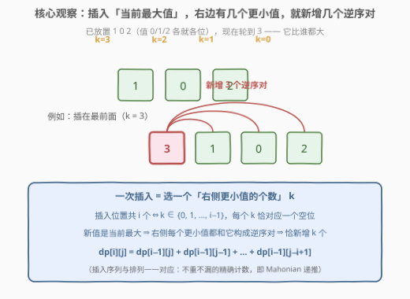
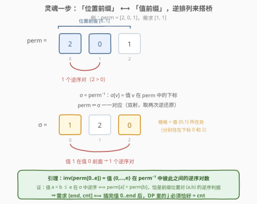
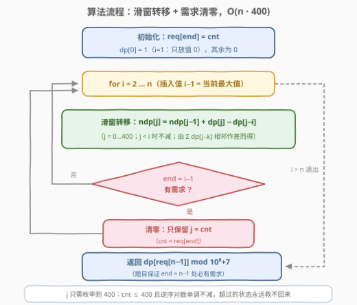
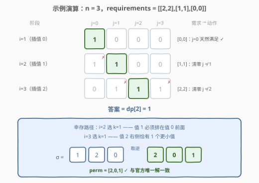

# 统计逆序对的数目

- **题目名称**：统计逆序对的数目
- **链接**：[3193. 统计逆序对的数目](https://leetcode.cn/problems/count-the-number-of-inversions/)
- **难度**：困难
- **标签**：数组、动态规划

## 1. 题目概述

给你一个整数 `n` 和一个二维数组 `requirements`，其中 `requirements[i] = [end_i, cnt_i]` 表示这条要求中的**末尾下标**和**逆序对**的数目。

整数数组 `nums` 中一个下标对 `(i, j)` 若满足 `i < j` 且 `nums[i] > nums[j]`，则被称为一个**逆序对**。

请你返回 `[0, 1, 2, ..., n - 1]` 的排列 `perm` 的数目，满足对**所有** `requirements[i]` 都有：`perm[0..end_i]` 中恰好有 `cnt_i` 个逆序对。由于答案可能很大，返回它对 $10^9 + 7$ **取余**的结果。

**示例 1**：

```text
输入：n = 3, requirements = [[2,2],[0,0]]
输出：2
解释：两个排列为 [2,0,1]（前缀 [2,0,1] 有 2 个逆序对）和 [1,2,0]（同理）。
```

**示例 2**：

```text
输入：n = 3, requirements = [[2,2],[1,1],[0,0]]
输出：1
解释：唯一满足要求的排列是 [2,0,1]：前缀 [2,0,1] 有 2 个、[2,0] 有 1 个、[2] 有 0 个逆序对。
```

**示例 3**：

```text
输入：n = 2, requirements = [[0,0],[1,0]]
输出：1
解释：唯一满足要求的排列是 [0,1]。
```

**约束条件**：

- $2 \le n \le 300$
- $1 \le \text{requirements.length} \le n$
- $0 \le \text{end}_i \le n - 1$，$0 \le \text{cnt}_i \le 400$
- 输入保证至少有一个 $i$ 满足 $\text{end}_i = n - 1$，且所有 $\text{end}_i$ 互不相同

> 💡 **审题三个关键**：① 约束卡在**嵌套前缀** `perm[0..end]` 上——前缀变长时逆序对只会增加不会减少（新增位置只带来新的 `(i, end)` 对），所以相邻需求的 `cnt` 若「倒挂」直接无解；② `cnt ≤ 400`，而 $n = 300$ 的排列逆序对最多可达 $\binom{300}{2} \approx 4.5 \times 10^4$ 个——绝大多数逆序对数**根本不会被问到**，暗示应当「按逆序对数」分层计数；③ 逆序对只取决于**相对大小**，一切「按相对顺序构造」的过程都与 $[0..n-1]$ 的排列同构——这就是插入型计数 DP 的舞台。

---

## 2. 解题思路

### 2.1 暴力思路：枚举全排列

枚举全部 $n!$ 个排列、每个再花 $O(n^2)$ 统计各前缀的逆序对数——$n = 300$ 时是天文数字。不过「逆序对数恰为某个定值的排列有多少个」是经典问题，有一件现成武器：**按值从小到大插入的计数 DP**（Mahonian 数递推）。真正的难点在于：本题的约束挂在**位置前缀**上，而这套 DP 天然跟踪的是**值**这个维度的量——两者如何对接，是本题的灵魂，见 2.3。

### 2.2 核心观察一：插入「当前最大值」，逆序对增量只由插入位置决定



把排列这样构造：**按值从小到大**，依次把 $0, 1, 2, \dots, n-1$ 插入序列。插入值 $v$ 时，已放置的值全比它小：

- 若 $v$ 右侧有 $k$ 个已放置的值，则这 $k$ 个**每个**都与 $v$ 构成逆序对——本次插入**恰新增 $k$ 个逆序对**；
- 序列当前长 $i-1$，插入位置共 $i$ 个，右侧元素数 $k \in \{0, 1, \dots, i-1\}$，且**每个 $k$ 恰对应一个插入空位**。

记 $dp[i][j]$ = 已插入值 $\{0, \dots, i-1\}$、这些值之间共 $j$ 个逆序对的构造方案数，则

$$dp[i][j] \;=\; \sum_{k=0}^{\min(i-1,\; j)} dp[i-1][j-k]$$

这正是 [629. K 个逆序对数组](https://leetcode.cn/problems/k-inverse-pairs-array/)（[站内题解](../0601-0700/629_K个逆序对数组.md)）的 Mahonian 递推。插入序列 $(k_1, k_2, \dots, k_n)$ 与排列一一对应（Lehmer 码 / 阶乘进制计数结构的近亲），所以这是**不重不漏的精确计数**，不是什么近似。

### 2.3 核心观察二（灵魂）：约束在「位置前缀」，DP 在「值前缀」——逆排列搭桥



细看会发现一个错位：$dp[i][j]$ 里的 $j$ 数的是「**值** $\{0..i-1\}$ 彼此之间」的逆序对；而题目要求的是「**位置** $0..end$ 上」的逆序对。前缀 `perm[0..end]` 里装的是**任意**子集的值，不一定是最小的 $end+1$ 个值——两者不是一回事！（反例：`perm = [2,0,1]`、`e = 1`：前缀 `[2,0]` 有 1 个逆序对，而值 `{0,1}` 之间有 0 个。）

桥梁是**逆排列**：

> **引理**：设 $\sigma$ 是任意排列，$\sigma^{-1}$ 是它的逆排列（$\sigma^{-1}[v] =$ 值 $v$ 在 $\sigma$ 中的下标）。那么
> 「$\sigma$ 中最小的 $e+1$ 个值（即 $0..e$）彼此之间的逆序对数」 $=$ 「$\sigma^{-1}$ 的前 $e+1$ 项的逆序对数」。
>
> **证明**：一对值 $a < b \le e$ 在 $\sigma$ 中构成逆序对（即 $b$ 排在 $a$ 前面）$\iff \sigma^{-1}[b] < \sigma^{-1}[a]$。把这组下标看作数组 $\sigma^{-1}$ 中位置 $a < b$ 的两个格子，上式恰说明 $\sigma^{-1}[a] > \sigma^{-1}[b]$——正是 $\sigma^{-1}$ 前缀中的一对逆序对。两边的逆序对一一对应。$\blacksquare$

把引理中的 $\sigma$ 取为 $\text{perm}^{-1}$（即令 $\text{perm} = \sigma^{-1}$），得到本题要用的形态：

$$\text{inv}\big(\text{perm}[0..e]\big) \;=\; \text{值 } \{0..e\} \text{ 在 } \sigma = \text{perm}^{-1} \text{ 中彼此之间的逆序对数}$$

而 $\text{perm} \mapsto \text{perm}^{-1}$ 是排列集合上的**双射**。于是：

> **数「满足位置前缀约束的 perm」 = 数「满足值前缀约束的 σ」**，而后者恰好是插入 DP 能直接检查的——**插完值 $0..e$ 后，看当前逆序对总数是否等于 $cnt$，不等于的状态全部清零**。

> 💡 **白板直觉**：逆排列把排列的「位置」和「值」两条坐标轴互换——perm 的前 $e+1$ 个**位置**，映过去恰是 σ 中最小的 $e+1$ 个**值**。位置前缀上的逆序对结构，被原封不动地搬到了值前缀上，一个不多一个不少。

### 2.4 算法流程：滑窗转移 + 需求清零 + 400 截断



1. 把 `requirements` 整理成哈希表 `req[end] = cnt`；
2. 初始化 $dp[0] = 1$（只放值 0，逆序对数为 0）；
3. $i = 2 \dots n$（插入值 $i-1$）：
   - **滑窗转移**：$dp'[j] = dp'[j-1] + dp[j] - dp[j-i]$（$j < i$ 时不减）——由 $dp'[j] = \sum_{k=0}^{\min(i-1,j)} dp[j-k]$ 相邻作差而来，窗口长度恰为 $i$；
   - **需求清零**：若 $i-1 \in \text{req}$，只保留 $j = \text{req}[i-1]$，其余全部清零（注意清零发生在**转移之后**）；
4. 返回 $dp[\text{req}[n-1]]$（题目保证 $n-1$ 处必有需求，此时它是唯一非零项）。

两个必要的收紧：

- **$j$ 只需枚举到 400**：$cnt \le 400$，且插入过程中逆序对数**单调不减**（每步新增 $k \ge 0$），任何时刻 $j > 400$ 的状态永远无法回到终态约束——直接砍掉。于是空间 $O(400)$、时间 $O(n \cdot 400)$。
- **相邻需求「倒挂」自动判死**：若 $\text{end}_1 < \text{end}_2$ 但 $\text{cnt}_1 > \text{cnt}_2$，清零后全为零，答案自然为 0，无需特判（$[0, c]$ 且 $c > 0$ 同理）。

### 2.5 示例演算



以示例 2（`n = 3, requirements = [[2,2],[1,1],[0,0]]`）为例，$j$ 只列到 3：

| 步骤 | 转移后 dp（j=0..3） | 需求 | 动作 |
|------|---------------------|------|------|
| i=1（插值 0） | [1, 0, 0, 0] | [0,0] | j=0 天然满足，保留 |
| i=2（插值 1） | [1, 1, 0, 0] | [1,1] | 清零 j≠1 → [0,1,0,0] |
| i=3（插值 2） | [0, 1, 1, 1] | [2,2] | 清零 j≠2 → [0,0,1,0] |

幸存路径回放：i=2 时 j=1（值 1 必须排在值 0 前面，$k=1$）；i=3 时 $j: 1 \to 2$（$k=1$，值 2 右侧恰有 1 个更小值）→ $\sigma = [1,2,0]$，取逆得 $\text{perm} = [2,0,1]$ ✓，与官方唯一解一致。

---

## 3. 参考代码

### C++

```cpp
class Solution {
  public:
    int numberOfPermutations(int n, vector<vector<int>>& requirements) {
        const int MOD = 1'000'000'007, C = 400;
        vector<int> req(n, -1);
        for (auto& r : requirements) req[r[0]] = r[1];   // end -> cnt

        vector<long long> dp(C + 1), ndp(C + 1);
        dp[0] = 1;                                        // i=1：只放值 0
        for (int i = 1; i <= n; ++i) {                    // 已插入值 0..i-1
            if (i > 1) {                                  // 插入值 i-1（当前最大值）
                for (int j = 0; j <= C; ++j) {
                    long long v = dp[j] + (j ? ndp[j - 1] : 0);
                    if (j >= i) v -= dp[j - i];           // 滑出窗口的项
                    ndp[j] = (v % MOD + MOD) % MOD;
                }
                swap(dp, ndp);
            }
            if (req[i - 1] >= 0) {                        // end = i-1 的需求
                int c = req[i - 1];
                long long keep = dp[c];                   // 只留 j = cnt
                fill(dp.begin(), dp.end(), 0);
                dp[c] = keep;
            }
        }
        return (int)dp[req[n - 1]];                       // 保证 end = n-1 存在
    }
};
```

### Python

```python
class Solution:
    def numberOfPermutations(self, n: int, requirements: List[List[int]]) -> int:
        MOD, C = 1_000_000_007, 400
        req = {end: cnt for end, cnt in requirements}

        dp = [0] * (C + 1)
        dp[0] = 1                                   # i=1：只放值 0
        for i in range(1, n + 1):                   # 已插入值 0..i-1
            if i > 1:                               # 插入值 i-1（当前最大值）
                ndp = [0] * (C + 1)
                for j in range(C + 1):
                    v = dp[j] + (ndp[j - 1] if j else 0)
                    if j >= i:
                        v -= dp[j - i]              # 滑出窗口的项
                    ndp[j] = v % MOD
                dp = ndp
            if (e := i - 1) in req:                 # end = i-1 的需求
                c = req[e]
                keep = dp[c]                        # 只留 j = cnt
                dp = [0] * (C + 1)
                dp[c] = keep
        return dp[req[n - 1]]
```

> 💡 两个易错点：**①** 滑窗公式里减的是 $dp[j-i]$（窗口长为 $i$，不是 $i-1$）——建议由「相邻作差」现场推导，别硬背；**②** 需求清零必须发生在**转移之后**——先算出长度 $end+1$ 的全部状态再筛，放在转移前会把上一层的合法状态误杀。

---

## 4. 复杂度分析

| 维度 | 复杂度 | 说明 |
|------|--------|------|
| 时间 | $O\big(n \cdot \min(400, \tbinom{n}{2})\big) \approx O(n \cdot 400)$ | 每层 401 个状态，滑窗 O(1) 转移；$n=300$ 时约 $1.2 \times 10^5$ 次运算 |
| 空间 | $O(400)$ | 滚动数组，两行 dp |
| 对照：朴素转移 | $O(n \cdot 400 \cdot n) \approx 3.6 \times 10^7$ | 每个状态逐项求和（最长 $n$ 项），也能过但难看 |
| 对照：枚举排列 | $O(n! \cdot n^2)$ | $n = 300$ 时宇宙热寂都算不完 |

---

## 5. 扩展：这题站在哪些经典肩膀上

**去掉 requirements 就是 629。** 若不设任何中途需求、只问「逆序对恰为 $k$ 的排列数」，答案就是 Mahonian 数——[629. K 个逆序对数组](https://leetcode.cn/problems/k-inverse-pairs-array/)（[站内题解](../0601-0700/629_K个逆序对数组.md)）求的正是同一递推，同样可用前缀和优化到 $O(nk)$。本题相当于在 Mahonian 递推的**中途**设了若干「检查站」：每到一站，把逆序对数不等于规定值的状态全部没收。

**插入 DP 的本质是 Lehmer 码。** 插入序列 $(k_1, \dots, k_n)$，$k_i \in [0, i-1]$，与排列一一对应——这正是阶乘进制 / Lehmer 码（逆序向量）的计数结构；逆序对总数 $= \sum_i k_i$。所以「按逆序对数统计排列」=「按数码和统计阶乘进制数」，这是很多排列计数题的共同底层。

**换个方向：给定排列数逆序对。** [315. 计算右侧小于当前元素的个数](https://leetcode.cn/problems/count-of-smaller-numbers-after-self/)（归并 / 树状数组）、[493. 翻转对](https://leetcode.cn/problems/reverse-pairs/)（判据放大为 $nums[i] > 2 \cdot nums[j]$）、[剑指 Offer 51. 数组中的逆序对](https://leetcode.cn/problems/shu-zu-zhong-de-ni-xu-dui-lcof/)是一族「求值」题；而 [1649. 通过指令创建有序数组](https://leetcode.cn/problems/create-sorted-array-through-instructions/) 边插入边实时统计左右侧更小 / 更大值——恰好就是本题插入过程中「$k$ 的求值版」。数排列与数逆序对，一体两面。

---

## 6. 面试要点

1. **为什么不能直接把「前缀 perm[0..end]」当作「最小的 end+1 个值」来 DP？**

   - 反例：`perm = [2,0,1]`、`e = 1`——前缀 `[2,0]` 有 1 个逆序对，值 `{0,1}` 之间却只有 0 个。前缀里的值是任意子集，两种计数对象不同；必须经过逆排列双射把「位置前缀」翻译成「值前缀」才能安全对接插入 DP。

2. **逆排列为什么能搭桥？一句话说清引理。**

   - 值 $a < b \le e$ 在 $\sigma$ 中逆序（$b$ 排在 $a$ 前）$\iff \sigma^{-1}[b] < \sigma^{-1}[a] \iff \text{perm}[a] > \text{perm}[b]$（其中 $\text{perm} = \sigma^{-1}$），而后者正是 perm 前缀中位置对 $(a,b)$ 的逆序判据——值对与位置对一一对应，计数相等。

3. **j 为什么截断在 400？会不会误杀合法状态？**

   - 不会。插入过程逆序对数单调不减，且终态需求 $cnt \le 400$；任何时刻 $j > 400$ 的状态只会继续变大，永远到不了终态，砍掉是安全的。这也是本题把 $n \le 300$、$cnt \le 400$ 两个小数字用足的地方。

4. **滑窗转移怎么 30 秒现场推出来？**

   - 记 $S(j) = dp[j] + dp[j-1] + \dots + dp[j-i+1]$（窗口长 $i$），则 $S(j) - S(j-1) = dp[j] - dp[j-i]$，即 $dp'[j] = dp'[j-1] + dp[j] - dp[j-i]$（$j < i$ 时无减项）。窗口长度 = 新序列长度，恰好把「右侧元素数至多 $i-1$」 encoded 进去。

5. **本题与 629 的关系是什么？**

   - 629 是本题「无中途检查站」的特例（纯 Mahonian 计数）；本题是给 Mahonian 递推加上「特定层强制坍缩到单点 $j = cnt$」的约束版本。面试中能主动指出「值前缀 ⟷ 位置前缀」这层双射，是真正吃透的信号。

---

## 7. 同类练习题

- [629. K 个逆序对数组](https://leetcode.cn/problems/k-inverse-pairs-array/)（[站内题解](../0601-0700/629_K个逆序对数组.md)）：本题去掉 requirements 的纯净版，同一插入递推 + 前缀和优化，先刷它再来做本题会非常顺
- [315. 计算右侧小于当前元素的个数](https://leetcode.cn/problems/count-of-smaller-numbers-after-self/)（[站内题解](../0301-0400/315_计算右侧小于当前元素的个数.md)）：换方向——给定排列求每个位置的逆序贡献（归并 / 树状数组），与本题「数排列」互为镜像
- [1649. 通过指令创建有序数组](https://leetcode.cn/problems/create-sorted-array-through-instructions/)（[站内题解](../1601-1700/1649_通过指令创建有序数组.md)）：插入过程中实时统计左右侧更小 / 更大值——正是本题插入过程里「k 的求值版」
- [493. 翻转对](https://leetcode.cn/problems/reverse-pairs/)（[站内题解](../0401-0500/493_翻转对.md)）：逆序对判据放大成 $nums[i] > 2 \cdot nums[j]$ 的归并分治，巩固「数逆序对」基本功
- [剑指 Offer 51. 数组中的逆序对](https://leetcode.cn/problems/shu-zu-zhong-de-ni-xu-dui-lcof/)（[站内题解](../0101-0200/LCOF51_数组中的逆序对.md)）：逆序对入门经典，归并排序与树状数组双解
