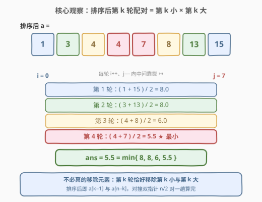
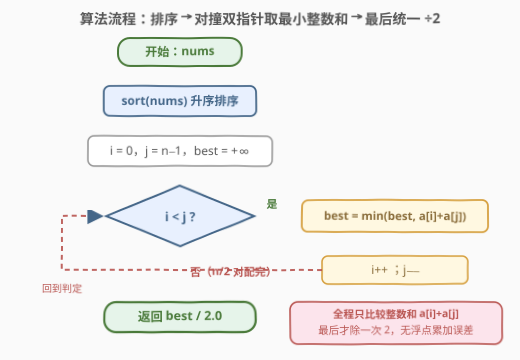
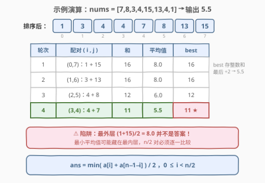

# 最小元素和最大元素的最小平均值

- **题目名称**：最小元素和最大元素的最小平均值
- **链接**：[3194. 最小元素和最大元素的最小平均值](https://leetcode.cn/problems/minimum-average-of-smallest-and-largest-elements/)
- **难度**：简单
- **标签**：数组，排序，双指针

## 1. 题目概述

给你一个初始为空的浮点数数组 `averages`。另给你一个包含 $n$ 个整数的数组 `nums`，其中 $n$ 为**偶数**。

你需要重复以下步骤 $n / 2$ 次：

- 从 `nums` 中移除**最小**的元素 `minElement` 和**最大**的元素 `maxElement`；
- 将 $(\text{minElement} + \text{maxElement}) / 2$ 加入到 `averages` 中。

返回 `averages` 中的**最小**元素。

**示例 1**：

```text
输入：nums = [7,8,3,4,15,13,4,1]
输出：5.5
解释：
步骤 0    nums = [7,8,3,4,15,13,4,1]    averages = []
步骤 1    nums = [7,8,3,4,13,4]          averages = [8]        （移除 1 和 15）
步骤 2    nums = [7,8,4,4]               averages = [8,8]      （移除 3 和 13）
步骤 3    nums = [7,4]                   averages = [8,8,6]    （移除 4 和 8）
步骤 4    nums = []                      averages = [8,8,6,5.5]（移除 4 和 7）
返回 averages 中最小的元素，即 5.5。
```

**示例 2**：

```text
输入：nums = [1,9,8,3,10,5]
输出：5.5
解释：三轮配对为 (1,10) → 5.5，(3,9) → 6，(5,8) → 6.5，最小为 5.5。
```

**示例 3**：

```text
输入：nums = [1,2,3,7,8,9]
输出：5.0
解释：三轮配对为 (1,9)、(2,8)、(3,7)，平均值全为 5.0。
```

**约束条件**：

- $2 \le n = \text{nums.length} \le 50$
- $n$ 为偶数
- $1 \le \text{nums}[i] \le 50$

> 💡 读题关键：整个过程是一个**确定性模拟**——每轮「掐头去尾」取当前最小与最大配对求平均，共恰好 $n/2$ 轮。题目只问所有 $n/2$ 个平均值的**最小值**，这暗示 `averages` 列表本身可能是多余的中间产物。真正的考点是看出**每一轮配对的是谁**，从而把模拟降维成一次线性扫描。

---

## 2. 解题思路

### 2.1 朴素思路：老老实实模拟 $n/2$ 轮

按题意直译：每轮线性扫描找 `min` / `max`，从数组中删除，把平均值 `append` 进 `averages`；最后 `min(averages)` 即答案。时间 $O(n^2)$，$n \le 50$ 完全能过。但这个写法有两处冗余：

- **`averages` 列表是多余的**——只需求最小值，一个滚动变量 `best` 就够；
- **删除操作是多余的**——每轮「移除当前最小/最大」并不改变剩余元素的相对大小，配对关系从头到尾是**确定**的，根本不用动态维护。

### 2.2 核心观察：排序后「第 $k$ 小 × 第 $k$ 大」配对是确定的



把 `nums` 升序排序得到 $a$，逐轮看移除的是谁：

- 第 1 轮移除**全局最小** $a_0$ 和**全局最大** $a_{n-1}$；
- 第 2 轮移除剩余中的最小/最大，即**全局第 2 小** $a_1$ 和**第 2 大** $a_{n-2}$；
- 归纳可得：**第 $k$ 轮恰好移除第 $k$ 小与第 $k$ 大**，也就是排序后的 $a_{k-1}$ 与 $a_{n-k}$。

于是整个模拟的产物可以一步写出：

$$\text{ans} = \min_{0 \le i < n/2} \frac{a_i + a_{n-1-i}}{2}$$

用**对撞双指针** $i$ 从左、$j$ 从右向中间靠拢，$n/2$ 对一趟扫完，无需任何删除。

两个值得强调的细节：

- **反直觉点：最小平均值未必来自最外层 $(a_0 + a_{n-1})/2$**。示例 1 中最外层是 $(1+15)/2 = 8.0$，答案却藏在最内层 $(4+7)/2 = 5.5$——中间元素挤在一起时内层配对的「跨度」更小。所以 $n/2$ 对**必须逐一比较**，不能只算一对。
- **浮点细节**：$\frac{a_i + a_j}{2}$ 关于 $a_i + a_j$ 单调，故**最小化平均值 ⇔ 最小化整数和**。全程只比较整数 $a_i + a_j \le 100$，最后一次统一除以 2——既无浮点累加误差，也不需要提前引入 `double`。

### 2.3 算法流程图



流程只有四步：

1. `sort(nums)` 升序排序；
2. 初始化 `i = 0`，`j = n − 1`，`best = +∞`；
3. 当 `i < j`：`best = min(best, nums[i] + nums[j])`，随后 `i++`、`j−−`；
4. 返回 `best / 2.0`。

### 2.4 示例演算



以示例 1 为例，排序后 $a = [1,3,4,4,7,8,13,15]$：

| 轮次 | 配对 $(i,j)$ | $a_i + a_j$ | 平均值 | `best`（存整数和） |
|------|-------------|-------------|--------|--------------------|
| 1 | $(0,7)$：$1+15$ | 16 | 8.0 | 16 |
| 2 | $(1,6)$：$3+13$ | 16 | 8.0 | 16 |
| 3 | $(2,5)$：$4+8$ | 12 | 6.0 | 12 |
| 4 | $(3,4)$：$4+7$ | 11 | **5.5** | 11 ★ |

最终 $11 / 2 = 5.5$。注意 `best` 全程只存**整数和**，除法只在 `return` 处做一次。示例 3 则展示了另一个极端：$[1,2,3,7,8,9]$ 三对平均值全为 5.0——数组「对称均匀」时所有平均值相同。

---

## 3. 参考代码

### C++

```cpp
class Solution {
  public:
    double minimumAverage(vector<int>& nums) {
        sort(nums.begin(), nums.end());
        int n = nums.size(), best = INT_MAX;
        for (int i = 0, j = n - 1; i < j; i++, j--) {
            best = min(best, nums[i] + nums[j]);   // 只比较整数和，最后统一 ÷2
        }
        return best / 2.0;
    }
};
```

### Python

```python
class Solution:
    def minimumAverage(self, nums: List[int]) -> float:
        nums.sort()
        n = len(nums)
        return min(nums[i] + nums[n - 1 - i] for i in range(n // 2)) / 2
```

> 💡 写法盘点：Python 的 `nums[n - 1 - i]` 可写成 `nums[~i]`（`~i == -i-1`，正数下标与倒序下标一步互换），生成器表达式 + `min` 免去显式循环；也可 `min(map(add, nums[:n//2], reversed(nums[n//2:])))`，但可读性反而下降。C++ 的 `for (int i = 0, j = n - 1; i < j; i++, j--)` 把双指针的推进写在循环头里，循环体只剩一行判定。**返回值用 `best / 2.0`**：C++ 中整数 `/` 会截断，必须除以 `2.0`（或 `best * 0.5`）才得到 `double`。

---

## 4. 复杂度分析

| 维度 | 复杂度 | 说明 |
|------|--------|------|
| 时间复杂度 | $O(n \log n)$ | 排序主导；双指针扫描仅 $O(n)$（恰 $n/2$ 对） |
| 空间复杂度 | $O(1)$ | 原地排序 + 两个下标与 `best`，不计语言排序的栈开销 |
| 中间量规模 | $\le 100$ | 整数和上界 $50 + 50$，`int` 绰绰有余；朴素模拟则为 $O(n)$ 额外数组 + $O(n^2)$ 时间 |

---

## 5. 扩展

### 5.1 值域计数排序：$O(n + V)$ 的无比较解法

约束里 $1 \le \text{nums}[i] \le 50$ 是个显眼的信号——值域 $V = 50$ 极小，可用**计数排序**绕开比较排序：统计每个值的出现次数后，在值域数组上做对撞双指针（值为 0 的桶跳过，同一个桶内部自己和自己配对）。整体 $O(n + V)$，当 $n \gg V$ 时优于 $O(n \log n)$。对 $n \le 50$ 的本题属于「杀鸡用牛刀」，但值域信息出现在约束里时就值得条件反射地想到桶。

### 5.2 「强制配对」vs「自由配对」：一道之隔的 1877

本题与 [1877. 数组中最大数对和的最小值](../1801-1900/1877_数组中最大数对和的最小值.md)构成漂亮的一对镜像：

| | 3194（本题） | 1877 |
|---|---|---|
| 配对方式 | **过程强制**：第 $k$ 小必配第 $k$ 大 | **自由选择**：任意两两配对 |
| 优化目标 | 最小化配对和的**最小值** | 最小化配对和的**最大值** |
| 求解难度 | 排序后直接读出（无需贪心证明） | 需交换论证：最小配最大才最优 |

两者代码几乎一模一样（排序 + 对撞双指针），但 1877 要回答「为什么这样配最优」，本题只需要回答「配对关系为什么是确定的」。同一副骨架，「配对由谁决定」是分野所在。再往外延伸，[881. 救生艇](../0801-0900/881_救生艇.md)给配对加上了容量约束（船限重且最多两人），[561. 数组拆分](../0501-0600/561_数组拆分.md)则是排序后**相邻**两两配对——排序 + 双指针这一族题的变体光谱相当完整。

---

## 6. 面试要点

1. **为什么排序后首尾配对就等价于逐轮移除的模拟？**

   - 归纳论证：第 1 轮移除全局最小 $a_0$ 与全局最大 $a_{n-1}$；移除后剩余数组仍保持升序，第 2 轮移除的自然是 $a_1$ 与 $a_{n-2}$……第 $k$ 轮恰好是第 $k$ 小配第 $k$ 大。整个过程是**确定性**的，多重集合（multiset）在排序意义下的配对结构不变，因此无需真的执行删除。

2. **只算最外层一对 $(a_0 + a_{n-1})/2$ 行不行？**

   - 不行。示例 1 是现成反例：最外层 $(1+15)/2 = 8.0$，而最内层 $(4+7)/2 = 5.5$ 更小。平均值最小的一对可能出现在任意层，$n/2$ 对必须逐一比较后取 `min`。

3. **如何避免浮点中间量与累加误差？**

   - 利用单调性：$\frac{x}{2}$ 随 $x$ 单调递增，最小化平均值等价于最小化整数和 $a_i + a_j$。全程用 `int` 维护 `best`，仅在 `return` 时做一次 `/ 2.0`。本题数值小、误差本不致命，但「整数域比较、最后一步转浮点」是无浮点坑的通用习惯。

4. **循环条件为什么写 `i < j`？写成 `i <= j` 有隐患吗？**

   - 本题 $n$ 恒为偶数，双指针恰好在中间「擦肩」——第 $n/2$ 轮后 $i = n/2$、$j = n/2 - 1$，`i < j` 自然退出，两条件等价。但若约束改成 $n$ 可为奇数，`i <= j` 会多算一次 $i = j$ 的「自配对」$(a_i + a_i)/2 = a_i$，把中位数错误地塞进候选——防御性地写 `i < j` 并想清楚相遇/交叉语义，是双指针题的基本功。

5. **能不排序做到 $O(n)$ 吗？**

   - 一般不能：答案需要**所有**「第 $k$ 小 + 第 $k$ 大」这 $n/2$ 个配对和，等价于要求出全体元素的完整次序结构，本质是排序信息。例外是值域极小（本题 $V = 50$）时用计数排序做到 $O(n + V)$，见 5.1；或用快速选择求单个次序统计量——但这里需要每一个 $k$，反而得不偿失。

---

## 7. 同类练习题

- [561. 数组拆分](https://leetcode.cn/problems/array-partition/)（[站内题解](../0501-0600/561_数组拆分.md)）：排序后**相邻**两两配对求 $\min$ 之和最大化——同为「排序即定配对」的骨架
- [1877. 数组中最大数对和的最小值](https://leetcode.cn/problems/minimize-maximum-pair-sum-in-array/)（[站内题解](../1801-1900/1877_数组中最大数对和的最小值.md)）：本题的镜像——自由配对下最小化**最大**数对和，最小配最大需交换论证
- [881. 救生艇](https://leetcode.cn/problems/boats-to-save-people/)（[站内题解](../0801-0900/881_救生艇.md)）：排序 + 对撞双指针贪心装船，给「最小配最大」加上容量约束
- [976. 三角形的最大周长](https://leetcode.cn/problems/largest-perimeter-triangle/)（[站内题解](../0901-1000/976_三角形的最大周长.md)）：排序后贪心取三元组，排序定候选的又一变体
- [1509. 三次操作后最大值与最小值的最小差](https://leetcode.cn/problems/minimum-difference-between-largest-and-smallest-value-in-three-moves/)（[站内题解](../1501-1600/1509_三次操作后最大值与最小值的最小差.md)）：排序后只关心首尾端点的少数配对组合，与本题「掐头去尾」过程同源
