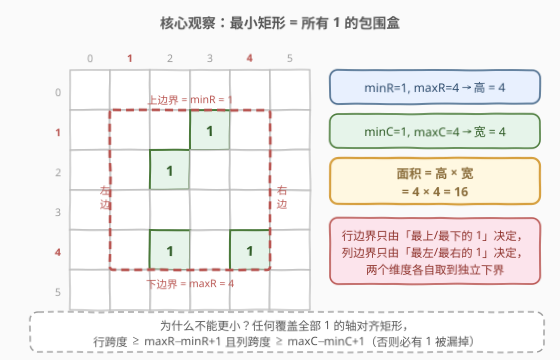
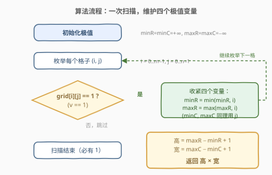
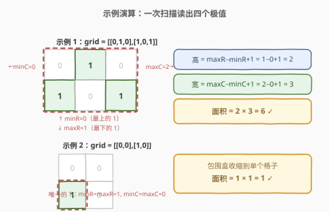

# 包含所有 1 的最小矩形面积 I

- **题目名称**：包含所有 1 的最小矩形面积 I
- **链接**：[3195. 包含所有 1 的最小矩形面积 I](https://leetcode.cn/problems/find-the-minimum-area-to-cover-all-ones-i/)
- **难度**：中等
- **标签**：数组、矩阵

## 1. 题目概述

给你一个二维**二进制**数组 `grid`。请你找出一个边在**水平方向**和**竖直方向**上、面积**最小**的矩形，并且满足 `grid` 中所有的 1 都在矩形的内部。

返回这个矩形可能的**最小**面积。

**示例 1**：

```text
输入：grid = [[0,1,0],[1,0,1]]
输出：6
解释：这个最小矩形的高度为 2，宽度为 3，因此面积为 2 * 3 = 6。
```

**示例 2**：

```text
输入：grid = [[0,0],[1,0]]
输出：1
解释：这个最小矩形的高度和宽度都是 1，因此面积为 1 * 1 = 1。
```

**约束条件**：

- $1 \le \text{grid.length},\ \text{grid[i].length} \le 1000$
- $\text{grid[i][j]}$ 是 0 或 1
- 输入保证 `grid` 中至少有一个 1

> 💡 **审题三个关键**：① 矩形边必须**轴对齐**（水平 + 竖直）——"斜着框住对角线上的 1 以缩小面积"这条路被题面直接堵死；② 从示例 1 看，1 落在矩形**边界上**也算被覆盖（闭矩形），即"内部"含边界；③ 面积只由**行跨度 × 列跨度**决定，与 1 的个数、形状统统无关——这暗示答案只有一个来源：所有 1 的**包围盒**。

---

## 2. 解题思路

### 2.1 暴力思路：枚举矩形

朴素想法是枚举所有轴对齐矩形 $(r_1, c_1, r_2, c_2)$：共 $O(m^2 n^2)$ 个，每个再花 $O(mn)$ 检查所有 1 是否都落在其中，总复杂度 $O(m^3 n^3)$——$m = n = 1000$ 时约 $10^{18}$ 次操作，完全不可行。

但更本质的问题是：**根本不需要搜索**。合法矩形由"行范围 × 列范围"唯一决定，而这两个范围各自的下界是**被迫**的——最优解可以直接读出来，见 2.2。

### 2.2 核心观察：最小矩形 = 所有 1 的包围盒



把所有取值为 1 的格子集合记为 $S$，定义四个极值：

$$\text{minR} = \min_{(i,j)\in S} i,\quad \text{maxR} = \max_{(i,j)\in S} i,\quad \text{minC} = \min_{(i,j)\in S} j,\quad \text{maxC} = \max_{(i,j)\in S} j$$

**最小矩形就是这四个极值张成的包围盒（bounding box）**，用双向夹逼论证：

- **可行性（它是一个合法解）**：包围盒覆盖了 $S$ 中每个格子——任何 $(i, j) \in S$ 都满足 $\text{minR} \le i \le \text{maxR}$ 且 $\text{minC} \le j \le \text{maxC}$，必在盒内；
- **最优性（没有人能比它更小）**：任何覆盖全部 1 的轴对齐矩形，行范围必须同时包含 $\text{minR}$ 和 $\text{maxR}$ 这两行（否则对应行上的 1 被漏掉），故高度 $\ge \text{maxR} - \text{minR} + 1$；同理宽度 $\ge \text{maxC} - \text{minC} + 1$。于是任何合法矩形的面积都不小于包围盒的面积。

两个方向一夹，包围盒就是唯一的最小矩形，答案为：

$$\big(\text{maxR} - \text{minR} + 1\big) \times \big(\text{maxC} - \text{minC} + 1\big)$$

> 💡 **白板直觉**：轴对齐矩形的"高"只看**行**这个维度、"宽"只看**列**这个维度，两个维度**互不牵制、各自取到独立下界**——这是本题一句话的本质。一旦允许矩形斜放，行宽就会耦合（同一面积下转动会改变行/列跨度），这行推理立刻失效，那将是另一道题（见第 5 节）。

### 2.3 算法流程：一次扫描维护四个极值



1. 初始化 $\text{minR} = \text{minC} = +\infty$，$\text{maxR} = \text{maxC} = -\infty$；
2. 双重循环枚举每个格子 $(i, j)$，若 $\text{grid}[i][j] = 1$，则收紧四个变量：$\text{minR} \leftarrow \min(\text{minR}, i)$、$\text{maxR} \leftarrow \max(\text{maxR}, i)$、$\text{minC} \leftarrow \min(\text{minC}, j)$、$\text{maxC} \leftarrow \max(\text{maxC}, j)$；
3. 扫描结束（题目保证至少一个 1，四个变量必被更新过，无需判空），返回 $\big(\text{maxR} - \text{minR} + 1\big) \times \big(\text{maxC} - \text{minC} + 1\big)$。

没有搜索、没有 DP、没有排序——整道题就是一次线性扫描。

### 2.4 示例演算



**示例 1**：`grid = [[0,1,0],[1,0,1]]`，三个 1 分别在 $(0,1)$、$(1,0)$、$(1,2)$：

| 变量 | 值 | 由哪个 1 决定 |
|------|----|--------------|
| minR | 0 | $(0,1)$——最上面的 1 |
| maxR | 1 | $(1,0)$、$(1,2)$——最下面的 1 |
| minC | 0 | $(1,0)$——最左边的 1 |
| maxC | 2 | $(1,2)$——最右边的 1 |

高 $= 1 - 0 + 1 = 2$，宽 $= 2 - 0 + 1 = 3$，面积 $= 2 \times 3 = 6$ ✓

**示例 2**：`grid = [[0,0],[1,0]]`，唯一的 1 在 $(1,0)$，四个极值全部坍缩（$\text{minR} = \text{maxR} = 1$，$\text{minC} = \text{maxC} = 0$），包围盒收缩为单格，面积 $= 1 \times 1 = 1$ ✓

---

## 3. 参考代码

### C++

```cpp
class Solution {
  public:
    int minimumArea(vector<vector<int>>& grid) {
        int m = grid.size(), n = grid[0].size();
        int minR = m, maxR = -1, minC = n, maxC = -1;
        for (int i = 0; i < m; ++i)
            for (int j = 0; j < n; ++j)
                if (grid[i][j] == 1) {              // 收紧四个极值
                    minR = min(minR, i);
                    maxR = max(maxR, i);
                    minC = min(minC, j);
                    maxC = max(maxC, j);
                }
        return (maxR - minR + 1) * (maxC - minC + 1);
    }
};
```

### Python

```python
class Solution:
    def minimumArea(self, grid: List[List[int]]) -> int:
        m, n = len(grid), len(grid[0])
        min_r, max_r = m, -1
        min_c, max_c = n, -1
        for i, row in enumerate(grid):
            for j, v in enumerate(row):
                if v == 1:                          # 收紧四个极值
                    min_r, max_r = min(min_r, i), max(max_r, i)
                    min_c, max_c = min(min_c, j), max(max_c, j)
        return (max_r - min_r + 1) * (max_c - min_c + 1)
```

> 💡 **常数优化**（面试加分项）：每行其实只需要"是否有 1 以及最左/最右 1 的位置"，Python 里可用 `row.find(1)` / 反向查找短路跳出内层循环，C++ 里可按行做位压缩后用 `__builtin_ctz` / `__builtin_clz` 定位两端——最坏仍是 $O(mn)$，但稀疏矩阵上快不少。

---

## 4. 复杂度分析

| 维度 | 复杂度 | 说明 |
|------|--------|------|
| 时间 | $O(mn)$ | 每格至多常数次比较；$m, n \le 1000$，约 $10^6$ 次操作 |
| 空间 | $O(1)$ | 只维护四个标量极值 |
| 对照：枚举矩形 | $O(m^3 n^3)$ | $O(m^2 n^2)$ 个候选矩形 × $O(mn)$ 逐一验证 |
| 对照：BFS/DFS 找连通块 | 不适用 | 1 不需要连通，散落的 1 同属一个包围盒 |

---

## 5. 扩展：从"一个矩形"到"多个矩形"

**II 版本——允许切两刀各框一个。** [3197. 包含所有 1 的最小矩形面积 II](https://leetcode.cn/problems/find-the-minimum-area-to-cover-all-ones-ii/)（困难）允许用一条水平或竖直线把 `grid` 分成两部分，每部分各自框一个最小矩形、目标改为两矩形面积之和最小。做法：预处理**行前缀 / 列前缀的 1 计数**（或前缀 min/max），枚举 $O(m + n)$ 个切割位置，左右（或上下）两段各自的包围盒由前缀极值 $O(1)$ 得到，取最小值。本题的四变量扫描正是它的基础构件——先会框一个盒子，再学切两半。

**矩形斜放会怎样？** 若边不必轴对齐，行宽耦合，问题升级为"最小面积覆盖矩形"，需要先求 1 所在格点集合的凸包、再旋转卡壳枚举边方向——正是 [963. 最小面积矩形 II](https://leetcode.cn/problems/minimum-area-rectangle-ii/)（[站内题解](../0901-1000/963_最小面积矩形II.md)）的套路。轴对齐时"行、列独立取下界"的推理是斜放版本不再成立的分水岭。

**同一主题的其它形态。** [3111. 覆盖所有点的最少矩形数目](https://leetcode.cn/problems/minimum-rectangles-to-cover-points/)（[站内题解](../3101-3200/3111_覆盖所有点的最少矩形数目.md)）把"一个矩形框住全部"放宽为"最少几个宽为 $w$ 的矩形盖住所有点"，从精确包围盒变成贪心覆盖；[836. 矩形重叠](https://leetcode.cn/problems/rectangle-overlap/)与 [223. 矩形面积](https://leetcode.cn/problems/rectangle-area/)则是轴对齐矩形的另外两个基本操作——判交与求并（容斥）。框、切、盖、交、并，构成轴对齐矩形的一族经典题。

---

## 6. 面试要点

1. **为什么包围盒一定是最优解？一句话说清双向夹逼。**

   - 可行性：包围盒覆盖所有 1；下界：任何合法矩形的行范围必须含 minR、maxR 两行（否则漏 1），列同理——高度、宽度都被迫不小于包围盒，面积自然不小于包围盒。可行解恰取到下界，即最优。

2. **"高和宽独立取下界"为什么成立？什么时候失效？**

   - 因为矩形轴对齐，行跨度只受 1 的行分布约束、列跨度只受列分布约束，两维度解耦。一旦允许斜放，同一条边同时贡献行高和列宽，两维度耦合，该推理失效，需要凸包 + 旋转卡壳（963）。

3. **本题需要处理"没有 1"的情况吗？**

   - 不需要，题目保证至少一个 1。但工程上稳健的写法应在返回前检查 `maxR == -1` 返回 0——把隐式契约显式化，是面试里主动提一句的细节。

4. **一次扫描里维护四个变量，有没有更"聪明"的写法？**

   - 可按行整体处理：`1 in row` 判断该行是否参与行极值；行内用 `find(1)` 与反向 `find` 直接拿到该行最左/最右 1 的列号参与列极值。仍是 $O(mn)$ 最坏复杂度，但稀疏时内层提前终止，常数显著更小。

5. **和 3197（II 版）的关系是什么？**

   - 3197 = 本题 × 切割枚举：一条线分成两部分，每部分各自求包围盒。用行/列前缀的 1 计数判断每段是否非空，用前缀极值 $O(1)$ 求每段盒子，总复杂度 $O(mn + m + n)$。会写本题的四变量扫描，3197 就只剩"前缀化 + 枚举切割"一层新东西。

---

## 7. 同类练习题

- [3197. 包含所有 1 的最小矩形面积 II](https://leetcode.cn/problems/find-the-minimum-area-to-cover-all-ones-ii/)：本题的直接进阶——一条线切两半各框一个矩形，前缀极值 + 枚举切割，巩固"包围盒"构件
- [3111. 覆盖所有点的最少矩形数目](https://leetcode.cn/problems/minimum-rectangles-to-cover-points/)（[站内题解](../3101-3200/3111_覆盖所有点的最少矩形数目.md)）：同为轴对齐矩形覆盖主题，从"一个盒子框住全部"变成"贪心最少宽 $w$ 盒子盖住所有点"
- [836. 矩形重叠](https://leetcode.cn/problems/rectangle-overlap/)（[站内题解](../0801-0900/836_矩形重叠.md)）：轴对齐矩形基本操作之判交，投影区间思想与本题"行列解耦"一脉相承
- [223. 矩形面积](https://leetcode.cn/problems/rectangle-area/)（[站内题解](../0201-0300/223_矩形面积.md)）：轴对齐矩形基本操作之求并，重叠部分容斥
- [463. 岛屿的周长](https://leetcode.cn/problems/island-perimeter/)（[站内题解](../0401-0500/463_岛屿的周长.md)）：同样是矩阵一次线性扫描出几何量的入门练手题
