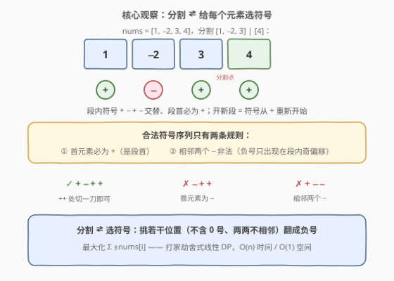
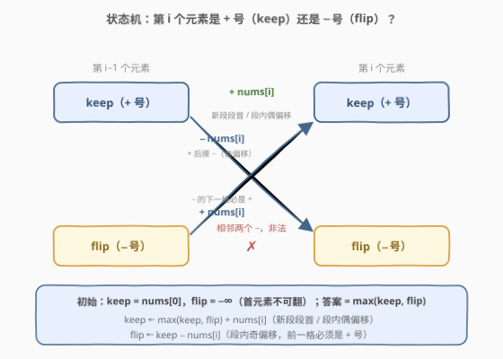

# LeetCode 最大化子数组的总成本 题解

## 1. 题目概述

- **标题 / 题号**：最大化子数组的总成本（#3196，medium）
- **链接**：https://leetcode.cn/problems/maximize-total-cost-of-alternating-subarrays/
- **难度**：中等
- **标签**：数组、动态规划

**题意**：给你一个长度为 $n$ 的整数数组 `nums`。子数组 `nums[l..r]` 的**成本**按「正负交替、首项为正」计算：

$$\text{cost}(l, r) = \text{nums}[l] - \text{nums}[l+1] + \text{nums}[l+2] - \cdots + \text{nums}[r] \cdot (-1)^{r-l}$$

你的任务是将 `nums` **分割**成若干子数组（每个元素恰好属于一个子数组），使所有子数组的成本之和**最大化**。若不分割（$k=1$），总成本即 $\text{cost}(0, n-1)$。

**示例 1**：

```text
输入：nums = [1,-2,3,4]
输出：10
解释：分割成 [1,-2,3] 和 [4]，总成本 (1+2+3) + 4 = 10。
```

**示例 2**：

```text
输入：nums = [1,-1,1,-1]
输出：4
解释：分割成 [1,-1] 和 [1,-1]，总成本 (1+1) + (1+1) = 4。
```

**示例 3**：

```text
输入：nums = [0]
输出：0
解释：无法分割，答案为 0。
```

**示例 4**：

```text
输入：nums = [1,-1]
输出：2
解释：整段选取，成本 1 - (-1) = 2。
```

**约束**：

- $1 \le \text{nums.length} \le 10^5$
- $-10^9 \le \text{nums}[i] \le 10^9$

> 💡 读题两个关键：**① 成本的符号由「段内偏移」决定**——段首永远乘 $+$，其后 $-\ +\ -\ \cdots$ 交替；**② 答案规模**——$n \cdot \max|v|$ 可达 $10^{14}$，C++ 必须 `long long`（题目签名也已如此），int32 必溢。

## 2. 解题思路

### 2.1 暴力思路：枚举分割方案

$n-1$ 条缝隙，每条「切 / 不切」，共 $2^{n-1}$ 种分割方案——$n \le 10^5$ 时是天文数字，不可行。

改良成**分段 DP**：设 $dp[i]$ 为前 $i$ 个元素（`nums[0..i-1]`）的最大总成本，枚举**最后一段**的起点 $j$：

$$dp[i] = \max_{0 \le j < i}\ \big(dp[j] + \text{cost}(j,\ i-1)\big)$$

配合交替前缀和可把单次 $\text{cost}$ 压到 $O(1)$，总体 $O(n^2) = 10^{10}$，依然超时。

> ⚠️ 病灶在状态设计：$dp[i]$ 只记「切到哪」，没记**最后一段的符号相位**（轮到 $+$ 还是 $-$）。相位缺失，只好回退枚举段首。把「当前元素是 $+$ 号还是 $-$ 号」补进状态，转移立刻变 $O(1)$——这正是 2.3 的做法。

### 2.2 核心观察：分割 ⇄ 给每个元素选符号



盯着成本公式看：段内第 $k$ 个元素（从 0 数）乘 $(-1)^k$——**符号在段内 $+\ -\ +\ -$ 交替，段首恒为 $+$**。而「开新段」的全部效果，仅仅是让符号从 $+$ 重新开始。

于是「怎么分段」可以翻译成「**给每个元素定符号**」$s_i \in \{+1, -1\}$，合法条件只有两条：

1. **首元素必为 $+$**（每段的段首都是 $+$）；
2. **相邻两个 $-$ 非法**（$-$ 号只出现在段内奇偏移，天然隔一个出现）。

两个方向的论证：

- **分割 → 符号**：任何合法分割逐段誊写符号，段首 $+$、段内交替，自然满足两条规则；
- **符号 → 分割**：满足两条规则的符号序列，相邻组合只剩 $++$、$+-$、$-+$ 三种。$++$ 相邻处**必须**切一刀（同段内相邻符号必须交替，$++$ 无法同段），$+-$、$-+$ 处可切可不切。在所有 $++$ 处切开后，每段符号恰是 $+\ -\ +\ -\ \cdots$——还原出一个合法分割。

因此**分割的最优值 = 合法符号序列的最优值**：分割到符号虽是多对一（可选切点处切不切都行），但每个合法符号序列都至少被一个分割实现，两个值域重合。目标变成：

$$\max\ \sum_i s_i \cdot \text{nums}[i]$$

> 💡 一句话：**「在哪里分段」等价于「给谁翻负号」**。设翻负号的集合为 $F$（$0 \notin F$、$F$ 内无相邻元素），目标即 $\sum_i \text{nums}[i] - 2\sum_{i \in F} \text{nums}[i]$——在路径图上选一个「无相邻、不含 0 号」的集合最小化带符号权和。**这正是打家劫舍的结构**（[198. 打家劫舍](https://leetcode.cn/problems/house-robber/) 的「选了不能相邻」）。

**贪心为什么不行**：取 `nums = [1, -2, -3]`。翻 $-2$ 得 $1+2-3 = 0$；翻 $-3$ 得 $1-2+3 = 2$；两个都翻则相邻非法。「从左到右见到负数就翻」会先翻 $-2$，错过最优 $2$。翻 $i$ 会**封锁** $i \pm 1$ 的翻转资格——局部决策与全局约束耦合，必须 DP。

### 2.3 状态机 DP：keep / flip



沿 2.2 的语义直接设状态：

- $\text{keep}_i$：第 $i$ 个元素**保持 $+$ 号**时，前缀 `nums[0..i]` 的最大总成本；
- $\text{flip}_i$：第 $i$ 个元素**翻成 $-$ 号**时的最大总成本。

转移方程（对应两条规则的逐格检查）：

$$\text{keep}_i = \max(\text{keep}_{i-1},\ \text{flip}_{i-1}) + \text{nums}[i]$$

$$\text{flip}_i = \text{keep}_{i-1} - \text{nums}[i]$$

- **keep 的两种身份**：$i$ 是**新段的段首**（前一格属于上一段，符号任意）；或 $i$ 是**段内偶偏移**（前一格是奇偏移、即 $-$ 号）。两种身份下前一格的 keep / flip 都可能，取 $\max$；
- **flip 的唯一身份**：$i$ 是段内奇偏移 $\ge 1$，**前一格必为同段偶偏移（$+$ 号）**——前驱只能是 keep。$\text{flip} \to \text{flip}$ 即相邻两个负号，非法。

边界与答案：

$$\text{keep}_0 = \text{nums}[0],\qquad \text{flip}_0 = -\infty,\qquad \text{ans} = \max(\text{keep}_{n-1},\ \text{flip}_{n-1})$$

> 💡 **实现细节**：$\text{flip}_0$ 的 $-\infty$ 可以偷懒写成 $\text{nums}[0]$——它**只**通过 $\max(\text{keep}, \text{flip})$ 影响后续，而初始 $\text{keep}_0 = \text{nums}[0]$ 永远支配它；$\text{flip}$ 的转移又只读 keep。**被支配的非法状态可以用任意足够小的值初始化**，比死磕 $-\infty$ 的溢出边界更稳。

### 2.4 示例演算

![示例演算：nums = [1,−2,3,4]](../images/p3196_example_walkthrough.svg)

以示例 1 演算（`nums = [1,-2,3,4]`）：

| $i$ | nums[i] | keep | flip | 说明 |
|-----|---------|------|------|------|
| 0 | 1 | $1$ | $-\infty$ | 首元素不可翻 |
| 1 | −2 | $\max(1,-\infty)-2 = -1$ | $1-(-2) = 3$ | 符号 $+\ -$：把 $-2$ 翻成 $+2$ |
| 2 | 3 | $\max(-1,3)+3 = 6$ | $-1-3 = -4$ | keep 续在 $+\ -$ 后变 $+\ -\ +$，即段 $[1,-2,3]$ 成本 6 |
| 3 | 4 | $\max(6,-4)+4 = 10$ | $6-4 = 2$ | 6 是整段 $[1,-2,3]$，4 开新段 $[4]$ |

答案 $\max(10, 2) = 10$ ✓。注意 $i=2$ 处 keep 的值来自 **flip 链**（$1 \to 3$）——「翻负号」的收益经由 $\max$ 汇入「保持正号」的续段决策，两条状态线在每一步重新比价。

再验证示例 2（`nums = [1,-1,1,-1]`）：$(1) \to (0,\ 2) \to (3,\ -1) \to (2,\ 4)$，答案 $4$，对应符号 $+\ -\ \vert\ +\ -$，即分割 $[1,-1],\ [1,-1]$ ✓。

## 3. 参考代码

### C++

```cpp
class Solution {
public:
    long long maximumTotalCost(vector<int>& nums) {
        // keep：当前元素保持 + 号的前缀最大成本；flip：翻成 − 号
        long long keep = nums[0], flip = nums[0];   // flip 初值被 keep 支配，取 nums[0] 即可
        for (int i = 1; i < (int)nums.size(); ++i) {
            long long nKeep = max(keep, flip) + nums[i];  // 新段段首 / 段内偶偏移
            long long nFlip = keep - nums[i];             // 段内奇偏移：前一格必须是 + 号
            keep = nKeep;
            flip = nFlip;
        }
        return max(keep, flip);
    }
};
```

### Python

```python
class Solution:
    def maximumTotalCost(self, nums: List[int]) -> int:
        keep = flip = nums[0]              # flip 初值被 keep 支配，取 nums[0] 即可
        for x in nums[1:]:
            keep, flip = max(keep, flip) + x, keep - x
        return max(keep, flip)
```

> 💡 两处工程要点：**① 溢出**——答案规模 $10^{14}$，C++ 全程 `long long`；**② 滚动变量**——转移只依赖上一格的 $(\text{keep}, \text{flip})$，两个变量足够，注意 C++ 要先算好两个新值再统一覆盖（Python 的元组赋值天然完成这件事）。

## 4. 复杂度分析

| 维度 | 复杂度 | 说明 |
|------|--------|------|
| 时间复杂度 | $O(n)$ | 单趟线性扫描，每步 $O(1)$ 转移 |
| 空间复杂度 | $O(1)$ | 仅两个滚动变量 keep / flip |
| 答案规模 | $\le 10^{14}$ | $n \cdot \max\vert\text{nums}[i]\vert = 10^5 \times 10^9$，int32 装不下 |
| 对照：分段 DP | $O(n^2)$ | 状态缺「符号相位」，需枚举最后一段的起点，$10^{10}$ 超时 |

## 5. 扩展：分段 DP + 前缀最值——另一条 $O(n)$ 正路

2.1 的分段 DP 其实还能救：定义**交替前缀和** $A[i] = \sum_{k=0}^{i} (-1)^k\,\text{nums}[k]$，则

$$\text{cost}(l, r) = (-1)^{l}\,\big(A[r] - A[l-1]\big)$$

（由 $(-1)^{k-l} = (-1)^k \cdot (-1)^l$，把公因子 $(-1)^l$ 提到求和号外。）代回 $dp[i] = \max_{j<i}\ dp[j] + \text{cost}(j,\ i-1)$ 并按 $j$ 的奇偶拆开：

$$dp[i] = \max\Big(A[i-1] + \max_{j\ \text{偶}}\big(dp[j] - A[j-1]\big),\quad -A[i-1] + \max_{j\ \text{奇}}\big(dp[j] + A[j-1]\big)\Big)$$

两个前缀 $\max$ 随扫随维护，总体同样 $O(n)$。殊途同归，但要维护两套前缀最值、还得小心 $A[-1]$ 的边界，代码量近乎翻倍。

> 💡 对比启示：**先把问题转化到最贴身的语义（这里是「符号」），再设计状态**，往往能天然避开一堆边角处理——keep/flip 就是把「相位」显式写进 DP 的结果；分段 DP 把相位藏在 cost 里，只好用前缀最值打补丁。另外，从 $\sum_i \text{nums}[i] - 2\sum_{i \in F} \text{nums}[i]$ 的形式看，本题本质是**路径图上的（最小权）独立集**——打家劫舍家族的又一位成员。

## 6. 面试要点

1. **为什么「分割」可以转化成「选符号」？现场把两个方向讲清楚。**

   正向：段首恒为 $+$、段内交替，誊写出的符号序列必满足「首 $+$、无相邻 $-$」。反向：合法符号序列的相邻组合只有 $++/+−/−+$，$++$ 处必须切刀、其余位置可切可不切，切完后每段都是 $+$ 开头的交替串。分割到符号虽是多对一，但每个合法符号序列都可实现，**最优值相等**。

2. **flip 为什么只能从 keep 转移？**

   $i$ 为 $-$ 号 $\Rightarrow$ $i$ 处于段内奇偏移 $\ge 1$ $\Rightarrow$ 前一格同段、偶偏移、$+$ 号。flip → flip 即相邻两个负号，任何分割都不会产生；强行允许会把非法方案计入答案。

3. **flip 初值的 $-\infty$ 用 nums[0] 代替，为什么安全？**

   该初值只经 $\max(\text{keep}, \text{flip})$ 参与后续，被 $\text{keep}_0 = \text{nums}[0]$ 支配，永远赢不了 max；flip 的转移只读 keep。一般化：**被支配的非法状态可用任意足够小的值初始化**——顺便回避了 C++ 里 $-\infty$ 参与加法的溢出陷阱。

4. **什么时候必须用 long long？**

   $n \le 10^5$、$|\text{nums}[i]| \le 10^9$，总和规模 $10^{14} \gg 2^{31}-1 \approx 2.1 \times 10^9$。C++ 中间量与返回值都要 64 位；Python 整数任意精度，无此虑。

5. **本题与打家劫舍家族的关系？**

   同构：选集合 $F$（两两不相邻、不含 0 号）最小化 $\sum_{i \in F} \text{nums}[i]$。[198. 打家劫舍](https://leetcode.cn/problems/house-robber/) 是「选了不能相邻」的母题，[740. 删除并获得点数](https://leetcode.cn/problems/delete-and-earn/) 是值域变形，[3165. 不包含相邻元素的子序列的最大和](https://leetcode.cn/problems/maximum-sum-of-subsequence-with-non-adjacent-elements/) 把同款 DP 搬进线段树支持动态修改——一脉相承的都是「**相邻互斥的 0/1 选择**」结构。

## 同类练习题

| # | 题目 | 与本题的关联 |
|---|------|-------------|
| 198 | [打家劫舍](https://leetcode.cn/problems/house-robber/)（[站内题解](../0101-0200/198_打家劫舍.md)） | keep/flip（不选/选）双状态线性 DP 的母题，本题的「翻负号」就是它的「偷」 |
| 213 | [打家劫舍 II](https://leetcode.cn/problems/house-robber-ii/)（[站内题解](../0201-0300/213_打家劫舍II.md)） | 环上首尾约束、拆环为线——本题「首元素不可翻」是首尾约束的单点弱化版 |
| 740 | [删除并获得点数](https://leetcode.cn/problems/delete-and-earn/)（[站内题解](../0701-0800/740_删除并获得点数.md)） | 按值建桶后回归打家劫舍——「相邻互斥」的另一种建模入口 |
| 3165 | [不包含相邻元素的子序列的最大和](https://leetcode.cn/problems/maximum-sum-of-subsequence-with-non-adjacent-elements/)（[站内题解](../3101-3200/3165_不包含相邻元素的子序列的最大和.md)） | 把同款 $2\times2$ 状态 DP 装进线段树、支持单点修改——本题的动态化进阶 |
