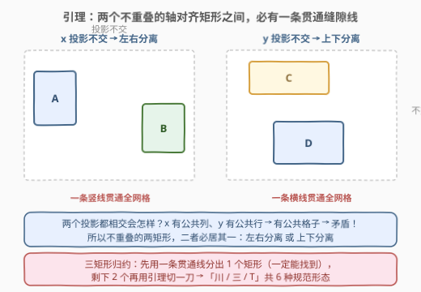
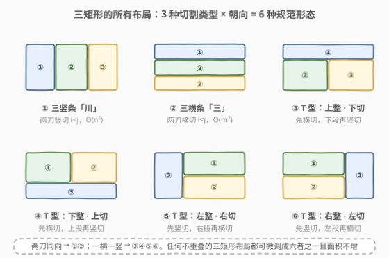
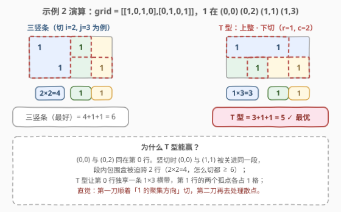

# LeetCode 包含所有 1 的最小矩形面积 II 题解

## 1. 题目概述

- **标题 / 题号**：包含所有 1 的最小矩形面积 II（#3197，hard）
- **链接**：https://leetcode.cn/problems/find-the-minimum-area-to-cover-all-ones-ii/
- **难度**：困难
- **标签**：数组、枚举、矩阵

**题意**：给你一个二维**二进制**数组 `grid`。你需要找到 **3 个**不重叠、面积**非零**、边在**水平方向和竖直方向**上的矩形，并且满足 `grid` 中所有的 1 都在这些矩形的内部。返回这些矩形**面积之和的最小可能值**。

注意，这些矩形**可以相接**（贴边摆放）。

**示例 1**：

```text
输入：grid = [[1,0,1],[1,1,1]]
输出：5
解释：(0,0)、(1,0) 被一个面积为 2 的矩形覆盖；(0,2)、(1,2) 被一个面积为 2 的矩形覆盖；(1,1) 被一个面积为 1 的矩形覆盖。
```

**示例 2**：

```text
输入：grid = [[1,0,1,0],[0,1,0,1]]
输出：5
解释：(0,0)、(0,2) 被一个面积为 3 的矩形覆盖；(1,1) 被一个面积为 1 的矩形覆盖；(1,3) 被一个面积为 1 的矩形覆盖。
```

**约束**：

- $1 \le \text{grid.length},\ \text{grid[i].length} \le 30$
- $\text{grid[i][j]}$ 是 0 或 1
- 输入保证 `grid` 中**至少有三个 1**

> 💡 **审题四个关键**：① 是 [3195. 包含所有 1 的最小矩形面积 I](https://leetcode.cn/problems/find-the-minimum-area-to-cover-all-ones-i/)（[站内题解](../3101-3200/3195_包含所有1的最小矩形面积I.md)）的进阶——从 1 个矩形变成 **3 个**；② 矩形仍然**轴对齐**、仍然只要求盖住 1（盖住的 0 白送，不额外收费也不退款）；③ 三矩形**两两不重叠**但**可以贴边**——这条约束反而帮了我们：它强制三个矩形能被"刀"切开（见 2.2）；④ **恰好 3 个、面积非零**——配合"至少三个 1"，可以证明最优解中每个矩形都至少压住一个 1（见 2.3 的证明），"空段"可以放心淘汰。

## 2. 解题思路

### 2.1 暴力思路：枚举三个矩形的四界

朴素想法：一个轴对齐矩形由 $(r_1, r_2, c_1, c_2)$ 四界唯一决定，$m = n = 30$ 时候选矩形有 $\left(\frac{m(m+1)}{2}\right)^2 \approx 2.2 \times 10^5$ 个，任取 3 个的组合数约 $10^{15}$ 量级，再逐组验证"两两不重叠 + 覆盖所有 1"，天文数字，完全不可行。

但"不重叠"这三个字暗藏结构：**不重叠的矩形之间一定存在缝隙，缝隙是一条贯通整个网格的直线**。把这条性质挖透，搜索空间会从 $10^{15}$ 塌缩到 $O(m^2 + n^2 + mn)$ 个切割方案。

### 2.2 核心观察一：分离引理——不重叠矩形之间必有贯通缝隙线



**引理（两矩形分离）**：设 $A$、$B$ 是两个不重叠的轴对齐矩形。若它们的**列投影不交**（$A$ 的列全部在 $B$ 左边），则存在一条**贯通全网格的竖直缝隙线**分开它们；若列投影相交但**行投影不交**，则存在一条**贯通的水平缝隙线**；若两个投影都相交——列有公共列、行有公共行，则两矩形共享某个格子，与不重叠矛盾。

> 💡 一句话：**不重叠的两矩形，要么左右分，要么上下分，二者必居其一**，且分界处藏着一条贯通线。

**推论（三矩形归约）**：对三个两两不重叠的矩形，先用一条贯通线把其中一个与其余两个分开（取任意一对矩形（比如 $R_1, R_2$）的贯通线，第三个矩形要么整条落在一侧——该侧含两个矩形，再用引理切一刀；要么骑跨这条线——此时它与两侧矩形的投影关系会逼出另一条能把某个矩形单独分出来的贯通线，逐类讨论殊途同归）。于是**任何合法的布局都能等价转化为「一条贯通线 + 剩余一侧再切一刀」**。

### 2.3 核心观察二：三类切割、六种规范形态



把「一条贯通线 + 一侧再来一刀」翻译成切割方案，只有 6 种：

| 形态 | 切法 | 枚举量 |
|------|------|--------|
| ① 三竖条「川」 | 两条贯通竖线，分成左中右三段 | $O(n^2)$ |
| ② 三横条「三」 | 两条贯通横线，分成上中下三段 | $O(m^2)$ |
| ③④ T 型（横刀） | 一条贯通横线，上（或下）段整块、另一段再竖切一刀 | $O(mn)$ |
| ⑤⑥ T 型（竖刀） | 一条贯通竖线，左（或右）段整块、另一段再横切一刀 | $O(mn)$ |

每种形态下，三个矩形就取**各自所在段中 1 的包围盒**（3195 的四变量扫描构件）。关键在于：**对最优解的三个矩形，一定能找到一种形态、一组切割位置，使得每段的 1 恰好是原解中对应矩形盖住的 1**——段的包围盒 $\subseteq$ 原矩形，面积只减不增。所以枚举 6 种形态必能碰到最优值。

**为什么"空段"可以放心淘汰？** 直觉上，一个段里没有 1 时似乎还能塞个 $1 \times 1$ 的"陪跑矩形"。但本题条件下**最优解的每个矩形必定至少压住一个 1**，证明只有三行：

- 反设最优解某矩形 $R_3$ 不含任何 1，所有 1（$\ge 3$ 个）被 $R_1, R_2$ 覆盖；
- 由鸽笼原理，$R_1, R_2$ 中必有一个（设 $R_1$）压住**至少两个** 1，故 $\text{area}(R_1) \ge \text{bbox}(两个 1) \ge 2$，又 $\text{area}(R_2), \text{area}(R_3) \ge 1$（面积非零），总和 $\ge 4$；
- 但"任取三个 1 所在格子各放一个 $1 \times 1$"永远是合法解，面积恰为 $3 < 4$，矛盾。

所以代码里空段直接返回哨兵值 $-1$（或 $+\infty$）淘汰，逻辑零特判。

### 2.4 算法流程：六大形态逐一枚举


1. 写一个函数 `area(r1, r2, c1, c2)`：返回子矩阵 $\text{grid}[r_1..r_2][c_1..c_2]$ 中 1 的包围盒面积（3195 的四变量扫描），段内无 1 返回 $-1$；
2. 枚举三竖条：切点 $1 \le i < j \le n-1$，代价 $= \text{area}(\text{全高}, [0, i)) + \text{area}(\text{全高}, [i, j)) + \text{area}(\text{全高}, [j, n))$；
3. 枚举三横条：切点 $1 \le i < j \le m-1$，同上转置；
4. 枚举 4 种 T 型：横切 $r \in [1, m)$ × 半竖切 $c \in [1, n)$ 的两个朝向，再转置来一遍；
5. 全程维护 `best = min(best, a + b + c)`（任一段为 $-1$ 则跳过该切法），枚举完返回 `best`。

没有 DP、没有贪心——就是**把 6 种刀法全部摆出来算一遍**。

### 2.5 示例演算



**示例 2**：`grid = [[1,0,1,0],[0,1,0,1]]`，1 在 $(0,0), (0,2), (1,1), (1,3)$：

- **三竖条**：无论怎么切，$(0,0)$ 和 $(1,1)$ 总会同段（除非中间段只装 $(0,2)$——比如切 $i=2, j=3$：左段盒子跨 2 行 $2 \times 2 = 4$，中段 $(0,2)$ 为 1，右段 $(1,3)$ 为 1，共 $6$；
- **T 型（上整下切，$r=1, c=2$）**：上段第 0 行的 $(0,0), (0,2)$ 共用一条 $1 \times 3$ 横带 $= 3$；下左段 $(1,1) = 1$，下右段 $(1,3) = 1$，共 $3 + 1 + 1 = 5$ ✓。

答案 5。**直觉**：第一刀顺着 1 的"聚集方向"（这里同行）切，第二刀再去收拾散点。

## 3. 参考代码

### C++

```cpp
class Solution {
  public:
    int minimumSum(vector<vector<int>>& grid) {
        int m = grid.size(), n = grid[0].size();
        // 子矩阵中 1 的包围盒面积；段内无 1 返回 -1（淘汰）
        auto area = [&](int r1, int r2, int c1, int c2) {
            int minR = m, maxR = -1, minC = n, maxC = -1;
            for (int i = r1; i <= r2; ++i)
                for (int j = c1; j <= c2; ++j)
                    if (grid[i][j] == 1) {
                        minR = min(minR, i); maxR = max(maxR, i);
                        minC = min(minC, j); maxC = max(maxC, j);
                    }
            return maxR < 0 ? -1 : (maxR - minR + 1) * (maxC - minC + 1);
        };
        int best = INT_MAX;
        auto upd = [&](int a, int b, int c) {
            if (a > 0 && b > 0 && c > 0) best = min(best, a + b + c);
        };

        for (int i = 1; i < n; ++i)                      // ① 三竖条
            for (int j = i + 1; j < n; ++j)
                upd(area(0, m - 1, 0, i - 1),
                    area(0, m - 1, i, j - 1),
                    area(0, m - 1, j, n - 1));
        for (int i = 1; i < m; ++i)                      // ② 三横条
            for (int j = i + 1; j < m; ++j)
                upd(area(0, i - 1, 0, n - 1),
                    area(i, j - 1, 0, n - 1),
                    area(j, m - 1, 0, n - 1));
        for (int r = 1; r < m; ++r)                      // ③④ T 型：横刀 + 半竖刀
            for (int c = 1; c < n; ++c) {
                upd(area(0, r - 1, 0, n - 1),
                    area(r, m - 1, 0, c - 1),
                    area(r, m - 1, c, n - 1));
                upd(area(r, m - 1, 0, n - 1),
                    area(0, r - 1, 0, c - 1),
                    area(0, r - 1, c, n - 1));
            }
        for (int c = 1; c < n; ++c)                      // ⑤⑥ T 型：竖刀 + 半横刀
            for (int r = 1; r < m; ++r) {
                upd(area(0, m - 1, 0, c - 1),
                    area(0, r - 1, c, n - 1),
                    area(r, m - 1, c, n - 1));
                upd(area(0, m - 1, c, n - 1),
                    area(0, r - 1, 0, c - 1),
                    area(r, m - 1, 0, c - 1));
            }
        return best;
    }
};
```

### Python

```python
class Solution:
    def minimumSum(self, grid: List[List[int]]) -> int:
        m, n = len(grid), len(grid[0])

        def area(r1, r2, c1, c2):          # 段内 1 的包围盒面积；空段返回 -1
            minR, maxR, minC, maxC = m, -1, n, -1
            for i in range(r1, r2 + 1):
                for j in range(c1, c2 + 1):
                    if grid[i][j] == 1:
                        minR, maxR = min(minR, i), max(maxR, i)
                        minC, maxC = min(minC, j), max(maxC, j)
            if maxR < 0:
                return -1
            return (maxR - minR + 1) * (maxC - minC + 1)

        def upd(a, b, c):
            nonlocal best
            if a > 0 and b > 0 and c > 0:
                best = min(best, a + b + c)

        best = inf = float('inf')
        for i in range(1, n):                          # ① 三竖条
            for j in range(i + 1, n):
                upd(area(0, m - 1, 0, i - 1),
                    area(0, m - 1, i, j - 1),
                    area(0, m - 1, j, n - 1))
        for i in range(1, m):                          # ② 三横条
            for j in range(i + 1, m):
                upd(area(0, i - 1, 0, n - 1),
                    area(i, j - 1, 0, n - 1),
                    area(j, m - 1, 0, n - 1))
        for r in range(1, m):                          # ③④ T 型：横刀 + 半竖刀
            for c in range(1, n):
                upd(area(0, r - 1, 0, n - 1),
                    area(r, m - 1, 0, c - 1),
                    area(r, m - 1, c, n - 1))
                upd(area(r, m - 1, 0, n - 1),
                    area(0, r - 1, 0, c - 1),
                    area(0, r - 1, c, n - 1))
        for c in range(1, n):                          # ⑤⑥ T 型：竖刀 + 半横刀
            for r in range(1, m):
                upd(area(0, m - 1, 0, c - 1),
                    area(0, r - 1, c, n - 1),
                    area(r, m - 1, c, n - 1))
                upd(area(0, m - 1, c, n - 1),
                    area(0, r - 1, 0, c - 1),
                    area(r, m - 1, 0, c - 1))
        return best
```

> ⚠️ **两个易错点**：一是 T 型的 4 个朝向（上整/下整 × 左整/右整）**一个都不能漏**，少枚举一个就可能在某些用例上漏掉最优布局；二是 C++ 里别用 `INT_MAX` 当段面积哨兵直接相加——三个 `INT_MAX` 相加会溢出，用 $-1$ + 显式判断最稳。

## 4. 复杂度分析

| 维度 | 复杂度 | 说明 |
|------|--------|------|
| 时间 | $O\big(mn\,(m^2 + n^2 + mn)\big)$ | 枚举 $O(m^2 + n^2 + mn)$ 个切法，每个切法 3 次 `area`，单次 $O(mn)$；$m = n = 30$ 时约 $2.4 \times 10^6$ 次基本操作 |
| 空间 | $O(1)$ | 只维护极值变量与 `best`（不含输入） |
| 对照：枚举三矩形 | $O\left(\binom{(m^2)(n^2)/4}{3}\right)$ | 候选矩形约 $2.2 \times 10^5$ 个，取 3 个的组合约 $10^{15}$，不可行 |
| 优化后（见第 5 节） | $O(mn + m^2 + n^2)$ | 预处理前缀极值，单段面积 $O(1)$ |

## 5. 扩展：从枚举到前缀极值，从 3 个矩形到更远

**优化：$O(1)$ 查段面积。** $m, n \le 30$ 下暴力 `area` 绰绰有余，但若约束放大到 $10^3$ 就得预处理：对**行前缀 / 行后缀 / 列前缀 / 列后缀**各维护四个极值（minR/maxR/minC/maxC），加上 $O(m^2)$（或 ST 表）级别的**任意行区间**极值，即可把每个切法的三段面积降到 $O(1)$，总复杂度 $O(mn + m^2 + n^2)$。这正是 3195「四变量扫描」从构件升级为**前缀数组族**的思路。

**本题的家族谱系。** 3195（一个矩形）→ 本题（三个矩形，两刀切割枚举）是同一条主线；[963. 最小面积矩形 II](https://leetcode.cn/problems/minimum-area-rectangle-ii/)（[站内题解](../0901-1000/963_最小面积矩形II.md)）则是"允许斜放"的分水岭——一旦矩形可旋转，行列解耦失效，要换成凸包 + 旋转卡壳；[3111. 覆盖所有点的最少矩形数目](https://leetcode.cn/problems/minimum-rectangles-to-cover-points/)（[站内题解](../3101-3200/3111_覆盖所有点的最少矩形数目.md)）把"恰好 3 个"放宽为"最少几个宽 $w$ 矩形"，从精确枚举走向贪心。

**矩形个数 $k$ 更大时？** $k = 3$ 靠分类枚举是甜区；$k$ 变大后形态爆炸（非薄板切割布局出现），一般要转向区间 DP 或轮廓线 DP——本题的"两刀六形态"正是 $k$ 小时值得手推的边界。

## 6. 面试要点

1. **为什么 6 种形态就够？一句话给出正确性骨架。**

   - 两矩形引理：投影都相交 ⇒ 有公共格子 ⇒ 重叠，故不重叠两矩形必被一条**贯通线**左右分或上下分；三矩形：先对任意一对取贯通线，第三个矩形要么落在一侧（该侧两矩形再切一刀），要么骑跨（与两侧矩形的投影关系逼出另一条能单独分出一个矩形的贯通线）——最终都归约为「一条贯通线 + 一侧再一刀」= 6 种形态。每段取包围盒，面积只减不增，故枚举必含最优。

2. **空段为什么可以直接淘汰，而不是塞个 $1 \times 1$ 陪跑矩形？**

   - "至少三个 1" + 鸽笼：若最优解有空矩形，另两矩形之一必压 $\ge 2$ 个 1（面积 $\ge 2$），加上两个非零面积至少 $4$；而"任取三个 1 各放一个 $1 \times 1$"永远合法且面积为 3，矛盾。故最优解每段必有 1，哨兵淘汰无损失。

3. **"矩形可以相接"体现在枚举的哪里？**

   - 切点枚举 $i < j$ 允许两刀相邻（$j = i + 1$，中间段恰一行/一列），相邻段的包围盒天然可以贴边；"不重叠"由"段与段无公共格子"自动保证，不需要额外的矩形求交逻辑。

4. **这题为什么不 DP？什么时候必须 DP？**

   - 两刀切完结构就封闭，枚举量 $O(m^2 + n^2 + mn)$ 极小，直接算最稳。当矩形个数 $k$ 增大、或允许更自由的布局时，形态分类爆炸，才需要区间 DP / 轮廓线 DP 这类通用武器。

5. **最容易翻车的实现细节是什么？**

   - T 型 4 个朝向漏枚举（上整/下整 × 竖刀侧、左整/右整 × 横刀侧）；C++ 哨兵值用 `INT_MAX` 直接三段相加溢出；以及切点范围写错（三竖条要求 $1 \le i < j \le n-1$，保证三段都非空）。

## 同类练习题

| # | 题目 | 与本题的关联 |
|---|------|-------------|
| 3195 | [包含所有 1 的最小矩形面积 I](https://leetcode.cn/problems/find-the-minimum-area-to-cover-all-ones-i/)（[站内题解](../3101-3200/3195_包含所有1的最小矩形面积I.md)） | 本题的前置构件——单矩形包围盒的四变量扫描，先会框一个盒子再来切三段 |
| 3111 | [覆盖所有点的最少矩形数目](https://leetcode.cn/problems/minimum-rectangles-to-cover-points/)（[站内题解](../3101-3200/3111_覆盖所有点的最少矩形数目.md)） | 同为轴对齐矩形覆盖，从"恰好 3 个"变"最少几个宽 $w$ 盒子"，贪心替代枚举 |
| 963 | [最小面积矩形 II](https://leetcode.cn/problems/minimum-area-rectangle-ii/)（[站内题解](../0901-1000/963_最小面积矩形II.md)） | 矩形允许斜放的分水岭，凸包 + 旋转卡壳，对照理解"轴对齐才解耦" |
| 939 | [最小面积矩形](https://leetcode.cn/problems/minimum-area-rectangle/) | 给定点集找四个角能围成矩形的最小面积，哈希角点 + 枚举对角线，矩形家族的又一基本形态 |
| 836 | [矩形重叠](https://leetcode.cn/problems/rectangle-overlap/)（[站内题解](../0801-0900/836_矩形重叠.md)） | 轴对齐矩形基本操作之判交——本题"不重叠"约束的投影判定正是它的逆命题 |
