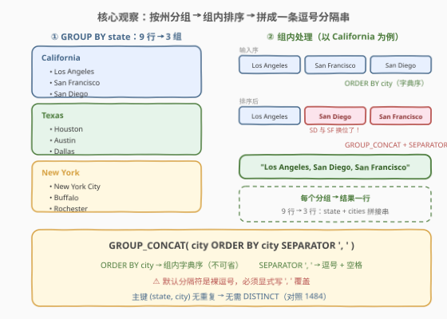
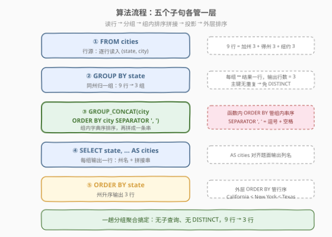
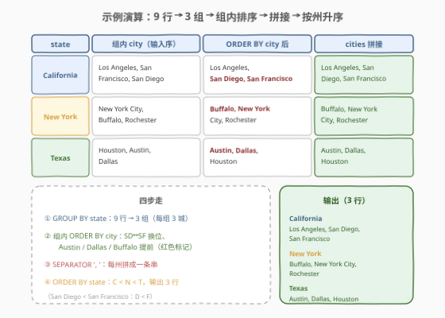

# 查找每个州的城市

- **题目名称**：查找每个州的城市
- **链接**：[3198. 查找每个州的城市 🔒](https://leetcode.cn/problems/find-cities-in-each-state/)
- **难度**：简单
- **标签**：数据库、SQL、GROUP BY、GROUP_CONCAT、聚合函数、字符串聚合、LeetCode 锁题

## 1. 题目概述

> ⚠️ 本题为 LeetCode 付费题，题意描述根据官方示例用例与 hints 重建，可能与官方题面有出入。

给定 `cities` 表，每行记录一个州名 `state` 与该州的一个城市名 `city`。编写解决方案，**查找每个州的所有城市**，并将它们组合成**一条逗号分隔**的字符串；结果按 `state` 与 `city` **升序**返回。

**表结构**：

```text
Table: cities
+-------------+---------+
| Column Name | Type    |
+-------------+---------+
| state       | varchar |
| city        | varchar |
+-------------+---------+
(state, city) 是这张表的主键（具有唯一值的列组合）。
该表每一行包含州名和其中的城市名。
```

**示例 1**：

```text
输入：
cities 表：
+-------------+---------------+
| state       | city          |
+-------------+---------------+
| California  | Los Angeles   |
| California  | San Francisco |
| California  | San Diego     |
| Texas       | Houston       |
| Texas       | Austin        |
| Texas       | Dallas        |
| New York    | New York City |
| New York    | Buffalo       |
| New York    | Rochester     |
+-------------+---------------+

输出：
+-------------+---------------------------------------+
| state       | cities                                |
+-------------+---------------------------------------+
| California  | Los Angeles, San Diego, San Francisco |
| New York    | Buffalo, New York City, Rochester     |
| Texas       | Austin, Dallas, Houston               |
+-------------+---------------------------------------+
解释：
- California：所有城市 ("Los Angeles", "San Diego", "San Francisco") 以逗号分隔的字符串列出。
- New York：所有城市 ("Buffalo", "New York City", "Rochester") 以逗号分隔的字符串列出。
- Texas：所有城市 ("Austin", "Dallas", "Houston") 以逗号分隔的字符串列出。
注意：输出表以州名升序排序。
```

**约束条件**：

- `(state, city)` 为主键——同一州内城市不重复，同一城市只出现在一行
- 每个州的所有城市拼成**一条**逗号分隔字符串，分隔符为「逗号 + 空格」`', '`
- 组内城市按 `city` **字典序升序**排列——示例输入中 `San Francisco` 在 `San Diego` 之前，输出被排成 `San Diego, San Francisco`
- 结果按 `state` 升序排列，输出两列 `state` 与 `cities`

> 💡 **审题关键**：① 「每个州的所有城市 → 一条字符串」是**组内字符串聚合**，MySQL 的 `GROUP_CONCAT` 招牌场景；② 分隔符是 `', '`（逗号**加空格**），不是裸逗号——对照 1484 的 `','`；③ 组内要按 `city` 排序——`GROUP_CONCAT` 内置 `ORDER BY` 子句；④ 主键保证组内无重复——**无需 `DISTINCT`**（与 1484 无主键必须去重形成对照）。

---

## 2. 解题思路

### 2.1 暴力思路：应用层分组拼接

最直觉的过程式思维：取出全部行，在应用层按 `state` 分桶，桶内排序后以 `', '` join：

```text
groups = defaultdict(list)
for state, city in rows:
    groups[state].append(city)
for state, cities in groups.items():
    emit(state, ', '.join(sorted(cities)))
```

逻辑完全正确——而 SQL 恰有声明式表达「分组 + 组内排序拼接」的聚合函数：**`GROUP_CONCAT`**。它把 `GROUP BY` 产生的每个分组内的多行值，按指定顺序、以指定分隔符拼接成一条字符串，一条查询即得全部结果。

### 2.2 核心观察：GROUP BY 分组 + GROUP_CONCAT 组内排序拼接



把题意落到 SQL 机制上：

| 题意要求 | SQL 机制 | 语义 |
|----------|----------|------|
| 「每个州」 | `GROUP BY state` | 按州分组，每州输出一行 |
| 「所有城市拼成一条」 | `GROUP_CONCAT(city ...)` | 组内多行的 city 聚合成一条字符串 |
| 「城市升序」 | `GROUP_CONCAT(city ORDER BY city ...)` | 拼接前在组内按 city 字典序排序 |
| 「逗号分隔」 | `SEPARATOR ', '` | 以「逗号 + 空格」分隔各城市 |
| 「按州升序返回」 | `ORDER BY state` | 结果集按州名排序 |

形式化地，设州 $s$ 的城市集合为 $C_s = \{c_1, c_2, \dots, c_k\}$，则输出该州的一行为

$$
\text{cities}(s) \;=\; \texttt{GROUP\_CONCAT}\bigl(c \;\texttt{ORDER BY}\; c \;\texttt{SEPARATOR}\; \texttt{',\ '}\bigr) \;=\; c_{(1)},\; c_{(2)},\; \dots,\; c_{(k)}
$$

其中 $c_{(1)} \le c_{(2)} \le \dots \le c_{(k)}$ 为组内城市字典序排列。输出行数 = 不同州数（分组数），本题即 9 行 → 3 行。

> 💡 **为什么不需要 `DISTINCT`？** 表以 `(state, city)` 为主键——同一州内城市天然不重复，`GROUP_CONCAT(city ...)` 直接拼不会出现重复城市。对照 [1484. 按日期分组销售产品](../1401-1500/1484_按日期分组销售产品.md)：其表**无主键**、允许重复，必须 `GROUP_CONCAT(DISTINCT product ...)` 去重。「聚合要不要 `DISTINCT`」由**表约束**决定，这是两题最核心的对照点。

> ⚠️ **两个易错细节**：① 分隔符是 `', '`（逗号 + 空格）而非 `','`——示例输出 `Los Angeles, San Diego` 逗号后有空格，照抄裸逗号会判错；② 组内排序**不能省**——`GROUP_CONCAT(city)` 不带 `ORDER BY` 时按组内扫描顺序拼接，输入序 `Los Angeles, San Francisco, San Diego` 会原样拼出、不符合字典序要求。

### 2.3 算法流程



**逻辑执行步骤**：

| 步骤 | 子句 | 作用 |
|------|------|------|
| ① | `FROM cities` | 行源：逐行读入 `(state, city)` |
| ② | `GROUP BY state` | 按州分组，同州所有行归入一组 |
| ③ | `GROUP_CONCAT(city ORDER BY city SEPARATOR ', ')` | 组内按 city 升序排序，再以 `', '` 拼成一条字符串 |
| ④ | `SELECT state, ... AS cities` | 每组输出一行：州名 + 拼接串 |
| ⑤ | `ORDER BY state` | 结果按州名升序输出 |

> 💡 **两层排序互不干扰**：`GROUP_CONCAT` **函数体内**的 `ORDER BY city` 管**组内串序**——决定一条字符串里城市出现的先后；**外层**的 `ORDER BY state` 管**结果集行序**——决定各州行的先后。二者作用层级不同，互不替代，本题两处都要写。

### 2.4 示例演算

以示例的 9 行 `cities` 为例，走一遍「分组 → 组内排序 → 拼接 → 州排序」全过程：



| state | 组内 city（输入序） | ORDER BY city 后 | cities（拼接结果） |
|-------|--------------------|------------------|--------------------|
| California | Los Angeles, San Francisco, San Diego | Los Angeles, **San Diego**, San Francisco | `Los Angeles, San Diego, San Francisco` |
| New York  | New York City, Buffalo, Rochester | **Buffalo**, New York City, Rochester | `Buffalo, New York City, Rochester` |
| Texas     | Houston, Austin, Dallas | **Austin, Dallas**, Houston | `Austin, Dallas, Houston` |

- **第 ① 步**：`GROUP BY state` 把 9 行归为 3 组（California / New York / Texas 各 3 行）；
- **第 ② 步**：每组内按 `city` 字典序排序——California 组 `San Diego` 与 `San Francisco` 换位（San **D** < San **F**），Texas 组 `Austin`、`Dallas` 提到 `Houston` 之前，New York 组 `Buffalo` 提到 `New York City` 之前；
- **第 ③ 步**：每组以 `', '` 拼接成一条字符串；
- **第 ④ 步**：`ORDER BY state` 按州名升序输出：`California < New York < Texas`（C < N < T）。

> 💡 **换位验证**：三个组的输入序都与字典序不同——New York 州的 `New York City` 从首位退到中间、Texas 州的 `Houston` 从首位退到末位、California 州的 `San Diego` 从末位升到中间。这是 `ORDER BY city` 不可省略的直接证据。

---

## 3. 参考代码

### SQL（解法 A：GROUP BY + GROUP_CONCAT，推荐）

```sql
# Write your MySQL query statement below
SELECT state,
       GROUP_CONCAT(city ORDER BY city SEPARATOR ', ') AS cities
FROM cities
GROUP BY state
ORDER BY state;
```

> 💡 **写法要点**：
> - `GROUP BY state`：按州分组，每州输出一行（9 行 → 3 行）。
> - `GROUP_CONCAT(city ORDER BY city SEPARATOR ', ')`：`ORDER BY city` 拼接前组内字典序排序；`SEPARATOR ', '` 指定「逗号 + 空格」分隔（默认是裸逗号 `','`，必须显式覆盖）。
> - `AS cities`：与题面输出列名对齐。
> - 无 `DISTINCT`：`(state, city)` 主键保证组内无重复。
> - `ORDER BY state`：题面要求按州升序返回。

### SQL（解法 B：相关子查询，暴力对照）

```sql
SELECT DISTINCT s.state,
       (SELECT GROUP_CONCAT(city ORDER BY city SEPARATOR ', ')
        FROM cities c
        WHERE c.state = s.state) AS cities
FROM cities s
ORDER BY s.state;
```

> ⚠️ **暴力的问题**：外层先对 `state` 去重得到 3 个州，再对每州跑一次**相关子查询**做排序拼接——$d$ 个州即 $d$ 次独立扫描过滤，对同一份数据重复做工。解法 A 一次 `GROUP BY` 一趟聚合即得，渐近复杂度相同但常数更小、写法更短。面试写解法 A，此解仅作理解对照。

### Python（pandas）

```python
import pandas as pd

def find_cities(cities: pd.DataFrame) -> pd.DataFrame:
    result = (
        cities.groupby('state')['city']
        .apply(lambda x: ', '.join(sorted(x)))
        .reset_index()
    )
    result.columns = ['state', 'cities']
    return result
```

> 💡 **pandas 对照**：`groupby('state')` 对应 `GROUP BY state`（pandas 默认按组键升序，天然满足「按州升序」）；`sorted(x)` 对应 `GROUP_CONCAT` 内的 `ORDER BY city`；`', '.join(...)` 对应 `SEPARATOR ', '`。若表无主键可重复（如 1484），改成 `sorted(x.unique())` 对应 `DISTINCT`。

---

## 4. 复杂度分析

| 维度 | 解法 A（GROUP_CONCAT） | 解法 B（子查询） | pandas |
|------|------------------------|------------------|--------|
| **时间复杂度** | $O(n \log n)$ | $O(n \log n)$ | $O(n \log n)$ |
| **空间复杂度** | $O(d \cdot \ell)$ | $O(d \cdot \ell)$ | $O(n + d \cdot \ell)$ |
| **扫描次数** | 1 次（单趟分组聚合） | $d$ 次（每州一查） | 1 次 |
| **代码行数** | 5 行 | 7 行 | 7 行 |

- $n$ = `cities` 行数，$d$ = 不同州数，$\ell$ = 每州拼接串的平均长度。
- **时间**：分组 $O(n)$；组内排序合计 $\sum_i k_i \log k_i \le n \log n$；外层 `ORDER BY state` 再 $O(d \log d)$，总体 $O(n \log n)$。
- **空间**：输出 $d$ 条、每条平均 $\ell$ 字符，即 $O(d \cdot \ell)$——这是答案本身的规模，不可避免。
- 解法 B 的 $d$ 次相关子查询在数据量大时放大常数；LeetCode 数据量小，两种写法都能通过。

---

## 5. 扩展：GROUP_CONCAT 的坑与续作

### 5.1 `group_concat_max_len` 截断

MySQL 默认 `GROUP_CONCAT` 结果上限为 **1024 字节**，超出会被**静默截断**（只给 warning 不报错）。生产环境长拼接前应先调大：

```sql
SET SESSION group_concat_max_len = 1000000;
```

> ⚠️ LeetCode 数据量小不会触发；真实业务里「拼接每省所有城市」这类长串很容易超过 1024 字节——这是 `GROUP_CONCAT` 最著名的生产坑。

### 5.2 跨数据库等价写法

| 数据库 | 函数 | 本题写法 |
|--------|------|----------|
| MySQL | `GROUP_CONCAT` | `GROUP_CONCAT(city ORDER BY city SEPARATOR ', ')` |
| PostgreSQL | `STRING_AGG` | `STRING_AGG(city, ', ' ORDER BY city)` |
| SQL Server 2017+ | `STRING_AGG` | `STRING_AGG(city, ', ') WITHIN GROUP (ORDER BY city)` |
| Oracle | `LISTAGG` | `LISTAGG(city, ', ') WITHIN GROUP (ORDER BY city)` |

`GROUP_CONCAT` 是 MySQL 专有函数；其余库的等价写法都是「聚合函数 + 组内排序子句」的组合，思想完全一致，仅语法不同。

### 5.3 续作：3328. 查找每个州的城市 II

本题的官方续作 [3328. 查找每个州的城市 II 🔒](https://leetcode.cn/problems/find-cities-in-each-state-ii/)（中等）在同一张 `cities` 表上把输出格式规则升级（更多约束的列表拼接），核心工具仍是 `GROUP_CONCAT`（可对条件表达式聚合）——先吃透本题的「分组 + 组内排序 + 分隔符」三件套，续作只是格式化规则的叠加。

---

## 6. 面试要点

1. **`GROUP_CONCAT` 里的 `ORDER BY` 与外层 `ORDER BY` 是什么关系？**

   > 两个 `ORDER BY` 作用于不同层级：`GROUP_CONCAT(city ORDER BY city)` **函数体内**的管**组内串序**——决定一条字符串里城市出现的先后；**外层**的 `ORDER BY state` 管**结果集行序**——决定各州行的先后。二者互不替代、互不干扰，本题两处都要写。

2. **本题为什么不用 `DISTINCT`？1484 却必须用？**

   > 由表约束决定。本题 `(state, city)` 是主键，组内城市天然无重复，加 `DISTINCT` 属冗余；1484 的表无主键、允许重复行，不去重会把重复产品拼进串里。**「无主键 → 聚合前想 DISTINCT」**是通用检查项。

3. **分隔符写成 `','` 会怎样？**

   > 会判错。示例输出为 `Los Angeles, San Diego, San Francisco`——逗号后带**一个空格**，分隔符是 `', '`。而 `GROUP_CONCAT` 的默认 `SEPARATOR` 恰好是裸逗号 `','`，必须显式写 `SEPARATOR ', '` 覆盖。审题时以示例输出的空白细节为准。

4. **`GROUP_CONCAT` 在生产环境有什么坑？**

   > 两个：① 默认 `group_concat_max_len = 1024` 字节，超长**静默截断**，长拼接前应 `SET SESSION group_concat_max_len = ...`；② 它是 MySQL 专有函数，PostgreSQL/SQL Server 用 `STRING_AGG`、Oracle 用 `LISTAGG`，跨库迁移需替换函数与语法。

5. **如果还要求输出每州的城市数量，怎么改？**

   > 在同一 `GROUP BY` 中**并联**一个聚合即可：`SELECT state, GROUP_CONCAT(...) AS cities, COUNT(*) AS cnt FROM cities GROUP BY state`。同一分组的多个聚合函数共享一趟分组扫描、并行求值，无需子查询——与 1484 的 `COUNT(DISTINCT)` + `GROUP_CONCAT` 同范式。

> 💡 **一句话总结**：3198 是 `GROUP_CONCAT` 的标准入门题——`GROUP BY state` 分组、`ORDER BY city` 组内排序、`SEPARATOR ', '` 逗号加空格拼接、外层 `ORDER BY state` 州升序。四要素各管一层；主键无重复故免 `DISTINCT`，与 1484 的「无主键 + DISTINCT + 裸逗号」形成完美对照组。

---

## 7. 同类练习题

- [1484. 按日期分组销售产品](https://leetcode.cn/problems/group-sold-products-by-the-date/)（[题解](../1401-1500/1484_按日期分组销售产品.md)）：`GROUP_CONCAT` 招牌题——无主键需 `DISTINCT`、裸逗号 `','` 分隔，与本题「主键免 DISTINCT、`', '` 分隔」逐项对照
- [2199. 找到每篇文章的主题](https://leetcode.cn/problems/finding-the-topic-of-each-post/)（[题解](../2101-2200/2199_找到每篇文章的主题.md)）：`GROUP_CONCAT` 按组拼接标签串，练同一函数在不同表结构下的复用
- [1741. 查找每个员工花费的总时间](https://leetcode.cn/problems/find-total-time-spent-by-each-employee/)（[题解](../1701-1800/1741_查找每个员工花费的总时间.md)）：`GROUP BY` + 数值聚合入门，对照本题的字符串聚合——「一组多行 → 一行」的两种聚合形态
- [2356. 每位教师所教授的科目种类的数量](https://leetcode.cn/problems/number-of-unique-subjects-taught-by-each-teacher/)（[题解](../2301-2400/2356_每位教师所教授的科目种类的数量.md)）：`GROUP BY` + `COUNT(DISTINCT)` 去重计数，体会「主键 vs 无主键」对要不要 DISTINCT 的影响
- [3328. 查找每个州的城市 II 🔒](https://leetcode.cn/problems/find-cities-in-each-state-ii/)：本题官方续作（中等），同一张表上格式化规则升级，检验 `GROUP_CONCAT` 组内排序与分隔符的熟练度
