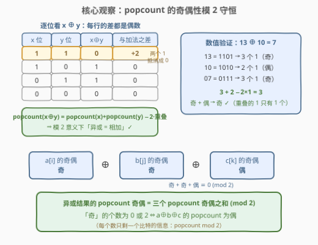
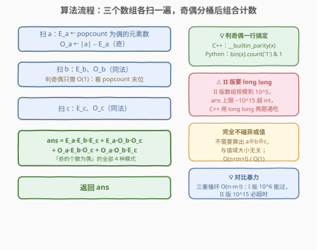
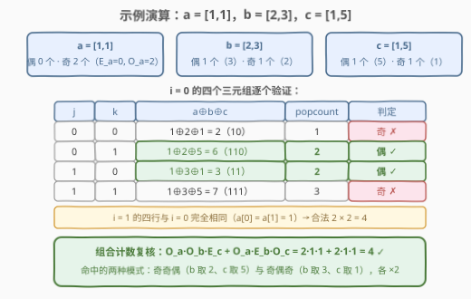

# LeetCode 用偶数异或设置位计数三元组 I 题解

## 1. 题目概述

- **标题 / 题号**：用偶数异或设置位计数三元组 I（#3199，easy）
- **链接**：https://leetcode.cn/problems/count-triplets-with-even-xor-set-bits-i/
- **难度**：简单
- **标签**：位运算、数组

> ⚠️ 本题为 LeetCode 付费题，题意描述根据官方示例用例与 hints 重建，可能与官方题面有出入。

**题意**：给你三个整数数组 `a`、`b`、`c`。对每个三元组 $(i, j, k)$（$0 \le i < |a|$，$0 \le j < |b|$，$0 \le k < |c|$）计算 $a[i] \oplus b[j] \oplus c[k]$（$\oplus$ 为按位异或），请统计其**置位位数**（二进制表示中 1 的个数，即 popcount）为**偶数**（0 也是偶数）的三元组数目。

**示例 1**：

```text
输入：a = [1], b = [2], c = [3]
输出：1
解释：唯一的三元组：1 ⊕ 2 ⊕ 3 = 0。0 没有任何置位位，0 是偶数，计入答案。
```

**示例 2**：

```text
输入：a = [1,1], b = [2,3], c = [1,5]
输出：4
解释：8 个三元组中，(0,0,1)、(0,1,0)、(1,0,1)、(1,1,0) 的异或结果依次为
6、3、6、3，置位位数均为 2（偶数）；其余 4 个三元组的异或结果为 2 或 7，
置位位数为 1 或 3（奇数），不计入。
```

**约束条件**（付费题，官方约束未能获取；按 I/II 双胞胎惯例与 hint「枚举所有三元组」重建）：

- $1 \le |a|, |b|, |c| \le 100$
- $1 \le a[i], b[j], c[k] \le 10^9$

> 💡 **审题关键**：判定只取决于 popcount 的**奇偶**，与数值大小完全无关——I 版规模小、三重暴力能过；II 版 [3215](https://leetcode.cn/problems/count-triplets-with-even-xor-set-bits-ii/) 放大规模后必须用 2.2 的奇偶分桶。本篇按正解写，一次到位。

## 2. 解题思路

### 2.1 暴力思路：三重循环逐个判定

约束下三元组至多 $100^3 = 10^6$ 个，每个算一次 popcount 即可通过：

```cpp
class Solution {
  public:
    int countTriplets(vector<int>& a, vector<int>& b, vector<int>& c) {
        int ans = 0;
        for (int x : a)
            for (int y : b)
                for (int z : c)
                    ans += (__builtin_popcount(x ^ y ^ z) % 2 == 0);
        return ans;
    }
};
```

I 版能 AC，但把数组放大到 $10^5$ 后是 $10^{15}$ 次运算——正解必须摆脱「真的算出异或值」。

### 2.2 核心观察：popcount 奇偶性模 2 守恒



逐位看两个数的异或，一共只有四种位型：

| $x$ 的位 | $y$ 的位 | $x \oplus y$ 的位 | 加法侧贡献 | 异或侧贡献 | 差 |
|----------|----------|------------------|-----------|-----------|-----|
| 1 | 1 | 0 | 2 | 0 | $+2$ |
| 1 | 0 | 1 | 1 | 1 | $0$ |
| 0 | 1 | 1 | 1 | 1 | $0$ |
| 0 | 0 | 0 | 0 | 0 | $0$ |

每一行的差都是**偶数**（双 1 位抵消时恰好差 2），逐位求和便得到恒等式：

$$\operatorname{popcount}(x \oplus y) = \operatorname{popcount}(x) + \operatorname{popcount}(y) - 2 \cdot \operatorname{popcount}(x \,\&\, y)$$

**模 2 意义下「异或 = 相加」**。归纳到三个数：

$$\operatorname{popcount}(a[i] \oplus b[j] \oplus c[k]) \equiv \operatorname{popcount}(a[i]) + \operatorname{popcount}(b[j]) + \operatorname{popcount}(c[k]) \pmod 2$$

于是「异或结果 popcount 为偶」$\iff$ 三个数中 **popcount 为奇的个数是偶数（0 个或 2 个）**——这正是 II 版 hint 给出的结论。每个元素从此只剩一个比特的信息（popcount 的奇偶），按奇偶把三个数组各分两桶，组合计数：

$$\text{ans} = E_a E_b E_c + E_a O_b O_c + O_a E_b O_c + O_a O_b E_c$$

其中 $E_x$ / $O_x$ 为数组 $x$ 中 popcount 为偶 / 奇的元素个数。四项恰对应「奇的个数为偶」的全部四种模式：**偶偶偶**（0 个奇）与**奇奇偶 / 奇偶奇 / 偶奇奇**（2 个奇的三种位置）。

### 2.3 算法流程：奇偶分桶 + 组合计数



1. 扫 `a`：统计 $E_a$（popcount 为偶的个数），$O_a = |a| - E_a$；
2. 同法扫 `b`、`c` 得 $E_b, O_b, E_c, O_c$；
3. 套 2.2 的四项公式，一次乘加出答案。

判奇偶一行搞定：C++ 用 `__builtin_parity(x)`（即 popcount 的最低位），Python 用 `bin(x).count('1') & 1`。

### 2.4 示例演算



以 `a = [1,1], b = [2,3], c = [1,5]` 为例。分桶：$E_a = 0, O_a = 2$（1 的 popcount 是 1，奇）；$E_b = 1, O_b = 1$（3 → 两个 1 偶，2 → 一个 1 奇）；$E_c = 1, O_c = 1$（5 → 偶，1 → 奇）。

组合公式：$\text{ans} = 0 \cdot 1 \cdot 1 + 0 \cdot 1 \cdot 1 + 2 \cdot 1 \cdot 1 + 2 \cdot 1 \cdot 1 = 4$，与暴力枚举 8 个三元组的结果一致 ✓。命中的是「奇奇偶」（$O_a O_b E_c$：b 取 2、c 取 5）与「奇偶奇」（$O_a E_b O_c$：b 取 3、c 取 1）两种模式，$a$ 的两个 1 各贡献一次倍数。

## 3. 参考代码

> ⚠️ 付费题官方代码签名未能获取，以下按题意推断为 `countTriplets(a, b, c)`，提交时按实际签名微调即可。

### C++

```cpp
class Solution {
  public:
    long long countTriplets(vector<int>& a, vector<int>& b, vector<int>& c) {
        auto evenCnt = [](vector<int>& v) {
            long long e = 0;
            for (int x : v) e += (__builtin_parity(x) == 0);
            return e;
        };
        long long ea = evenCnt(a), oa = (long long)a.size() - ea;
        long long eb = evenCnt(b), ob = (long long)b.size() - eb;
        long long ec = evenCnt(c), oc = (long long)c.size() - ec;
        return ea * eb * ec    // 偶 偶 偶
             + ea * ob * oc    // 偶 奇 奇
             + oa * eb * oc    // 奇 偶 奇
             + oa * ob * ec;   // 奇 奇 偶
    }
};
```

### Python

```python
class Solution:
    def countTriplets(self, a: List[int], b: List[int], c: List[int]) -> int:
        def split(v):
            e = sum(bin(x).count('1') & 1 == 0 for x in v)
            return e, len(v) - e
        ea, oa = split(a)
        eb, ob = split(b)
        ec, oc = split(c)
        return ea * eb * ec + ea * ob * oc + oa * eb * oc + oa * ob * ec
```

> 💡 答案上限 $|a| \cdot |b| \cdot |c|$：I 版 `int` 足够；II 版规模至 $10^5$ 时乘积达 $10^{15}$，C++ 用 `long long`、Python 天然大整数，同一份代码两题通吃。

## 4. 复杂度分析

| 维度 | 复杂度 | 说明 |
|------|--------|------|
| 时间 | $O(n + m + l)$ | 三个数组各扫一遍，每个元素一次 popcount 奇偶判定（$O(1)$） |
| 空间 | $O(1)$ | 只需 6 个计数器 |

> 💡 对比暴力 $O(nml)$：I 版 $10^6$ 次运算无感；II 版 $10^{15}$ 次，相差 **9 个数量级**——这正是同一题面拆成 I/II 两版的用意：I 版收留暴力，II 版逼出奇偶分桶。

## 5. 扩展

### 5.1 闭式解：符号和一击必杀

令 $s_x = E_x - O_x$（数组 $x$ 的「符号和」：每个元素按 popcount 奇偶贡献 $\pm 1$）。在全体三元组上，每个偶数结果贡献 $+1$、奇数结果贡献 $-1$，而 $(-1)^{\operatorname{popcount}}$ 可以按数组拆开成三因子的乘积：

$$\#\text{偶} - \#\text{奇} = s_a \cdot s_b \cdot s_c, \qquad \#\text{偶} + \#\text{奇} = n_a n_b n_c$$

两式相加除二即得闭式：

$$\text{ans} = \frac{n_a n_b n_c + s_a s_b s_c}{2}$$

示例 2 验证：$s_a = 0 - 2 = -2$，$s_b = s_c = 0$，$\text{ans} = (8 + 0) / 2 = 4$ ✓。它与 2.2 的四项公式完全等价（$s_x \equiv n_x \pmod 2$ 保证整除）。「把奇偶判定变成乘 $\pm 1$ 求和」是奇偶计数题的通用武器。

### 5.2 II 版（3215）：同一份代码直接提交

[3215. 用偶数异或设置位计数三元组 II](https://leetcode.cn/problems/count-triplets-with-even-xor-set-bits-ii/)（中等）同题面放大规模：

- 暴力 $O(nml)$ 必超时，奇偶分桶 $O(n + m + l)$ 稳过；
- 答案上限约 $10^{15}$，C++ 必须 `long long`（参考代码已就位）。

## 6. 面试要点

1. **为什么不需要真的算出 $a[i] \oplus b[j] \oplus c[k]$？**

   - 判定只依赖其 popcount 的**奇偶**，而奇偶满足模 2 守恒：等于三个数 popcount 之和的奇偶；
   - 每个数被无损压缩成一个比特（popcount mod 2），信息不多不少，异或值本身是冗余的。

2. **逐位解释 $\operatorname{popcount}(x \oplus y) \equiv \operatorname{popcount}(x) + \operatorname{popcount}(y) \pmod 2$？**

   - 双 1 位：加法侧贡献 2、异或侧贡献 0，差恰好是 2；其余三种位型差均为 0；
   - 逐位差的合计是 $2 \cdot \operatorname{popcount}(x \,\&\, y)$，必为偶数，故模 2 同余成立。

3. **四项组合公式如何保证不重不漏？**

   - 三元组的奇偶模式共 $2^3 = 8$ 种，「奇的个数为偶」的恰有 4 种：偶偶偶、奇奇偶、奇偶奇、偶奇奇；
   - 四种模式两两互斥且穷尽所有合法情形，每种内任取都合法，各贡献三个桶计数之积。

4. **`(−1)^popcount` 的符号和技巧还能用在哪？**

   - 任何「统计奇偶两种结果次数之差」的场合都能用：本题把它化成三因子乘积直接得闭式；
   - 本质是把奇偶判定嵌入乘法（$+1$ 不改变符号、$-1$ 翻转符号），与哈希计数中「只存余数/奇偶」是同一压缩思想。

5. **II 版提交要注意什么？**

   - 算法与代码零改动，只看数据类型：答案上限约 $10^{15}$ 超 `int`，C++ 用 `long long`；
   - Python 无溢出问题，直接提交即可。

## 同类练习题

| # | 题目 | 与本题的关联 |
|---|------|-------------|
| 3215 | [用偶数异或设置位计数三元组 II](https://leetcode.cn/problems/count-triplets-with-even-xor-set-bits-ii/) | 同题面放大规模，本文奇偶分桶即其正解 |
| 191 | [位 1 的个数](https://leetcode.cn/problems/number-of-1-bits/)（[站内题解](../0001-0100/191_位1的个数.md)） | popcount 与 $n \& (n-1)$ 技巧的母题 |
| 1863 | [所有子集的异或总和](https://leetcode.cn/problems/sum-of-all-subset-xor-totals/)（[站内题解](../1801-1900/1863_所有子集的异或总和.md)） | 在异或结果上做求和统计的枚举版，对比本题只取奇偶 |
| 2425 | [所有数对的异或和](https://leetcode.cn/problems/bitwise-xor-of-all-pairings/)（[站内题解](../2401-2500/2425_所有数对的异或和.md)） | 配对异或中「逐位独立数 1 的个数」的同款思想 |
| 2997 | [使数组异或和等于 K 的最少操作次数](https://leetcode.cn/problems/minimum-number-of-operations-to-make-array-xor-equal-to-k/)（[站内题解](../2901-3000/2997_使数组异或和等于K的最少操作次数.md)） | 逐位独立统计 1 的个数的奇偶，popcount 家族直接应用 |
