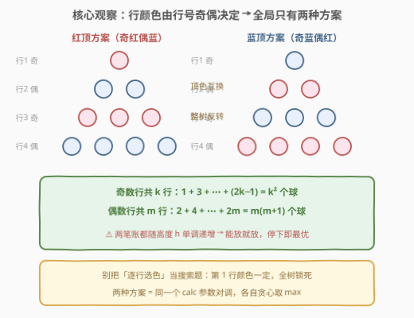
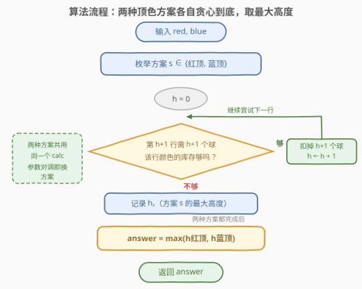
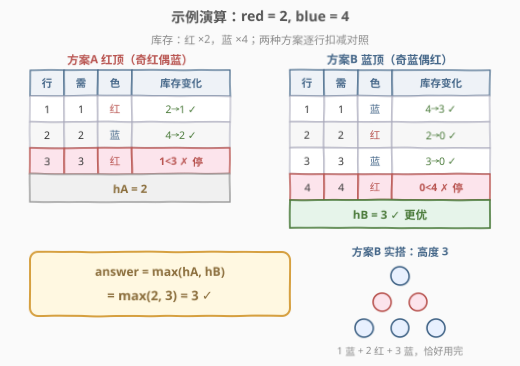

# 三角形的最大高度

- **题目名称**：三角形的最大高度
- **链接**：[3200. 三角形的最大高度](https://leetcode.cn/problems/maximum-height-of-a-triangle/)
- **难度**：简单
- **标签**：数组、枚举

## 1. 题目概述

给你两个整数 `red` 和 `blue`，分别表示红球和蓝球的数量。你需要用这些球来构成一个三角形：第 1 行有 1 个球，第 2 行有 2 个球，第 3 行有 3 个球，依此类推。

每一行的球必须是**相同**颜色，且相邻行的颜色必须**不同**。

返回可以实现的三角形的**最大**高度。

**示例 1**：

```text
输入：red = 2, blue = 4
输出：3
解释：红顶排列（奇红偶蓝）搭到第 3 行需 3 个红球、只剩 1 个，高度为 2；
换成蓝顶排列（奇蓝偶红）：第 1 行 1 蓝、第 2 行 2 红、第 3 行 3 蓝，
恰好用完 4 个蓝球和 2 个红球，高度为 3。
```

**示例 2**：

```text
输入：red = 2, blue = 1
输出：2
解释：第 1 行 1 蓝、第 2 行 2 红，高度为 2。
```

**示例 3**：

```text
输入：red = 1, blue = 1
输出：1
解释：只够放第 1 行的 1 个球。
```

**示例 4**：

```text
输入：red = 10, blue = 1
输出：2
解释：第 1 行 1 蓝、第 2 行 2 红；蓝球只有 1 个，撑不到第 3 行。
```

**约束条件**：

- $1 \le red, blue \le 100$

> 💡 读题关键：约束只有一句「相邻行异色」，但它像多米诺骨牌——**第 1 行的颜色一确定，第 2 行被迫换色、第 3 行被迫换回来……整棵三角的颜色沿行号交替锁死**。所以这题看似每行都有选颜色的自由度，实则只有「第 1 行放红还是放蓝」这**一次**二选一。识别出「伪搜索、真枚举」是本题唯一的考点。

---

## 2. 解题思路

### 2.1 朴素思路：逐行选色？不，颜色早就被锁死了

最直觉的模拟是从第 1 行开始逐行搭：第 $i$ 行需要 $i$ 个球，颜色要与上一行不同。乍看每行都在「红/蓝」中做选择，选错了仿佛要回溯——像一道搜索题。

但把交替条件展开：第 1 行红 ⇒ 第 2 行蓝 ⇒ 第 3 行红 ⇒ 第 4 行蓝……颜色完全由**行号的奇偶**决定：

- **奇数行**（行号 $1, 3, 5, \ldots$）同色，都跟第 1 行一样；
- **偶数行**（行号 $2, 4, 6, \ldots$）同色，都跟第 1 行相反。

于是全局只有 **2 种方案**：红顶（奇红偶蓝）与蓝顶（奇蓝偶红）。伪搜索问题坍缩成枚举问题：分别模拟两种方案能搭多高，取较大者即可。

> ⚠️ 另一种「重」的朴素做法是二分/从大到小枚举高度 $h$，再检查可行性——方向没错，但既然只有 2 种方案且可行性关于 $h$ 单调（见 2.2），从第 1 行开始「能放就放」地贪心，一趟循环就能停在每个方案的最大高度上，连枚举 $h$ 都省了。

### 2.2 核心观察：奇偶定色 + 需求单调，能放就放不后悔



把两个关键性质钉死：

**性质 1（颜色 = 行号奇偶的函数）**：方案只有 2 种，由「奇数行用哪种颜色」这一个比特决定。

**性质 2（需求只增不减）**：第 $i$ 行消耗 $i$ 个球。前 $h$ 行中，奇数行共 $k = \lceil h/2 \rceil$ 行，偶数行共 $m = \lfloor h/2 \rfloor$ 行，两种颜色的累计消耗为：

$$
\underbrace{1 + 3 + \cdots + (2k-1)}_{\text{奇数行}} = k^2, \qquad
\underbrace{2 + 4 + \cdots + 2m}_{\text{偶数行}} = m(m+1)
$$

（前 $k$ 个奇数之和恰为 $k^2$，前 $m$ 个偶数之和为 $m(m+1)$。）

于是方案固定后，高度 $h$ 可行 $\iff k^2 \le odd$ 且 $m(m+1) \le even$（$odd/even$ 为奇偶行对应颜色的库存）。两个不等式左边都是 $h$ 的**增函数**，可行性关于 $h$ 单调——可行的高度恰是前缀 $1, 2, \ldots, H$。所以「从第 1 行起能放就放」天然停在最大高度 $H$，贪心即最优，无需回溯。

> 💡 **「能放就放」为什么安全？** 反证：若最优解跳过了某个放得下的行，由于后续行的需求只会更大、且颜色消耗按奇偶分账互不挪用，跳行不可能让总高度更高。单调可行性是这类「逐级递增消耗」问题的通用正确性保证（同款结构见 875 爱吃香蕉的珂珂）。

### 2.3 算法流程图



流程只有两层：

1. 外层枚举 2 种方案：`calc(red, blue)`（红顶）与 `calc(blue, red)`（蓝顶）——同一个函数，换参数即换方案；
2. 内层从 $h = 0$ 起逐行尝试：第 $h+1$ 行需要 $h+1$ 个球，奇数行扣第一参数、偶数行扣第二参数，不够即停，返回 $h$。

### 2.4 示例演算



以 `red = 2, blue = 4` 演算两种方案：

| 方案 | 行 1（需 1） | 行 2（需 2） | 行 3（需 3） | 行 4（需 4） | 高度 |
|------|------------|------------|------------|------------|------|
| 红顶（奇红偶蓝） | 红 $2 \to 1$ ✓ | 蓝 $4 \to 2$ ✓ | 红 $1 < 3$ ✗ 停 | — | $h_A = 2$ |
| 蓝顶（奇蓝偶红） | 蓝 $4 \to 3$ ✓ | 红 $2 \to 0$ ✓ | 蓝 $3 \to 0$ ✓ | 红 $0 < 4$ ✗ 停 | $h_B = 3$ |

答案 $= \max(h_A, h_B) = \max(2, 3) = 3$。示例 2/3/4 同法：`2,1 → 2`、`1,1 → 1`、`10,1 → 2`（红多蓝少时把仅有的蓝球放第 1 行更划算，正是枚举两方案的必要性所在）。

---

## 3. 参考代码

### C++

```cpp
class Solution {
  public:
    int maxHeightOfTriangle(int red, int blue) {
        // calc(odd, even)：奇数行用 odd 色、偶数行用 even 色时能搭的最大高度
        auto calc = [](int odd, int even) {
            int h = 0;
            while (true) {
                int need = h + 1;              // 第 h+1 行需要 need 个球
                if (need & 1) {                // 奇数行扣 odd 色
                    if (odd < need) break;
                    odd -= need;
                } else {                       // 偶数行扣 even 色
                    if (even < need) break;
                    even -= need;
                }
                ++h;
            }
            return h;
        };
        return max(calc(red, blue), calc(blue, red));   // 红顶 / 蓝顶取大
    }
};
```

### Python

```python
class Solution:
    def maxHeightOfTriangle(self, red: int, blue: int) -> int:
        def calc(odd: int, even: int) -> int:   # 奇数行用 odd 色、偶数行用 even 色
            h = 0
            while True:
                need = h + 1
                if need % 2 == 1:
                    if odd < need:
                        break
                    odd -= need
                else:
                    if even < need:
                        break
                    even -= need
                h += 1
            return h

        return max(calc(red, blue), calc(blue, red))    # 红顶 / 蓝顶取大
```

> 💡 写法盘点：两种方案共用一个 `calc`，只是参数对调——「方案 = 参数」是本题最干净的抽象。若追求极致紧凑，内层可以不维护余量而直接用 2.2 的求和公式判 $k^2 \le odd$ 且 $m(m+1) \le even$，循环体变成两个不等式；也可以彻底数学化到 $O(1)$（见第 5 节）。注意 `calc` 的循环至多 $\lceil\sqrt{red+blue}\rceil + 1$ 次就会因「需求超过总库存」终止，不存在死循环。

---

## 4. 复杂度分析

| 维度 | 复杂度 | 说明 |
|------|--------|------|
| 时间复杂度 | $O(\sqrt{red + blue})$ | 高度 $h$ 满足 $\frac{h(h+1)}{2} \le red + blue$，故 $h = O(\sqrt{red+blue})$；本题 $red+blue \le 200 \Rightarrow h \le 19$，循环至多 20 次，实测量级为常数 |
| 空间复杂度 | $O(1)$ | 仅方案枚举的两个局部变量与行号 |
| 答案规模 | $\le 19$ | $\frac{19 \times 20}{2} = 190 \le 200 < \frac{20 \times 21}{2} = 210$，`int` 无任何压力 |

---

## 5. 扩展：一步到位的 O(1) 数学解

2.2 的两个不等式可以直接解出最大高度，把循环也省掉。以「奇数行用 $x$ 个、偶数行用 $y$ 个」的方案为例：

- 奇数行数上限：$a = \max\{k : k^2 \le x\} = \lfloor\sqrt{x}\rfloor$；
- 偶数行数上限：$b = \max\{m : m(m+1) \le y\} = \left\lfloor\dfrac{\sqrt{4y+1}-1}{2}\right\rfloor$（对 $m^2 + m - y \le 0$ 用求根公式取正根）。

高度 $h$ 与 $(k, m)$ 的对应：$h = 2k-1$ 时 $(k, k-1)$；$h = 2k$ 时 $(k, k)$。故取 $k^\* = \min(a, b+1)$ 得基准高度 $2k^\*-1$（奇数行 $k^\*$ 行、偶数行 $k^\*-1$ 行均满足上限），若 $k^\* \le b$ 还能再垫一层偶数行升到 $2k^\*$：

$$h = 2\min(a, b+1) - 1 + [\min(a, b+1) \le b]$$

```python
from math import isqrt

class Solution:
    def maxHeightOfTriangle(self, red: int, blue: int) -> int:
        def calc(odd: int, even: int) -> int:
            a = isqrt(odd)                         # 奇数行数上限: a² ≤ odd
            b = (isqrt(4 * even + 1) - 1) // 2     # 偶数行数上限: b(b+1) ≤ even
            k = min(a, b + 1)
            return 2 * k - 1 + (1 if k <= b else 0)

        return max(calc(red, blue), calc(blue, red))
```

验证示例 1（`red=2, blue=4`）：红顶 $a=1, b=1, k=1 \le b \Rightarrow h=2$；蓝顶 $a=2, b=1, k=2 > b \Rightarrow h=3$；$\max = 3$ ✓。

> ⚠️ Python 务必用 `math.isqrt`（精确整数平方根）而非 `sqrt`——浮点误差可能把 $\sqrt{x}$ 算成略小于整数解的值，`int()` 截断后差 1。C++ 没有标准 `isqrt`，用 `sqrt` 后需向上下两个方向试探修正。本题 $red, blue \le 100$，模拟法循环至多 20 次，$O(1)$ 更多是面试中的加分谈资而非工程必要。

---

## 6. 面试要点

1. **为什么全局只有两种方案？不用回溯？**

   - 「相邻行异色」使颜色沿行号交替：奇数行全部同于第 1 行，偶数行全部相反。整棵三角的染色由「第 1 行的颜色」一个比特唯一确定，故方案数恰为 2（红顶/蓝顶），枚举后各自贪心即可，不存在需要撤销的选择。

2. **「能放就放」的贪心为什么正确？**

   - 方案固定后，高度 $h$ 可行 $\iff k^2 \le odd$ 且 $m(m+1) \le even$（$k=\lceil h/2\rceil, m=\lfloor h/2\rfloor$），两式左边随 $h$ 单调不减，可行高度构成前缀区间 $[1, H]$——逐行放置恰好停在 $H$。跳跃放置不会更优，因为后续需求更大且奇偶两本账不能互相挪用。

3. **奇数行、偶数行的总消耗公式是什么？**

   - 前 $k$ 个奇数之和 $1+3+\cdots+(2k-1) = k^2$；前 $m$ 个偶数之和 $2+4+\cdots+2m = m(m+1)$。前者是「奇数和 = 平方数」的经典结论，后者即 $m$ 的 2 倍三角形数。这套「按层求和」公式与 2579 统计染色格子数同源。

4. **能不能 $O(1)$？怎么避免浮点坑？**

   - 解不等式：$a = \lfloor\sqrt{odd}\rfloor$，$b = \lfloor(\sqrt{4 \cdot even + 1}-1)/2\rfloor$，$h = 2\min(a, b+1)-1 + [\min(a,b+1) \le b]$。Python 用 `isqrt` 保精确；C++ 用浮点 `sqrt` 后必须向两侧试探修正（如 `while ((a+1)*(a+1) <= odd) ++a;`）。

5. **答案的上界是多少？什么时候两种方案差距最大？**

   - 总球数 $\le 200 \Rightarrow h \le 19$（$\frac{19 \cdot 20}{2} = 190 \le 200 < 210$）。两方案差距在颜色极不均衡时拉开：如 `red=100, blue=1`，红顶高度 1、蓝顶高度 2——把稀缺色放在需求最小的第 1 行（奇数行账本前几页最便宜），这正是必须两种方案都枚举、不能只试一种的原因。

---

## 7. 同类练习题

- [3201. 找出有效子序列的最大长度 I](https://leetcode.cn/problems/find-the-maximum-length-of-valid-subsequence-i/)：紧邻本题的姊妹题，同样靠「下标奇偶分类」把看似自由的选择压成常数个方案
- [2579. 统计染色格子数](https://leetcode.cn/problems/count-total-number-of-colored-cells/)（[站内题解](../2501-2600/2579_统计染色格子数.md)）：按层增量求和公式 $1 + 4(1+\cdots+k-1)$，与本题 $k^2$、$m(m+1)$ 同款「按层算账」
- [1954. 收集足够苹果的最小花园周长](https://leetcode.cn/problems/minimum-garden-perimeter-to-collect-enough-apples/)（[站内题解](../1901-2000/1954_收集足够苹果的最小花园周长.md)）：层间求和公式 + 解不等式反解层数，本题第 5 节 $O(1)$ 解法的近亲
- [875. 爱吃香蕉的珂珂](https://leetcode.cn/problems/koko-eating-bananas/)（[站内题解](../0801-0900/875_爱吃香蕉的珂珂.md)）：「可行性关于答案单调」的二分版，与本题贪心正确性共享同一单调性骨架
- [1688. 比赛中的配对次数](https://leetcode.cn/problems/count-of-matches-in-tournament/)（[站内题解](../1601-1700/1688_比赛中的配对次数.md)）：小数据模拟 + 数学公式双解法的轻量练习，体会「模拟够用就不硬上数学」的取舍
