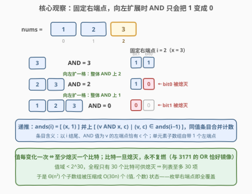
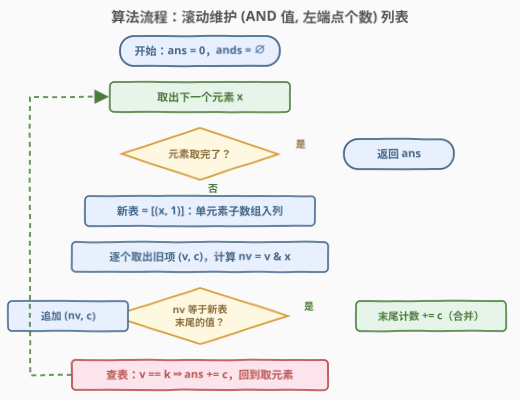

# LeetCode 子数组按位与值为K的数目 题解

## 1. 题目概述

- **标题 / 题号**：子数组按位与值为 K 的数目（#3209，hard）
- **链接**：https://leetcode.cn/problems/number-of-subarrays-with-and-value-of-k/
- **难度**：困难
- **标签**：位运算、数组、二分查找、线段树

**题意**：给你一个整数数组 `nums` 和一个整数 `k`，请你返回 `nums` 中有多少个**子数组**满足：子数组中所有元素按位 `AND` 的结果为 `k`。

**示例 1**：

```text
输入：nums = [1,1,1], k = 1
输出：6
解释：所有子数组都只含有元素 1，AND 值均为 1。
```

**示例 2**：

```text
输入：nums = [1,1,2], k = 1
输出：3
解释：AND 值为 1 的子数组包括 [1,1,2], [1,1,2], [1,1,2]。
```

**示例 3**：

```text
输入：nums = [1,2,3], k = 2
输出：2
解释：AND 值为 2 的子数组包括 [1,2,3], [1,2,3]。
```

**约束**：

- $1 \le \texttt{nums.length} \le 10^5$
- $0 \le \texttt{nums}[i], k \le 10^9$

> 💡 **审题关键**：$n$ 高达 $10^5$，子数组约 $\frac{n(n+1)}{2} \approx 5 \times 10^9$ 个——逐个枚举必死。和 [3171](https://leetcode.cn/problems/find-subarray-with-bitwise-or-closest-to-k/) 一样，突破口在位运算的单调性：**固定右端点向左扩展时，AND 只会把 1 变成 0**，值域 $10^9 < 2^{30}$ 只有 30 个比特可供「熄灭」——以每个右端点结尾的不同 AND 值至多 30 个。本题在此基础上再多问一步「**有多少个**」：给每个值挂上**左端点个数**即可。

## 2. 解题思路

### 2.1 暴力思路：枚举所有子数组（被 10^5 卡死）

双重循环枚举 $(l, r)$：固定 $l$、向右推进 $r$ 的同时滚动维护 AND 值，等于 $k$ 则计数，时间 $O(n^2)$。$n = 10^5$ 时约 $5 \times 10^9$ 次运算，必然 TLE。

问题还是出在**大量重复**：以同一个右端点结尾的各个子数组，AND 值高度相似——都是若干元素 AND 起来，比特只减不增。能否把「以 $i$ 结尾的所有子数组」压缩成极少数代表值，并且**顺带记下每个值对应几个左端点**？

### 2.2 核心观察：固定右端点，不同 AND 值不超过 30 个



把子数组从 $[i..i]$ 向左扩成 $[i-1..i]$、$[i-2..i]$……每扩一步，AND 值都满足：

- **单调不增**：AND 只能清 0、不能置 1，越往左扩值越小（比特集是子集）；
- **每变化一次至少熄灭一个比特**：相邻两个长度若 AND 值不同，较长者至少少一个 1；
- **比特永不复燃**：某个比特一旦被清 0，继续向左扩展它仍然是 0。

值域 $< 2^{30}$，全程只有 30 个比特可供「熄灭」——整条值链至多变化 30 次。于是「以 $i$ 结尾的全部子数组」可以压缩成一个**长度 $\le 30$ 的列表**，每项是一个二元组：

$$\texttt{ands}_i = \big[\, (v_1, c_1), (v_2, c_2), \cdots \,\big]$$

其中 $v_j$ 互不相同（按左端点从小到大严格递减），$c_j$ 是 **AND 值恰好等于 $v_j$ 的左端点个数**。滚动递推（记 $x = \texttt{nums}[i]$）：

$$\texttt{ands}_i = \texttt{merge}\Big(\big[\,(x, 1)\,\big] \;\cup\; \big[\, (v \,\&\, x,\; c) \mid (v, c) \in \texttt{ands}_{i-1} \,\big]\Big)$$

含义：以 $i$ 结尾的子数组，要么是单元素子数组 $[i..i]$（AND 值为 $x$，1 个左端点），要么是「某个以 $i-1$ 结尾的子数组再拼上 $x$」（旧值 AND 上 $x$，左端点个数原样带走）。新值与前面撞车时**合并、计数累加**——这正是本题比 3171 多出来的「计数」维度。每轮扫一遍列表，发现 $v_j = k$ 就把整段 $c_j$ 计入答案，遍历完所有右端点就等价于数完了全部子数组。

> 💡 这是「**子数组 OR/AND 的 dp 集合**」套路的计数版：[898](https://leetcode.cn/problems/bitwise-ors-of-subarrays/) 统计 OR 不同值个数、[3171](https://leetcode.cn/problems/find-subarray-with-bitwise-or-closest-to-k/) 求 OR 最接近 $k$、[1521](https://leetcode.cn/problems/find-a-value-of-a-mysterious-function-closest-to-target/) 求 AND 最接近 target，用的都是同一个骨架；本题只需把集合升级成「值 → 左端点个数」的映射。

### 2.3 算法流程



1. 初始化 `ans = 0`，列表 `ands` 为空
2. 对每个元素 $x$：
   - 新表先放入 $(x, 1)$——单元素子数组 $[i..i]$ 自带 1 个左端点
   - 旧表逐项 $(v, c)$ 更新为 $(v \,\&\, x,\; c)$：与新表末尾值相同则**计数累加合并**，否则**追加**
   - 扫描新表：$v = k$ 则 $ans \mathrel{+}= c$（值互不相同，命中至多一处）
3. 返回 `ans`

> 💡 **为什么合并只看相邻**：旧表值严格递减，$v \mapsto v \,\&\, x$ 保序，且所有结果都 $\le x$（新表头）；相等值必然相邻，一遍线性合并即可。若上一项 AND 后没变小，说明这段左端点的 AND 值「扛住了」新元素——它们的计数直接并进来。

### 2.4 示例演算

![示例演算：nums=[1,2,3], k=2 逐右端点滚动列表](../images/p3209_and_list_walkthrough.svg)

以示例 3（`nums = [1,2,3]`，`k = 2`）为例，条目写成「AND 值 : 左端点个数」：

| i | x | 旧列表 $\texttt{ands}_{i-1}$ | 新列表 $\texttt{ands}_i$ | 命中 $k=2$ | ans |
|---|---|------|------|------|-----|
| 0 | 1 | ∅ | (1:1) | 无 | 0 |
| 1 | 2 | (1:1) | (2:1), (0:1) —— $1\,\&\,2=0$ | (2:1) → +1 | 1 |
| 2 | 3 | (2:1), (0:1) | (3:1), (2:1), (0:1) —— $2\,\&\,3=2$，$0\,\&\,3=0$ | (2:1) → +1 | 2 |

$i=1$ 时条目 (2:1) 对应子数组 $[2]$；$i=2$ 时条目 (2:1) 对应子数组 $[2,3]$——正是示例解释里那两个，答案 2 ✓。

> ⚠️ 注意 $i=2$ 这一步：旧表头 $(2,1)$ AND 上 3 得 2，值**没有**被压到 3（新表头）以下去和 $(0,1)$ 撞车——每项只与**相邻前驱**比较合并，顺序处理天然正确。

## 3. 参考代码

### C++

```cpp
class Solution {
  public:
    long long countSubarrays(vector<int>& nums, int k) {
        long long ans = 0;
        vector<pair<int, long long>> ands;               // (AND 值, 左端点个数)，值严格递减
        for (int x : nums) {
            vector<pair<int, long long>> nxt;
            nxt.reserve(ands.size() + 1);
            nxt.emplace_back(x, 1);                      // 单元素子数组 [i..i]，1 个左端点
            for (auto& [v, c] : ands) {
                int nv = v & x;
                if (nv == nxt.back().first)
                    nxt.back().second += c;              // AND 值不变：左端点段合并
                else
                    nxt.emplace_back(nv, c);
            }
            swap(ands, nxt);
            for (auto& [v, c] : ands)
                if (v == k) { ans += c; break; }         // 值互不相同，命中至多一处
        }
        return ans;
    }
};
```

### Python

```python
class Solution:
    def countSubarrays(self, nums: List[int], k: int) -> int:
        ans = 0
        ands = []                                       # [AND 值, 左端点个数]，值严格递减
        for x in nums:
            nxt = [[x, 1]]                              # 单元素子数组 [i..i]
            for v, c in ands:
                nv = v & x
                if nv == nxt[-1][0]:
                    nxt[-1][1] += c                     # AND 值不变：左端点段合并
                else:
                    nxt.append([nv, c])
            ands = nxt
            for v, c in ands:
                if v == k:
                    ans += c                            # 值互不相同，命中至多一处
                    break
        return ans
```

## 4. 复杂度分析

| 维度 | 复杂度 | 说明 |
|------|--------|------|
| 时间复杂度 | $O(n \cdot B)$，$B \approx 30$ | 每个右端点重建并扫描 $\le 30$ 项的列表；$n = 10^5$ 时约 $3 \times 10^6$ 次位运算 |
| 空间复杂度 | $O(B)$ | 只滚动维护一个列表，与 $n$ 无关 |

> 💡 $B = \lceil \log_2 \text{值域} \rceil \approx 30$。答案最大可达 $\frac{n(n+1)}{2} \approx 5 \times 10^9$，必须用 64 位整数累加（C++ 用 `long long`，Python 天然大数）。

## 5. 扩展：按位约束法与二分 + ST 表

### 5.1 按位约束法：k 固定时的更短写法

$k$ 在整轮扫描中固定，可以把「AND 值恰好等于 $k$」拆成**逐位双向约束**。对每个比特位 $b$ 维护 `last_zero[b]` = 该位最近一次出现 0 的下标（1 起，0 表示从未出现）：

- $k$ 的第 $b$ 位为 **1**：窗口内所有数该位都得是 1 ⟹ $l > \texttt{last\_zero}[b]$，即 $l \ge \texttt{last\_zero}[b] + 1$；
- $k$ 的第 $b$ 位为 **0**：窗口内至少有一个数该位是 0 ⟹ $l \le \texttt{last\_zero}[b]$。

可行左端点是一个区间 $[\max(\text{第一种约束}),\; \min(\text{第二种约束})]$，长度直接计入答案：

```python
class Solution:
    def countSubarrays(self, nums: List[int], k: int) -> int:
        B = 30
        last_zero = [0] * B                     # 各比特位最近一次出现 0 的位置（1 起）
        ans = 0
        for r, x in enumerate(nums, 1):
            for b in range(B):
                if not x >> b & 1:
                    last_zero[b] = r
            lo, hi = 1, r
            for b in range(B):
                if k >> b & 1:
                    lo = max(lo, last_zero[b] + 1)  # k 为 1 的位：窗口内必须全 1
                else:
                    hi = min(hi, last_zero[b])      # k 为 0 的位：窗口内须出现过 0
            if lo <= hi:
                ans += hi - lo + 1
        return ans
```

> 💡 它与「值列表」法殊途同归：$\texttt{lo}$ 就是「AND $\supseteq k$ 的最小左端点」，$\texttt{hi}$ 就是「AND $\subseteq k$ 的最大左端点」，恰好等于 $k$ 的左端点被两端夹出来。同样 $O(30n)$ 时间、$O(30)$ 空间，且不需要维护列表，但**只适用于 $k$ 固定的计数**；值列表法还能顺手答「最接近 $k$」「不同值个数」等问题，更通用。

### 5.2 二分 + ST 表：官方提示的路线

官方 hints 给的是另一条路：固定 $l$ 时 $\text{AND}(l..r)$ 随 $r$ 单调不增；对称地，固定 $r$ 时 $\text{AND}(l..r)$ 随 $l$ **单调不减**——而且不仅是比特集的超集关系，**整数值**也单调不减（比特集变大，数值只会更大）。于是每个 $r$ 可二分出 AND 值恰好为 $k$ 的左端点区间 $[\text{firstGE}(k),\, \text{firstGE}(k+1))$，区间 AND 查询交给 ST 表 $O(1)$ 完成：

```cpp
class Solution {
    vector<vector<int>> st;
    int query(int l, int r) {                       // AND(nums[l..r])
        int j = 31 - __builtin_clz(r - l + 1);
        return st[j][l] & st[j][r - (1 << j) + 1];
    }
  public:
    long long countSubarrays(vector<int>& nums, int k) {
        int n = nums.size();
        int LOG = 32 - __builtin_clz(n);
        st.assign(LOG, vector<int>(n));
        st[0] = nums;
        for (int j = 1; j < LOG; j++)
            for (int i = 0; i + (1 << j) <= n; i++)
                st[j][i] = st[j - 1][i] & st[j - 1][i + (1 << (j - 1))];

        long long ans = 0;
        for (int r = 0; r < n; r++) {
            // 最小 l 使 AND(l..r) >= target（单调不减，不存在则 r+1）
            auto firstGE = [&](int target) {
                int lo = 0, hi = r + 1;
                while (lo < hi) {
                    int mid = lo + (hi - lo) / 2;
                    if (query(mid, r) >= target) hi = mid;
                    else lo = mid + 1;
                }
                return lo;
            };
            ans += firstGE(k + 1) - firstGE(k);     // AND == k 的 l 区间长度
        }
        return ans;
    }
};
```

总复杂度 $O(n \log n \log U)$（每次二分 $O(\log n)$ 次 $O(1)$ 查询），预处理空间 $O(n \log n)$，均逊于值列表法的 $O(30n)$ / $O(30)$。二分的优势在于**不依赖「值链至多 30 段」这一位运算特技**，可平移到其它满足幂等性与单调性的区间统计问题。

> ⚠️ 本题**不能**朴素滑动窗口：AND 不可逆，左端点右移无法恢复已被清掉的比特，必须借助按位计数（如 [3097](https://leetcode.cn/problems/shortest-subarray-with-or-at-least-k-ii/) 的做法）才能模拟移除；且「恰好等于 $k$」的左端点区间由「$\supseteq k$」与「$\subseteq k$」两个边界夹出，需要两个左指针分别单调推进——本质就是 5.1 的 `lo`/`hi`。

## 6. 面试要点

1. **为什么以每个右端点结尾的不同 AND 值不超过 30 个？**

   - 向左扩展子数组时 AND 单调不增，且相邻两个不同值之间至少熄灭一个比特
   - 比特一旦熄灭永不复燃，值域 $< 2^{30}$ 只有 30 个比特 → 值链至多 30 段
   - 与 OR 版（3171/898）互为镜像：OR「点亮」、AND「熄灭」，引理一字不差

2. **计数版与集合版（898/3171）差在哪？**

   - 集合版只存互异的值；计数版每项是 $(值, 左端点个数)$ 二元组
   - 递推时旧项个数 $c$ 原样带走，新值与相邻前驱撞车则合并累加
   - 命中 $v = k$ 时整段 $c$ 计入答案；值互不相同，命中至多一处

3. **答案为什么必须用 64 位整数？**

   - 最坏情形（如全数组 AND 恒为 $k$）答案为 $\frac{n(n+1)}{2} \approx 5 \times 10^9$，超出 `int` 上界
   - 列表条目的 $c$ 同理，C++ 中计数与累加都用 `long long`

4. **官方提示的二分 + ST 表怎么落地？**

   - 固定 $r$，$\text{AND}(l..r)$ 关于 $l$ 单调不减（比特集扩大 ⟹ 数值不降）
   - AND 满足幂等性，可用 ST 表 $O(n \log n)$ 预处理、$O(1)$ 区间查询
   - 两次二分：$\text{firstGE}(k)$ 与 $\text{firstGE}(k+1)$ 之差即 AND $= k$ 的左端点个数

5. **这题能滑动窗口吗？**

   - 朴素不行：AND 不可逆，左端点右移无法撤销已熄灭的比特
   - 用按位计数可模拟移除（3097 的技巧）；「恰好 $= k$」需两个左指针分别维护 $\supseteq k$ 与 $\subseteq k$ 的边界
   - 两个边界都随 $r$ 单调不减，可摊还 $O(1)$ 推进——等价于 5.1 的 `lo`/`hi` 区间

## 同类练习题

| # | 题目 | 与本题的关联 |
|---|------|-------------|
| 3171 | [找到按位或最接近 K 的子数组](https://leetcode.cn/problems/find-subarray-with-bitwise-or-closest-to-k/) | OR 姊妹题，同一「右端点集合」骨架，把「计数命中」换成「求最接近」 |
| 898 | [子数组按位或操作](https://leetcode.cn/problems/bitwise-ors-of-subarrays/) | 该套路的源头题，统计所有子数组 OR 的不同值个数 |
| 1521 | [找到最接近目标值的函数值](https://leetcode.cn/problems/find-a-value-of-a-mysterious-function-closest-to-target/) | AND 镜像版，区间函数值即 AND，求最接近 target |
| 3097 | [或值至少为 K 的最短子数组 II](https://leetcode.cn/problems/shortest-subarray-with-or-at-least-k-ii/) | 按位计数实现滑动窗口的范本，攻克「位运算不可逆」的关键练习 |
