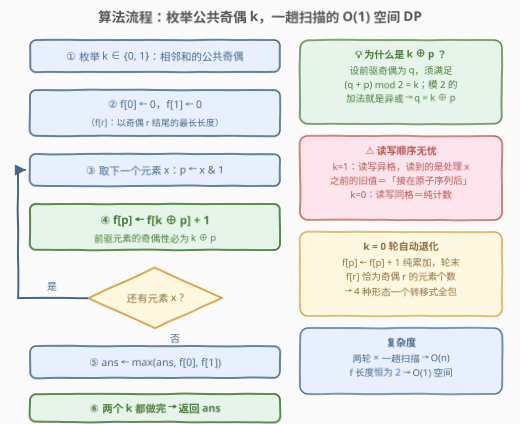
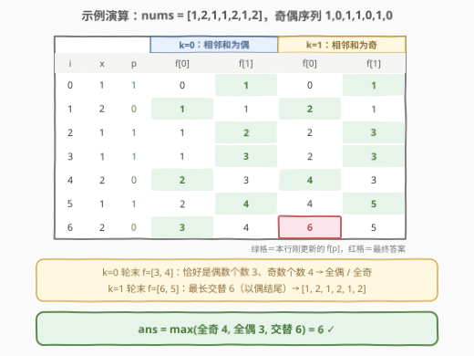

# 找出有效子序列的最大长度 I

- **题目名称**：找出有效子序列的最大长度 I
- **链接**：[3201. 找出有效子序列的最大长度 I](https://leetcode.cn/problems/find-the-maximum-length-of-valid-subsequence-i/)
- **难度**：中等
- **标签**：数组、动态规划

## 1. 题目概述

给你一个整数数组 `nums`。

`nums` 的子序列 `sub` 的长度为 `x`，如果其满足以下条件，则称其为**有效子序列**：

$$(\text{sub}[0] + \text{sub}[1]) \bmod 2 = (\text{sub}[1] + \text{sub}[2]) \bmod 2 = \cdots = (\text{sub}[x-2] + \text{sub}[x-1]) \bmod 2$$

即**所有相邻元素之和的奇偶性全都相同**。返回 `nums` 的**最长的有效子序列**的长度。

**示例 1**：

```text
输入：nums = [1,2,3,4]
输出：4
解释：最长的有效子序列是 [1, 2, 3, 4]。
```

**示例 2**：

```text
输入：nums = [1,2,1,1,2,1,2]
输出：6
解释：最长的有效子序列是 [1, 2, 1, 2, 1, 2]。
```

**示例 3**：

```text
输入：nums = [1,3]
输出：2
解释：最长的有效子序列是 [1, 3]。
```

**约束条件**：

- $2 \le \text{nums.length} \le 2 \times 10^5$
- $1 \le \text{nums[i]} \le 10^7$

> 💡 **审题关键**：判定条件里只有加法和 $\bmod\ 2$——**每个元素的具体数值无关紧要，唯一重要的是奇偶性**。把整个数组压成 0/1 序列后，问题几乎肉眼可解。另外注意是**子序列**（保序、可不连续），不是子数组；$x \ge 2$ 时条件才有约束力，任意两个元素都构成有效子序列，故答案至少为 2。

---

## 2. 解题思路

### 2.1 暴力思路：枚举子序列 / O(n²) DP 都会超时

最直接的想法是枚举所有子序列逐一验证——$2^n$ 种组合，指数爆炸。退一步是标准的「以 i 结尾」DP：

$$f[i][j] = \text{以 } \text{nums}[i] \text{ 结尾、最后一对和} \bmod 2 = j \text{ 的最长长度}$$

转移需要枚举前一个元素的下标 $i'$，整体 $O(n^2)$。本题 $n \le 2 \times 10^5$，$4 \times 10^{10}$ 次运算必然超时——必须把「奇偶性」这层信息彻底榨干，把平方降成线性。

### 2.2 核心观察：只看奇偶，有效子序列只有 4 种形态


条件说的是**所有相邻元素之和的奇偶性相同**，设这个公共奇偶性为 $k$：

- **$k = 0$（相邻和全是偶数）**：奇+奇=偶，偶+偶=偶 → 相邻元素必须**同奇偶**。由归纳法，奇偶性沿子序列一路传导——**要么全奇，要么全偶**；
- **$k = 1$（相邻和全是奇数）**：奇+偶=奇 → 相邻元素必须**异奇偶**——**奇偶交替**（奇开头、偶开头两种）。

于是候选答案只有 4 个，可归并为 3 项：

$$\text{ans} = \max(\underbrace{\text{奇数个数}}_{\text{全奇}},\ \underbrace{\text{偶数个数}}_{\text{全偶}},\ \underbrace{\text{最长交替}}_{\text{含奇/偶两种开头}})$$

其中全奇/全偶一趟计数即可；最长交替子序列有经典结论：**每个「连续同奇偶段」各取一个元素**就是最优（连续两个选取落在同一段则奇偶相同、违反交替，故选取数 ≤ 段数；每段取一个又确实合法保序——两头夹逼即最优）。

### 2.3 算法流程：按 k 分类的统一 DP，一个转移式通吃 4 种形态



4 种形态分开写要 4 段代码，容易顾此失彼。更优雅的做法是把 $k$ 当外层枚举量，用一个统一的 DP 一网打尽：

$$f[r] = \text{「相邻和} \bmod 2 = k\text{」的最长子序列中，以奇偶 } r \text{ 结尾的长度}$$

遍历到奇偶性为 $p$ 的元素 $x$ 时，设它前面那个元素的奇偶性为 $q$，合法性要求 $(q + p) \bmod 2 = k$。**模 2 的加法就是异或**，解这个方程得 $q = k \oplus p$。于是转移只需一行：

$$f[p] \leftarrow f[k \oplus p] + 1$$

流程：

1. 枚举 $k \in \{0, 1\}$；
2. 初始化 $f[0] = f[1] = 0$；
3. 对每个 $x$：$p \leftarrow x \mathbin{\&} 1$，$f[p] \leftarrow f[k \oplus p] + 1$；
4. 一轮结束取 $\text{ans} \leftarrow \max(\text{ans}, f[0], f[1])$；
5. 两个 $k$ 都做完，返回 $\text{ans}$。

两个细节：

- **读写无冲突**：更新 $f[p]$ 时读的是 $f[k \oplus p]$。$k=0$ 时读写同一格（$f[p] \leftarrow f[p]+1$，即纯累加）；$k=1$ 时读写异格，读到的都是**本元素处理前**的旧值——恰好是「把 $x$ 接在之前某个子序列后面」的正确 DP 语义；
- **$k=0$ 轮自动退化成奇偶计数**：轮次结束时 $f[r]$ 恰好就是奇偶为 $r$ 的元素个数，无需再单独写计数逻辑——4 种形态被一个转移式全包。

### 2.4 示例演算



以 `nums = [1,2,1,1,2,1,2]`（奇偶序列 $1,0,1,1,0,1,0$）为例，两轮并行演算：

| $i$ | $x$ | $p = x \& 1$ | $k=0$：$f[0], f[1]$ | $k=1$：$f[0], f[1]$ |
|-----|-----|--------------|----------------------|----------------------|
| 0 | 1 | 1 | 0, **1** | 0, **1** |
| 1 | 2 | 0 | **1**, 1 | **2**, 1 |
| 2 | 1 | 1 | 1, **2** | 2, **3** |
| 3 | 1 | 1 | 1, **3** | 2, **3** |
| 4 | 2 | 0 | **2**, 3 | **4**, 3 |
| 5 | 1 | 1 | 2, **4** | 4, **5** |
| 6 | 2 | 0 | **3**, 4 | **6**, 5 |

（粗体为本行刚更新的 $f[p]$）

- $k=0$ 轮结束 $f = [3, 4]$——恰好是 [偶数个数, 奇数个数]，即「全偶 3 / 全奇 4」两种形态；
- $k=1$ 轮结束 $f = [6, 5]$——以偶结尾的最长交替为 6，对应子序列 $[1,2,1,2,1,2]$；
- $\text{ans} = \max(4, 6) = 6$ ✓（与官方示例一致）。

顺手复核示例 3 `nums = [1,3]`：$k=0$ 轮 $f = [0, 2]$（全奇 2），$k=1$ 轮 $f = [0, 1]$，$\text{ans} = 2$ ✓。

---

## 3. 参考代码

### C++

```cpp
class Solution {
  public:
    int maximumLength(vector<int>& nums) {
        int ans = 0;
        for (int k = 0; k < 2; ++k) {       // k：相邻和的公共奇偶
            int f[2] = {0, 0};              // f[r]：以奇偶 r 结尾的最长长度
            for (int x : nums) {
                int p = x & 1;
                f[p] = f[k ^ p] + 1;        // 前驱奇偶必为 k ^ p
            }
            ans = max({ans, f[0], f[1]});
        }
        return ans;
    }
};
```

### Python

```python
class Solution:
    def maximumLength(self, nums: List[int]) -> int:
        ans = 0
        for k in (0, 1):                    # k：相邻和的公共奇偶
            f = [0, 0]                      # f[r]：以奇偶 r 结尾的最长长度
            for x in nums:
                p = x & 1
                f[p] = f[k ^ p] + 1         # 前驱奇偶必为 k ^ p
            ans = max(ans, f[0], f[1])
        return ans
```

---

## 4. 复杂度分析

| 维度 | 复杂度 | 说明 |
|------|--------|------|
| 时间 | $O(n)$ | 两个 $k$ 各扫一遍数组，每步仅取模、异或、赋值，均为 $O(1)$ |
| 空间 | $O(1)$ | 只有两个长度为 2 的 DP 数组，与 $n$ 无关 |

> 💡 对比 $O(n^2)$ DP：$n = 2 \times 10^5$ 时快 5 个数量级（$4 \times 10^{10}$ 必超时）。能降复杂度的本质是把「前一个元素是**谁**」压缩成「前一个元素的**奇偶性**」——状态数从 $n$ 降到 $2$，转移从枚举变直取。

---

## 5. 扩展

### 5.1 计数版：三种候选直接取 max

把 2.2 的分类显式写出来也只需几行——全奇/全偶一趟计数，交替子序列贪心数「奇偶段」的段数：

```python
class Solution:
    def maximumLength(self, nums: List[int]) -> int:
        odd = sum(x & 1 for x in nums)
        even = len(nums) - odd
        alt, last = 0, -1                   # alt：连续同奇偶段的段数
        for x in nums:
            if x & 1 != last:
                alt += 1
                last = x & 1
        return max(odd, even, alt)
```

两种写法各有取舍：DP 版把 4 种形态统一进一个转移式、可直接推广到 II 版；计数版思路更「人话」，面试先讲它再引出 DP 版是不错的展开顺序。

### 5.2 II 版（3202）：把 2 换成 k

[3202. 找出有效子序列的最大长度 II](https://leetcode.cn/problems/find-the-maximum-length-of-valid-subsequence-ii/) 把条件中的 $\bmod\ 2$ 换成 $\bmod\ k$（$n, k \le 10^3$）。本题的转移式可以**原样推广**：

$$f[r][p] \leftarrow f[r][(r - p + k) \bmod k] + 1$$

其中 $f[r][p]$ 是「所有相邻和 $\bmod k = r$ 的子序列中，以 $\text{nums}[i] \bmod k = p$ 结尾的最长长度」——前驱余数 $j$ 须满足 $(j + p) \bmod k = r$，解得 $j = (r - p) \bmod k$，与本题的 $q = k \oplus p$ 完全同构（模 2 时减法就是异或）。复杂度 $O(nk) \approx 10^6$，轻松通过。

```cpp
class Solution {
  public:
    int maximumLength(vector<int>& nums, int k) {
        int ans = 0;
        for (int r = 0; r < k; ++r) {       // r：相邻和 mod k 的公共值
            vector<int> f(k, 0);            // f[p]：以余数 p 结尾的最长长度
            for (int x : nums) {
                int p = x % k;
                f[p] = f[(r - p + k) % k] + 1;
            }
            ans = max(ans, *max_element(f.begin(), f.end()));
        }
        return ans;
    }
};
```

验证 II 版示例：`nums = [1,2,3,4,5], k = 2` → 5；`nums = [1,4,2,3,1,4], k = 3` → 4（子序列 $[1,4,1,4]$，相邻和 $5,5,5$ 均是 $\bmod 3 = 2$）。

---

## 6. 面试要点

1. **为什么有效子序列只有「全奇 / 全偶 / 交替」这几种形态？**

   - 设相邻和的公共奇偶为 $k$。$k=0$ 时相邻元素同奇偶，奇偶性沿子序列逐位传导 → 全体同奇偶（全奇或全偶）；
   - $k=1$ 时相邻元素异奇偶 → 相邻必交替 → 奇偶交替（奇开头、偶开头两种）。

2. **为什么可以完全无视元素的具体值？**

   - 判定条件只含 $(\text{sub}[i] + \text{sub}[i+1]) \bmod 2$，而 $(a + b) \bmod 2 = (a \bmod 2) \oplus (b \bmod 2)$；
   - 数值被模 2 压缩后只剩奇偶一比特信息——「值域大先想取模」的又一实例。

3. **转移 $f[p] \leftarrow f[k \oplus p] + 1$ 中，为什么前驱奇偶恰好是 $k \oplus p$？**

   - 合法性要求前驱 $q$ 满足 $q \oplus p = k$（模 2 加法 = 异或），异或方程两边同或 $p$ 解得 $q = k \oplus p$；
   - 把约束**解出来**而不是枚举 $q$ 再验证，是状态设计从 $O(n)$ 降到 $O(1)$ 的关键一步。

4. **更新 $f[p]$ 时会不会读到本轮已被污染的值？**

   - 不会：读的是 $f[k \oplus p]$，$k=1$ 时与写的 $f[p]$ 异格，读到的必是处理 $x$ 之前的旧值；
   - $k=0$ 时读写同格，$f[p] \leftarrow f[p] + 1$ 本来就该累加（纯计数），语义同样正确。

5. **本题和 II 版（3202）的 DP 有什么联系？**

   - 模数 2 换成 $k$：$f[r][p] \leftarrow f[r][(r-p+k) \bmod k] + 1$，异或是模 2 下减法的特例；
   - 复杂度从 $O(n)$ 变 $O(nk)$——状态设计完全同构，是「同一转移式的参数化推广」。

---

## 7. 同类练习题

- [3202. 找出有效子序列的最大长度 II](https://leetcode.cn/problems/find-the-maximum-length-of-valid-subsequence-ii/)（[站内题解](../3201-3300/3202_找出有效子序列的最大长度II.md)）：本题的模 k 泛化版，转移式原样推广到 $O(nk)$
- [3101. 交替子数组计数](https://leetcode.cn/problems/count-alternating-subarrays/)（[站内题解](../3101-3200/3101_交替子数组计数.md)）：同是 0/1 交替结构，从「最长交替子序列」换成「交替子数组计数」
- [376. 摆动序列](https://leetcode.cn/problems/wiggle-subsequence/)（[站内题解](../0301-0400/376_摆动序列.md)）：交替的比较符号（升/降）与交替奇偶同构，最长摆动子序列的贪心与 DP
- [978. 最长湍流子数组](https://leetcode.cn/problems/longest-turbulent-subarray/)（[站内题解](../0901-1000/978_最长湍流子数组.md)）：湍流 = 比较符号交替，「交替模式」家族的子数组版成员
