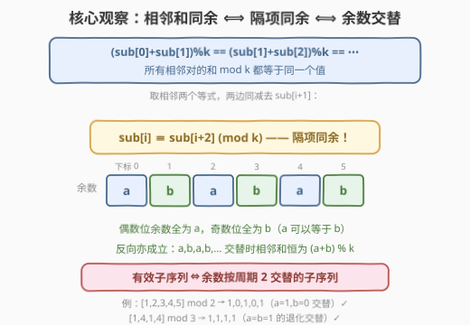
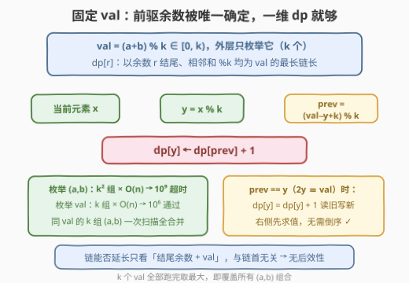
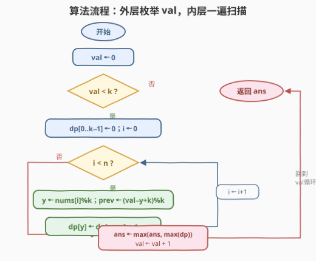
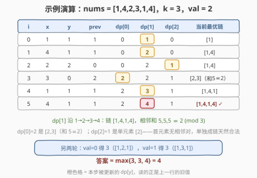

# LeetCode 找出有效子序列的最大长度 II 题解

## 1. 题目概述

- **标题 / 题号**：找出有效子序列的最大长度 II（#3202，medium）
- **链接**：https://leetcode.cn/problems/find-the-maximum-length-of-valid-subsequence-ii/
- **难度**：中等
- **标签**：数组、动态规划

**题意**：给你一个整数数组 `nums` 和一个**正**整数 `k`。`nums` 的一个子序列 `sub` 长度为 `x`，如果满足：

$$(sub[0]+sub[1]) \bmod k = (sub[1]+sub[2]) \bmod k = \cdots = (sub[x-2]+sub[x-1]) \bmod k$$

则称其为**有效子序列**。返回 `nums` 的**最长**有效子序列的长度。

一句话读题：子序列里每一对**相邻元素之和 mod k** 必须等于同一个值，求最长能选多少个元素。

**示例 1**：

```text
输入：nums = [1,2,3,4,5], k = 2
输出：5
解释：整个数组 [1,2,3,4,5] 就是有效子序列，
     相邻和 3,5,7,9 mod 2 全都等于 1。
```

**示例 2**：

```text
输入：nums = [1,4,2,3,1,4], k = 3
输出：4
解释：最长有效子序列为 [1,4,1,4]（取下标 0,1,4,5），
     相邻和 5,5,5 mod 3 全都等于 2。
```

**约束**：

- $2 \le nums.length \le 10^3$
- $1 \le nums[i] \le 10^7$
- $1 \le k \le 10^3$

> 💡 读题关键：$n \le 10^3$ 且 $k \le 10^3$——一个 $O(n \cdot k)$ 量级的解法（约 $10^6$）正落在甜区，同时也给 $O(n^2)$ 的按下标 DP 留了活路。另外注意长度 $\le 2$ 的子序列条件链至多只有一个等式，**自动成立**，所以 $n \ge 2$ 时答案至少为 2。

## 2. 解题思路

### 2.1 暴力思路：按下标 DP，$O(n^2)$

枚举全部 $2^n$ 个子序列逐对验证是天文数字，直接放弃。可行的第一档是**按下标**做 DP：

$$dp[i][r] = \text{以 } nums[i] \text{ 结尾、且倒数第二个元素余数为 } r \text{ 的最长有效子序列长度}$$

处理到下标 $i$ 时枚举前驱 $j < i$，把 $nums[i]$ 接到以 $j$ 结尾的链后面。链上原有的相邻和余数由「$j$ 的前驱余数 $r'$ + $nums[j]$」决定，而新相邻对是 $(nums[j] + nums[i]) \bmod k$，两者必须相等：

$$(r' + nums[j]) \bmod k = (nums[j] + nums[i]) \bmod k \iff r' \equiv nums[i] \pmod k$$

于是转移只需读 $dp[j][nums[i] \bmod k]$：

$$dp[i][nums[j] \bmod k] = \max\big(dp[i][nums[j] \bmod k],\ dp[j][nums[i] \bmod k] + 1\big)$$

初始 $dp[i][r] = 1$（单元素链，$j$ 可做链首）。时间 $O(n^2)$、空间 $O(nk)$，本题规模下能过。

> ⚠️ 卡点：状态里背着的「下标 $i$」其实是个累赘——**接一个元素是否合法，只取决于前驱的余数**，与前驱是哪个下标无关。把下标换成余数，才是这道题真正想考的降维。

### 2.2 核心观察：余数隔项相等 ⟺ 周期 2 交替

先直观感受一下「有效」到底长什么样：



**观察 1（条件化简）**：把条件串中**相邻的两个等式**单独拿出来：

$$(sub[i]+sub[i+1]) \bmod k = (sub[i+1]+sub[i+2]) \bmod k \iff sub[i] \equiv sub[i+2] \pmod k$$

（两边同减 $sub[i+1]$ 即得。）整条链成立 $\iff$ **隔项同余** $\iff$ 偶数位置余数全为某个 $a$、奇数位置余数全为某个 $b$（$a$ 可以等于 $b$）。反过来，$a,b,a,b,\cdots$ 交替的余数其相邻和恒为 $(a+b) \bmod k$，条件必然满足——**充要**。

**观察 2（换个枚举维度，$k^2 \to k$）**：有了交替结构，第一反应是枚举余数对 $(a,b)$（$k^2$ 组），每组贪心交替扫描一遍 $O(n)$——总 $O(nk^2) = 10^9$，超时。但整条链真正的**不变量**是相邻和余数 $val = (a+b) \bmod k$，它只有 $k$ 个取值！

**观察 3（固定 $val$ 后前驱被唯一确定）**：固定 $val$ 后，链上当前结尾余数为 $y$ 时，下一个能接上的元素余数必须是 $(val - y) \bmod k$——**没有选择余地**。于是定义一维状态：

$$dp[r] = \text{以余数 } r \text{ 结尾、所有相邻对之和} \bmod k \text{ 均为 } val \text{ 的最长链长}$$

从左到右扫描 `nums`，对每个 $y = nums[i] \bmod k$：

$$dp[y] \leftarrow dp[(val - y + k) \bmod k] + 1$$

一遍扫描同时覆盖该 $val$ 下**所有起点、所有 $(a,b)$ 组合**。$k$ 个 $val$ 全部跑完取最大值即答案。



两个实现细节：

- **无后效性**：以余数 $r$ 结尾的链能否延长，只看 $r$ 和 $val$，与链首是 $a$ 还是 $b$ 无关——所以一维状态就是充分统计量，$k^2$ 组 $(a,b)$ 中同 $val$ 的 $k$ 组被合并成一次扫描；
- **$prev = y$ 时无自污染**：当 $2y \equiv val \pmod k$（对应 $a = b$ 的同余数链）时转移变成 $dp[y] = dp[y] + 1$，赋值语句**右侧先求值**，读到的是不含当前元素的旧值，天然安全——不用像 0-1 背包那样倒序（对照 [3176. 求出最长好子序列 I](https://leetcode.cn/problems/find-the-maximum-length-of-a-good-subsequence-i/) 的倒序坑）。

### 2.3 算法流程图



流程共五步：

1. 外层 $val$ 从 $0$ 到 $k-1$，每轮把 $dp[0..k-1]$ 清零；
2. 内层从左到右遍历 $nums$，取 $y = nums[i] \bmod k$；
3. 由 $val$ 唯一确定前驱余数 $prev = (val - y + k) \bmod k$；
4. 更新 $dp[y] = dp[prev] + 1$；
5. 一轮结束用 $\max(dp)$ 更新全局答案；$k$ 轮跑完返回 $ans$。

### 2.4 示例演算

以 `nums = [1,4,2,3,1,4], k = 3, val = 2` 一轮为例，逐元素记录 $dp$ 三格的变化：



| i | x | y | prev | dp[0] | dp[1] | dp[2] | 当前最优链 |
|---|---|---|------|-------|-------|-------|-----------|
| 0 | 1 | 1 | 1 | 0 | **1** | 0 | [1] |
| 1 | 4 | 1 | 1 | 0 | **2** | 0 | [1,4] |
| 2 | 2 | 2 | 0 | 0 | 2 | **1** | [1,4] |
| 3 | 3 | 0 | 2 | **2** | 2 | 1 | [2,3]（和 5≡2） |
| 4 | 1 | 1 | 1 | 2 | **3** | 1 | [1,4,1] |
| 5 | 4 | 1 | 1 | 2 | **4** | 1 | [1,4,1,4] ✓ |

注意 $prev = 1 = y$ 恰好落在「自环」情形：$dp[1]$ 一路 $1 \to 2 \to 3 \to 4$，每步读的都是上一行旧值，链 $[1,4,1,4]$ 的相邻和 $5,5,5 \bmod 3 = 2$ 全程合法。另两轮 $val=0$ 得 3（链 $[1,2,1]$）、$val=1$ 得 3（链 $[1,3,1]$），**答案 = 4**。

## 3. 参考代码

### C++

```cpp
class Solution {
  public:
    int maximumLength(vector<int>& nums, int k) {
        int ans = 0;
        vector<int> dp(k);
        for (int val = 0; val < k; val++) {          // 枚举相邻和余数，只有 k 个
            fill(dp.begin(), dp.end(), 0);
            for (int x : nums) {
                int y = x % k;
                dp[y] = dp[(val - y + k) % k] + 1;   // 前驱余数被 val 唯一确定
            }
            ans = max(ans, *max_element(dp.begin(), dp.end()));
        }
        return ans;
    }
};
```

### Python

```python
class Solution:
    def maximumLength(self, nums: List[int], k: int) -> int:
        ans = 0
        for val in range(k):                          # 枚举相邻和余数，只有 k 个
            dp = [0] * k
            for x in nums:
                y = x % k
                dp[y] = dp[(val - y) % k] + 1         # 前驱余数被 val 唯一确定
            ans = max(ans, max(dp))
        return ans
```

> 💡 细节盘点：Python 的 `%` 对负数也返回非负，`(val - y) % k` 直接安全；C++ 要写成 `(val - y + k) % k` 防负数取模。$k = 1$ 时所有余数都是 0，$val=0$ 一轮 $dp[0]$ 直接刷到 $n$，无需特判。首元素落进任何 $val$ 轮都从 $dp[prev]+1 = 1$ 起步——单元素链没有相邻对，天然合法。

## 4. 复杂度分析

| 维度 | 复杂度 | 说明 |
|------|--------|------|
| 时间复杂度 | $O(n \cdot k + k^2)$ | 外层 $k$ 个 $val$，每个扫一遍 $O(n)$，加每轮 $O(k)$ 的清零与取最大；$n = k = 10^3$ 时约 $2 \times 10^6$ |
| 空间复杂度 | $O(k)$ | 一维 $dp$ 数组逐轮复用 |
| 暴力对照 | $O(n^2)$ / $O(nk)$ | 2.1 按下标 DP，本题能过但状态冗余；换余数维度后时间与空间双降 |

## 5. 扩展：$k=2$ 特例与孪生题 3201

### 5.1 孪生题 3201：$k = 2$ 时的「三选一」

[3201. 找出有效子序列的最大长度 I](https://leetcode.cn/problems/find-the-maximum-length-of-valid-subsequence-i/) 是本题 $k = 2$ 的特例。此时余数只有 0/1，交替模式只有四种，直接三选一：

- $a = b = 0$：全偶数子序列，长度 = 偶数元素个数；
- $a = b = 1$：全奇数子序列，长度 = 奇数元素个数；
- $a \ne b$：奇偶交替子序列，贪心扫描一遍取最长。

三者取最大。本题的 $O(nk)$ 解法在 $k=2$ 时自动退化为这三种情况的统一处理——这也印证了「枚举 $val$」框架的一般性：$k = 2$ 时 $val \in \{0, 1\}$，恰好对应「同奇偶」与「异奇偶」两大类。

### 5.2 答案下界与两个退化边界

- $n \ge 2$ 时答案 $\ge 2$：任取两个元素，条件链里只有一个等式，自动成立；
- $k = 1$：所有元素余数都是 0，整个数组就是有效子序列，答案 $= n$；
- $a = b$ 型链（如示例 2 的 $[1,4,1,4]$，余数 $1,1,1,1$）对应转移中的自环 $prev = y$，无需任何特判。

## 6. 面试要点

1. **条件 $(sub[i]+sub[i+1]) \bmod k$ 全相等如何化简？**

   - 取相邻两个等式两边同减 $sub[i+1]$，得 $sub[i] \equiv sub[i+2] \pmod k$——**隔项同余**。等价于子序列余数按 $a,b,a,b,\cdots$ 周期 2 交替（$a$ 可等于 $b$），且这是充要条件，正反两个方向都能推。

2. **为什么枚举 $val$ 而不是枚举余数对 $(a,b)$？**

   - $(a,b)$ 有 $k^2$ 组，每组 $O(n)$ 扫描共 $O(nk^2) = 10^9$ 超时；而链的不变量 $val = (a+b) \bmod k$ 只有 $k$ 个。固定 $val$ 后前驱余数被唯一确定为 $(val - y) \bmod k$，同 $val$ 的 $k$ 组 $(a,b)$ 在一次 $O(n)$ 扫描中全部覆盖，总复杂度降到 $O(nk)$。

3. **$dp[y] = dp[prev] + 1$ 会不会读到被自己污染的新值？**

   - 当 $prev = y$（即 $2y \equiv val$）时变成 $dp[y] = dp[y] + 1$，但赋值语句**右侧先求值**，读的是处理当前元素之前的旧值，天然「读旧写新」。这与 0-1 背包一维化必须倒序是对照关系：背包的转移在同一轮内多次读写不同状态才有污染风险，这里每个元素只写一格、且读写在同一语句内完成。

4. **2.1 的 $O(n^2)$ DP 与最优解差在哪里？**

   - 按下标的状态 $dp[i][r]$ 中，下标 $i$ 是冗余维度——衔接合法性只取决于前驱**余数**。把状态按余数聚合（再借「枚举 $val$」消掉对）后，时间 $O(n^2) \to O(nk)$、空间 $O(nk) \to O(k)$，与 3176/3177「状态按值聚合」是同一套思想。

5. **$k = 1$、$k = 2$ 分别退化成什么？**

   - $k = 1$：所有余数为 0，整个数组即答案，代码自然返回 $n$；$k = 2$：退化为 3201 的「全偶 / 全奇 / 奇偶交替」三选一，$O(nk)$ 框架自动覆盖，无需分情况手写。

## 同类练习题

| # | 题目 | 与本题的关联 |
|---|------|-------------|
| 3201 | [找出有效子序列的最大长度 I](https://leetcode.cn/problems/find-the-maximum-length-of-valid-subsequence-i/) | 本题 $k=2$ 特例，「全偶 / 全奇 / 奇偶交替」三选一，先做它再回头看本题的统一框架 |
| 1218 | [最长定差子序列](https://leetcode.cn/problems/longest-arithmetic-subsequence-of-given-difference/) | `dp[v] = dp[v−d] + 1` 的一维哈希转移模板，与本题 $dp[y] = dp[prev] + 1$ 同款 |
| 3176 | [求出最长好子序列 I](https://leetcode.cn/problems/find-the-maximum-length-of-a-good-subsequence-i/) | 状态按值聚合 + 内层倒序防污染，与本题「读旧写新」正反对照 |
| 978 | [最长湍流子数组](https://leetcode.cn/problems/longest-turbulent-subarray/) | 「交替」条件的子数组版（比较符号交替翻转），体会子数组与子序列在交替约束下的异同 |
