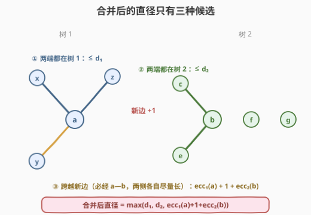
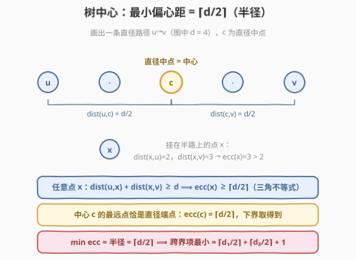
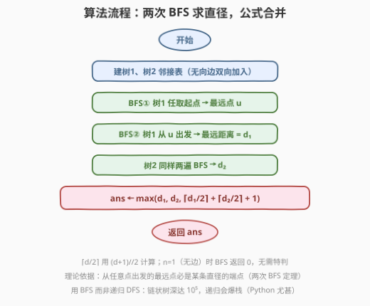
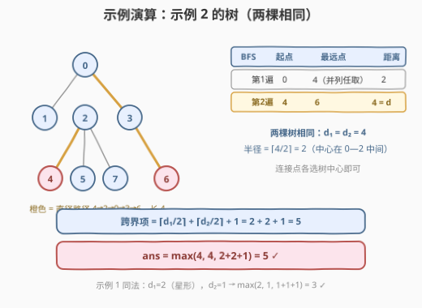

# 合并两棵树后的最小直径

- **题目名称**：合并两棵树后的最小直径
- **链接**：[3203. 合并两棵树后的最小直径](https://leetcode.cn/problems/find-minimum-diameter-after-merging-two-trees/)
- **难度**：困难
- **标签**：树、深度优先搜索、广度优先搜索、图

## 1. 题目概述

给定两棵**无向**树，分别有 $n$ 和 $m$ 个节点，节点编号分别为 $0$ 到 $n-1$ 和 $0$ 到 $m-1$。边数组 `edges1`、`edges2` 长度分别为 $n-1$ 和 $m-1$。

你必须**在两棵树中各选一个节点**，并用一条边连接它们。返回添加这条边后得到的树的**最小直径**。

一棵树的**直径**指树中任意两个节点之间路径长度的最大值（按边数计）。

**示例 1**：

```text
输入：edges1 = [[0,1],[0,2],[0,3]], edges2 = [[0,1]]
输出：3
解释：将第一棵树的节点 0 与第二棵树的任意节点连接，得到直径为 3 的树。
```

**示例 2**：

```text
输入：edges1 = [[0,1],[0,2],[0,3],[2,4],[2,5],[3,6],[2,7]],
     edges2 = [[0,1],[0,2],[0,3],[2,4],[2,5],[3,6],[2,7]]
输出：5
解释：将第一棵树的节点 0 与第二棵树的节点 0 连接，得到直径为 5 的树。
```

**约束条件**：

- $1 \le n, m \le 10^5$
- `edges1.length == n - 1`，`edges2.length == m - 1`
- 输入保证 `edges1` 和 `edges2` 分别表示一棵合法的树

> 💡 读题关键：这条边**必须加**、只能加**一条**、两端分属两棵树。合并后是一棵 $n+m$ 个节点的更大的树，新直径由「旧直径」与「跨界路径」共同决定。另外注意 $n, m$ 可达 $10^5$ 且树可能退化为链——递归 DFS 深度 $10^5$ 会爆栈（Python 默认递归上限 1000 直接 `RecursionError`），迭代 BFS 才稳。

---

## 2. 解题思路

### 2.1 暴力思路：枚举连接点对

先想清楚：连接树 1 的节点 $a$ 与树 2 的节点 $b$ 之后，新树的最长路径长什么样？只有三种可能：



1. **两端都在树 1**：长度 $\le d_1$（树 1 的直径）；
2. **两端都在树 2**：长度 $\le d_2$（树 2 的直径）；
3. **跨越新边**：路径必经 $a \to b$ 这条边。树 1 一侧是从 $a$ 出发能走出的最长链，即 $a$ 的**偏心距** $\mathrm{ecc}_1(a)$（$a$ 到树 1 中最远点的距离）；树 2 一侧同理。长度恰为 $\mathrm{ecc}_1(a) + 1 + \mathrm{ecc}_2(b)$。

于是连接 $(a,b)$ 后的直径为：

$$\max\big(d_1,\ d_2,\ \mathrm{ecc}_1(a) + 1 + \mathrm{ecc}_2(b)\big)$$

暴力做法：枚举全部 $n \times m$ 个点对取上式的最小值——$10^{10}$ 对，直接爆炸。即便对每棵树花 $O(n^2)$ 预处理出所有点的偏心距，把单次查询降到 $O(1)$，枚举点对本身仍是 $O(nm)$，不可行。

> ⚠️ 卡点：枚举点对是伪需求。上式中前两项与 $(a,b)$ 无关，第三项的 $\mathrm{ecc}_1(a)$ 与 $\mathrm{ecc}_2(b)$ **相互独立、可以分开最小化**：

$$\min_{a,b}\big(\mathrm{ecc}_1(a) + \mathrm{ecc}_2(b)\big) = \min_a \mathrm{ecc}_1(a) + \min_b \mathrm{ecc}_2(b)$$

问题坍缩成：**每棵树各自求最小偏心距**（即树的半径）。

### 2.2 核心观察：最小偏心距 = ⌈d/2⌉，答案只由两个直径决定



设树的一条直径两端点为 $u, v$，长度 $d$。

**观察 1（下界，三角不等式）**：对树上任意点 $x$，路径 $u \to x$ 与 $x \to v$ 拼起来不短于 $u \to v$：

$$\mathrm{dist}(u,x) + \mathrm{dist}(x,v) \ge d \implies \max\big(\mathrm{dist}(u,x),\ \mathrm{dist}(x,v)\big) \ge \left\lceil \frac{d}{2} \right\rceil$$

即**任何点**的偏心距都 $\ge \lceil d/2 \rceil$。

**观察 2（下界可达，中心）**：取直径路径的中点 $c$，它到两端各走半条直径，最远点恰是直径端点，$\mathrm{ecc}(c) = \lceil d/2 \rceil$。（$d$ 为偶数时中心是唯一节点；$d$ 为奇数时中点落在一条边上，两侧各一个中心节点，偏心距均为 $\lceil d/2 \rceil$。）

两者合并：**最小偏心距 = 半径 = $\lceil d/2 \rceil$**，最优连接点就是各自的树中心。

**观察 3（直径怎么求）**：经典**两次 BFS**——从任意点 $s$ 出发 BFS，最远点 $u$ 必是某条直径的端点（引理；否则可用 $s$ 的最远链与直径拼出更长的路径，矛盾）；再从 $u$ 出发 BFS，到最远点的距离即直径 $d$。全程迭代，无爆栈风险。

三件事拼起来，答案只依赖 $d_1, d_2$：

$$\boxed{\ \mathrm{ans} = \max\left(d_1,\ d_2,\ \left\lceil \frac{d_1}{2} \right\rceil + \left\lceil \frac{d_2}{2} \right\rceil + 1\right)\ }$$

> 💡 直觉校验：两棵树都很「长」时，跨界项 $\lceil d_1/2 \rceil + \lceil d_2/2 \rceil + 1$ 主导，新直径约是两个半直径拼起来；其中一棵是「小blob」时，另一棵自身的直径主导。$\max$ 把三种情形统一收口。

### 2.3 算法流程图



流程共五步：

1. 分别建两棵树的邻接表（无向边双向加入）；
2. 树 1：从任意点 BFS 得最远点 $u$，再从 $u$ BFS 得 $d_1$；
3. 树 2 同法得 $d_2$；
4. 代入公式 $\max(d_1, d_2, \lceil d_1/2 \rceil + \lceil d_2/2 \rceil + 1)$ 返回。

### 2.4 示例演算

以示例 2 的树为例（两棵相同）：



| BFS | 起点 | 最远点 | 距离 |
|-----|------|--------|------|
| 第 1 遍 | 0 | 4（5/6/7 距离并列，任取） | 2 |
| 第 2 遍 | 4 | 6 | **4 = d** |

$d_1 = d_2 = 4$，半径 $= \lceil 4/2 \rceil = 2$，于是 $\mathrm{ans} = \max(4, 4, 2+2+1) = 5$ ✓。

示例 1：$d_1 = 2$（星形），$d_2 = 1$，$\mathrm{ans} = \max(2, 1, 1+1+1) = 3$ ✓。

---

## 3. 参考代码

### C++

```cpp
class Solution {
  public:
    int minimumDiameterAfterMerge(vector<vector<int>>& edges1, vector<vector<int>>& edges2) {
        int d1 = diameter(edges1);
        int d2 = diameter(edges2);
        return max({d1, d2, (d1 + 1) / 2 + (d2 + 1) / 2 + 1});   // (d+1)/2 即 ⌈d/2⌉
    }

  private:
    int diameter(vector<vector<int>>& edges) {
        int n = edges.size() + 1;
        vector<vector<int>> g(n);
        for (auto& e : edges) {
            g[e[0]].push_back(e[1]);
            g[e[1]].push_back(e[0]);
        }
        auto bfs = [&](int s) {
            vector<int> dist(n, -1);
            deque<int> q{s};
            dist[s] = 0;
            int far = s;
            while (!q.empty()) {
                int u = q.front(); q.pop_front();
                if (dist[u] > dist[far]) far = u;
                for (int v : g[u])
                    if (dist[v] < 0) {
                        dist[v] = dist[u] + 1;
                        q.push_back(v);
                    }
            }
            return make_pair(far, dist[far]);
        };
        pair<int, int> p = bfs(0);          // 第 1 遍：任意点 → 直径端点 u
        return bfs(p.first).second;         // 第 2 遍：u → 最远距离即直径
    }
};
```

### Python

```python
class Solution:
    def minimumDiameterAfterMerge(self, edges1: List[List[int]], edges2: List[List[int]]) -> int:
        def diameter(edges):
            n = len(edges) + 1
            g = [[] for _ in range(n)]
            for a, b in edges:
                g[a].append(b)
                g[b].append(a)

            def bfs(s):
                dist = [-1] * n
                dist[s] = 0
                q = [s]
                head = 0
                far = s
                while head < len(q):
                    u = q[head]; head += 1
                    if dist[u] > dist[far]:
                        far = u
                    for v in g[u]:
                        if dist[v] < 0:
                            dist[v] = dist[u] + 1
                            q.append(v)
                return far, dist[far]

            u, _ = bfs(0)                   # 第 1 遍：任意点 → 直径端点 u
            return bfs(u)[1]                # 第 2 遍：u → 最远距离即直径

        d1, d2 = diameter(edges1), diameter(edges2)
        return max(d1, d2, (d1 + 1) // 2 + (d2 + 1) // 2 + 1)   # (d+1)//2 即 ⌈d/2⌉
```

> 💡 细节盘点：`n = len(edges) + 1` 同时兼容单节点树（`edges` 为空，BFS 从 0 出发返回距离 0，公式天然正确，无需特判）。Python 用「列表 + 头指针」模拟队列，免 import 且比 `deque` 略快；C++ 的 `far` 初值取起点本身，保证第 1 遍 BFS 至少返回一个合法端点。

---

## 4. 复杂度分析

| 维度 | 复杂度 | 说明 |
|------|--------|------|
| 时间复杂度 | $O(n + m)$ | 每棵树两遍 BFS，每条边各访问两次；建表线性 |
| 空间复杂度 | $O(n + m)$ | 邻接表 + 距离数组 |
| 暴力对照 | $O(nm)$ | 枚举连接点对；发现「跨界项两项独立」后，点对枚举完全消去 |

---

## 5. 扩展：树中心的常用性质

- **中心个数**：直径为偶数时中心唯一；为奇数时有两个相邻中心。求**全部**中心的另一招是拓扑剥叶子（不断去掉度数为 1 的节点，剩下的 1–2 个即中心），见 [310. 最小高度树](https://leetcode.cn/problems/minimum-height-trees/)。
- **所有直径共享中心**：任意两条直径都经过中心，这一性质常用于构造与判定题。
- **求每个点的偏心距**：本题暴力版需要它——可用**换根 DP** $O(n)$ 求出（自底向上求子树内最深，自顶向下用父亲方向的最深回填），与 [834. 树中距离之和](https://leetcode.cn/problems/sum-of-distances-in-tree/) 同款套路；朴素做法每点 BFS 一遍是 $O(n^2)$。

---

## 6. 面试要点

1. **为什么合并后的直径是三项取 $\max$？**

   - 新树的最长路径按端点位置分三类：两端都在树 1（$\le d_1$）、都在树 2（$\le d_2$）、跨越新边。跨界的路径必经 $a \to b$，两侧分别是从 $a$、$b$ 出发的最长链，长度恰为 $\mathrm{ecc}_1(a) + 1 + \mathrm{ecc}_2(b)$。三类各取最大即合并后直径。

2. **为什么连接点选树中心？最小值为什么是 $\lceil d_1/2 \rceil + \lceil d_2/2 \rceil + 1$？**

   - 跨界项中 $\mathrm{ecc}_1(a)$ 与 $\mathrm{ecc}_2(b)$ 独立，可分别最小化。对任意点 $x$，由 $\mathrm{dist}(u,x) + \mathrm{dist}(x,v) \ge d$（直径端点 $u,v$）知 $\mathrm{ecc}(x) \ge \lceil d/2 \rceil$；直径中点取到等号，故 $\min \mathrm{ecc} = \lceil d/2 \rceil$（半径）。

3. **两次 BFS 求直径为什么正确？**

   - 引理：从任意点 $s$ 出发的最远点 $u$ 必是某条直径的端点。反证：若 $u$ 不是任何直径端点，用 $s \to u$ 的长链与直径拼接可推出更长的路径，与直径定义矛盾。于是第 2 遍从 $u$ 出发的最远距离就是直径。

4. **为什么用 BFS 而不是递归 DFS？**

   - $n \le 10^5$ 且树可退化为链，递归深度 $10^5$：Python 直接 `RecursionError`（默认上限 1000），C++ 深递归也可能爆栈。BFS 迭代天然安全，复杂度同为 $O(n)$。

5. **单节点树（无边）怎么处理？**

   - `n = len(edges) + 1 = 1`，BFS 起点 0，两遍都返回 0，$d = 0$、$\lceil 0/2 \rceil = 0$，公式无需任何特判。两棵单节点树相连时答案为 $\max(0, 0, 0+0+1) = 1$，恰好正确。

---

## 7. 同类练习题

- [543. 二叉树的直径](https://leetcode.cn/problems/diameter-of-binary-tree/)：直径入门，DFS 后序维护「向下最深两条链」，与本题「两条半直径拼合」一脉相承
- [310. 最小高度树](https://leetcode.cn/problems/minimum-height-trees/)：求树的全部中心——正是本题连接点的理论依据，拓扑剥叶子 $O(n)$
- [1245. 树的直径](https://leetcode.cn/problems/tree-diameter/)：本题「两次 BFS」的母题（付费题），无向树版直径模板
- [834. 树中距离之和](https://leetcode.cn/problems/sum-of-distances-in-tree/)：换根 DP 求每点点权和，与「每点偏心距」同款套路
- [2246. 相邻字符不同的最长路径](https://leetcode.cn/problems/longest-path-with-different-adjacent-characters/)：带约束的树上最长路径，树形 DP 维护 top-2 链的进阶练习
