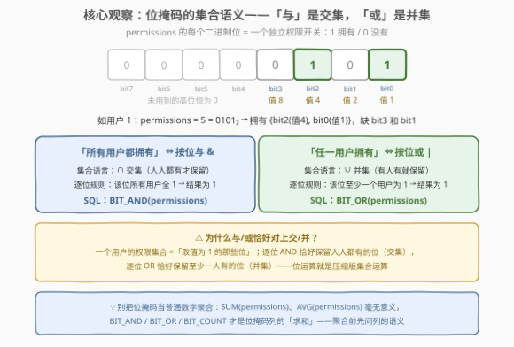
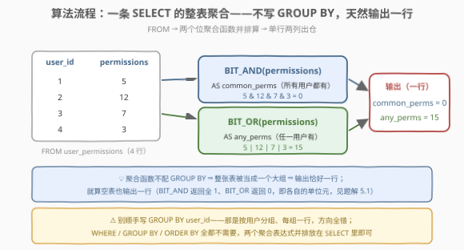
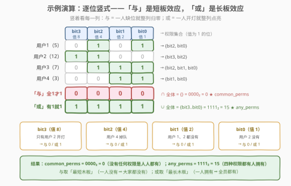

# LeetCode 按位用户权限分析 题解

## 1. 题目概述

- **标题 / 题号**：按位用户权限分析（#3204，medium）
- **链接**：https://leetcode.cn/problems/bitwise-user-permissions-analysis/
- **难度**：中等
- **标签**：数据库、SQL、位运算、位掩码、聚合函数、`BIT_AND`/`BIT_OR`、LeetCode 锁题

> ⚠️ 本题为 LeetCode 付费题（锁题），题意描述根据官方示例用例与外部资料重建，可能与官方题面有出入。（题面已与社区镜像 doocs/leetcode 的官方中文翻译交叉核对，示例输入输出与 GraphQL 接口返回一致，出入风险较低。）

**表结构**：`user_permissions`

| 列名 | 类型 |
|------|------|
| user_id | int |
| permissions | int |

- `user_id` 是这张表的主键（值互不相同）。
- 每行包含一个用户 ID 和该用户的权限，权限**编码为一个整数**。

**编码规则**：`permissions` 整数中的**每一个二进制位**代表该用户拥有的一个不同的访问级别（权限）——第 $b$ 位为 1 表示拥有权限 $b$，为 0 表示没有。例如 $5 = 0101_2$ 表示该用户拥有 bit2（值 4）和 bit0（值 1）两个权限。

**目标**：写一条 SQL 查询，计算以下两项：

- `common_perms`：授予**所有用户**的访问级别——对 `permissions` 列做**按位与**；
- `any_perms`：授予**任一用户**的访问级别——对 `permissions` 列做**按位或**。

以任意顺序返回结果表（单行两列）。

**示例 1**：

```text
输入：user_permissions 表
+---------+-------------+
| user_id | permissions |
+---------+-------------+
| 1       | 5           |
| 2       | 12          |
| 3       | 7           |
| 4       | 3           |
+---------+-------------+

输出：
+--------------+-----------+
| common_perms | any_perms |
+--------------+-----------+
| 0            | 15        |
+--------------+-----------+

解释：
common_perms（按位与）：
  用户 1: 5  = 0101₂
  用户 2: 12 = 1100₂
  用户 3: 7  = 0111₂
  用户 4: 3  = 0011₂
  5 & 12 & 7 & 3 = 0（0000₂）—— 没有任何权限位是四个用户全开的
any_perms（按位或）：
  5 | 12 | 7 | 3 = 15（1111₂）—— 四个权限位都有至少一个用户开着
```

**约束条件**（重建推测）：

- `user_id` 为主键，值互不相同；
- `permissions` 为编码权限的非负整数（位掩码按语义恒非负，`int` 至多 32 个权限位）；
- 判题数据规模小。

> 💡 **审题关键**：这是一道「位掩码 + SQL 聚合」的缝合题。权限不按「一行一条」地存，而是压进一个整数的各个二进制位——这种设计在 Unix 文件权限（`chmod 755`）、HTTP 标志位里随处可见。而「**所有用户都有 ⇔ 按位与**」「**任一用户有 ⇔ 按位或**」这组对应，就是位运算版的「交集 / 并集」。想通这一点，整道题坍缩成一条不带 `GROUP BY` 的 `SELECT`。

## 2. 解题思路

### 2.1 暴力思路：应用层累算 / 逐位相关子查询

「工程暴力」是把整表拉到应用层：

```sql
SELECT * FROM user_permissions;
```

然后在程序里维护两个累加器，逐行 `acc_and &= perms; acc_or |= perms`——两行代码，但聚合整体外包，$n$ 行数据全部过网络，SQL 只当了搬运工。

SQL 层的「笨办法」是**不敢用位聚合函数**时的逐位判定：位 $b$ 属于 `common_perms` $\iff$ 所有用户的第 $b$ 位都是 1 $\iff$ `SUM((permissions >> b) & 1) = COUNT(*)`；属于 `any_perms` $\iff$ 该和 $> 0$。若对 32 个位各写一条子查询，同一列要被反复扫 32 遍——「每个位问一遍全体」其实是同一件事重复了 32 次。

> ⚠️ 暴力思路的根本问题：把「对一列做整体折叠」拆成了逐位、逐行的重复劳动。位掩码列的聚合有原生的折叠算子——`BIT_AND` / `BIT_OR`，一次扫描同时算完所有位。有趣的是，逐位判定的**内核**并不差（它是方言无关的通用解法，见解法 B），笨的只是「重复扫描」的姿势——把 32 次扫描横向合并成一次分组即可。

### 2.2 核心观察：位掩码的集合语义——与是交集，或是并集



把每个用户的权限看成集合 $S_u = \{b : \text{permissions 的第 } b \text{ 位为 1}\}$，则两个目标各有一个精确的集合语义：

| 目标 | 集合语义 | 位运算语义 | 逐位规则 |
|------|----------|-----------|----------|
| `common_perms`（所有用户都有） | $\bigcap_u S_u$ 交集 | 逐位**与** `&` | 该位所有用户全为 1 → 1 |
| `any_perms`（任一用户有） | $\bigcup_u S_u$ 并集 | 逐位**或** `\|` | 该位至少一个用户为 1 → 1 |

这不是巧合：位掩码本来就是集合的紧凑编码（第 $b$ 位 = 元素 $b$ 的成员资格布尔值），按位与/或逐列做逻辑运算，恰好就是集合交/并的「按元素」定义。

MySQL 为此内置了两个**聚合函数**：

- `BIT_AND(expr)`：整列按位与，返回 `BIGINT UNSIGNED`；
- `BIT_OR(expr)`：整列按位或，同上。

再叠加聚合的一条通则：**聚合函数不配 `GROUP BY` 时，整张表被当成一个大组**——$n$ 行进、1 行出，两个聚合表达式并排放在 `SELECT` 里恰好得到单行两列，正是题目要的输出形状。整条查询一步到位：

$$
\text{common\_perms} = 5 \,\&\, 12 \,\&\, 7 \,\&\, 3 = 0, \qquad \text{any\_perms} = 5 \,|\, 12 \,|\, 7 \,|\, 3 = 15
$$

> 💡 顺带认清「列的语义决定聚合的方式」：对位掩码列，`SUM`/`AVG` 这类算术聚合毫无意义（把权限码加起来算什么呢？），`BIT_AND`/`BIT_OR`/`BIT_COUNT` 才是它对应的「求和」。聚合之前先问一句「这一列是什么语义的数」，是 SQL 题（也是数据建模）的基本功。

### 2.3 算法流程图



**逻辑执行步骤**：

| 步骤 | SQL 片段 | 作用 | 示例数据流 |
|------|----------|------|-----------|
| ① | `FROM user_permissions` | 读取全部行 | 4 行 |
| ② | `BIT_AND(permissions)` | 整列折叠成按位与 | $5\,\&\,12\,\&\,7\,\&\,3 = 0$ |
| ③ | `BIT_OR(permissions)` | 整列折叠成按位或 | $5\,|\,12\,|\,7\,|\,3 = 15$ |
| ④ | `SELECT` 两个表达式 | 无分组 ⇒ 输出一行 | `(0, 15)` |

> 💡 SQL 逻辑执行顺序为 `FROM → WHERE → GROUP BY → 聚合 → SELECT → ORDER BY → LIMIT`。本题不需要 `WHERE`、`GROUP BY`、`ORDER BY`：无过滤条件、无分组维度（要的是**整表**一行）、单行输出无排序可言。最容易画蛇添足的就是顺手写个 `GROUP BY user_id`——那是按用户分组、每组一行的方向性错误。

### 2.4 示例演算



把 4 个用户的权限写成二进制**竖式**，逐位分列观察：

| 行 | bit3（值 8） | bit2（值 4） | bit1（值 2） | bit0（值 1） | 集合语言 |
|----|----|----|----|----|----|
| 用户1（5 = 0101₂） | 0 | 1 | 0 | 1 | {bit2, bit0} |
| 用户2（12 = 1100₂） | 1 | 1 | 0 | 0 | {bit3, bit2} |
| 用户3（7 = 0111₂） | 0 | 1 | 1 | 1 | {bit2, bit1, bit0} |
| 用户4（3 = 0011₂） | 0 | 0 | 1 | 1 | {bit1, bit0} |
| **与（全 1 才 1）** | **0** | **0** | **0** | **0** | $\bigcap = \{\}$ = 0 |
| **或（有 1 就 1）** | **1** | **1** | **1** | **1** | $\bigcup$ = 15 |

每一列都有一个「谁拖后腿 / 谁点亮」的故事：

- **bit3**：只有用户 2 开灯 → 与 = 0（其余三人都没有），或 = 1；
- **bit2**：用户 4 掉队 → 与 = 0，或 = 1；
- **bit1**：用户 1、2 都没有 → 与 = 0，或 = 1；
- **bit0**：用户 2 没有 → 与 = 0，或 = 1。

> 💡 两个效应可以一句话记住：**与是短板效应**——一人缺位就整列归零（交集取最「短」的集合）；**或是长板效应**——一人开灯就整列点亮（并集取最「长」的集合）。示例里四个位恰好演示了四种不同的「短板」位置，最终 `common_perms = 0000₂ = 0`、`any_perms = 1111₂ = 15`。

## 3. 参考代码

### SQL（解法 A：`BIT_AND` / `BIT_OR` 聚合函数，推荐）

```sql
# Write your MySQL query statement below
SELECT
    BIT_AND(permissions) AS common_perms,
    BIT_OR(permissions)  AS any_perms
FROM user_permissions;
```

> 💡 **写法要点**：
> - 两个聚合函数并排放同一条 `SELECT`，引擎一次扫描即可同时折叠出两列；
> - **不写 `GROUP BY`**：整表一组，恰好输出一行；写了反而按 `user_id` 分组出 $n$ 行，方向全错；
> - 返回类型为 `BIGINT UNSIGNED`，本题值域很小，与普通整数比较无碍（无符号比较的坑见第 6 节第 4 问）；
> - PostgreSQL 同名聚合 `bit_and` / `bit_or` 同样可用；SQL Server 没有内置位聚合，用解法 B。

### SQL（解法 B：递归 CTE 逐位展开，方言无关）

```sql
# Write your MySQL query statement below（MySQL 8.0+）
WITH RECURSIVE bits AS (
    SELECT 0 AS b                       -- 生成 0..31 共 32 个权限位
    UNION ALL
    SELECT b + 1 FROM bits WHERE b < 31
)
SELECT
    CAST(SUM(CASE WHEN ones = total THEN 1 << b ELSE 0 END) AS SIGNED) AS common_perms,
    CAST(SUM(CASE WHEN ones > 0     THEN 1 << b ELSE 0 END) AS SIGNED) AS any_perms
FROM (
    SELECT b,
           SUM((permissions >> b) & 1) AS ones,   -- 第 b 位为 1 的用户数
           COUNT(*)                    AS total   -- 用户总数
    FROM user_permissions
    CROSS JOIN bits
    GROUP BY b
) t;
```

> 💡 **解法 B 的取舍**：
> - 内层把「用户 × 位」交叉展开后按位分组：`ones` = 第 $b$ 位为 1 的用户数、`total` = 用户总数，于是**每位拥有一个人数**——`ones = total` 即人人都有（与），`ones > 0` 即有人有（或），再把命中的位按 $2^b$ 加权求和还原成整数；
> - 它是 2.1「逐位判定」的正确姿势：32 个位**横向合并成一次分组**，全表只扫一遍（CROSS JOIN 32 倍展开后聚合，量级 $O(32n)$），而不是 32 条子查询各扫一遍；
> - 真正的价值在**可扩展**：任何「按人数」的权限统计变体（至少 K 人、恰好 K 人拥有某权限）都只改一个 `CASE` 条件（见 5.2）；
> - `CAST(... AS SIGNED)` 把 `SUM` 的 DECIMAL 结果收回归整数类型，纯为输出整洁，判题不 CAST 也能过。

### Python（pandas）

```python
import numpy as np
import pandas as pd


def bitwise_user_permissions_analysis(user_permissions: pd.DataFrame) -> pd.DataFrame:
    perms = user_permissions["permissions"].to_numpy()
    return pd.DataFrame({
        "common_perms": [int(np.bitwise_and.reduce(perms))],
        "any_perms": [int(np.bitwise_or.reduce(perms))],
    })
```

> 💡 **pandas 对照**（付费题无官方函数签名，函数名按题名约定）：
> - `np.bitwise_and.reduce` / `np.bitwise_or.reduce` 就是「按位与/或」版的 `sum`——`reduce` 把二元运算沿整列折叠，与 SQL 的 `BIT_AND`/`BIT_OR` 一一对应；
> - 空表行为与 MySQL 优雅地同构：`bitwise_and.reduce([])` 返回 `-1`（补码全 1，AND 的单位元），`bitwise_or.reduce([])` 返回 `0`（OR 的单位元）；
> - `int(...)` 把 numpy 标量转成 Python int，避免返回值带 `np.int64` 类型。

## 4. 复杂度分析

设 $n$ 为表的行数，$W = 32$ 为权限位宽（`int` 语义下的常数）。

| 维度 | 复杂度 | 说明 |
|------|--------|------|
| **时间复杂度（解法 A）** | $O(n)$ | 单趟扫描整列；每行的按位与/或是宽度固定的 64 位运算，视作 $O(1)$ |
| **时间复杂度（解法 B）** | $O(W \cdot n) = O(32n)$ | 用户 × 32 个位的交叉展开 + 按位分组计数；$W$ 为常数，量级仍是线性 |
| **空间复杂度** | $O(1)$ / $O(W)$ | 解法 A 仅两个 64 位累加器；解法 B 另需 32 组 `(ones, total)` 计数 |

> - 对比 2.1 的逐位相关子查询：32 个位各触发一次全表扫描，$O(32n)$ 次比较且伴随 32 趟重复 IO；解法 A/B 都把它压回「全表只读一遍」；
> - 本题无过滤、无分组、无排序，`ORDER BY` 的省略也免掉了 $O(n \log n)$——单行输出无排序可言。

## 5. 扩展

### 5.1 MySQL 位函数家族与空表行为

| 函数 | 类别 | 语义 |
|------|------|------|
| `BIT_AND(expr)` | 聚合 | 整列按位与，返回 `BIGINT UNSIGNED` |
| `BIT_OR(expr)` | 聚合 | 整列按位或，返回 `BIGINT UNSIGNED` |
| `BIT_XOR(expr)` | 聚合 | 整列按位异或（两次出现 = 抵消，可用来找「出现奇数次的值」） |
| `BIT_COUNT(N)` | 标量 | 数一个整数里 1 的个数——「每个用户有几个权限」就是 `SELECT BIT_COUNT(permissions) FROM user_permissions`，SQL 版的 [191. 位 1 的个数](https://leetcode.cn/problems/number-of-1-bits/) |

**空表行为**是最有数学味的一个细节：没有匹配行时，`BIT_AND()` 返回 $18446744073709551615$（64 位全 1），`BIT_OR()` / `BIT_XOR()` 返回 $0$。这不是乱设计——它们正是两个运算的**单位元**（$x \,\&\, 111\cdots1 = x$，$x \,|\, 0 = x$），「空集折叠返回单位元」与代数里的空和为 0、空积为 1 完全同构（numpy 的 `bitwise_and.reduce([]) = -1` 亦然）。对照记忆：`COUNT` 空表返回 0，`SUM`/`AVG`/`MIN`/`MAX` 空表返回 `NULL`，位聚合独走一条路。

### 5.2 变体追问：按人数统计权限

面试官常见的追加问：「**至少 K 个用户**拥有的权限有哪些？」解法 B 的 `ones`（每位的持有人数）已经把数据摊平，答案只是换一个 `CASE` 条件：

```sql
CAST(SUM(CASE WHEN ones >= 3 THEN 1 << b ELSE 0 END) AS SIGNED) AS at_least_3_perms
```

- 恰好 K 人：`ones = K`；无人拥有：`ones = 0`；多数派（超过半数）：`ones > total / 2`。
- 解法 A 的 `BIT_AND`/`BIT_OR` 是两个特例端点：K = n（人人都有）与 K = 1（有人有）。**位聚合函数只能答端点问题，逐位展开才能答整条人数轴**——这正是解法 B 值得存在的理由。

### 5.3 工程背景：真的有系统这样存权限

- **Unix 文件权限**就是位掩码的祖师爷：`rwx` 三位一组，读 = 4、写 = 2、执行 = 1，`chmod 755` 的 755 = `111101101₂`；
- 增删查改权限全是位运算三件套：**查** `p & PERM != 0`，**授予** `p | PERM`，**撤销** `p & ~PERM`；
- **位掩码 vs 关联表**（`user_id, perm_id` 一行一条的规范化设计）的取舍：位掩码一行搞定、交并差 $O(1)$（本题正是展示窗口）、极省空间；代价是权限数 ≤ 64（BIGINT）、无法对单个权限建索引/外键、可读性差（还得靠本题这类查询翻译）。权限项少且稳定（菜单开关、功能开关）选位掩码，权限项多且要运营人员自由配置选关联表。

## 6. 面试要点

1. **`BIT_AND` / `BIT_OR` 的语义分别是什么？对应什么集合运算？**

   > `BIT_AND(expr)` 把整列按位与、`BIT_OR(expr)` 整列按位或，返回 `BIGINT UNSIGNED`。把每个用户的权限看作「取值为 1 的位的集合」，按位与恰好保留**人人都有的位**（交集 ∩），按位或保留**至少一人有的位**（并集 ∪）——位掩码是集合的紧凑编码，位运算就是压缩版集合运算。

2. **为什么这条查询不写 `GROUP BY` 也恰好输出一行？空表会输出几行？**

   > 聚合函数不配 `GROUP BY` 时把整张表当成一个大组：$n$ 行进、1 行出，两个聚合表达式并排即得单行两列。就算空表也**输出一行**——`BIT_AND` 返回全 1（$18446744073709551615$）、`BIT_OR` 返回 0，即各自的单位元，这与「聚合函数对空组返回单位元」的代数约定一致（对照 `SUM` 空表返回 `NULL`）。

3. **不用专用位聚合函数（例如 SQL Server 没有），怎么写？**

   > 逐位展开：递归 CTE 生成 0..31 的位编号，与原表 CROSS JOIN 后按位分组，统计每位的持有人数 `ones` 与总人数 `total`——`ones = total` 即人人都有、`ones > 0` 即有人有，再按 $2^b$ 加权 `SUM` 还原成整数。一次分组替代 32 条相关子查询，且天然支持「至少 K 人 / 恰好 K 人」等按人数的变体。

4. **`BIGINT UNSIGNED` 返回类型有什么坑？**

   > 无符号 64 位整数与**负数字面量**比较或参与减法时，MySQL 会因符号冲突报错（如 `BIT_AND(...) - 1` 可能触发 `BIGINT UNSIGNED value is out of range`）。本题输出值域极小无此风险，但在工程里拿位聚合结果做算术时要先 `CAST(... AS SIGNED)`。

5. **位掩码存权限的优缺点？什么时候该换成关联表？**

   > 优点：一行存全部权限、交/并/差/检查都是 $O(1)$ 位运算、极省空间。缺点：权限数受位宽限制（BIGINT ≤ 64）、不能按单个权限建索引/外键、人类不可读、无法附加属性（如授权时间）。权限项少且稳定（功能开关、菜单权限）用位掩码；权限项多、需动态配置或要审计追溯时用「用户-权限」关联表。

> 💡 **一句话总结**：3204 = 位掩码列的集合语义 + SQL 位聚合。「所有用户都有 ⇔ `BIT_AND`，任一用户有 ⇔ `BIT_OR`」，无 `GROUP BY` 的整表聚合天然输出一行——`SELECT BIT_AND(permissions), BIT_OR(permissions) FROM user_permissions` 一条到位；逐位展开版则是方言无关、可扩展到「至少 K 人」的通用骨架。

## 同类练习题

| # | 题目 | 与本题的关联 |
|---|------|-------------|
| 201 | [数字范围按位与](https://leetcode.cn/problems/bitwise-and-of-numbers-range/) | 算法侧深水区——连续整数连按位与的公共前缀性质，与 `BIT_AND` 同语义的纯算法版 |
| 898 | [子数组按位或操作](https://leetcode.cn/problems/bitwise-ors-of-subarrays/) | 按位或的聚合传播（OR 只增不减的单调性），与 `BIT_OR` 对偶的算法版 |
| 586 | [订单最多的客户](https://leetcode.cn/problems/customer-placing-the-largest-number-of-orders/)（[站内题解](../0501-0600/586_订单最多的客户.md)） | SQL 聚合基本功——`GROUP BY + COUNT + ORDER BY`，聚合家族的入门对照 |
| 187 | [重复的DNA序列](https://leetcode.cn/problems/repeated-dna-sequences/)（[站内题解](../0101-0200/187_重复的DNA序列.md)） | 位编码的另一个方向——把序列压进整数位当哈希键，与本题「集合压进整数」互为镜像 |
| 191 | [位 1 的个数](https://leetcode.cn/problems/number-of-1-bits/)（[站内题解](../0001-0100/191_位1的个数.md)） | `BIT_COUNT` 的算法侧原型 `n & (n-1)`，数 1 的基本功 |
