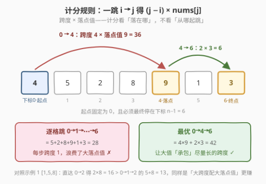
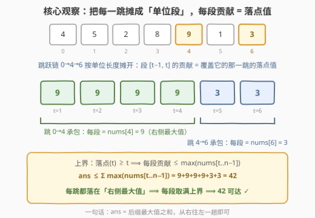
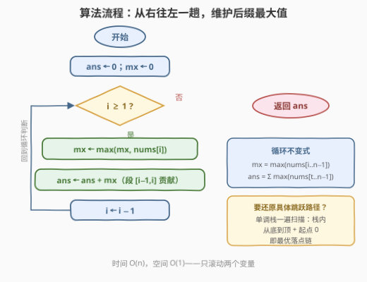
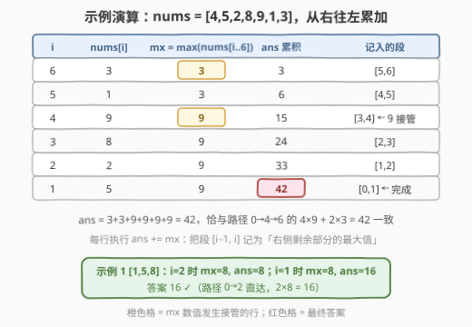

# LeetCode 最大数组跳跃得分 I 题解

## 1. 题目概述

- **标题 / 题号**：最大数组跳跃得分 I（#3205，medium）
- **链接**：https://leetcode.cn/problems/maximum-array-hopping-score-i/
- **难度**：中等
- **标签**：数组、动态规划、贪心、单调栈

> ⚠️ 本题为 LeetCode 付费题（锁题），题意描述根据官方示例用例与外部资料重建，可能与官方题面有出入。（题面已与社区镜像 doocs/leetcode 的官方中文翻译交叉核对，示例输入输出与 GraphQL 接口返回一致，且两个示例答案均已用暴力 DP 独立验证，出入风险较低。）

**题意**：给定一个数组 `nums`，你必须**从下标 0 开始**跳跃，直到**到达数组的最后一个元素**，使得获得**最大**分数。

每一次**跳跃**中，你可以从下标 $i$ 跳到一个 $j > i$ 的下标，并且可以得到 $(j - i) \times nums[j]$ 的分数。

返回你能够取得的最大分数。

一句话读题：从下标 0 出发、最终停在下标 $n-1$，每跳一步按「**跨度 × 落点值**」计分，求最大总分。

**示例 1**：

```text
输入：nums = [1,5,8]
输出：16
解释：有两种方式到达最后一个元素：
     0 -> 1 -> 2，得分为 (1-0)*5 + (2-1)*8 = 13；
     0 -> 2，    得分为 (2-0)*8 = 16。取最大值 16。
```

**示例 2**：

```text
输入：nums = [4,5,2,8,9,1,3]
输出：42
解释：按 0 -> 4 -> 6 跳跃，得分为 (4-0)*9 + (6-4)*3 = 36 + 6 = 42。
```

**约束**：

- $2 \le nums.length \le 10^3$
- $1 \le nums[i] \le 10^5$

> 💡 读题关键：计分公式 $(j-i) \times nums[j]$ 用的是**落点值** $nums[j]$，不是起点值 $nums[i]$——这与周赛题 [3282. 到达数组末尾的最大得分](https://leetcode.cn/problems/reach-end-of-array-with-max-score/) 恰好互为镜像（那题按起点值计分）。落点值计分意味着「**让大值承包尽量长的跨度**」是本能方向。另外 $n \le 10^3$ 给 $O(n^2)$ DP 留了活路，但最优解可以做到 $O(n)$。

## 2. 解题思路

### 2.1 暴力思路：线性 DP，$O(n^2)$

跳跃链是一条下标严格递增的路径 $0 = i_0 < i_1 < \cdots < i_m = n-1$，天然的**无后效性**结构。定义：

$$f[j] = \text{从下标 } 0 \text{ 出发、恰好停在下标 } j \text{ 的最大得分}$$

枚举最后一跳的起点 $i < j$，得转移方程：

$$f[j] = \max_{0 \le i < j} \big\{ f[i] + (j - i) \times nums[j] \big\}, \qquad f[0] = 0$$

答案是 $f[n-1]$。时间 $O(n^2)$、空间 $O(n)$，$n \le 10^3$ 时约 $10^6$ 次运算，稳过。（官方 hints 给的是反向定义 $dp[i]$ = 从 $i$ 出发跳到末尾的最大得分，本质相同，倒序刷表即可。）

> ⚠️ 卡点：转移里「$f[i] + (j-i) \times nums[j]$」对**每一对** $(i,j)$ 都单独算一遍，是 $O(n^2)$ 的根源。但每一跳的得分其实可以按单位长度摊开——摊开之后你会发现每一段的贡献有个**显然的上界**，根本不需要逐对比较。

### 2.2 核心观察：单位段分解 + 后缀最大值，$O(n)$

先直观感受一下「跨度 × 落点值」鼓励什么样的跳法：



**观察 1（把每一跳摊成单位段）**：落在 $i_{k+1}$ 的那一跳覆盖了 $(i_k, i_{k+1}]$ 里的每一段单位区间 $[t-1, t]$（共 $i_{k+1} - i_k$ 段），每段贡献 $nums[i_{k+1}]$。于是总分可以**逐段**重写：

$$\text{总分} = \sum_{t=1}^{n-1} nums[\text{落点}(t)]， \qquad \text{落点}(t) \text{ 是覆盖段 } [t-1,t] \text{ 的那一跳的落点}$$



**观察 2（每段贡献有上界）**：覆盖段 $[t-1, t]$ 的那一跳必然落在某个 $\ge t$ 的下标上（跳只能往右），所以：

$$nums[\text{落点}(t)] \le \max(nums[t..n-1]) \;\triangleq\; m(t)$$

对全部 $n-1$ 个单位段求和，得到**答案上界**：

$$ans \le \sum_{t=1}^{n-1} m(t) = \sum_{t=1}^{n-1} \max(nums[t..n-1])$$

**观察 3（上界可以达到）**：贪心地「每一跳都落在右侧剩余部分的**最大值**处」（并列时任取其一）：站在 $i$，跳到 $j$ = $\arg\max_{j > i} nums[j]$。对任一段 $t \in (i_k, i_{k+1}]$：

- $nums[i_{k+1}]$ 是 $nums[i_k+1..n-1]$ 的最大值，而 $t \ge i_k + 1$，故 $m(t) \le nums[i_{k+1}]$；
- 又 $i_{k+1} \ge t$，故 $m(t) \ge nums[i_{k+1}]$。

两边的夹逼说明 $m(t) = nums[i_{k+1}]$，即**每一段都恰好取满上界**；链严格右移且必然终止于 $n-1$，所以上界就是答案：

$$ans = \sum_{t=1}^{n-1} \max(nums[t..n-1])$$

> 💡 一个记忆钩子：把 $[t-1, t]$ 这一段想象成「过路费」，谁承包这段路（那一跳的落点）就按谁的价值收费——当然要让**右侧还没错过的最大值**来承包。全部摊开后，答案就是后缀最大值之和。

### 2.3 算法流程图

求和式只需**从右往左一趟**滚动维护 $\max$：



流程共五步：

1. 初始化 `ans = 0`（总分）、`mx = 0`（后缀最大值）；
2. 倒序枚举 $i$ 从 $n-1$ 到 $1$；
3. `mx = max(mx, nums[i])`，此时 `mx = max(nums[i..n-1])`；
4. `ans += mx`，把段 $[i-1, i]$ 记为后缀最大值；
5. 循环结束返回 `ans`。

若面试官追问「具体怎么跳」，可用**单调栈**还原路径（见 5.1）：从左到右维护严格递减栈，栈中下标（加上起点 0）就是一条最优落点链。

### 2.4 示例演算

以 `nums = [4,5,2,8,9,1,3]` 为例，从右往左逐行累加：



| $i$ | $nums[i]$ | $mx=\max(nums[i..6])$ | $ans$ 累积 | 记入的段 |
|-----|-----------|------------------------|-----------|----------|
| 6 | 3 | **3** | 3 | $[5,6]$ |
| 5 | 1 | 3 | 6 | $[4,5]$ |
| 4 | 9 | **9** | 15 | $[3,4]$，9 接管 |
| 3 | 8 | 9 | 24 | $[2,3]$ |
| 2 | 2 | 9 | 33 | $[1,2]$ |
| 1 | 5 | 9 | 42 | $[0,1]$，完成 |

$ans = 3+3+9+9+9+9 = 42$，与最优路径 $0 \to 4 \to 6$ 的 $4 \times 9 + 2 \times 3 = 42$ 完全一致。示例 1 `[1,5,8]` 同法：$i=2$ 时 $mx=8$、$ans=8$；$i=1$ 时 $mx=8$、$ans=16$，答案 16（路径 $0 \to 2$ 直达）。

## 3. 参考代码

### C++

```cpp
class Solution {
  public:
    int maxScore(vector<int>& nums) {
        int n = nums.size(), ans = 0, mx = 0;
        for (int i = n - 1; i >= 1; --i) {   // 倒序枚举每个落点区间
            mx = max(mx, nums[i]);           // mx = max(nums[i..n-1])
            ans += mx;                       // 段 [i-1, i] 记为后缀最大值
        }
        return ans;
    }
};
```

### Python

```python
class Solution:
    def maxScore(self, nums: List[int]) -> int:
        ans = mx = 0
        for i in range(len(nums) - 1, 0, -1):   # 倒序枚举每个落点区间
            mx = max(mx, nums[i])               # mx = max(nums[i..n-1])
            ans += mx                           # 段 [i-1, i] 记为后缀最大值
        return ans
```

> 💡 细节盘点：循环从 $n-1$ 跑到 $1$（段 $[0,1]$ 是最后一段，下标 0 永远只是起点、不产生得分项）；`mx` 初值取 0 即可，因 $nums[i] \ge 1 > 0$，第一轮就被覆盖。溢出方面 $n \le 10^3$、$nums[i] \le 10^5$，$ans \le 999 \times 10^5 < 2^{31}$，`int` 足够；放到孪生题 3221（$n \le 10^5$）就要换 `long long`（见 5.2）。

## 4. 复杂度分析

| 维度 | 复杂度 | 说明 |
|------|--------|------|
| 时间复杂度 | $O(n)$ | 从右往左一趟，每个元素读一次 |
| 空间复杂度 | $O(1)$ | 只滚动 `ans` / `mx` 两个变量 |
| 暴力对照 | $O(n^2)$ / $O(n)$ | 2.1 线性 DP，$n \le 10^3$ 能过但没挖出「段贡献上界」的结构 |

## 5. 扩展

### 5.1 单调栈：还原具体跳跃路径

官方标签里的「栈 / 单调栈」来自另一问法：**给出一条最优跳跃链**。从左到右维护一个从栈底到栈顶**严格递减**的下标栈——遇到 $nums[i]$ 时不断弹掉所有值 $\le nums[i]$ 的栈顶，再压入 $i$。最终栈中下标（自底向上）加上起点 0，就是一条最优落点链：每个栈中下标都是「右侧严格最大值」（严格后缀记录），相邻栈元素之间的所有元素值都不超过后者，恰好让每一段都取满 $m(t)$。

```cpp
class Solution {
  public:
    int maxScore(vector<int>& nums) {
        vector<int> stk;                       // 值严格递减的下标栈
        for (int i = 0; i < (int)nums.size(); ++i) {
            while (!stk.empty() && nums[stk.back()] <= nums[i]) {
                stk.pop_back();
            }
            stk.push_back(i);
        }
        int ans = 0, i = 0;                    // i 是当前落点，从起点 0 出发
        for (int j : stk) {                    // 栈底→栈顶 = 最优落点链
            ans += (j - i) * nums[j];
            i = j;
        }
        return ans;
    }
};
```

```python
class Solution:
    def maxScore(self, nums: List[int]) -> int:
        stk = []                               # 值严格递减的下标栈
        for i, x in enumerate(nums):
            while stk and nums[stk[-1]] <= x:
                stk.pop()
            stk.append(i)
        ans = i = 0                            # i 是当前落点，从起点 0 出发
        for j in stk:                          # 栈底→栈顶 = 最优落点链
            ans += (j - i) * nums[j]
            i = j
        return ans
```

对比示例 2：栈的演化依次为 `[0] → [1] → [1,2] → [3] → [4] → [4,5] → [4,6]`，最终 `[4,6]` 即落点链，跳跃路径 $0 \to 4 \to 6$。

### 5.2 孪生题 3221：$n$ 放大到 $10^5$

[3221. 最大数组跳跃得分 II 🔒](https://leetcode.cn/problems/maximum-array-hopping-score-ii/) 与本题题面完全相同，仅把 $n$ 放大到 $10^5$：$O(n^2)$ DP 直接超时，必须用上面的 $O(n)$ 后缀最大值求和；同时答案上界达到 $10^5 \times 10^5 = 10^{10}$，返回值要换 64 位整数。本题的 `int` 版代码只需改两处（返回类型与 `ans` 类型）即可迁移。

### 5.3 镜像题 3282：起点值计分 → 前缀最大值

[3282. 到达数组末尾的最大得分](https://leetcode.cn/problems/reach-end-of-array-with-max-score/)（免费题，第 414 场周赛 Q3）把计分换成 $(j - i) \times nums[i]$——按**起点值**计分。同样的单位段分解：段 $[t-1, t]$ 的贡献变成「那一跳的**起点**值」，起点 $\le t-1$，于是每段贡献 $\le \max(nums[0..t-1])$，答案化为**前缀最大值之和**，贪心策略相应变成「跳到右侧**下一个更大值**」。两题对照着做，「落点值 → 后缀 max、起点值 → 前缀 max」的对称性一目了然。

## 6. 面试要点

1. **为什么「每一跳落在右侧最大值处」是最优的？**

   - 单位段分解：总分 $= \sum_{t=1}^{n-1} nums[\text{落点}(t)]$。段 $[t-1,t]$ 的落点 $\ge t$，故每段贡献 $\le \max(nums[t..n-1])$，得**上界** $\sum_t m(t)$。而「跳到右侧最大值」的链对每段 $t \in (i_k, i_{k+1}]$ 都有 $m(t) = nums[i_{k+1}]$（两边夹逼），**每段取满上界**，故上界可达、即最优。

2. **$O(n^2)$ DP 与 $O(n)$ 贪心的本质差距在哪？**

   - DP 对每对 $(i, j)$ 独立比较，没注意到「一跳的得分可以按单位长度摊开、每段贡献只由落点决定」——而落点值的上界（右侧最大值）可以倒序一趟滚动维护。这是典型的**交换求和顺序**式优化（先按跳求和 → 改按单位段求和）。

3. **右侧最大值有并列时跳最左还是最右？**

   - 任取其一，得分相同：并列时 $m(t)$ 与落点值相等的关系不受影响；两条链（如 `[3,5,1,5,2]` 的 $0 \to 1 \to 3 \to 4$ 与 $0 \to 3 \to 4$）都取满上界。单调栈实现因用 `<=` 弹栈，天然落在**最右**那个并列最大值上。

4. **怎么还原一条具体的最优跳跃路径？**

   - 单调栈：从左到右维护值严格递减的下标栈（`nums[栈顶] <= nums[i]` 则弹），栈中下标自底向上加起点 0 即最优落点链；等价地也可直接贪心「从当前位置跳到右侧最大值的任一出现处」。

5. **与 3282（按起点值计分）是什么关系？答案分别怎么退化？**

   - 互为镜像：落点值计分 ⟹ 每段贡献上界是**后缀**最大值，答案 = Σ 后缀 max，贪心「跳到右侧最大值」；起点值计分 ⟹ 上界是**前缀**最大值，答案 = Σ 前缀 max，贪心「跳到下一个更大值」。两题都用同样的单位段分解，只是「谁承包这段路」从落点换成了起点。

6. **数据范围与溢出要盯什么？**

   - 本题 $n \le 10^3$、$nums[i] \le 10^5$，$ans < 10^8$，32 位 `int` 安全，$O(n^2)$ 也能过；孪生题 3221 的 $n \le 10^5$ 逼出 $O(n)$ 且需要 64 位。面试中先问清范围再选解法档次，是基本功。

## 同类练习题

| # | 题目 | 与本题的关联 |
|---|------|-------------|
| 3221 | [最大数组跳跃得分 II 🔒](https://leetcode.cn/problems/maximum-array-hopping-score-ii/) | 同题面、$n \le 10^5$，逼出 $O(n)$ 后缀最大值求和 + 64 位返回值，本题的进阶版 |
| 3282 | [到达数组末尾的最大得分](https://leetcode.cn/problems/reach-end-of-array-with-max-score/) | 镜像题，按起点值 $(j-i) \times nums[i]$ 计分，单位段分解后答案化为前缀最大值之和（免费题，周赛 414 Q3） |
| 1696 | [跳跃游戏 VI](https://leetcode.cn/problems/jump-game-vi/) | 同为「最大得分到达终点」的线性 DP，但跳跃范围限制在 $1..k$ 步，用单调队列优化到 $O(n)$——对照体会「转移结构决定优化手段」 |
| 739 | [每日温度](https://leetcode.cn/problems/daily-temperatures/) | 单调栈求「右侧下一个更大」的入门模板，练熟后 5.1 的路径还原信手拈来 |
| 45 | [跳跃游戏 II](https://leetcode.cn/problems/jump-game-ii/) | 跳跃家族的贪心招牌题（求最少跳数），与本题「最大化得分」的贪心互为对照 |
