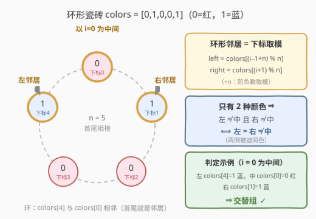
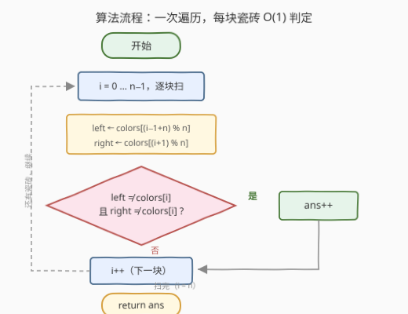

# LeetCode 交替组 I 题解

## 1. 题目概述

- **标题 / 题号**：交替组 I（#3206，easy）
- **链接**：https://leetcode.cn/problems/alternating-groups-i/
- **难度**：简单
- **标签**：数组、滑动窗口

**题意**：给你一个整数数组 `colors`，表示一个由红色和蓝色瓷砖组成的**环**，第 `i` 块瓷砖的颜色为 `colors[i]`：

- `colors[i] == 0` 表示第 `i` 块瓷砖是**红色**；
- `colors[i] == 1` 表示第 `i` 块瓷砖是**蓝色**。

环中**连续 3 块**瓷砖的颜色如果是**交替**颜色（也就是中间瓷砖的颜色与它**左边**和**右边**的颜色都不同），那么它被称为一个**交替组**。请你返回交替组的数目。

注意 `colors` 表示的是一个**环**——第一块瓷砖和最后一块瓷砖是相邻的。

**示例 1**：

```text
输入：colors = [1,1,1]
输出：0
解释：三块瓷砖全是蓝色，任何中间块的左右邻居都与它同色，不存在交替组。
```

**示例 2**：

```text
输入：colors = [0,1,0,0,1]
输出：3
解释：交替组为下标三元组 (4,0,1)、(0,1,2)、(3,4,0)，
     其中 (4,0,1) 和 (3,4,0) 跨过了首尾接缝。
```

**约束**：

- $3 \le colors.length \le 100$
- $colors[i] \in \{0, 1\}$

> 💡 读题关键：①「连续 3 块」在环上有 $n$ 个可能的位置（每块瓷砖都能当一次中间），且允许**跨过首尾接缝**；②颜色只有两种，这让「左右都与中间不同」有一个更强的等价形式（见 2.2）。

## 2. 解题思路

### 2.1 暴力思路

对每个位置 $i$，取出它在环上的左右邻居做判断——思路本身一次遍历就够了，真正的难点在**环形边界**：`i = 0` 的左邻居是 `colors[n-1]`，`i = n-1` 的右邻居是 `colors[0]`。最朴素的写法是给首尾两个位置单独写 if 特判，正确但分支多、容易漏；另一种办法是把数组复制拼接（`colors + colors` 的前 2 个元素），把环摊平成链再数长度为 3 的窗口，正确但多花 $O(n)$ 空间。

$n \le 100$，怎么写都能过。但更优雅的做法是一行**取模**统一所有边界。

### 2.2 核心观察：环形取模 + 两色化简



**观察 1（环形 = 下标取模）**：第 $i$ 块的左右邻居统一写成

$$left = colors[(i-1+n) \bmod n], \quad right = colors[(i+1) \bmod n]$$

「$+n$」把 $i-1$ 搬进 $[0, 2n)$，避免 C++/Java 中负数取模出负数；Python 的 `%` 天然非负，甚至 `colors[-1]` 直接就是最后一块——环形白送。

**观察 2（两种颜色 ⇒ 判定化简）**：颜色只有红蓝两种。若中间与左右都不同，左右只能同取另一种颜色，因此

$$左 \ne 中 \text{ 且 } 右 \ne 中 \iff 左 = 右 \ne 中$$

判定条件只写两个「不等」即可；等价地，三元组 $(a, b, c)$ 是交替组 $\iff a \ne b$ 且 $b \ne c$（两色下两端自动同色）——这正是**长度 3 的定长滑窗**视角，也更容易推广到 3208 的长度 $k$（见第 5 节）。

**观察 3（不重不漏）**：每个交替组由「中间那块」瓷砖唯一确定。让 $i$ 取遍 $0 \dots n-1$ 各当一次中间，$n$ 次判定恰好与所有交替组一一对应，天然无重复、无遗漏。

### 2.3 算法流程图



单重循环，每个位置 $O(1)$ 取邻居 + $O(1)$ 判定，一遍扫完。

### 2.4 示例演算

![示例演算：colors = [0,1,0,0,1]](../images/p3206_walkthrough.svg)

以 `colors = [0,1,0,0,1]`，$n = 5$ 为例：

- $i=0$：左 `colors[4]=1`、中 `colors[0]=0`、右 `colors[1]=1`——左右同蓝、中间红，✓；
- $i=1$：左 0、中 1、右 0，✓；
- $i=2$、$i=3$：各有一侧与中间同色，✗；
- $i=4$：左 `colors[3]=0`、中 `colors[4]=1`、右 `colors[0]=0`，✓（跨接缝）。

答案为 **3**。三个交替组 $(4,0,1)$、$(0,1,2)$、$(3,4,0)$ 中有两个跨过首尾接缝——这正是「环」存在的意义，也是边界处理的价值所在。

## 3. 参考代码

### C++（中间锚点 + 取模）

```cpp
class Solution {
  public:
    int numberOfAlternatingGroups(vector<int>& colors) {
        int n = colors.size(), ans = 0;
        for (int i = 0; i < n; i++) {
            int left = colors[(i - 1 + n) % n];  // 环形左邻居
            int right = colors[(i + 1) % n];     // 环形右邻居
            if (left != colors[i] && right != colors[i]) ans++;
        }
        return ans;
    }
};
```

### Python（负索引白送环形）

```python
class Solution:
    def numberOfAlternatingGroups(self, colors: List[int]) -> int:
        n = len(colors)
        ans = 0
        for i in range(n):
            if colors[i - 1] != colors[i] != colors[(i + 1) % n]:
                ans += 1
        return ans
```

> 💡 Python 的 `colors[i - 1]` 在 `i = 0` 时取到 `colors[-1]`（末元素），负索引天然表达环形；`a != b != c` 是链式比较，同时声明两个「不等」。C++ 则务必写 `(i - 1 + n) % n` 防止负数取模。

## 4. 复杂度分析

| 维度 | 复杂度 | 说明 |
|------|--------|------|
| 时间复杂度 | $O(n)$ | 每个位置 $O(1)$ 取邻居 + $O(1)$ 判定，一次遍历 |
| 空间复杂度 | $O(1)$ | 仅常数个变量，不拼接数组 |
| 暴力对照 | $O(n)$ / $O(n)$ | 拼接破环版同样线性，但多花 $O(n)$ 空间；首尾特判版分支冗余易错 |

## 5. 扩展：3208 交替组 II 与「破环为链」

[3208. 交替组 II](https://leetcode.cn/problems/alternating-groups-ii/) 把窗口长度从 3 泛化为 $k$：统计环上长度**恰为 $k$** 的交替组个数。通用技巧是**破环为链**——把 `colors` 的前 $k-1$ 个元素接到尾部，环就摊平成长度 $n+k-1$ 的链；再用「交替段长度 run」一次遍历统计：若以 $j$ 结尾的交替段长度 $run \ge k$，则窗口 $[j-k+1, j]$ 恰好是一个长度为 $k$ 的交替组。

```python
class Solution:
    def numberOfAlternatingGroups(self, colors: List[int], k: int) -> int:
        a = colors + colors[:k - 1]        # 破环为链：首尾再接 k-1 个元素
        ans = run = 0
        for j in range(len(a)):
            run = run + 1 if j and a[j] != a[j - 1] else 1
            ans += run >= k                 # 窗口 [j-k+1, j] 恰好交替
        return ans
```

本题（$k = 3$）就是它的特例；反过来，先把 $k=3$ 想清楚，再看这段代码会非常自然。注意 3208 的约束保证 $k \le n$，所以接 $k-1$ 个元素足以覆盖所有跨接缝的窗口。

## 6. 面试要点

1. **环形数组的左右邻居怎么取？**

   - 统一用下标取模：`(i - 1 + n) % n` 与 `(i + 1) % n`。C++/Java 中 `i - 1` 可能为 $-1$，负数取模结果仍为负，必须先 `+n`；Python 的 `%` 恒非负，且 `colors[-1]` 直接等价于末元素。

2. **判定条件为什么只写「左≠中 且 右≠中」？它和「左==右≠中」是什么关系？**

   - 颜色只有两种：中间与两侧都不同时，两侧只能同取另一种颜色，故两条件在两色前提下等价。若颜色种类 $\ge 3$，等价性失效——「左右都≠中」不再蕴含「左==右」，此时应以题面定义（前者）为准直接判定。

3. **会不会重复计数或漏数？**

   - 不会。每个交替组由中间那块瓷砖唯一确定；$i$ 取遍 $0 \dots n-1$ 各当一次中间，交替组与命中位置一一对应，不重不漏。

4. **定长滑窗的视角是什么？**

   - 三元组 $(a,b,c)$ 交替 $\iff a \ne b$ 且 $b \ne c$（两色下自动 $a = c$）。以窗口起点 $j$ 遍历，判 `colors[j]`、`colors[j+1]`、`colors[j+2]`（取模）相邻两两不等——与「中间锚点」完全等价，且能无缝推广到 3208 的长度 $k$。

5. **如果不用取模，怎么处理环？**

   - 「破环为链」：把前 $k-1$（本题 $k=3$，即前 2）个元素拼到数组尾部，在长 $n+k-1$ 的链上滑窗，代价 $O(n+k)$ 空间；取模法 $O(1)$ 空间更优，但拼接法在 $k$ 较大时更不容易写错下标。

## 同类练习题

| # | 题目 | 与本题的关联 |
|---|------|-------------|
| 3208 | [交替组 II](https://leetcode.cn/problems/alternating-groups-ii/) | 本题的长度 $k$ 泛化版，破环为链 + 交替段计数 |
| 2134 | [最少交换次数来组合所有的 1 II](https://leetcode.cn/problems/minimum-swaps-to-group-all-1s-together-ii/) | 环形数组取模遍历 + 固定长度窗口，同款破环技巧 |
| 978 | [最长湍流子数组](https://leetcode.cn/problems/longest-turbulent-subarray/) | 「交替」条件的线性版（比较符号翻转），run 计数思想与第 5 节扩展同源 |
| 457 | [环形数组是否存在循环](https://leetcode.cn/problems/circular-array-loop/) | 环形数组取模移动的进阶应用，练习 $(i + step) \bmod n$ 的边界直觉 |
