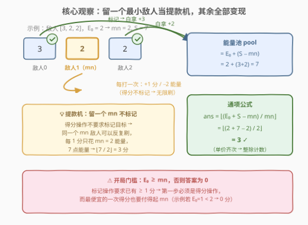
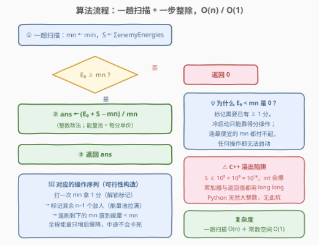
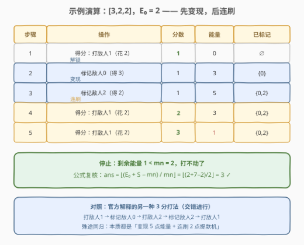

# LeetCode 与敌人战斗后的最大分数 题解

## 1. 题目概述

- **标题 / 题号**：与敌人战斗后的最大分数（#3207，medium）
- **链接**：https://leetcode.cn/problems/maximum-points-after-enemy-battles/
- **难度**：中等
- **标签**：贪心、数组

**题意**：给你一个下标从 0 开始的整数数组 `enemyEnergies` 表示敌人能量，以及初始能量 `currentEnergy`。初始分数为 0，所有敌人都未标记。你可以**任意次**执行以下两种操作**之一**：

1. **得分操作**：选择一个**未标记**且 $E_0 \ge \text{enemyEnergies}[i]$ 的敌人 $i$ —— 得 $1$ 分，能量减少 $\text{enemyEnergies}[i]$；
2. **标记操作**：若已有**至少 1 分**，选择一个未标记的敌人 $i$ —— 能量增加 $\text{enemyEnergies}[i]$，敌人 $i$ 被标记（每个敌人只能标记一次）。

返回能获得的**最大分数**。

**示例 1**：

```text
输入：enemyEnergies = [3,2,2], currentEnergy = 2
输出：3
解释：打敌人1得分（能量 2→0）→ 标记敌人0（能量 0→3）→ 打敌人2得分（3→1）
     → 标记敌人2（1→3）→ 打敌人1得分（3→1），共 3 分。
```

**示例 2**：

```text
输入：enemyEnergies = [2], currentEnergy = 10
输出：5
解释：对敌人 0 连续使用 5 次得分操作。
```

**约束**：

- $1 \le \text{enemyEnergies.length} \le 10^5$
- $1 \le \text{enemyEnergies}[i] \le 10^9$
- $0 \le \text{currentEnergy} \le 10^9$

> 💡 **审题关键**：得分操作**不标记**目标、标记操作**不花能量**——于是同一个敌人可以被反复刷分，而标记纯粹是「白嫖能量」。两个不对称（一个花钱不标记、一个免费才标记）叠加「任意次操作」，说明这题求的是**策略层面的最优**，大概率能推出一个一步到位的公式，而不是逐步模拟。另外标记操作要求已有 $\ge 1$ 分，意味着**第一步必须是得分操作**——这是本题唯一的门槛条件。

## 2. 解题思路

### 2.1 暴力思路：逐步模拟，操作次数高达 $10^{14}$

最朴素的做法是把操作序列一步步模拟出来：能打就打、打不动就标记。问题不在正确性，而在**步数**：

$$\text{操作总数} \approx \text{分数} + \text{标记数} \le \frac{10^9 + 10^5 \times 10^9}{1} + 10^5 \approx 10^{14}$$

当 $\text{mn} = 1$、总能量池拉满时，逐步模拟要执行约 $10^{14}$ 次得分操作——必然超时。必须把「反复刷同一个敌人」这件重复的事**折叠成一次整除**。

### 2.2 核心观察：留一个最小的当提款机，其余全部变现



记 $E_0 = \text{currentEnergy}$，$S = \sum \text{enemyEnergies}$，$\text{mn} = \min \text{enemyEnergies}$。三个观察层层递进：

**观察一：得分永远打最小敌人（交换论证）**。设某最优方案中一次得分操作打了能量 $e > \text{mn}$ 的敌人，把这次操作换成打某个未标记的 $\text{mn}$ 敌人（若没有未标记的 mn，可先调整标记顺序腾出一个），分数不变、能量少花 $e - \text{mn} \ge 0$，方案不变劣。因此**所有得分操作都该打能量最小的敌人**——每次得 1 分的「单价」就是 $\text{mn}$。

**观察二：标记是白嫖（除提款机外全标记）**。标记操作不花能量（只要已有 $\ge 1$ 分），还白得该敌人的能量。于是除留一个 $\text{mn}$ 敌人不标记外，其余 $n-1$ 个敌人全部标记变现，能量池拉满：

$$\text{pool} = E_0 + (S - \text{mn})$$

注意得分操作**不要求标记目标**，所以留着的那个 $\text{mn}$ 敌人可以**无限次刷**。

**观察三：守恒律一步出答案**。每得 1 分花 $\text{mn}$ 能量，能量池总量固定，于是：

$$\text{ans} = \left\lfloor \frac{E_0 + S - \text{mn}}{\text{mn}} \right\rfloor$$

> ⚠️ **开局门槛**：标记操作要求已有 $\ge 1$ 分，而得分操作至少要付得起 $\text{mn}$。若 $E_0 < \text{mn}$，任何操作都无法启动（连第一次得分都做不到，标记永远解锁不了），答案为 $0$。

### 2.3 算法流程：一趟扫描 + 一步整除



1. 一趟扫描求出 $\text{mn}$ 与 $S$；
2. 若 $E_0 < \text{mn}$，返回 $0$；
3. 否则返回 $\left\lfloor (E_0 + S - \text{mn}) / \text{mn} \right\rfloor$。

对应的具体操作序列（可行性构造）：先打一次 $\text{mn}$ 敌人拿 1 分解锁标记 → 把其余敌人全部标记变现 → 连刷剩下的 $\text{mn}$ 敌人直到能量不足。全程能量单调够用，无需担心中途卡死。

### 2.4 示例演算



以 `enemyEnergies = [3,2,2], currentEnergy = 2` 为例（$\text{mn}=2$，$S=7$）：

| 步骤 | 操作 | 分数 | 能量 | 已标记 |
|------|------|------|------|--------|
| 1 | 得分：打敌人1（花 2） | 1 | 0 | $\varnothing$ |
| 2 | 标记敌人0（得 3） | 1 | 3 | {0} |
| 3 | 标记敌人2（得 2） | 1 | 5 | {0, 2} |
| 4 | 得分：打敌人1（花 2） | 2 | 3 | {0, 2} |
| 5 | 得分：打敌人1（花 2） | 3 | 1 | {0, 2} |

剩余能量 $1 < \text{mn} = 2$，停止。公式复核：$(2 + 7 - 2) / 2 = 3$ ✓（与官方示例一致；官方解释的交错打法殊途同归，本质相同）。

## 3. 参考代码

### C++

```cpp
class Solution {
  public:
    long long maximumPoints(vector<int>& enemyEnergies, int currentEnergy) {
        long long mn = *min_element(enemyEnergies.begin(), enemyEnergies.end());
        long long sum = 0;
        for (int e : enemyEnergies) sum += e;   // sum ≤ 1e14，必须 long long
        if (currentEnergy < mn) return 0;       // 连最便宜的敌人都打不动
        return (currentEnergy + sum - mn) / mn;
    }
};
```

### Python

```python
class Solution:
    def maximumPoints(self, enemyEnergies: List[int], currentEnergy: int) -> int:
        mn = min(enemyEnergies)
        if currentEnergy < mn:
            return 0
        return (currentEnergy + sum(enemyEnergies) - mn) // mn
```

## 4. 复杂度分析

| 维度 | 复杂度 | 说明 |
|------|--------|------|
| 时间 | $O(n)$ | 一趟扫描同时求 $\min$ 与 $\sum$，答案由一次整除直接得出 |
| 空间 | $O(1)$ | 只用常数个变量，无需排序（只需最小值与总和） |

> 💡 对比逐步模拟：最坏 $10^{14}$ 步 → 一步整除，快 14 个数量级。能折叠的本质是「每次得分的花费完全相同（都是 $\text{mn}$）」——同价重复购买用除法计数，异价才需要 DP。

## 5. 扩展：正确性证明（上界与构造匹配）

**构造（可达性）**：见 2.4——先打一次 $\text{mn}$ 解锁标记，再变现其余 $n-1$ 个敌人，最后连刷 $\text{mn}$。全程合法，得 $\lfloor (E_0 + S - \text{mn}) / \text{mn} \rfloor$ 分。

**上界（最优性）**：设任意合法方案得 $p$ 分。考察**最后一次**得分操作，其目标敌人 $j$ 在该时刻必然未标记，故此前通过标记获得的能量至多 $S - \text{enemyEnergies}[j] \le S - \text{mn}$；而每次得分操作至少花费 $\text{mn}$。由能量非负：

$$p \cdot \text{mn} \le E_0 + S - \text{mn} \implies p \le \left\lfloor \frac{E_0 + S - \text{mn}}{\text{mn}} \right\rfloor$$

上界与构造值相等，公式即最优解。∎

> 💡 证明里最妙的一步是盯住「最后一次得分操作」：它的目标此后即使被标记，换来的能量也花不出去了——于是标记收益的紧上界 $S - \text{mn}$ 天然浮现。

## 6. 面试要点

1. **为什么得分操作永远打最小敌人？**

   - 交换论证：把任意一次「打 $e > \text{mn}$」换成「打 $\text{mn}$」，分数不变、能量省 $e - \text{mn}$，后续可行性只增不减；
   - 得分的单价被压到全局最低 $\text{mn}$，是能量池除法的前提。

2. **为什么必须留一个敌人不标记？全部标记行不行？**

   - 得分操作要求目标未标记，全部标记后再无得分目标；
   - 得分操作本身不标记目标，所以留**一个** $\text{mn}$ 敌人就够无限刷，其余全部变现——「变现 $\ge$ 保留」因为能量只有花在得分上才有意义。

3. **$E_0 < \text{mn}$ 时为什么答案恰好是 0？**

   - 标记操作要求已有 $\ge 1$ 分，冷启动只能靠得分操作；连最便宜的敌人都付不起，则任何操作序列长度为 0；
   - 这也是公式必须带门槛判断的原因：直接套公式会虚高。

4. **C++ 实现有哪些坑？**

   - $S \le 10^5 \times 10^9 = 10^{14}$，累加和必须用 `long long`（`int` 溢出）；
   - `currentEnergy + sum` 中 `sum` 已是 `long long`，运算会自动提升，返回类型官方给的也是 `long long`。

5. **这题看起来像 DP / 背包，为什么直接贪心？**

   - 背包的标志是「物品价格互异、互斥选择」；本题通过标记机制把**所有能量汇入同一个池子**，且得分单价统一为 $\text{mn}$——费用齐次化后，计数用整除即可，无后效性也无子问题重叠；
   - 识别信号：目标问「最多多少次」且每次开销相同 → 先找守恒律，再除。

## 同类练习题

| # | 题目 | 与本题的关联 |
|---|------|-------------|
| 1710 | [卡车上的最大单元数](https://leetcode.cn/problems/maximum-units-on-a-truck/)（[站内题解](../1701-1800/1710_卡车上的最大单元数.md)） | 每箱占一格车位但单元数不同——「单位开销换最大收益」的排序贪心，与本题「得分单价压到 mn」同源 |
| 2144 | [购买糖果的最低成本](https://leetcode.cn/problems/minimum-cost-of-buying-candies-with-discount/)（[站内题解](../2101-2200/2144_购买糖果的最低成本.md)） | 排序后从最小端白拿两件——本题「标记白嫖能量」的镜像问题 |
| 1005 | [K 次取反后最大化的数组和](https://leetcode.cn/problems/maximize-sum-of-array-after-k-negations/)（[站内题解](../1001-1100/1005_K次取反后最大化的数组和.md)） | 固定操作预算下按收益贪心分配，与本题「能量预算换分数」同构 |
| 2244 | [完成所有任务需要的最少轮数](https://leetcode.cn/problems/minimum-rounds-to-complete-all-tasks/)（[站内题解](../2201-2300/2244_完成所有任务需要的最少轮数.md)） | 按任务计数一步算出 2/3 轮组合——同款「用整除代替逐步模拟」的折叠思想 |
