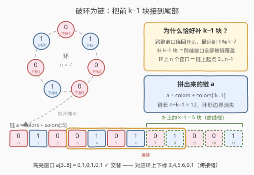
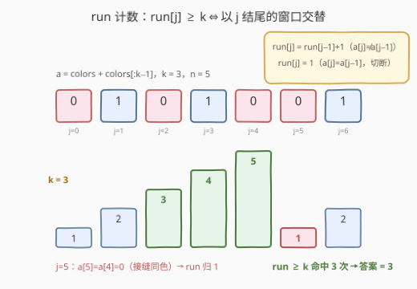
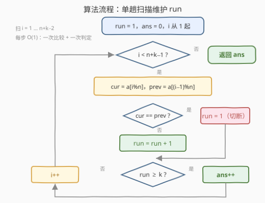

# 交替组 II

- **题目名称**：交替组 II
- **链接**：[3208. 交替组 II](https://leetcode.cn/problems/alternating-groups-ii/)
- **难度**：中等
- **标签**：数组、滑动窗口

## 1. 题目概述

给你一个整数数组 `colors` 和一个整数 `k`，`colors` 表示一个由红色和蓝色瓷砖组成的**环**，第 `i` 块瓷砖的颜色为 `colors[i]`：

- `colors[i] == 0` 表示第 `i` 块瓷砖是**红色**；
- `colors[i] == 1` 表示第 `i` 块瓷砖是**蓝色**。

环中**连续 $k$ 块**瓷砖的颜色如果是**交替**颜色（也就是说除了第一块和最后一块瓷砖以外，中间瓷砖的颜色与它**左边**和**右边**的颜色都不同），那么它被称为一个**交替组**。请你返回交替组的数目。

注意 `colors` 表示的是一个**环**——第一块瓷砖和最后一块瓷砖是相邻的。

**示例 1**：

```text
输入：colors = [0,1,0,1,0], k = 3
输出：3
解释：交替组为 (0,1,2)、(1,2,3)、(2,3,4)。
```

**示例 2**：

```text
输入：colors = [0,1,0,0,1,0,1], k = 6
输出：2
解释：交替组对应环上下标 (3,4,5,6,0,1) 与 (4,5,6,0,1,2)，两个都跨过了首尾接缝。
```

**示例 3**：

```text
输入：colors = [1,1,0,1], k = 4
输出：0
```

**约束条件**：

- $3 \le colors.length \le 10^5$
- $colors[i] \in \{0, 1\}$
- $3 \le k \le colors.length$

> 💡 读题关键：① 窗口长度从 3206 的 3 泛化为 $k$，环上每个起点 $i \in [0, n)$ 都对应一个长度 $k$ 的窗口，共 $n$ 个候选，允许**跨首尾接缝**；② 两色下「中间每块与左右都不同」等价于**窗口内每一对相邻瓷砖都不同色**（首尾两块自动同色）；③ $n$ 到 $10^5$ 且 $k$ 可到 $n$，$O(nk)$ 的逐窗暴力必然超时，需要线性做法。

---

## 2. 解题思路

### 2.1 暴力思路：枚举起点逐窗判定

枚举 $n$ 个起点，对每个起点取出 $k$ 块瓷砖（下标全部取模处理环形），逐一检查相邻对是否都不同色，时间 $O(nk)$。$n = k = 10^5$ 时约 $10^{10}$ 次比较，必然超时。

瓶颈在于：相邻两个窗口重叠了 $k-1$ 块瓷砖，逐窗从头判定把这部分信息全部丢掉了。定长滑窗的标准出路是利用**增量**——窗口右移一格只有一个新相邻对进入。而对「交替」这个性质，还有一个更强的刻画方式，可以连窗口都不用显式维护（见 2.2）。

### 2.2 核心观察：破环为链 + 交替段 run 计数



**观察 1（破环为链）**：环上长度为 $k$ 的窗口共 $n$ 个：起点 $i \in [0, n)$、终点 $(i+k-1) \bmod n$。其中跨过首尾接缝的窗口最远绕回到下标 $k-2$（起点 $i = n-1$ 的窗口）。因此把 `colors` 的**前 $k-1$ 个元素拼到尾部**，得到长度 $n+k-1$ 的链 $a$，环上所有窗口都变成链上的普通窗口，环形边界一次性消灭。由 $k \le n$ 可证这是一一对应：链上起点 $0 \dots n-1$ 恰好对应环上全部 $n$ 个窗口，不多不少。

**观察 2（交替段 run）**：窗口 $[j-k+1, j]$ 是交替组 $\iff$ 这 $k$ 块内**每一对相邻都不同色**。定义 $run_j$ 为**以 $j$ 结尾的最长交替段长度**：

$$run_j = \begin{cases} run_{j-1} + 1, & a_j \ne a_{j-1} \\ 1, & a_j = a_{j-1} \end{cases}$$

则窗口 $[j-k+1, j]$ 交替 $\iff run_j \ge k$：一旦 $run_j \ge k$，以 $j$ 结尾往左的 $k-1$ 个相邻对全部不同色，窗口自动合法。每个命中的右端点 $j$ 唯一对应一个窗口，不重不漏。



**观察 3（一遍计数，$O(1)$ 空间）**：从左到右扫一遍链，维护 $run$，每当 $run \ge k$ 答案加一。链甚至不用真拼出来——下标取模 $a_i = colors[i \bmod n]$ 即可，与 3206 取模取邻居是同一招的推广。

> 💡 若**整个环全部交替**（只在 $n$ 为偶数时可能），拼接后的链上 $run$ 一路涨到 $n+k-1$，命中 $(n+k-1)-k+1 = n$ 次——恰好是环上 $n$ 个窗口全部合法的期望答案，**无需任何特判**（对比第 5 节「极大段贡献法」在此处的陷阱）。

### 2.3 算法流程图



单重循环 $n+k-2$ 次，每个位置只做一次比较、一次判定。

### 2.4 示例演算

![示例演算：colors = [0,1,0,0,1,0,1], k = 6](../images/p3208_walkthrough.svg)

以 `colors = [0,1,0,0,1,0,1]`，$k = 6$ 为例：$n = 7$，拼上前 $5$ 块得链 $a = [0,1,0,0,1,0,1,0,1,0,0,1]$，长度 $12$。

- $j = 1 \sim 2$：连续交替，$run$ 涨到 $3$；
- $j = 3$：$a_3 = a_2 = 0$ 同色对，$run$ **归 1**；
- $j = 4 \sim 7$：一路交替，$run$ 涨到 $5$；
- $j = 8$：$run = 6 \ge k$，**命中**——窗口 $a[3..8] = 0,1,0,1,0,1$，对应环上下标 $3,4,5,6,0,1$，跨接缝 ✓；
- $j = 9$：$run = 7 \ge k$，再命中——对应环上 $4,5,6,0,1,2$；
- $j = 10$：$a_{10} = a_9 = 0$，$run$ 归 1；$j = 11$ 涨回 2，不足 6。

答案为 **2**。

---

## 3. 参考代码

### C++（取模破环 + run 计数，O(1) 空间）

```cpp
class Solution {
  public:
    int numberOfAlternatingGroups(vector<int>& colors, int k) {
        int n = colors.size(), ans = 0;
        int run = 1;                            // 以下标 0 结尾的交替段长度
        for (int i = 1; i < n + k - 1; i++) {   // 链上下标 1 … n+k−2
            if (colors[i % n] != colors[(i - 1) % n]) run++;  // 交替段延长
            else run = 1;                       // 同色对切断，从 1 重新起算
            if (run >= k) ans++;                // 窗口 [i−k+1, i] 恰好交替
        }
        return ans;
    }
};
```

### Python（拼接破环 + run 计数）

```python
class Solution:
    def numberOfAlternatingGroups(self, colors: List[int], k: int) -> int:
        a = colors + colors[:k - 1]          # 破环为链：尾部再接前 k−1 块
        ans = run = 0
        for j in range(len(a)):
            run = run + 1 if j and a[j] != a[j - 1] else 1
            ans += run >= k                  # 以 j 结尾的窗口恰好交替
        return ans
```

> 💡 两种写法等价：C++ 版用 `i % n` 取模访问，省掉拼接的 $O(n + k)$ 空间；Python 版直接拼接，代码最短、下标不易写错。注意 Python 版 `j and ...` 让 $j = 0$ 时跳过比较、$run$ 直接置 1。

---

## 4. 复杂度分析

| 维度 | 复杂度 | 说明 |
|------|--------|------|
| 时间复杂度 | $O(n + k)$ | 扫描链长 $n+k-1$，每步 $O(1)$；由 $k \le n$ 亦为 $O(n)$ |
| 空间复杂度 | $O(1)$ / $O(n + k)$ | 取模版仅常数个变量；拼接版多存一条链 |
| 暴力对照 | $O(nk)$ | 逐窗重判，$n = k = 10^5$ 时约 $10^{10}$ 次比较，超时 |

---

## 5. 扩展：极大交替段贡献法与「整环交替」陷阱

线性数组上数「长度恰为 $k$ 的交替窗口」还有另一种视角：找出每个**极大交替段**，长度为 $L$ 的段贡献 $\max(0,\ L - k + 1)$ 个窗口（段内每个合法起点各对应一个），求和即答案，与 run 逐位计数完全等价。

搬到环上要小心一个陷阱：若**整个环都交替**（只在 $n$ 为偶数时可能——两色绕环一圈回到起点必须红蓝各半），环上的极大交替段「首尾相衔」，长度记作 $n$，贡献却只有 $n - k + 1$，而正确答案是 $n$（每个起点都合法）。例如 `colors = [0,1,0,1]`，$k = 3$：4 个起点全部合法，按 $L = 4$ 只算出 2。

破环为链恰好自动消掉这个特判：全交替的环拼成链后 $run$ 一路涨到 $n + k - 1$，命中 $(n+k-1) - k + 1 = n$ 次，答案自动正确。这也解释了观察 1 里「**恰好补 $k-1$ 个**」的精确性——补 $k$ 个会把起点 $0$ 的窗口在链尾重复数一遍，补 $k-2$ 个会截断起点 $n-1$ 的最长跨缝窗口，长度必须分毫不差。

---

## 6. 面试要点

1. **为什么要补 $k-1$ 个元素？补 $k$ 个或 $k-2$ 个行不行？**

   - 跨缝窗口最远绕回到下标 $k-2$（起点 $n-1$ 的窗口），所以**至少**补 $k-1$ 个才覆盖全部跨缝窗口；补 $k$ 个则链上起点 $n$ 的窗口与起点 $0$ 完全相同，会重复计数；补 $k-2$ 个则起点 $n-1$ 的窗口被截断，可能漏数。精确 $k-1$，与环上窗口一一对应。

2. **$run \ge k$ 为什么就恰好命中一个窗口？会不会重复计数？**

   - $run_j \ge k$ 说明以 $j$ 结尾、往左数 $k-1$ 个相邻对全部不同色，窗口 $[j-k+1, j]$ 交替；每个窗口由其**右端点**唯一确定，一次扫描中每个右端点只判定一次，天然不重不漏。

3. **run 遇到同色对为什么要「归 1」而不是「归 0」？**

   - $run_j$ 的定义是**以 $j$ 结尾**的交替段长度，$a_j$ 自己总构成一段长度 1 的交替段，所以切断后从 1 重新起算。若实现成「归 0 再加一」，数值上等价，但边界（$j=0$ 与切断两种情形）更容易写岔。

4. **取模版和拼接版各有什么取舍？**

   - 取模版 $O(1)$ 空间、无内存分配，代价是每步两次取模；拼接版逻辑直白、可读性最好，代价 $O(n+k)$ 空间。$n \le 10^5$ 量级下两者都轻松通过，面试先讲清「破环为链 + run 计数」的思路，再谈实现选择。

5. **和 3206（$k=3$）的关系是什么？**

   - 3206 是 $k=3$ 特例：「中间锚点」判定 `左≠中 且 右≠中` 本质就是「$run \ge 3$」的定点版本。$k$ 泛化后窗口里有 $k-2$ 块「中间」，锚点判定失效，必须换成**相邻对的增量刻画**——这正是 run 计数的价值：窗口合法性被压缩成一个整数的比较。

---

## 7. 同类练习题

- [3206. 交替组 I](https://leetcode.cn/problems/alternating-groups-i/)：本题 $k = 3$ 特例，「中间锚点」与「run 计数」两种视角对照
- [2134. 最少交换次数来组合所有的 1 II](https://leetcode.cn/problems/minimum-swaps-to-group-all-1s-together-ii/)：环形数组破环为链 + 定长窗口，同款拼接技巧
- [978. 最长湍流子数组](https://leetcode.cn/problems/longest-turbulent-subarray/)：「交替」比较符号翻转的 run 计数线性版，思想同源
- [2765. 最长交替子数组](https://leetcode.cn/problems/longest-alternating-subarray/)：相邻差恰为 ±1 交替的子数组，练习交替性质的另一种定义
