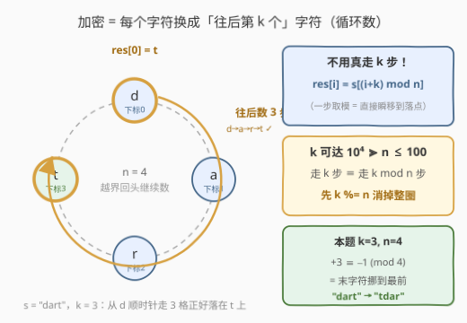
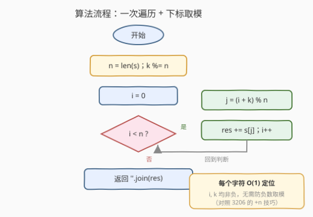
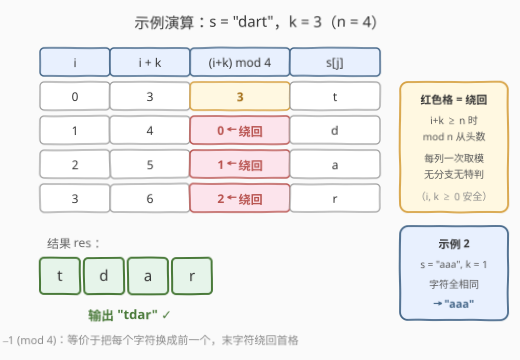

# LeetCode 找出加密后的字符串 题解

## 1. 题目概述

- **标题 / 题号**：找出加密后的字符串（#3210，easy）
- **链接**：https://leetcode.cn/problems/find-the-encrypted-string/
- **难度**：简单
- **标签**：字符串

**题意**：给你一个字符串 `s` 和一个整数 `k`。请你使用以下算法加密字符串：

- 对于字符串 `s` 中的每个字符 `c`，用字符串中 `c` **后面的第 `k` 个字符**替换 `c`（以**循环**方式）。

返回加密后的字符串。

**示例 1**：

```text
输入：s = "dart", k = 3
输出："tdar"
解释：
- 对于 i = 0，'d' 后面的第 3 个字符是 't'。
- 对于 i = 1，'a' 后面的第 3 个字符是 'd'。
- 对于 i = 2，'r' 后面的第 3 个字符是 'a'。
- 对于 i = 3，'t' 后面的第 3 个字符是 'r'。
```

**示例 2**：

```text
输入：s = "aaa", k = 1
输出："aaa"
解释：由于所有字符都相同，加密后的字符串也将相同。
```

**约束**：

- $1 \le s.length \le 100$
- $1 \le k \le 10^4$
- `s` 仅由小写英文字母组成

> 💡 读题关键：①「后面的第 $k$ 个」从 $c$ 自身往后数 $k$ 步（不含自身），即下标 $i$ 换成 $i+k$；②「循环方式」意味着越过末尾要**从头绕回**——下标对 $n$ 取模；③ $k$ 最大 $10^4$，远大于 $n \le 100$，提示你需要处理「绕好几圈」的情形。

## 2. 解题思路

### 2.1 暴力思路

对每个位置 $i$，从 $j = i$ 出发，真实地走 $k$ 步，每步 $j = (j + 1) \bmod n$，走完的落点就是替换字符：

```python
for i in range(n):
    j = i
    for _ in range(k):      # 真走 k 步
        j = (j + 1) % n
    res.append(s[j])
```

正确性没问题，复杂度 $O(nk)$；本题 $n \le 100$、$k \le 10^4$，最多 $10^6$ 步也能过。但「走 $k$ 步」里有大量**整圈重复劳动**——走一整圈 $n$ 步等于原地不动，这些圈完全可以一次性跳过。

### 2.2 核心观察：一步取模 $(i+k) \bmod n$



**观察 1（落点公式）**：把字符串看成一个环，$i$ 往后走 $k$ 步的落点就是

$$res[i] = s[(i + k) \bmod n]$$

「循环往后走 $k$ 步」这个动作本身已经被取模运算完整编码——**不需要真走，直接瞬移**。暴力思路的 $k$ 次循环被压缩成一次 `(i + k) % n`。

**观察 2（先消整圈）**：$k$ 可达 $10^4$ 而 $n \le 100$，走 $k$ 步可能绕环十几圈。由于绕一整圈回到原点，真正起作用的只有余数：

$$k \equiv k \bmod n \pmod n$$

先做 `k %= n`，把 $k$ 压到 $[0, n)$。本题 $n$、$k$ 都很小、且 $i, k$ 非负，`(i + k) % n` 不会溢出也不会出负数，取余只是常数优化；但当 $k$ 大到 `long long`（甚至是个大数）时，这一步就是必须的预处理。另外它还暴露一个边界彩蛋：**若 $k \bmod n = 0$，每个字符都被自己替换，结果就是原串**。

**观察 3（本题的彩蛋）**：$k = 3$、$n = 4$ 时 $+3 \equiv -1 \pmod 4$——每个字符换成**前一个**，末字符绕回首格，`"dart"` → `"tdar"` 恰好是「字符串右旋 1 位」。这正是它与 189 轮转数组同源的原因（见第 7 节）。

### 2.3 算法流程图



预处理 `k %= n`，随后单重循环：每个 $i$ 用 $O(1)$ 算出落点 $j = (i+k) \bmod n$，把 `s[j]` 追加到结果，一遍扫完拼接返回。由于 $i, k$ 均非负，这里**不需要** 3206 那种 `(i - 1 + n) % n` 的防负数技巧。

### 2.4 示例演算



以 `s = "dart"`，$k = 3$，$n = 4$ 为例：

| $i$ | $i+k$ | $(i+k) \bmod 4$ | $s[(i+k) \bmod 4]$ |
|-----|-------|-----------------|--------------------|
| 0   | 3     | 3               | `t`                |
| 1   | 4     | **0**（绕回）   | `d`                |
| 2   | 5     | **1**（绕回）   | `a`                |
| 3   | 6     | **2**（绕回）   | `r`                |

结果为 **`"tdar"`**。后三行的 $i+k$ 越过了 $n$，取模后从头绕回——这正是「循环方式」的体现；而每一列都只是同一次取模，无分支、无特判。示例 2 中字符全相同，无论绕到哪儿结果都是 `"aaa"`。

## 3. 参考代码

### C++（取模定位 + 预留结果串）

```cpp
class Solution {
  public:
    string getEncryptedString(string s, int k) {
        int n = s.size();
        k %= n;                      // 消掉整圈，k 压到 [0, n)
        string res(n, ' ');
        for (int i = 0; i < n; i++) {
            res[i] = s[(i + k) % n]; // 一步取模，瞬移到落点
        }
        return res;
    }
};
```

### Python（切片一行流）

```python
class Solution:
    def getEncryptedString(self, s: str, k: int) -> str:
        k %= len(s)
        return s[k:] + s[:k]         # 整体右旋 k 位
```

> 💡 Python 版揭示了另一个视角：所有位置统一前移 $k$，等价于把字符串**整体左旋** $k$ 位（前 $k$ 个字符挪到尾部）。$k \bmod n = 0$ 时切片拼回原串，边界天然正确。C++ 版保留了逐位取模的通用写法，两种写法结果完全一致。

## 4. 复杂度分析

| 维度 | 复杂度 | 说明 |
|------|--------|------|
| 时间复杂度 | $O(n)$ | 每个位置 $O(1)$ 取模定位，一次遍历 |
| 空间复杂度 | $O(n)$ | 结果串本身（不计输出则为 $O(1)$） |
| 暴力对照 | $O(nk)$ / $O(n)$ | 真走 $k$ 步，整圈重复劳动；本题数据弱可过，但 $k$ 大时退化 |

## 5. 扩展：这种「加密」能解密吗？

把加密记为 $E_k$：$E_k(s)[i] = s[(i+k) \bmod n]$。它有两个漂亮的性质：

1. **复合封闭**：先加密 $k_1$ 再加密 $k_2$，等于加密 $k_1 + k_2$——

$$E_{k_2}(E_{k_1}(s))[i] = E_{k_1}(s)[(i+k_2) \bmod n] = s[(i+k_1+k_2) \bmod n] = E_{(k_1+k_2) \bmod n}(s)[i]$$

2. **可逆（解密 = 再加密）**：取 $k' = (n - k \bmod n) \bmod n$，则 $E_{k'}$ 恰好抵消 $E_k$：

$$E_{k'}(E_k(s))[i] = s[(i + k + n - k) \bmod n] = s[i]$$

也就是说 $\{E_0, E_1, \dots, E_{n-1}\}$ 在复合运算下构成一个与 $\mathbb{Z}_n$ 同构的**循环群**。不过别被「加密」二字骗了——全体密钥只有 $n \le 100$ 种，穷举瞬间破解，这只是凯撒密码式的玩具变换，密码学上毫无安全性可言。

## 6. 面试要点

1. **「往后第 k 个字符（循环）」怎么翻译成下标运算？**

   - $res[i] = s[(i+k) \bmod n]$。「往后 $k$ 步」= 下标 $+k$，「循环」= 对 $n$ 取模。把题目的自然语言逐词映射成运算是本题的全部内容。

2. **k 比 n 大很多怎么办？什么时候必须 `k %= n`？**

   - 走 $k$ 步与走 $k \bmod n$ 步落点相同，先取余消掉整圈。本题 `(i+k) % n` 已含取模，`k %= n` 只是让 $i+k$ 更小；但若题目改成「拼接 $k$ 份字符串」或 $k$ 达到 `long long` 级别（防 `i+k` 溢出），取余就是必须的预处理。

3. **`(i + k) % n` 会不会出负数？和 3206 的 `+n` 技巧什么关系？**

   - 不会。$i, k$ 均非负，$i+k \ge 0$，C++/Java 的 `%` 只在操作数为负时才可能出负。3206 里是 `i - 1` 可能为 $-1$ 才需要 `+n` 把数搬回非负区间——判断标准是「表达式可能为负吗」，而不是无脑加。

4. **为什么 Python 可以直接写 `s[k:] + s[:k]`？**

   - 所有位置统一前移 $k \bmod n$，等价于字符串整体左旋 $k$ 位；且 `k % n == 0` 时两个切片拼回原串，边界自动正确。这是「逐位映射」的批量等价写法，189 轮转数组的翻转法/切片法同源。

5. **这种加密安全吗？**

   - 不安全。密钥空间只有 $n$ 种移位，且加密映射是**保位置换**（只换字符不换频次），字母频率分析 + 穷举都能秒破（见第 5 节的群性质——$E_{n-k \bmod n}$ 就是解密钥）。

## 同类练习题

| # | 题目 | 与本题的关联 |
|---|------|-------------|
| 189 | [轮转数组](https://leetcode.cn/problems/rotate-array/) | 同款 $k \bmod n$ 消整圈 + 循环移位，本题的数组版母题 |
| 796 | [旋转字符串](https://leetcode.cn/problems/rotate-string/) | 判定 s 是否能旋转得到 goal（`s+s` 包含判据），旋转视角的延伸 |
| 1528 | [重新排列字符串](https://leetcode.cn/problems/shuffle-string/) | 按下标映射 `indices[i]` 重排字符串，同样是「目标位置 ← 源位置」的一次遍历填表 |
| 3206 | [交替组 I](https://leetcode.cn/problems/alternating-groups-i/) | 环形下标取模 `(i±1) % n` 取邻居，对照学习何时需要 `+n` 防负数 |
