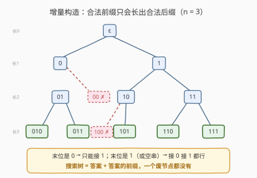
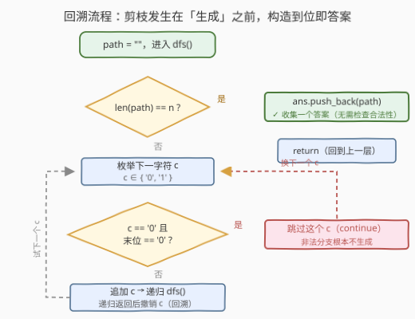
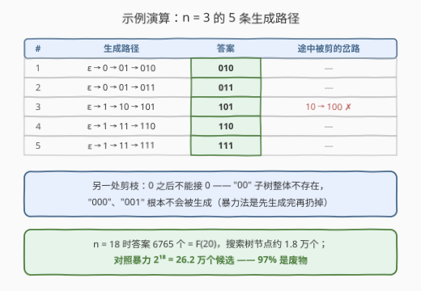
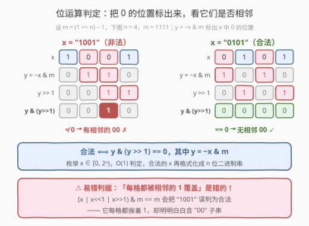

# 生成不含相邻零的二进制字符串

- **题目名称**：生成不含相邻零的二进制字符串
- **链接**：[3211. 生成不含相邻零的二进制字符串](https://leetcode.cn/problems/generate-binary-strings-without-adjacent-zeros/)
- **难度**：中等
- **标签**：位运算、字符串、回溯

## 1. 题目概述

给你一个正整数 $n$。

如果一个二进制字符串 $x$ 的所有**长度为 2 的子字符串**中都包含**至少一个 `"1"`**，则称 $x$ 是一个**有效字符串**。

返回所有长度为 $n$ 的有效字符串，可以以**任意顺序**排列。

**示例 1**：

```text
输入：n = 3
输出：["010","011","101","110","111"]
解释：长度为 3 的有效字符串有 "010"、"011"、"101"、"110" 和 "111"。
```

**示例 2**：

```text
输入：n = 1
输出：["0","1"]
解释：长度为 1 的有效字符串有 "0" 和 "1"。
```

**约束条件**：

- $1 \le n \le 18$

> 💡 读题关键：①「每个长度为 2 的子串都含 1」翻译过来就是**不存在两个相邻的 0**——`"00"` 是唯一被禁的组合；②「任意顺序」说明输出顺序不受限，怎么生成方便怎么来；③ 别被 $n \le 18$ 骗去无脑暴力——答案本身就有 $\Theta(\varphi^n)$ 个（$n=18$ 时 6765 个），**输出规模决定了任何算法都躲不开指数级**，比拼的是谁不在废物身上花时间。

---

## 2. 解题思路

### 2.1 暴力思路：枚举再检验

枚举 $[0, 2^n)$ 中的每个整数 $x$，格式化成 $n$ 位二进制串，再逐个检查每个相邻对 $(i, i+1)$ 是否全为 0：

```python
for x in range(1 << n):
    s = format(x, '0{}b'.format(n))
    if all(s[i] != '0' or s[i + 1] != '0' for i in range(n - 1)):
        ans.append(s)
```

$n = 18$ 时 $2^{18} = 262144$ 个候选、每个 $O(n)$ 检查，约 470 万次操作，本题能过。但 26.2 万个候选里只有 6765 个是答案——**97% 的枚举是先生成、再检查、然后扔掉**。问题出在「生成」与「检验」是分开的两步。

### 2.2 核心观察：回溯增量构造——非法前缀永远救不回来



**观察 1（禁组合唯一）**：合法 ⟺ 无相邻 `"00"` ⟺ 只要**上一位是 0**，这一位就不能再放 0。下一个字符的合法性只取决于**末位一个字符**，规则是 $O(1)$ 的局部规则。

**观察 2（非法的前缀封闭性）**：一个串非法 ⟺ 某处出现了 `"00"` ⟺ 它的某个**前缀**已经非法。所以非法前缀无论后面怎么填都救不回来——含 `"00"` 的分支**整棵子树**都是废的。反过来，合法前缀长出来的串全都合法。

**观察 3（构造即答案）**：把观察 1 变成生成规则——末位是 `0` → 只能接 `1`（1 个分支）；末位是 `1`（或空串）→ 接 `0` 接 `1` 都行（2 个分支）。这样搜索树里**只剩答案和答案的前缀**：构造到长度 $n$ 时天然合法，一步检查都不用做，一个废节点都不会访问。

### 2.3 算法流程图



`dfs(path)`：长度到 $n$ 就收集返回；否则枚举下一字符 $c$（'0' 或 '1'），「$c$ 是 '0' 且末位是 '0'」的分支**直接跳过**；其余分支追加 $c$、递归、撤销 $c$（回溯）。剪枝发生在「生成」之前，而不是生成之后。

### 2.4 示例演算



以 $n = 3$ 为例，DFS 沿生成树走出 5 条到叶子的路径，恰好就是示例 1 的 5 个答案。途中两处剪枝：`"0"` 之后接 `"0"` 被禁（`"00"` 子树整体不存在，`"000"`、`"001"` 从未被生成）；`"10"` 之后接 `"0"` 被禁（`"100"` 未生成）。$n=18$ 时整棵树约 1.8 万个节点，每个叶子都是答案，无一浪费。

---

## 3. 参考代码

### C++（回溯 + 末位剪枝）

```cpp
class Solution {
  public:
    vector<string> validStrings(int n) {
        vector<string> ans;
        string path;
        function<void()> dfs = [&]() {
            if ((int)path.size() == n) {
                ans.push_back(path);          // 构造到位即答案，无需检查
                return;
            }
            for (char c : {'0', '1'}) {
                // 末位是 '0' 时不能再接 '0'：唯一的剪枝规则
                if (c == '0' && !path.empty() && path.back() == '0') continue;
                path.push_back(c);            // 做选择
                dfs();                        // 递归构造下一位
                path.pop_back();              // 撤销选择（回溯）
            }
        };
        dfs();
        return ans;
    }
};
```

### Python（回溯 + 末位剪枝）

```python
class Solution:
    def validStrings(self, n: int) -> List[str]:
        ans, path = [], []

        def dfs() -> None:
            if len(path) == n:
                ans.append(''.join(path))     # 构造到位即答案
                return
            for c in '01':
                if c == '0' and path and path[-1] == '0':
                    continue                  # 末位是 0，禁接 0
                path.append(c)
                dfs()
                path.pop()                    # 回溯

        dfs()
        return ans
```

---

## 4. 复杂度分析

| 维度 | 复杂度 | 说明 |
|------|--------|------|
| 时间复杂度 | $O(n \cdot F_{n+2})$ | $F$ 为斐波那契数（$F_1 = F_2 = 1$）；每个答案花费 $O(n)$ 复制，搜索节点总数 $\sum_{k=0}^{n} a(k) \approx 1.8$ 万（$n=18$） |
| 空间复杂度 | $O(n)$ | 递归栈深度（不计输出）；输出本身 $\Theta(n \cdot F_{n+2})$ |
| 暴力对照 | $O(2^n \cdot n)$ | $n=18$ 时 26.2 万候选全生成全检验，97% 是废物；能过但范式落后 |

> 💡 为什么说回溯已经「最优」：输出本身就有 $\Theta(n \cdot F_{n+2})$ 大小，任何算法都至少要付这笔钱；回溯的时间恰好就是这笔钱——**每个搜索节点要么是答案、要么是答案的前缀**，一分力气都没浪费。

---

## 5. 扩展：位运算判定 + 斐波那契计数

### 5.1 枚举 + O(1) 位运算判定



仍走「枚举」路线，但把 $O(n)$ 的逐位检查压成 $O(1)$：令 $m = (1 \ll n) - 1$（全 1 掩码），$y = \sim x \,\&\, m$ 把 $x$ 中所有 0 的位置标成 1，则

$$\text{合法} \iff y \,\&\, (y \gg 1) = 0$$

即「0 的位置两两不相邻」。

```python
class Solution:
    def validStrings(self, n: int) -> List[str]:
        mask = (1 << n) - 1
        ans = []
        for x in range(1 << n):
            y = ~x & mask              # 1 标出所有 0 的位置
            if y & (y >> 1) == 0:      # 0 的位置互不相邻 → 合法
                ans.append(f'{x:0{n}b}')
        return ans
```

> ⚠️ 两个坑：①「每个格子都被相邻的 1 覆盖」（$(x \mid x \ll 1 \mid x \gg 1) \,\&\, m = m$）是**错误判据**——`"1001"` 每格都挨着 1，却含 `"00"` 子串；判定永远要围绕「0 的位置不能相邻」来写。② C++ 中 `==` 的优先级**高于** `&`，`a & m == m` 会解析成 `a & (m == m)`，按位与表达式必须整体加括号。

### 5.2 答案有多少个？——斐波那契

按**末位**分类：末位是 `1` ↔ 前面接任意长度 $n-1$ 的合法串；末位是 `0` ↔ 倒数第二位必须是 `1` ↔ 前面接任意长度 $n-2$ 的合法串。于是

$$a(n) = a(n-1) + a(n-2), \quad a(1) = 2,\ a(2) = 3 \implies a(n) = F_{n+2}$$

| $n$ | 1 | 2 | 3 | 4 | 5 | … | 18 |
|-----|---|---|---|---|---|---|----|
| $a(n)$ | 2 | 3 | 5 | 8 | 13 | … | **6765** |

与 198 打家劫舍、600 不含连续 1 的非负整数同源：**「不许相邻」的结构天然长出斐波那契**。

---

## 6. 面试要点

1. **为什么用回溯，而不是枚举 $2^n$ 个串再逐个检查？**

   - 非法具有**前缀封闭性**：出现 `"00"` 的那一刻就注定非法，后面怎么填都救不回来。增量构造在产生 `"00"` 的那一步直接掐掉分支，搜索树里只剩答案与答案的前缀；枚举法「先生成再扔」，$n=18$ 时 97% 的候选被扔掉。

2. **剪枝条件为什么只看末位一位？**

   - 合法 ⟺ 无相邻 `"00"`。追加 `0` 合法 ⟺ 前一位不是 0 ⟺ 末位是 `1`（或串为空）。整条历史里只有末位影响下一步的合法性，规则天然 $O(1)$、无需回看整串。

3. **答案有多少个？怎么证明？**

   - $a(n) = F_{n+2}$。按末位分类：末位 `1` 贡献 $a(n-1)$，末位 `0`（必然形如 `…10`）贡献 $a(n-2)$，相加即斐波那契递推；$a(1)=2$、$a(2)=3$。$n=18 \Rightarrow F_{20} = 6765$。

4. **复杂度是多少？为什么说它已经最优？**

   - 时间 $O(n \cdot F_{n+2})$、空间 $O(n)$（不计输出）。输出本身规模 $\Theta(n \cdot F_{n+2})$ 是任何算法的下界，回溯恰好达到——每个节点要么是答案、要么是答案的前缀。

5. **位运算 O(1) 判定怎么写？有什么坑？**

   - $y = \sim x \,\&\, m$ 标出 0 位，$y \,\&\, (y \gg 1) = 0$ ⟺ 无相邻 0。坑①：别用「每格被相邻 1 覆盖」的照亮判据，`"1001"` 是反例；坑②：C++ 里 `==` 优先级高于 `&`，按位与表达式必须整体加括号。

---

## 7. 同类练习题

- [22. 括号生成](https://leetcode.cn/problems/generate-parentheses/)：同款「构造时就合法」的回溯——分支合法性只看两个计数器，非法分支从不进入搜索树
- [600. 不含连续1的非负整数](https://leetcode.cn/problems/non-negative-integers-without-consecutive-ones/)：本题的镜像（禁 `11` 而非禁 `00`）+ 从「枚举」升级为「计数」，数位 DP 经典
- [17. 电话号码的字母组合](https://leetcode.cn/problems/letter-combinations-of-a-phone-number/)：回溯逐位构造的入门模板，无剪枝的纯生成版
- [784. 字母大小写全排列](https://leetcode.cn/problems/letter-case-permutation/)：逐位枚举「变换 / 不变换」两种分支，生成树视角同款
- [509. 斐波那契数](https://leetcode.cn/problems/fibonacci-number/)：本题答案数就是 $F_{n+2}$，「不许相邻」结构与斐波那契的天然联系
