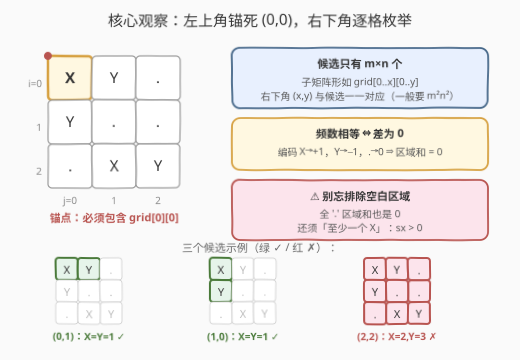
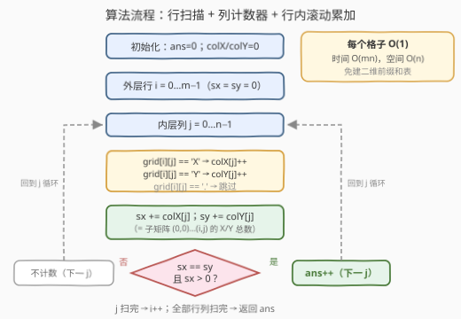
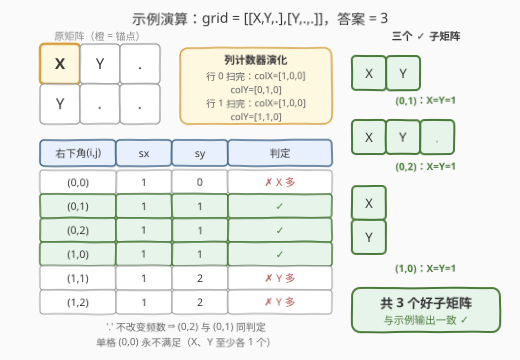

# LeetCode 统计 X 和 Y 频数相等的子矩阵数量 题解

## 1. 题目概述

- **标题 / 题号**：统计 X 和 Y 频数相等的子矩阵数量（#3212，medium）
- **链接**：https://leetcode.cn/problems/count-submatrices-with-equal-frequency-of-x-and-y/
- **难度**：中等
- **标签**：数组，矩阵，前缀和

**题意**：给你一个二维字符矩阵 `grid`，其中 `grid[i][j]` 可能是 `'X'`、`'Y'` 或 `'.'`。返回满足以下**全部**条件的**子矩阵**数量：

1. **包含 `grid[0][0]`**（左上角格子必须落在子矩阵内）；
2. 子矩阵内 `'X'` 与 `'Y'` 的**频数相等**；
3. 子矩阵内**至少包含一个 `'X'`**。

子矩阵定义为矩阵中一段连续的行与一段连续的列围成的矩形区域。

**示例 1**：

```text
输入：grid = [["X","Y","."],["Y",".","."]]
输出：3
解释：3 个好子矩阵分别为
- 行 0..0、列 0..1：[X, Y]
- 行 0..0、列 0..2：[X, Y, .]
- 行 0..1、列 0..0：[X / Y]（竖着两格）
```

**示例 2**：

```text
输入：grid = [["X","X"],["X","Y"]]
输出：0
解释：不存在 X 与 Y 频数相等的子矩阵。
```

**示例 3**：

```text
输入：grid = [[".","."],[".","."]]
输出：0
解释：不存在至少包含一个 'X' 的子矩阵。
```

**约束**：

- $1 \le grid.length, grid[i].length \le 1000$
- $grid[i][j] \in \{'X', 'Y', '.'\}$

> 💡 读题关键：①「子矩阵」= 连续行 × 连续列；②「包含 `grid[0][0]`」是最强的减枝条件——它把左上角**锚死**，候选由右下角唯一确定；③ 条件 3「至少一个 X」专门用来排除**全 `'.'` 的空白区域**——空白区域 X 与 Y 频数也相等（都是 0），但不算数。

## 2. 解题思路

### 2.1 暴力思路

枚举所有包含 `grid[0][0]` 的子矩阵：左上角固定为 $(0,0)$，枚举右下角 $(x, y)$ 共 $m \times n$ 个候选；对每个候选，重新扫描 $grid[0..x][0..y]$ 数一遍 X 与 Y 的个数：

```python
for x in range(m):
    for y in range(n):
        cx = sum(row[:y + 1].count('X') for row in grid[:x + 1])
        cy = sum(row[:y + 1].count('Y') for row in grid[:x + 1])
        if cx == cy and cx > 0:
            ans += 1
```

复杂度 $O(m^2 n^2)$：$m, n \le 1000$ 时高达 $10^{12}$，必然超时。瓶颈在于**每个候选都从零重数**——而相邻候选之间只差一行或一列，大量重复劳动。

### 2.2 核心观察：锚定子矩阵 + 滚动前缀计数



**观察 1（左上角锚死 ⇒ 候选只有 $mn$ 个）**：子矩阵必须包含 $grid[0][0]$，故其形状必为 $grid[0..x][0..y]$——**右下角 $(x,y)$ 与候选一一对应**。一般子矩阵计数需枚举四条边界（$O(m^2n^2)$ 个候选），本题被条件 1 直接砍到 $mn$ 个。

**观察 2（频数相等 ⇔ 差为 0）**：X 与 Y 频数相等 $\iff \#X - \#Y = 0$。若把 X 编码为 $+1$、Y 编码为 $-1$、'.' 为 $0$，则「频数相等」⇔ **区域和为 0**。也可以不编码、直接维护两个计数器，判定条件统一写成 $sx = sy$。

**观察 3（⚠️ 别忘排除空白区域）**：全 '.' 的子矩阵区域和**同样是 0**！只判「和为 0」会把空白子矩阵误计入——示例 3 的 $2 \times 2$ 全 '.' 矩阵会被错误地数出 4 个。所以必须再补上「至少一个 X」$\iff sx > 0$。这是本题最大的坑。

**观察 4（滚动更新，免建二维前缀和表）**：候选按 $(x,y)$ 逐行逐列**单调扩张**：从 $(i-1,j)$ 到 $(i,j)$ 只多出第 $i$ 行，从 $(i,j-1)$ 到 $(i,j)$ 只多出第 $j$ 列。于是只需两个一维**列计数器**：

$$colX[j] = \text{第 } j \text{ 列第 } 0..i \text{ 行中 X 的个数（列前缀）}$$

行内再滚动累加 $sx \mathrel{+}= colX[j]$，则 $(sx, sy)$ 恰为 $grid[0..i][0..j]$ 的 X/Y 总数——**双重前缀**被拆成「列前缀（向下推进）+ 行内滚动（向右推进）」两步 $O(1)$ 增量，空间只需 $O(n)$，连二维前缀和表都不用建。

### 2.3 算法流程图



外层逐行推进：先把当前行的字符累进列计数器 $colX / colY$，行首把行内累计 $sx / sy$ 清零；内层逐列右移，每步 $sx \mathrel{+}= colX[j]$、$sy \mathrel{+}= colY[j]$，随即判定 $sx = sy \land sx > 0$，命中则 `ans++`。全程每个格子只被访问一次。

### 2.4 示例演算



以示例 1 为例，$grid = \begin{bmatrix} X & Y & . \\ Y & . & . \end{bmatrix}$：

| 右下角 $(i,j)$ | $sx$ | $sy$ | 判定 $sx = sy \land sx > 0$ |
|---------------|------|------|------------------------------|
| $(0,0)$       | 1    | 0    | ✗（X 多）                    |
| $(0,1)$       | 1    | 1    | ✓                            |
| $(0,2)$       | 1    | 1    | ✓（'.' 不改变频数）          |
| $(1,0)$       | 1    | 1    | ✓                            |
| $(1,1)$       | 1    | 2    | ✗（Y 多）                    |
| $(1,2)$       | 1    | 2    | ✗（Y 多）                    |

共 3 个 ✓，与示例输出一致。注意 $(0,2)$ 与 $(0,1)$ 频数相同——右端多出的 '.' 不影响判定，所以**答案是 3 而不是 2**。

## 3. 参考代码

### C++（列计数器 + 行内滚动，$O(n)$ 空间）

```cpp
class Solution {
  public:
    int numberOfSubmatrices(vector<vector<char>>& grid) {
        int m = grid.size(), n = grid[0].size();
        vector<int> colX(n), colY(n);            // 列前缀：列 j 在第 0..i 行中 X / Y 的个数
        int ans = 0;
        for (int i = 0; i < m; i++) {
            int sx = 0, sy = 0;                  // grid[0..i][0..j] 中 X / Y 总数
            for (int j = 0; j < n; j++) {
                if (grid[i][j] == 'X')      colX[j]++;
                else if (grid[i][j] == 'Y') colY[j]++;
                sx += colX[j];
                sy += colY[j];
                if (sx == sy && sx > 0) ans++;   // 频数相等 且 非全 '.'
            }
        }
        return ans;
    }
};
```

### Python（同逻辑）

```python
class Solution:
    def numberOfSubmatrices(self, grid: List[List[str]]) -> int:
        m, n = len(grid), len(grid[0])
        col_x = [0] * n      # 列 j 在第 0..i 行中 X 的个数
        col_y = [0] * n
        ans = 0
        for i in range(m):
            sx = sy = 0      # grid[0..i][0..j] 中 X / Y 总数
            row = grid[i]
            for j in range(n):
                if row[j] == 'X':
                    col_x[j] += 1
                elif row[j] == 'Y':
                    col_y[j] += 1
                sx += col_x[j]
                sy += col_y[j]
                if sx == sy and sx > 0:
                    ans += 1
        return ans
```

> 💡 也可以按官方 hint 的思路把 X/Y/. 编码为 $+1/-1/0$，用一张二维前缀和表判「区域和为 0」，再配一张 X 计数前缀和表判非空；两个计数器版本与之完全等价，还省掉了 $O(mn)$ 的表空间。

## 4. 复杂度分析

| 维度 | 复杂度 | 说明 |
|------|--------|------|
| 时间复杂度 | $O(mn)$ | 每个格子只处理一次，判定 $O(1)$ |
| 空间复杂度 | $O(n)$ | 两个长度为 $n$ 的列计数器（二维前缀和表版本为 $O(mn)$） |
| 暴力对照 | $O(m^2n^2)$ / $O(1)$ | 每个候选从零重数；$10^{12}$ 必然超时 |

## 5. 扩展：去掉「包含 grid[0][0]」会怎样？

若子矩阵可取任意位置（仍要求 X/Y 频数相等且至少一个 X），就回到经典套路「**和为 target 的子矩阵计数**」（1074）：

1. 枚举**上下边界** $(r_1, r_2)$，共 $O(m^2)$ 对；
2. 把第 $r_1..r_2$ 行按列压成一维**列前缀数组** $P[j] = \sum_{r_1 \le r \le r_2} \sum_{j' \le j} val[r][j']$（$val$ 取 $\pm 1 / 0$）；
3. 任意子矩阵 $[r_1..r_2][j_1{+}1..j_2]$ 的和 $= P[j_2] - P[j_1]$，问题化为一维「和为 0 的子数组个数」，哈希表一遍扫（560 套路）；「至少一个 X」用一张 X 的二维前缀计数表 $O(1)$ 校验。

总复杂度 $O(m^2 n)$——本题 $m, n \le 1000$ 时约 $10^9$ 会超时；正是锚定条件把 $O(m^2)$ 的上下边界枚举整个砍掉，才降到 $O(mn)$。**读题时见到「必须包含左上角 / 某个固定格子」的条件，第一反应就该是：候选集合塌缩成单角枚举**。

## 6. 面试要点

1. **「包含 grid[0][0]」这个条件带来了什么？**

   子矩阵左上角被锚死在 $(0,0)$，候选由右下角 $(x,y)$ 唯一确定，只剩 $mn$ 个；一般子矩阵问题要枚举上下左右四条边界，$O(m^2n^2)$ 个候选。这一步是本题复杂度的根本来源。

2. **只判「区域和为 0」为什么错？**

   全 '.' 的空白子矩阵 X、Y 频数都为 0，区域和同样是 0。必须补上「至少一个 X」（$sx > 0$）才能排除——示例 3 全 '.' 矩阵，漏判会输出 4 而非 0。

3. **为什么不用真正建二维前缀和表？**

   候选按行优先序**单调扩张**：右移多一列、下移多一行。用列计数器 $colX/colY$ 吃「下移」增量、行内滚动累加 $sx/sy$ 吃「右移」增量，即可把「双重前缀」拆成两步 $O(1)$ 增量，空间从 $O(mn)$ 降到 $O(n)$。建二维前缀和表也不算错，只是没必要。

4. **单格子矩阵 $(0,0)$ 有可能被计入吗？**

   不可能。$1 \times 1$ 的子矩阵只有一格，X 与 Y 频数相等且至少一个 X 要求 $\#X = \#Y \ge 1$，至少需要两格。演算表里 $(0,0)$ 那行天然是 ✗。

5. **复杂度是多少？**

   时间 $O(mn)$：每个格子进出列计数器各一次、参与一次判定；空间 $O(n)$：两个长度为 $n$ 的列计数器。

## 同类练习题

| # | 题目 | 与本题的关联 |
|---|------|-------------|
| 1074 | [元素和为目标值的子矩阵数量](https://leetcode.cn/problems/number-of-submatrices-that-sum-to-target/) | 去掉锚定约束的通用版——枚举边界 + 哈希计数，本文第 5 节扩展的完全体 |
| 304 | [二维区域和检索 - 数组不可变](https://leetcode.cn/problems/range-sum-query-2d-immutable/) | 二维前缀和模板（容斥四角公式），列计数器思路的理论基础 |
| 560 | [和为 K 的子数组](https://leetcode.cn/problems/subarray-sum-equals-k/) | 一维「区间和 = target」+ 哈希表，1074 的原子操作 |
| 1504 | [统计全 1 子矩形](https://leetcode.cn/problems/count-submatrices-with-all-ones/) | 同样逐行扫描统计满足约束的子矩形，对照「约束不同 ⇒ 计数手法不同」 |
