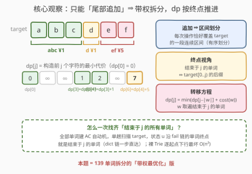
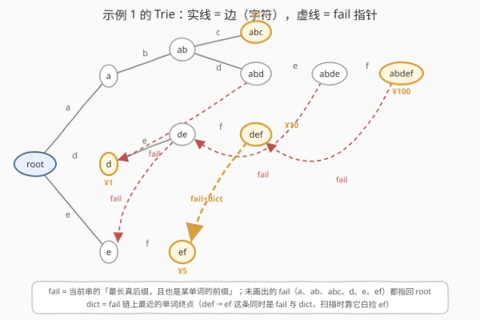
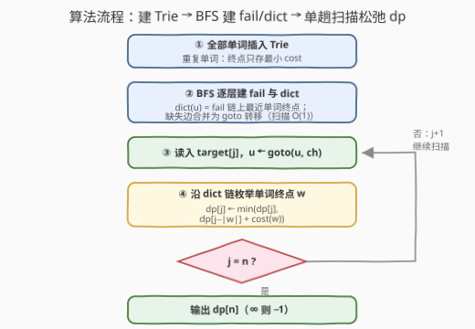
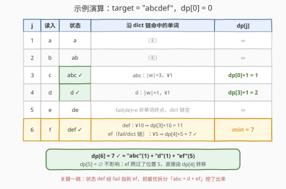

# 最小代价构造字符串

- **题目名称**：最小代价构造字符串
- **链接**：[3213. 最小代价构造字符串](https://leetcode.cn/problems/construct-string-with-minimum-cost/)
- **难度**：困难
- **标签**：字符串，动态规划，字典树，AC 自动机

## 1. 题目概述

给定字符串 `target`、字符串数组 `words` 与等长整数数组 `costs`。初始 `s` 为空串，可以执行任意次（含 **零** 次）操作：

1. 选择范围 `[0, words.length - 1]` 内的索引 `i`；
2. 把 `words[i]` 追加到 `s` 末尾；
3. 该操作花费 `costs[i]`。

返回使 `s` 等于 `target` 的**最小**总代价；无法构造返回 `-1`。

**示例 1**：

```text
输入：target = "abcdef", words = ["abdef","abc","d","def","ef"], costs = [100,1,1,10,5]
输出：7
解释：追加 "abc"(1) + "d"(1) + "ef"(5)，s = "abcdef"，总代价 7。
```

**示例 2**：

```text
输入：target = "aaaa", words = ["z","zz","zzz"], costs = [1,10,100]
输出：-1
解释：任何单词都不含 'a'，无法构造 target。
```

**约束条件**：

- $1 \le target.length \le 5 \times 10^4$
- $1 \le words.length = costs.length \le 5 \times 10^4$
- $1 \le words[i].length \le target.length$
- 所有 $words[i].length$ 之和 $\le 5 \times 10^4$
- `target` 与 `words[i]` 仅由小写字母组成；$1 \le costs[i] \le 10^4$

> 💡 读题关键：操作只能**往末尾追加**，且每次追加的单词互不重叠、按序无缝衔接——所以每个单词恰好覆盖 `target` 的一段连续区间。问题等价于：**把 `target` 切成若干段，每段恰好等于某个单词，最小化代价和**，即 139 单词拆分的「带权最优化」版。官方 hint 也点明了方向：DP + Aho-Corasick（或哈希）。

---

## 2. 解题思路

### 2.1 暴力思路

定义 $dp[i]$ = 构造 `target` 前 $i$ 个字符的最小代价，$dp[0] = 0$：

$$dp[i] = \min_{\substack{j < i \\ target[j..i) \in words}} dp[j] + cost(target[j..i))$$

直接实现：对每个位置枚举全部单词并逐字符比对——单轮判定就要 $O(\Sigma)$（记 $\Sigma = \sum |words[i]|$），整体 $O(n\Sigma) \approx 2.5 \times 10^9$，必然超时。就算换成「哈希集合 + 子串切片」，每个 $(j, i)$ 组合仍要付出 $O(\text{长度})$ 的切片/哈希成本，量级不变。瓶颈在于：**「哪些单词匹配 target 的某个片段」这个子问题，被每个起点重复回答了一遍**。

### 2.2 核心观察：终点视角 + AC 自动机



**观察 1（拆分模型）**：追加操作按顺序无缝衔接，第 $k$ 次操作拼上的 `words[i]` 恰好占据 `target` 的一段区间。于是合法方案 $\iff$ `target` 的一个有序划分，每段是一个单词。dp 顺势改成**终点视角**：$dp[j]$ = 构造前 $j$ 个字符的最小代价。

**观察 2（结束于 j 的单词 ⇔ 前缀的后缀）**：转移需要回答「**哪些单词恰好结束于位置 $j$**」。任何这样的单词都是 `target[0..j)` 的后缀——这是把匹配问题交给 AC 自动机的天然接口。

**观察 3（fail/dict 链一次扫描给出全部匹配）**：把所有单词（重复单词取最小 cost）插入 Trie，为每个节点计算 **fail 指针**（当前串的最长真后缀，且它也是某单词的前缀）。单趟扫描 `target`，设读入第 $j$ 个字符后自动机停在状态 $u$（含义：`target[0..j)` 的最长「某单词前缀」后缀），那么

> **结束于 $j$ 的全部单词 = $u$ 沿 fail 链上的所有单词终点节点。**

为跳过 fail 链上的非单词节点，再预处理 **dict（输出链接）**：$dict(u)$ = $u$ 的 fail 链上**最近的单词终点**，一步直达下一个有效转移。转移方程：

$$dp[j] = \min_{w \text{ 结束于 } j} \; dp[j - |w|] + cost(w)$$



**观察 4（枚举总量为什么可控）**：记 $\Sigma = \sum|words| \le 5 \times 10^4$。单词去重后互不相同，若出现过 $k$ 种不同长度，则 $1 + 2 + \cdots + k \le \Sigma$，即 $k \le \sqrt{2\Sigma} \approx 316$；而固定长度 $L$ 的所有不同单词在 `target` 中的出现次数之和 $\le n - L + 1$（每个长度 $L$ 的窗口只对应一个串）。两者相乘，整个扫描过程中「(位置, 单词) 匹配对」总数 $\le n \cdot \sqrt{2\Sigma} \approx 1.6 \times 10^7$，量级安全。

> ⚠️ 为什么不用裸 Trie「对每个起点沿树下行」？最坏情形 `target` 与唯一单词都是 `"aaa⋯a"` 时，每个起点都会一路走到链尾，总代价 $O(n^2) \approx 1.25 \times 10^9$。fail 指针的作用正是把「逐起点重复匹配」摊还成「一次扫描 + 后缀链枚举」。

### 2.3 算法流程图



三阶段：① 建 Trie（重复单词只留最小 cost）；② BFS 逐层建 fail 与 dict，同时把 **goto 转移合并进边表**（节点缺失的字符边直接指向 `fail(u)` 对应转移，扫描时 $O(1)$ 转移）；③ 单趟扫描 `target`，每个位置沿 dict 链松弛 dp，最后 $dp[n]$ 为 $\infty$ 则输出 $-1$。

### 2.4 示例演算



以示例 1 为例（$dp[0] = 0$）：

| $j$ | 读入 | 自动机状态 | dict 链命中单词 | $dp[j]$ |
|-----|------|-----------|----------------|---------|
| 1 | a | a | — | $\infty$ |
| 2 | b | ab | — | $\infty$ |
| 3 | c | abc（词） | abc：$\lvert w\rvert=3$，¥1 | $dp[0]+1 = 1$ |
| 4 | d | d（词） | d：$\lvert w\rvert=1$，¥1 | $dp[3]+1 = 2$ |
| 5 | e | de | fail(de)=e 非单词终点，链空 | $\infty$ |
| 6 | f | def（词） | def：¥10 → $dp[3]+10=11$；ef：¥5 → $dp[4]+5=7$ | $\mathbf{7}$ |

注意 $j=6$ 这一行的精髓：状态 `def` 自身命中单词 def（得 11），而 **fail 指针把 def 引到 ef**（`"def"` 的后缀 `"ef"` 也是单词），再松弛出 $dp[4]+5=7$——正是这条 fail/dict 边把最优拆分「abc + d + ef」挖了出来。另注意 $dp[5]=\infty$ 完全不影响：ef 跨过位置 5，直接由 $dp[4]$ 转移。

---

## 3. 参考代码

### C++（AC 自动机 + dict 链）

```cpp
class Solution {
  public:
    int minimumCost(string target, vector<string>& words, vector<int>& costs) {
        int n = target.size();

        // ---- 1. 建 Trie：ch / len / cost（重复单词只留最小 cost）----
        struct Node { int ch[26] = {}; int fail = 0, dict = 0, len = 0; long long cost = -1; };
        vector<Node> t(1);
        for (int i = 0; i < (int)words.size(); ++i) {
            int u = 0;
            for (char c : words[i]) {
                int d = c - 'a';
                if (!t[u].ch[d]) { t[u].ch[d] = t.size(); t.emplace_back(); }
                u = t[u].ch[d];
            }
            t[u].len = (int)words[i].size();
            if (t[u].cost < 0 || costs[i] < t[u].cost) t[u].cost = costs[i];
        }

        // ---- 2. BFS 建 fail 与 dict，并把缺失边合并为 goto 转移 ----
        queue<int> q;
        for (int c = 0; c < 26; ++c)
            if (t[0].ch[c]) q.push(t[0].ch[c]);       // 深度 1 的节点 fail = 0
        while (!q.empty()) {
            int u = q.front(); q.pop();
            int f = t[u].fail;                         // f 更浅，必定已处理完毕
            t[u].dict = (t[f].cost >= 0) ? f : t[f].dict;
            for (int c = 0; c < 26; ++c) {
                int &v = t[u].ch[c];
                if (v) { t[v].fail = t[f].ch[c]; q.push(v); }
                else    v = t[f].ch[c];                // goto 合并，扫描 O(1)
            }
        }

        // ---- 3. 单趟扫描 target，沿 dict 链松弛 dp ----
        const long long INF = 1e15;
        vector<long long> dp(n + 1, INF);
        dp[0] = 0;
        int u = 0;
        for (int j = 1; j <= n; ++j) {
            u = t[u].ch[target[j - 1] - 'a'];          // O(1) goto 转移
            for (int v = (t[u].cost >= 0 ? u : t[u].dict); v; v = t[v].dict) {
                dp[j] = min(dp[j], dp[j - t[v].len] + t[v].cost);
            }
        }
        return dp[n] >= INF ? -1 : (int)dp[n];
    }
};
```

### Python（同逻辑，列表 + 头指针模拟队列）

```python
class Solution:
    def minimumCost(self, target: str, words: List[str], costs: List[int]) -> int:
        n = len(target)

        # 1. 建 Trie：ch[v] = {字符: 子节点}，cost[v] = 该单词最小 cost（-1 非单词终点）
        ch, cost, length = [{}], [-1], [0]
        for w, c in zip(words, costs):
            u = 0
            for x in w:
                v = ch[u].get(x)
                if v is None:
                    v = len(ch)
                    ch[u][x] = v
                    ch.append({}); cost.append(-1); length.append(0)
                u = v
            length[u] = len(w)
            cost[u] = c if cost[u] == -1 else min(cost[u], c)

        # 2. BFS 建 fail / dict，缺失边合并为 goto 转移
        m = len(ch)
        fail, dic = [0] * m, [0] * m
        q = list(ch[0].values())                 # 深度 1 的节点 fail = 0
        head = 0
        while head < len(q):
            u = q[head]; head += 1
            f = fail[u]
            dic[u] = f if cost[f] != -1 else dic[f]
            for x, v in ch[u].items():           # 先处理真实子节点（此时未被污染）
                fail[v] = ch[f].get(x, 0)
                q.append(v)
            for x, v in ch[f].items():           # 再合并 goto（f 更浅，已合并完毕）
                if x not in ch[u]:
                    ch[u][x] = v

        # 3. 单趟扫描 + dp
        INF = float('inf')
        dp = [INF] * (n + 1)
        dp[0] = 0
        u = 0
        for j in range(1, n + 1):
            u = ch[u].get(target[j - 1], 0)      # O(1) goto 转移
            v = u if cost[u] != -1 else dic[u]   # 从最近单词终点起沿 dict 链枚举
            while v:
                if dp[j - length[v]] + cost[v] < dp[j]:
                    dp[j] = dp[j - length[v]] + cost[v]
                v = dic[v]
        return -1 if dp[n] == INF else dp[n]
```

> 💡 两份代码已用随机对拍 + 定向用例验证。Python 版在最坏情形（如 `target = "aaa⋯a"`、单词取 $a, aa, \cdots$）dict 链枚举约 $1.6 \times 10^7$ 次，CPython 下偏慢，卡时限可改用第 5 节的滚动哈希写法（常数更小）；C++ 版轻松通过。

---

## 4. 复杂度分析

| 维度 | 复杂度 | 说明 |
|------|--------|------|
| 时间复杂度 | $O(26\Sigma + n\cdot\sqrt{2\Sigma})$ | 建树 $O(\Sigma)$；BFS + goto 合并 $O(26\Sigma)$；扫描转移 $O(n)$；dict 链枚举总数 = 单词出现总次数 $\le n \times$ 长度种类数，种类数 $\le \sqrt{2\Sigma} \approx 316$ |
| 空间复杂度 | $O(26\Sigma + n)$ | Trie 边表（含合并的 goto 边）+ fail/dict 数组 + dp 数组 |
| 暴力对照 | $O(n\Sigma)$ | 每个起点重复匹配所有单词，$\approx 2.5 \times 10^9$ |

代入 $\Sigma = n = 5 \times 10^4$：约 $1.3 \times 10^6 + 1.6 \times 10^7$ 次基本操作，稳过。

---

## 5. 扩展：按长度分组 + 滚动哈希

官方提示的另一条路是 **Hashing**，思路更短，也更好写：

1. 单词去重（同词取最小 cost），按**长度**分桶：$best[L]$ 是「哈希值 → 最小 cost」的哈希表；
2. 预处理 `target` 的**滚动哈希**前缀数组，任意子串 $O(1)$ 取哈希；
3. 对每种出现过的长度 $L$，扫一遍 `target`：$dp[j] = \min(dp[j],\; dp[j-L] + best[L][hash(target[j-L..j]))])$。

复杂度同阶 $O(n\cdot\sqrt{2\Sigma})$：长度种类数 $\le 316$，每种长度线性扫一遍。工程上注意**哈希冲突**——用双哈希，或桶里存原串做最终核对；单模大质数被构造数据卡掉的概率不大，但理论不为零。AC 自动机则是确定性的，不依赖哈希。

顺带一提，题目标签里的**后缀数组**也可解：对 `target` 建后缀数组，每个单词二分定位其全部出现位置，逐个做 dp 松弛——转移次数同样是「出现次数总和」，量级一致，但实现更重，面试中优先 AC 自动机 / 哈希两条路。

---

## 6. 面试要点

1. **怎么把「拼接操作」转成 dp？**

   追加操作按序无缝覆盖 `target` 的区间 ⇒ 合法方案 = `target` 的有序划分。定义 $dp[j]$ = 前 $j$ 个字符的最小代价，转移枚举「结束于 $j$ 的单词」。与 139 单词拆分同构：从可行性升级为最优化，且规模要求把匹配结构换成 AC 自动机。

2. **为什么裸 Trie 逐起点下行会超时，AC 自动机不会？**

   反例：`target` 与唯一单词都是 `"aaa⋯a"`，每个起点都沿链走到头，$O(n^2)$。AC 自动机单趟扫描，状态始终是「当前前缀的最长可匹配后缀」；配合 dict 链只枚举单词终点，枚举总量 = 所有单词在 `target` 中的出现总次数 $\le n\sqrt{2\Sigma}$。

3. **fail 链和 dict 链的区别？只沿 fail 链枚举会怎样？**

   fail 链上大量节点不是单词终点，逐个跳最坏每次 $O(\text{深度})$（如 `"aaa⋯a"` 的 fail 链长为深度的链）；dict 链 preprocess 出「fail 链上最近的单词终点」，链上每个节点都是有效转移，一次 $O(1)$ 跳一步。

4. **枚举总量的上界怎么证？**

   匹配对总数 $= \sum_w occ(w)$。固定长度 $L$：所有不同长度 $L$ 串的出现次数之和 $\le n - L + 1$（每个窗口唯一对应一个串）；长度种类数 $k$ 满足 $1 + 2 + \cdots + k \le \Sigma \Rightarrow k \le \sqrt{2\Sigma}$。相乘即 $n \cdot \sqrt{2\Sigma}$。

5. **重复单词、答案上界怎么处理？**

   `words` 可含重复串：Trie 终点只存**最小 cost**，自然去重。答案上界 = 段数 $\times$ 最大单价 $\le n \times 10^4 = 5 \times 10^8$，`int` 装得下但建议 `long long` 更稳；不可行以 $\infty$ 判定后返回 $-1$。

---

## 7. 同类练习题

- [139. 单词拆分](https://leetcode.cn/problems/word-break/)：本题的「可行性判定」缩小版——DP + 哈希集合
- [140. 单词拆分 II](https://leetcode.cn/problems/word-break-ii/)：单词拆分的「枚举全部方案」版，记忆化 DFS
- [208. 实现 Trie (前缀树)](https://leetcode.cn/problems/implement-trie-prefix-tree/)：Trie 模板，AC 自动机的地基
- [472. 连接词](https://leetcode.cn/problems/concatenated-words/)：Trie + DFS 判「能否由更短单词拼接」
- [820. 单词的压缩编码](https://leetcode.cn/problems/short-encoding-of-words/)：Trie 按「后缀」建树省空间，与本题「后缀视角」的匹配思想一脉相承
