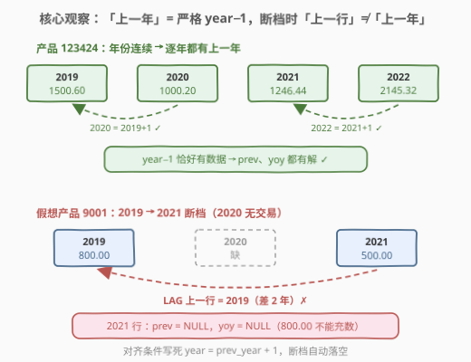
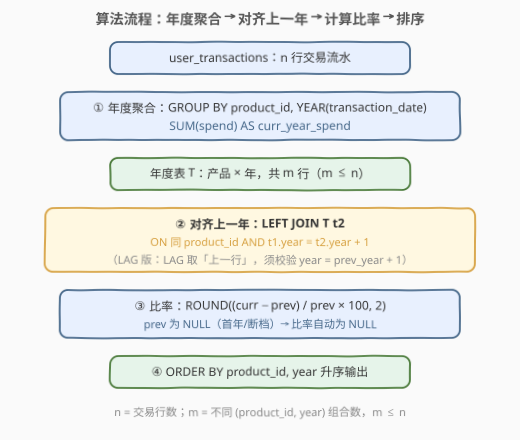
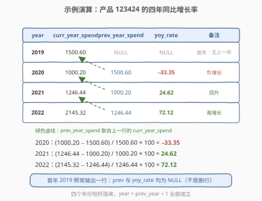

# LeetCode 同比增长率 题解

## 1. 题目概述

- **标题 / 题号**：同比增长率（#3214，hard）
- **链接**：https://leetcode.cn/problems/year-on-year-growth-rate/
- **难度**：困难
- **标签**：数据库、SQL、CTE、自连接、窗口函数、`LAG()`、`SUM()`、`YEAR()`

> ⚠️ 本题为 LeetCode 付费题（Plus 会员专享），题意描述根据官方示例用例与外部资料重建，可能与官方题面有出入。

**表结构**：`user_transactions`

| 列名 | 类型 |
|------|------|
| transaction_id | integer |
| product_id | integer |
| spend | decimal |
| transaction_date | datetime |

- `transaction_id` 唯一标识表中的每一行。
- 每行包含交易 ID、产品 ID、花费金额与交易日期。

**目标**：编写一个解决方案，计算**每个产品**总支出的**同比增长率**（Year-on-Year, YoY）。结果表应包含以下列：

- `year`：交易的年份。
- `product_id`：产品的 ID。
- `curr_year_spend`：当年的总支出。
- `prev_year_spend`：上一年的总支出。
- `yoy_rate`：同比增速百分比，四舍五入至小数点后 2 位。

返回结果表以 `product_id`、`year` **升序**排序。

**示例 1**：

```text
输入：
user_transactions 表：
+----------------+------------+---------+---------------------+
| transaction_id | product_id | spend   | transaction_date    |
+----------------+------------+---------+---------------------+
| 1341           | 123424     | 1500.60 | 2019-12-31 12:00:00 |
| 1423           | 123424     | 1000.20 | 2020-12-31 12:00:00 |
| 1623           | 123424     | 1246.44 | 2021-12-31 12:00:00 |
| 1322           | 123424     | 2145.32 | 2022-12-31 12:00:00 |
+----------------+------------+---------+---------------------+

输出：
+------+------------+----------------+----------------+----------+
| year | product_id | curr_year_spend| prev_year_spend| yoy_rate |
+------+------------+----------------+----------------+----------+
| 2019 | 123424     | 1500.60        | NULL           | NULL     |
| 2020 | 123424     | 1000.20        | 1500.60        | -33.35   |
| 2021 | 123424     | 1246.44        | 1000.20        | 24.62    |
| 2022 | 123424     | 2145.32        | 1246.44        | 72.12    |
+------+------------+----------------+----------------+----------+
```

**解释**（对产品 123424）：

- **2019**：当年支出 1500.60，没有上一年的记录，`prev_year_spend` 与 `yoy_rate` 均为 NULL（该行**仍然输出**）。
- **2020**：$yoy = \frac{1000.20 - 1500.60}{1500.60} \times 100 = -33.35$。
- **2021**：$yoy = \frac{1246.44 - 1000.20}{1000.20} \times 100 = 24.62$。
- **2022**：$yoy = \frac{2145.32 - 1246.44}{1246.44} \times 100 = 72.12$。

> 💡 **审题关键**：① 同比比较的对象是**严格的上一个日历年**（$\text{year} - 1$）——年份断档时上一年支出就是 NULL，**不能拿更早年份的数充数**；② 每个产品的**首年照常输出一行**（`prev_year_spend`、`yoy_rate` 置 NULL），是「置 NULL」而不是「过滤掉」；③ 同一产品同一年可能有多笔交易，必须先按 `(product_id, year)` 聚合再比较；④ `yoy_rate` 是**百分数数值**（−33.35 即 −33.35%），公式 $\frac{curr - prev}{prev} \times 100$，保留 2 位小数。

## 2. 解题思路

### 2.1 暴力思路：相关子查询逐年回查

先把流水聚合成 `(product_id, year, curr_year_spend)`，再对**每一行**用相关子查询回表重算一遍「上一年的总支出」：

```sql
SELECT year, product_id, curr_year_spend,
       (SELECT SUM(spend) FROM user_transactions u
        WHERE u.product_id = t.product_id
          AND YEAR(u.transaction_date) = t.year - 1) AS prev_year_spend
FROM (SELECT product_id, YEAR(transaction_date) AS year, SUM(spend) AS curr_year_spend
      FROM user_transactions
      GROUP BY product_id, YEAR(transaction_date)) t;
```

- **正确性**：没问题——`t.year - 1` 写死了严格上一年，断档时子查询返回 NULL。
- **效率**：外层 $m$ 行、每行都把 $n$ 行流水重新扫一遍，时间 $O(m \times n)$（$n$ = 交易行数，$m$ = 不同「产品 × 年」组合数）。
- **别扭之处**：`yoy_rate` 要复用 `prev_year_spend`，还得再包一层查询（SELECT 里不能引用同层别名）；而上一年的支出**明明已经在聚合结果里了**，却被反复重算。

> ⚠️ 瓶颈在于「找上一年」被当成了逐行的回表动作。突破口：让聚合出的年度表**自己跟自己错位一年对齐**——这正是自连接 / 窗口函数的主场。

### 2.2 核心观察：年度聚合 + 严格 year−1 对齐



**观察 1（先降维：交易行 → 产品 × 年）**：无论哪种写法，第一步都是

$$\texttt{GROUP BY product\_id,\ YEAR(transaction\_date)}$$

把 $n$ 行流水压成 $m$ 行「年度支出表」$T$（$m \le n$）。同比是**年级**指标，日期里的月日时分全部无关；之后所有对齐与比较都发生在这张小表上。

**观察 2（⚠️ 「上一年」= 严格 year − 1，不是「上一行」）**：这是本题被评为 Hard 的主要来源。年份可能**断档**：产品在 2019、2021 有交易而 2020 没有，则 2021 行的 `prev_year_spend` 必须是 NULL——**不能拿 2019 年的支出充数**（隔了一年，不是同比）。于是「找上一年」有两种严谨写法：

- **自左连接**：`LEFT JOIN T t2 ON t1.product_id = t2.product_id AND t1.year = t2.year + 1`——「恰好早一年」直接写进连接条件，断档自然落空为 NULL；
- **LAG 窗口**：`LAG` 取的是**上一行**（上一个有数据的年份），必须再校验 `year = prev_year + 1` 才能当作「上一年」用，不满足则作废为 NULL。

**观察 3（NULL 自动传播，首年免特判）**：LEFT JOIN 没命中时 `t2` 侧全为 NULL，于是 `ROUND((curr − NULL) / NULL × 100, 2)` 结果也是 NULL——每个产品的**首年**什么都不用写，天然输出 `prev_year_spend = NULL, yoy_rate = NULL`，且该行保留在结果里。LAG 版同理：首行 `LAG` 返回 NULL，`year = prev_year + 1` 不成立，`CASE` 落回 NULL。

**观察 4（比率口径）**：$yoy\_rate = \dfrac{curr - prev}{prev} \times 100$，输出是**百分数数值**——别漏乘 100，也别把 100 写成 1；`ROUND(..., 2)` 放在最外层 SELECT 即可。

### 2.3 算法流程图



**逻辑执行步骤**：

| 步骤 | 表达式 | 作用 |
|------|--------|------|
| ① 抽年份 | `YEAR(transaction_date)` | datetime → 年份，丢掉月日时分 |
| ② 年度聚合 | `GROUP BY product_id, YEAR(...)` + `SUM(spend)` | 流水压成「产品 × 年」一行，得到 `curr_year_spend` |
| ③ 对齐上一年 | `LEFT JOIN ... AND t1.year = t2.year + 1` | 取严格 year−1 的支出；首年/断档得 NULL |
| ④ 计算比率 | `ROUND((curr − prev) / prev × 100, 2)` | prev 为 NULL 时 NULL 传播，免特判 |
| ⑤ 排序 | `ORDER BY product_id, year` | 题目要求的输出顺序 |

### 2.4 示例演算



聚合后产品 123424 的年度表恰为 4 行（每年一笔交易），逐行演算：

| year | curr_year_spend | prev_year_spend | 计算式 | yoy_rate |
|------|-----------------|-----------------|--------|----------|
| 2019 | 1500.60 | NULL | 无上一年，跳过 | NULL |
| 2020 | 1000.20 | 1500.60 | $\frac{1000.20-1500.60}{1500.60} \times 100 = -33.34\overline{6}$ | −33.35 |
| 2021 | 1246.44 | 1000.20 | $\frac{246.24}{1000.20} \times 100 = 24.619\ldots$ | 24.62 |
| 2022 | 2145.32 | 1246.44 | $\frac{898.88}{1246.44} \times 100 = 72.115\ldots$ | 72.12 |

四个年份恰好连续，`year = prev_year + 1` 全部成立，2019 作为首年输出两个 NULL——与示例一致。若 2020 那笔交易不存在，则 2021 行的校验 `2021 = 2020 + 1` 落空，`prev_year_spend` 应为 NULL 而**不是** 1500.60，这正是断档陷阱（见 2.2 观察 2）。

## 3. 参考代码

### SQL（解法 A：CTE 年度聚合 + 自左连接，推荐）

```sql
# Write your MySQL query statement below
WITH T AS (
    SELECT product_id,
           YEAR(transaction_date) AS year,
           SUM(spend)             AS curr_year_spend
    FROM user_transactions
    GROUP BY product_id, YEAR(transaction_date)
)
SELECT t1.year,
       t1.product_id,
       t1.curr_year_spend,
       t2.curr_year_spend AS prev_year_spend,
       ROUND((t1.curr_year_spend - t2.curr_year_spend) / t2.curr_year_spend * 100, 2) AS yoy_rate
FROM T t1
LEFT JOIN T t2
       ON t1.product_id = t2.product_id
      AND t1.year = t2.year + 1
ORDER BY t1.product_id, t1.year;
```

> 💡 **写法要点**：
> - CTE `T`（年度聚合表）只算一次，自连接两侧复用同一份结果——这正是 2.1 暴力解法里「被反复重算的上一年」的正确归宿。
> - 「上一年」的语义全部压进 `ON` 条件 `t1.year = t2.year + 1`：**连接条件即业务规则**，读者一眼看懂；写 `t2.year = t1.year - 1` 完全等价。
> - 首年与断档年：`t2` 侧全 NULL，比率表达式 NULL 传播，无需任何 `CASE` / `IFNULL` 分支。
> - 必须用 `LEFT JOIN`：`INNER JOIN` 会把首年行整个丢掉，而题目要求输出它。

### SQL（解法 B：`LAG` 窗口函数 + 年份连续性校验）

```sql
# Write your MySQL query statement below
WITH T AS (
    SELECT product_id,
           YEAR(transaction_date) AS year,
           SUM(spend)             AS curr_year_spend
    FROM user_transactions
    GROUP BY product_id, YEAR(transaction_date)
),
P AS (
    SELECT product_id,
           year,
           curr_year_spend,
           LAG(year) OVER w            AS prev_year,
           LAG(curr_year_spend) OVER w AS prev_year_spend
    FROM T
    WINDOW w AS (PARTITION BY product_id ORDER BY year)
)
SELECT year,
       product_id,
       curr_year_spend,
       CASE WHEN year = prev_year + 1 THEN prev_year_spend END AS prev_year_spend,
       CASE WHEN year = prev_year + 1
            THEN ROUND((curr_year_spend - prev_year_spend) / prev_year_spend * 100, 2)
       END AS yoy_rate
FROM P
ORDER BY product_id, year;
```

> 💡 **写法要点**：
> - 窗口函数在 `GROUP BY` **之后**求值，所以对聚合结果做 `LAG` 完全合法；等价地也可以一步写成 `LAG(SUM(spend)) OVER (...)`。
> - ⚠️ `LAG` 的语义是「上一行」不是「上一年」——`year = prev_year + 1` 这道校验是解法 B 的**生命线**：断档年份（如 2019 → 2021）不满足条件，`CASE` 无 `ELSE` 分支默认输出 NULL，prev 作废。
> - `WINDOW w AS (...)`（MySQL 8.0+ 具名窗口）避免同一个 `OVER` 子句写两遍。
> - 与解法 A 的取舍：B 一趟分区排序完成对齐（$O(m \log m)$），免自连接；A 语义更直白，不依赖窗口函数方言。

### Python（pandas）

```python
import pandas as pd


def year_on_year_growth_rate(user_transactions: pd.DataFrame) -> pd.DataFrame:
    df = user_transactions.copy()
    df["year"] = pd.to_datetime(df["transaction_date"]).dt.year

    yearly = (
        df.groupby(["product_id", "year"], as_index=False)["spend"].sum()
          .rename(columns={"spend": "curr_year_spend"})
          .sort_values(["product_id", "year"], kind="stable")
          .reset_index(drop=True)
    )

    g = yearly.groupby("product_id", sort=False)
    yearly["prev_year_spend"] = g["curr_year_spend"].shift(1)
    prev_year = g["year"].shift(1)

    ok = yearly["year"] == prev_year + 1          # 严格上一年，断档不满足
    yearly["prev_year_spend"] = yearly["prev_year_spend"].where(ok)

    yearly["yoy_rate"] = (
        (yearly["curr_year_spend"] - yearly["prev_year_spend"])
        / yearly["prev_year_spend"] * 100
    ).round(2)

    return yearly[["year", "product_id", "curr_year_spend", "prev_year_spend", "yoy_rate"]]
```

> 💡 **pandas 对照**：
> - `.groupby().shift(1)` 对应 `LAG() OVER (PARTITION BY ... ORDER BY ...)`；`.where(ok)` 对应 `CASE WHEN year = prev_year + 1 THEN ... END`——把不连续年份的 prev 打回 `NaN`。
> - `NaN` 参与算术仍得 `NaN`，与 SQL 的 NULL 传播一致：首年与断档年无需特判。
> - `.round(2)` 对应 `ROUND(..., 2)`（pandas/numpy 对 `.5` 采用「四舍六入五成双」，MySQL 对精确值四舍五入；本题数据不含恰好在 .005 上的边界，两者一致）。
> - 付费题的站点端 pandas 函数签名可能与上文略有出入，以站点模板为准，逻辑不变。

## 4. 复杂度分析

| 维度 | 复杂度 | 说明 |
|------|--------|------|
| **时间（解法 A）** | $O(n + m)$ | 哈希聚合 $O(n)$；CTE 自连接按 `(product_id, year)` 等值哈希 $O(m)$（无索引退化为嵌套循环 $O(m^2)$，MySQL 对物化 CTE 可自动建索引） |
| **时间（解法 B）** | $O(n + m\log m)$ | 聚合 $O(n)$ + 分区排序 $O(m\log m)$，`LAG` 沿排序单趟 $O(m)$ |
| **时间（暴力）** | $O(m \times n)$ | 每个「产品 × 年」都回表重扫一遍上一年 |
| **空间** | $O(m)$ | 年度表 $T$（含连接/窗口的中间结果），$m \le n$ |

> $n$ = `user_transactions` 行数，$m$ = 不同 `(product_id, year)` 组合数。若表按 `(product_id, transaction_date)` 组织，聚合可借索引有序性省去排序，整体进一步降低。

## 5. 扩展：从同比到通用「同比/环比」报表

### 5.1 环比（MoM）：换个对齐维度，跨年是坑

「同比」对齐**年**，「环比」对齐**月**。套路完全同构：把 `YEAR(date)` 换成月首日，对齐条件从「+1 年」换成「+1 个月」：

```sql
-- 月度环比骨架：ym 取「月首日」，对齐交给 DATE_ADD
WITH T AS (
    SELECT product_id,
           DATE_SUB(DATE(transaction_date),
                    INTERVAL DAY(DATE(transaction_date)) - 1 DAY) AS ym,   -- 归到月首
           SUM(spend) AS spend
    FROM user_transactions
    GROUP BY 1, 2
)
SELECT t1.ym, t1.product_id, t1.spend,
       t2.spend AS prev_month_spend
FROM T t1
LEFT JOIN T t2
       ON t1.product_id = t2.product_id
      AND t1.ym = DATE_ADD(t2.ym, INTERVAL 1 MONTH)    -- 上月 + 1 个月 = 本月，跨年自动正确
ORDER BY t1.product_id, t1.ym;
```

关键在于**把周期键表示成日期、把「上一个周期」交给 `DATE_ADD`**：12 月的下一个月是次年 1 月，`INTERVAL 1 MONTH` 自动处理跨年；若用 `年×100 + 月` 数值键就得自己写「13 月进位」。断档陷阱不变——2 月没数据，3 月的环比就是 NULL。

### 5.2 报表工程：除零防护与缺失年份补零

- **prev = 0 的除零**：本题 `spend` 恒正没有这个问题，但真实报表里上一年支出为 0 时，`(curr − 0) / 0` 在 MySQL 中**不报错、返回 NULL**（除零按 NULL 处理），语义上「增长率无定义」，通常可接受；要显式控制口径就用 `NULLIF(prev_year_spend, 0)` 把 0 转成 NULL。
- **时间轴连续**：业务报表常要求缺失年份也输出一行 0——用**递归 CTE** 生成「最早年 ~ 最晚年」的连续年份序列，再与年度表 LEFT JOIN 补零。注意补零后「连续两年为 0」的增长率仍是 0/0 无定义，**同比报表的坑一半在 SQL，一半在口径**，动手前先和需求方对齐。

## 6. 面试要点

1. **本题为什么是 Hard？核心陷阱是什么？**

   「上一年」是**严格的 year − 1**。`LAG` / 「上一条记录」给的是上一个**有数据的年份**，年份断档（如 2019 → 2021）时直接拿来算就是错的。必须用 `year = prev_year + 1` 校验（LAG 版），或把 `t1.year = t2.year + 1` 写进连接条件（自连接版）。漏掉这一步示例照样过（示例年份恰好连续），断档数据必错——这是它区别于普通窗口题的地方。

2. **首年（每个产品最早的一年）为什么不用特判？**

   LEFT JOIN 未命中 ⇒ `t2.*` 全 NULL ⇒ `(curr − NULL) / NULL × 100` 按 NULL 传播得 NULL，`ROUND(NULL, 2)` 仍是 NULL——恰好是题目要求的首年输出（两个 NULL 且该行保留）。LAG 版里首行 `prev_year` 为 NULL，`year = prev_year + 1` 不成立，`CASE` 同样落回 NULL。

3. **`GROUP BY` 和窗口函数谁先执行？能写 `LAG(SUM(spend)) OVER ...` 吗？**

   逻辑顺序：`FROM → WHERE → GROUP BY → 聚合 → HAVING → 窗口函数 → SELECT → ORDER BY`。窗口函数作用在分组聚合**之后**的行集上，所以 `LAG(SUM(spend)) OVER (PARTITION BY product_id ORDER BY year)` 合法——聚合值先算好，`LAG` 再在聚合结果上取上一行。反之在窗口之后再用聚合/`WHERE` 过滤窗口结果就得套一层 CTE。

4. **解法 A 与解法 B 怎么选？**

   A（自左连接）：语义直白，连接条件即业务规则，不依赖窗口函数方言，任何实现可跑；代价是 CTE 引用两次，无索引时连接可能退化 $O(m^2)$。B（LAG）：一趟分区排序完成对齐，大表上更快；但必须记得年份连续性校验，且依赖 MySQL 8.0+。面试建议先写 A 保正确，再提 B 展示窗口功底，并主动点出 B 的校验生命线。

5. **`ORDER BY 1, 2` 在本题里为什么是错的？**

   题目要求按 `product_id, year` 升序，而输出列的第一列是 `year`——列顺序与排序键无关。`ORDER BY 1, 2` 是按 `year, product_id` 排，单产品示例里看不出来，多产品时顺序就错了。写显式列名 `ORDER BY product_id, year`（或 `ORDER BY 2, 1`）最稳。

## 同类练习题

| # | 题目 | 与本题的关联 |
|---|------|-------------|
| 550 | [游戏玩法分析 IV](https://leetcode.cn/problems/game-play-analysis-iv/) | 算「次日留存率」——今天活跃且**严格昨天**也活跃的占比，同样是「严格前一单位时间」对齐 + 比率计算 |
| 197 | [上升温度](https://leetcode.cn/problems/rising-temperature/) | `DATEDIFF` + 自连接找「恰好昨天」的行，相邻周期比较的最小单元 |
| 1193 | [每月交易 I](https://leetcode.cn/problems/monthly-transactions-i/) | 按月 `SUM` 聚合 + `DATE_FORMAT` 取周期键，同比/环比题「周期聚合」这半边的模板 |
| 1225 | [报告系统状态的连续日期](https://leetcode.cn/problems/report-contiguous-dates/) | Gaps and Islands 母题——日期断档的识别与合并，本题「断档则 NULL」陷阱的进阶背景 |
| 180 | [连续出现的数字](https://leetcode.cn/problems/consecutive-numbers/) | `LAG` 连用判定「连续 3 次」，对照本题「LAG 之后必须验证连续性」的核心动作 |
